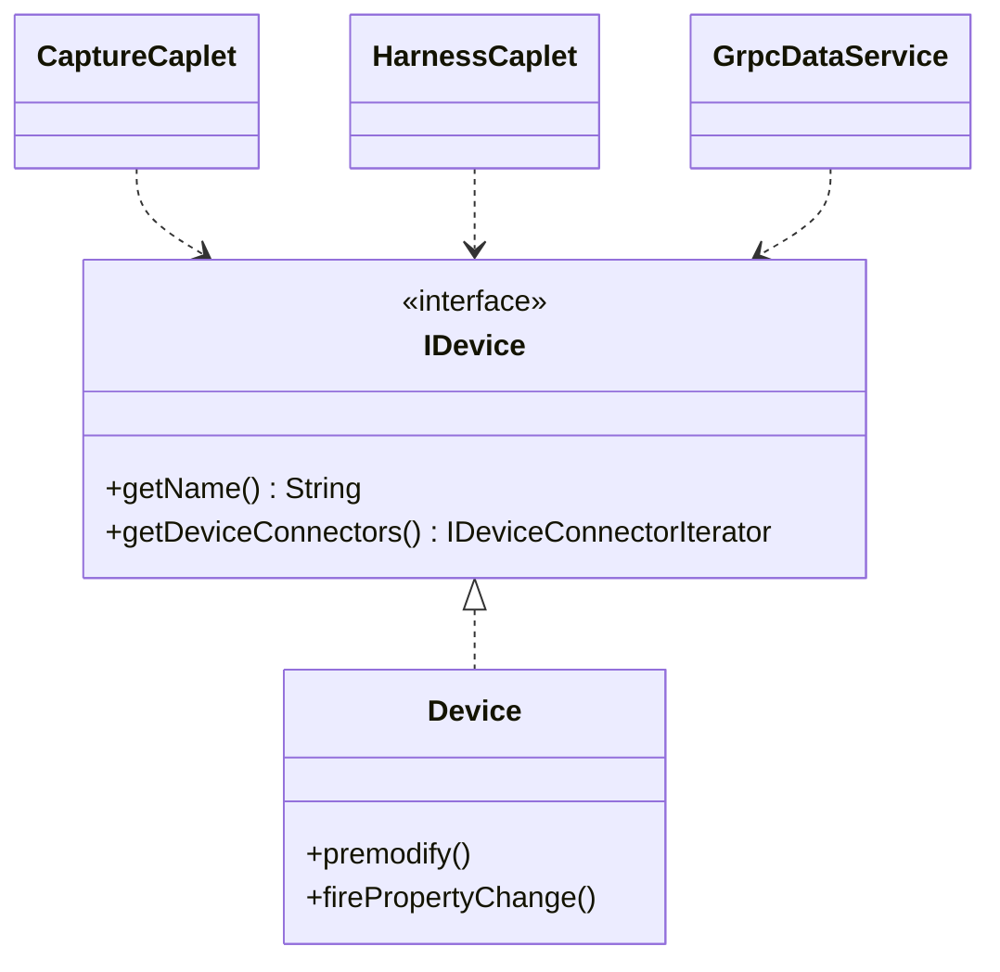
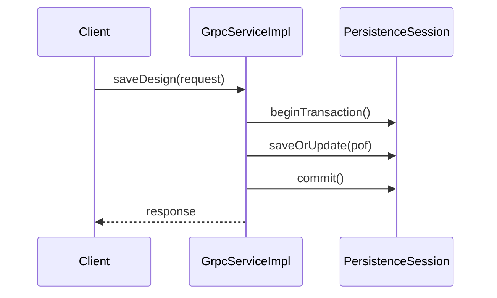
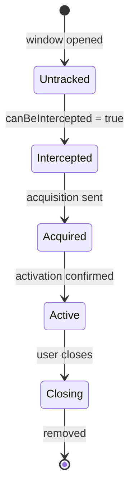

# Mermaid Diagrams as LLM Context — The 10x Technique

> **What:** Use Mermaid text diagrams as structured context for Copilot instead of raw code.
> **Why:** 20 lines of Mermaid = same knowledge as 500 lines of code, with 10x fewer tokens.
> **Result:** Better first-attempt accuracy, fewer iteration cycles, architecturally sound output.

---

## Contents

1. [🟢 Quick Start (Newbie)](#-quick-start-newbie)
2. [🟡 Full Technique (Amateur)](#-full-technique-amateur)
3. [🔴 Advanced Patterns (Pro)](#-advanced-patterns-pro)
4. [Mermaid Cheat Sheet](#mermaid-cheat-sheet)

---

## 🟢 Quick Start (Newbie)

### Why Raw Code Fails as LLM Context

When you paste 500 lines of Java into a Copilot prompt:
- It consumes ~2,000 tokens (mostly syntax noise: braces, imports, getters)
- LLM must **infer** relationships from `extends`, `implements`, `import` statements
- Deep inheritance chains are impossible to reason about from code alone
- Cross-module dependencies are invisible without reading 10+ files

**Result:** LLM guesses architecture → hallucinated code → you waste time fixing it.

### The Fix: A 20-line Mermaid Diagram

```
500 LOC of Device.java
  → LLM guesses: "Device probably extends something"

20 lines of Mermaid
  → LLM knows: "Device extends AbstractDevice,
                 implements IDevice + IPrivilegedDevice,
                 fires PropertyChangeEvent on every setter,
                 consumed by CaptureCaplet, HarnessCaplet, GrpcDataService"
```

This isn't about pretty pictures — it's about **making architecture visible as text**, the one format LLMs actually understand deeply.

### Your First Diagram-Assisted Prompt (3 steps)

**Step 1 — Ask Copilot to generate a diagram:**
```
Generate a Mermaid class diagram showing the IDevice interface,
its implementations, and all classes that use IDevice.
```

**Step 2 — Copilot produces something like:**


**Step 3 — Use the diagram in your next prompt:**
```
Using this class diagram as context:
[paste diagram here]

Add a "wireGauge" property to IDevice. Consider all consumers.
```

Now Copilot has complete architectural knowledge and generates correct code on the first try.

### Quick Win Examples

| Without diagram | With diagram |
|---|---|
| "Add a property to Device" | Correct interface + implementation + consumers handled |
| "Add validation before saveOrUpdate" | Knows exactly where in the call chain to insert |
| "Add a new state to the window lifecycle" | Sees the full state machine, branches correctly |

---

## 🟡 Full Technique (Amateur)

### The 3-Step Workflow

```
┌─────────────────────────────────────────────────────────────┐
│  Step 1: GENERATE                                           │
│  Ask agent to generate a Mermaid diagram from existing code  │
│  "Generate a class diagram for the IDevice hierarchy"       │
└─────────────────────────────────┬───────────────────────────┘
                                  │
                                  ▼
┌─────────────────────────────────────────────────────────────┐
│  Step 2: FEED                                               │
│  Include the diagram in your next prompt as context          │
│  "Using this diagram: [paste] ..."                          │
└─────────────────────────────────┬───────────────────────────┘
                                  │
                                  ▼
┌─────────────────────────────────────────────────────────────┐
│  Step 3: MODIFY                                             │
│  Agent reasons over structure to plan and implement changes  │
│  No need to grep 30,000 files — the diagram has the answer  │
└─────────────────────────────────────────────────────────────┘
```

### Best Diagram Type by Task

| Task | Diagram Type | Why This Type |
|---|---|---|
| Add or modify a property/method | **Class diagram** | Shows inheritance + who implements/uses |
| Understand a call flow | **Sequence diagram** | Shows method call order across classes |
| Cross-module impact analysis | **Dependency graph** | Shows module-to-module ripple effects |
| Refactoring plan | **Component diagram** | Shows module responsibilities and boundaries |
| Debug event-driven code | **State diagram** | Shows transitions and edge cases explicitly |
| Lifecycle changes (UI, FSM) | **Flowchart** | Shows decision points and ordering |
| API design | **Class diagram** | Shows contracts + hierarchies |
| Performance bottleneck | **Sequence diagram** | Shows call depth + where time is spent |

### Before vs After — Three Real Examples

#### Example 1: Adding a Property

**Without diagram context:**
```java
// ❌ LLM guesses — missing premodify(), wrong hierarchy, no PropertyChange
public class Device implements IDevice {
    private String description;
    public void setDescription(String desc) { this.description = desc; }
}
```

**With class diagram context:**
```java
// ✅ LLM knows the full contract from the diagram
@Override
public void setDescription(@NotNull String description) {
    premodify();  // ← shown in diagram as required pattern
    String oldDescription = this.m_description;
    this.m_description = description;
    pcs.firePropertyChange("description", oldDescription, description);
}
```

---

#### Example 2: Adding Validation to a gRPC Flow

**Sequence diagram fed as context:**


**Prompt:** `"Add a validation step before saveOrUpdate in this flow"`

Agent inserts **exactly** between `beginTransaction()` and `saveOrUpdate()` — the sequence diagram makes the insertion point unambiguous.

---

#### Example 3: Adding a State to a Lifecycle

**State diagram fed as context:**


**Prompt:** `"Add a 'minimized' state for windows temporarily hidden"`

Agent sees the full machine, branches from `Active` correctly — no guessing about where the new state fits.

---

### Embedding Diagrams in Instruction Files

The most powerful technique: bake diagrams into instruction files so they are **always loaded** when editing relevant files.

**Create `.github/instructions/architecture-diagrams.instructions.md`:**

```yaml
---
applyTo: "**/*.java"
---

# Architecture Reference Diagrams

The following diagrams are always-on context when editing any Java file.

## Entity Hierarchy
[paste your entity class diagram here]

## Call Flow Reference
[paste your key sequence diagrams here]

## Module Dependency Map
[paste your module dependency graph here]
```

**What this gives you:**
- Every Java file edit now has full architectural context
- No need to manually paste diagrams — they're in the system prompt automatically
- As the codebase evolves, update the diagrams and the instructions file

**Build an architecture diagram index** (from the Capital IESD-24 session pattern):

| Diagram | Purpose | Auto-loads when |
|---|---|---|
| Entity hierarchy | Inheritance chains, implementations | Editing entity code |
| Module dependency graph | Cross-module ripple effects | Any Java file |
| Call flow (key service) | Method ordering, insertion points | Editing service code |
| State diagrams | Lifecycle FSMs | Editing manager/controller code |

---

### Diagram Prompts That Work Well

**Generate a class hierarchy:**
```
Generate a Mermaid classDiagram showing [InterfaceName], 
all classes that implement it, and all classes that use it.
Include the key methods and inheritance relationships.
```

**Generate a sequence flow:**
```
Generate a Mermaid sequenceDiagram for the [operation] flow,
from [entry point] through to [end result].
Show all class interactions in order.
```

**Generate a state machine:**
```
Generate a Mermaid stateDiagram-v2 for the [component] lifecycle,
showing all states, transitions, and edge cases.
```

**Generate a module dependency graph:**
```
Generate a Mermaid graph TD showing all modules in the project
and their dependencies (which depends on which).
Show arrow direction as [depends on].
```

---

## 🔴 Advanced Patterns (Pro)

### Pattern 1: Generate → Modify → Re-generate (Diagram Diff)

Instead of describing code changes in prose, **show the diff as a diagram modification**.

```
Step 1: Generate class diagram for current state
Step 2: Modify the diagram in your editor (add new class/field/method)
Step 3: "Implement the changes shown in this modified diagram:
         [paste modified diagram]
         The differences from before are:
         - Added IWireConductor.getGauge() method
         - Added WireConductor.m_gauge field
         - Added DRCWireGaugeValidator class
         Implement only the changes."
```

**Why this works:** LLM now has a visual diff — it knows exactly what changed vs what to preserve.

---

### Pattern 2: Diagram as Specification (Replace English Prose)

Instead of writing a design doc in English, draw the design as a Mermaid diagram:

```
Here is my design:
[paste Mermaid class diagram with new classes and relationships]

Implement everything shown in this diagram following [project's] coding patterns.
Use the instruction files for conventions.
```

The diagram **is** the specification. No ambiguity about class names, method signatures, or relationships.

---

### Pattern 3: Sequence Diagram as Test Specification

Each arrow in a sequence diagram becomes a test assertion:

```
Given this sequence diagram of the login flow:
[paste sequence diagram]

Generate integration tests that verify each step in the sequence,
including error paths at each interaction boundary.
```

Each → becomes a `verify()` or `assertEquals()`. Each -->> becomes an assertion on the return value.

---

### Pattern 4: State Diagram as FSM Implementation

```
Implement a state machine for the window lifecycle shown in this state diagram:
[paste stateDiagram-v2]

Use the State pattern with enum-based states.
Each state becomes an enum value, each transition becomes a method.
```

---

### Pattern 5: Reverse Engineering — Understand Unfamiliar Code Instantly

When you inherit someone else's code:

```
Generate a sequence diagram showing everything that happens when a user
[performs action], from [entry point] through to [end state].
Show all class interactions in order.
```

You get a full walkthrough in 30 seconds. No reading 15 files.

---

### Pattern 6: Architecture Decision Records with Diagrams

When evaluating design options:

```
I need to choose between Strategy and State patterns for [component].
Generate both as class diagrams and compare them against the existing
[relevant component] architecture shown here: [paste current diagram].
Recommend the best fit and explain why.
```

Agent generates both options as diagrams, overlays them against your existing code, and gives a reasoned recommendation.

---

### Pattern 7: Dependency Graph for Build/Impact Order

```
Generate a module dependency graph for this codebase.
Then tell me: if I change [interfaceModule], what is the correct
build order for all dependent modules?
```

Agent does topological sort on the dependency graph and gives you an ordered list.

---

### Mermaid in CI/CD — Keeping Diagrams Fresh

**Problem:** Diagrams go stale as code evolves.

**Solutions:**
1. **Include diagram regeneration in PR review checklist** — "Did architecture diagrams get updated?"
2. **Create a `/update-diagrams` prompt** — One command to regenerate all architecture diagrams
3. **Use diagram drift as a code smell signal** — When code doesn't match the diagram, something changed without architectural review
4. **Automate with a CI step** — Script that validates Mermaid syntax and flags new classes not in any diagram

---

## Mermaid Cheat Sheet

```markdown
# Class Diagram
classDiagram
    class ClassName {
        <<interface>>           %% interface stereotype
        +publicMethod() Return  %% + = public
        -privateField: Type     %% - = private
        #protectedMethod()      %% # = protected
    }
    ClassA <|-- ClassB          %% inheritance (B extends A)
    ClassA <|.. ClassC          %% implementation (C implements A)
    ClassA *-- ClassD           %% composition (D is part of A)
    ClassA o-- ClassE           %% aggregation (E is used by A)
    ClassA ..> ClassF           %% dependency (A uses F)
    ClassA --> ClassG           %% association

# Sequence Diagram
sequenceDiagram
    participant A as Alice
    participant B as Bob
    A->>B: synchronous call
    A-->>B: async/dotted call
    B->>A: return value
    A->>A: self-call
    Note over A,B: A note spanning both
    alt condition true
        A->>B: branch 1
    else
        A->>B: branch 2
    end

# State Diagram
stateDiagram-v2
    [*] --> State1: trigger event
    State1 --> State2: condition
    State2 --> State1: reverse
    State2 --> [*]: terminal

# Flowchart
flowchart TD
    A[Start] --> B{Decision}
    B -->|Yes| C[Action 1]
    B -->|No| D[Action 2]
    C --> E[End]
    D --> E
    style A fill:#2d6        %% green
    style E fill:#d44        %% red

# Graph (dependency map)
graph LR
    ModuleA --> ModuleB
    ModuleA --> ModuleC
    ModuleB --> ModuleD
```

### Token Cost Reference

| Approach | ~Tokens | LLM Understanding |
|---|---|---|
| 500-line Java class | ~2,000 | Inferred (guesses relationships) |
| Class + sequence diagrams | ~200 | Explicit (knows relationships) |
| Compression ratio | 10x | Higher accuracy, fewer iterations |

---

## See Also

- `.github/docs/copilot-customization-deep-dive.md` — Full guide to all 6 customization primitives
- `.github/skills/copilot-customization/SKILL.md` — Quick reference for instructions, skills, agents
- `.github/docs/team-copilot-adoption.md` — How to roll out these techniques to a team
