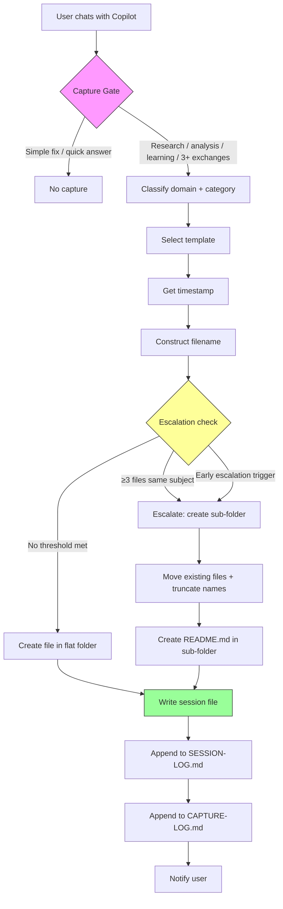
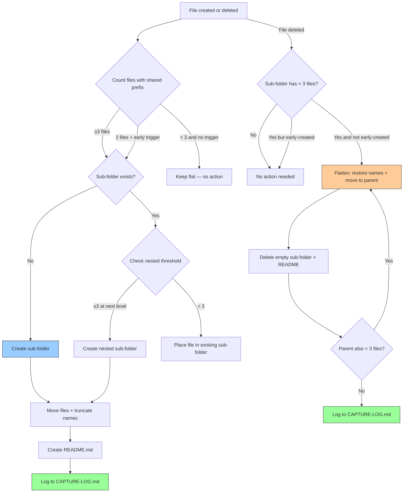
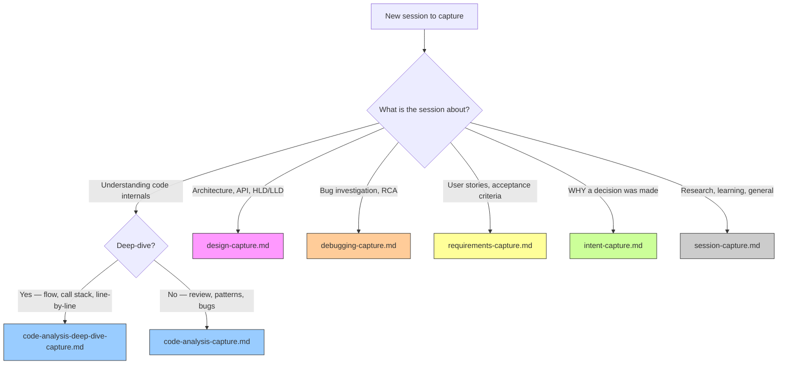

# Session Capture — How AI Chat Sessions Are Saved

> **Audience:** Anyone using this repo's Copilot setup.
> Takes 5 minutes to read. After this, you'll know exactly when and how your
> AI conversations get preserved — and how to find them later.

---

## What Is Session Capture?

When you chat with Copilot in this repo, some conversations are automatically saved as
structured Markdown files inside `brain/ai-brain/sessions/`. These captured sessions
become a searchable knowledge base of your research, analysis, and learning.

**Think of it like a lab notebook for your AI conversations** — you don't record every
hallway chat, but you DO record every experiment result.

---

## The Big Picture

```text
You chat with Copilot
    ↓
Copilot evaluates: "Is this conversation worth saving?"
    ↓
  YES → Creates a structured .md file in sessions/
           with frontmatter, tags, and content sections
  NO  → Nothing happens — the chat is just a chat
```

---

## When Does Capture Happen?

### Conversations That ARE Captured

Any **ONE** of these triggers is enough:

| Trigger | Example |
|---|---|
| **Research** | "Compare REST vs gRPC for our use case" |
| **Code analysis** | "Review this service class for design smells" |
| **Requirements** | "Let's scope the MVP features for task-manager" |
| **Complex debugging** | "Help me track down this intermittent NPE" |
| **Architecture decisions** | "Should we use microservices or a monolith?" |
| **Learning deep-dives** | "Explain Java virtual threads in depth" |
| **Performance analysis** | "Profile this query — it's slow at scale" |
| **Feature exploration** | "What are the design options for real-time chat?" |
| **Documentation** | "Help me write API docs for the config module" |
| **Financial/advisory** | "Analyze my freelance tax optimization options" |
| **3+ substantive exchanges** | Multiple back-and-forth with real analytical depth |
| **Long analytical output** | A single response exceeding ~500 words of explanation |

### Conversations That Are NOT Captured

| Skip Condition | Example |
|---|---|
| Simple refactoring | "Rename this variable to `orderTotal`" |
| One-line fixes | "Add the missing import for `List`" |
| Formatting/linting | "Run the linter and fix whitespace" |
| Quick factual answers | "What's the return type of `Stream.map()`?" |
| Build commands | "Compile and run `Main.java`" |
| Simple git operations | "Commit with message 'fix typo'" |
| Routine file operations | "Create a new file at `src/utils/Helper.java`" |

**Rule of thumb:** If it takes analytical thinking, it gets captured. If it's mechanical,
it doesn't.

### Edge Cases

- **Starts simple, becomes complex** — capture begins mid-conversation when complexity
  emerges, and earlier exchanges are included retroactively.
- **You can force capture** — say "capture this session" or `/capture` at any time.
- **You can prevent capture** — say "don't capture this" or "no session log."

---

## Where Do Captured Sessions Go?

Sessions are organized by **domain** (work vs personal) and **category** (what kind
of work):

```text
brain/ai-brain/sessions/
├── SESSION-LOG.md                          ← Index of ALL captured sessions
│
├── work/                                   ← Job-related conversations
│   ├── code-analysis/                      ← Code review, architecture review
│   │   └── deep-dive/                      ← Code internals deep-dive (permanent)
│   ├── debugging/                          ← Complex bug investigation
│   ├── requirements/                       ← User stories, acceptance criteria
│   ├── performance/                        ← Profiling, optimization
│   ├── feature-exploration/                ← Design alternatives, POC, feasibility
│   ├── documentation/                      ← API docs, design docs, runbooks
│   ├── research/                           ← Technology evaluation, protocol analysis
│   └── general/                            ← Anything else work-related
│
└── personal/                               ← Personal projects & self-learning
    ├── learning/                           ← Concept deep-dives, tutorials
    ├── financial/                          ← Budgeting, investment, tax planning
    ├── research/                           ← Personal interest research (non-software)
    ├── general/                            ← Anything else personal
    └── software-dev/                       ← Personal coding projects (umbrella)
        ├── requirements/                   ← Scoping, user stories for your projects
        ├── research/                       ← Tech evaluation for your projects
        ├── design/                         ← Architecture, API design, schemas
        ├── implementation/                 ← Coding sessions, feature building
        ├── testing/                        ← Test strategy, TDD/BDD setup
        ├── code-review/                    ← Code analysis, refactoring review
        │   └── deep-dive/                  ← Code internals deep-dive (permanent)
        ├── devops/                         ← CI/CD, Docker, deployment
        └── general/                        ← Other software dev activities
```

**How domain is decided:**

- **work** = things you'd discuss with your manager or team
- **personal** = things you'd do on your own time

When ambiguous, defaults to `work`.

---

## File Naming

Every captured session follows this pattern:

```text
YYYY-MM-DD_HH-MMtt_<category>_<subject>.md
```

| Part | What it is | Example |
|---|---|---|
| Date | ISO date | `2026-03-24` |
| Time | 12-hour, lowercase am/pm | `02-15pm` |
| Category | Matches the folder name | `research` |
| Subject | 3-8 words, kebab-case | `spring-vs-quarkus-comparison` |

**Real examples:**

```text
2026-03-24_02-15pm_research_mcp-transport-sse-vs-stdio.md
2026-03-24_10-30am_code-analysis_order-service-calculate-total.md
2026-03-24_01-30pm_financial_tax-optimization-freelance-income.md
2026-03-24_05-00pm_learning_java-virtual-threads-deep-dive.md
```

### Versioning — Continuing a Previous Session

When you continue analysis on the **same subject** from a prior session, versions are
appended:

```text
2026-03-20_10-30am_code-analysis_order-service-calculate-total.md      ← v1 (implicit)
2026-03-21_02-15pm_code-analysis_order-service-calculate-total_v2.md   ← v2
2026-03-22_09-00am_code-analysis_order-service-calculate-total_v3.md   ← v3
```

**When to version vs. create a new file:**

| Situation | Action |
|---|---|
| Same subject, continued analysis | Version (v2, v3) |
| Same area, different aspect | New file |
| Same topic, weeks later | New file (too stale) |

---

## What's Inside a Captured Session File?

Every session file has two parts: **frontmatter** (metadata) and **content** (the actual
conversation).

### Frontmatter (YAML Header)

```yaml
---
date: 2026-03-24
time: "02:15 PM"
kind: session-capture
domain: personal
category: research
project: learning-assistant
subject: spring-vs-quarkus-comparison
tags: [java, spring-boot, quarkus, trade-off-analysis]
status: draft
version: 1
parent: null
complexity: high
outcomes:
  - Spring Boot wins for ecosystem maturity
  - Quarkus wins for startup time and native compilation
source: copilot
scope: global
scope-project: null
scope-feature: null
scope-transitions: []
scope-refs: []
---
```

### Frontmatter Field Reference

| Field | What It Means | Example Values |
|---|---|---|
| `date` | When the session happened | `2026-03-24` |
| `time` | Start time (quoted) | `"02:15 PM"` |
| `kind` | Always `session-capture` | `session-capture` |
| `domain` | Work or personal | `work`, `personal` |
| `category` | Activity type (matches folder) | `research`, `debugging`, `requirements` |
| `project` | Which project this relates to | `learning-assistant`, `task-manager` |
| `subject` | Topic in kebab-case | `spring-vs-quarkus-comparison` |
| `tags` | 3-7 searchable keywords | `[java, spring-boot, trade-off-analysis]` |
| `status` | Lifecycle state | `draft`, `final`, `archived` |
| `version` | Version number (starts at 1) | `1`, `2`, `3` |
| `parent` | Previous version's filename | `null` or `2026-03-20_..._v1.md` |
| `complexity` | How deep the session went | `high`, `medium` |
| `outcomes` | Key takeaways (list) | `- identified 3 code smells` |
| `source` | Always `copilot` for AI sessions | `copilot` |

#### Scope Fields (for tracking context shifts)

| Field | What It Means | Example Values |
|---|---|---|
| `scope` | How broadly applicable the content is | `global`, `project`, `feature` |
| `scope-project` | Which project (when scoped) | `null`, `task-manager` |
| `scope-feature` | Which feature (when narrowly scoped) | `null`, `user-auth-flow` |
| `scope-transitions` | Log of scope changes during the session | `[]` or list of transitions |
| `scope-refs` | Links to related sessions at other scopes | `[]` or list of references |

**Scope levels explained:**

| Level | Meaning | Example |
|---|---|---|
| `global` | Useful for any project | "How does OAuth 2.0 work?" |
| `project` | Useful within one project | "Which auth library for task-manager?" |
| `feature` | Useful for one specific feature | "task-manager login page OAuth button" |

### Content Structure

```markdown
# Session Title — Human-Readable Description

> **Context:** Brief 1-2 sentence context.

---

## Request

The user's original question or request.

---

## Analysis / Response

The substantive AI response — code, tables, diagrams, explanations.
Uses H3/H4 headings for structure.

---

## Key Outcomes

- Outcome 1
- Outcome 2

---

## Follow-Up / Next Steps

- [ ] Action item 1
- [ ] Action item 2

---

## Session Metadata

| Property | Value |
|---|---|
| Duration | ~X exchanges |
| Files touched | `file1.java`, `file2.md` |
| Related sessions | none |
```

For **multi-exchange sessions** (several distinct Q&A pairs), numbered exchange sections
are used instead:

```markdown
## Exchange 1 — Topic A

### Request
...
### Response
...

## Exchange 2 — Topic B

### Request
...
### Response
...
```

---

## Tagging System

Tags make sessions discoverable across folders. Every session gets 3-7 tags.

| Tag Type | Format | Example |
|---|---|---|
| Project | `project:<name>` | `project:task-manager` |
| GitHub repo | `gh:<owner/repo>` | `gh:saharshpoddarorg/task-manager` |
| Activity | plain kebab-case | `requirements`, `api-design`, `debugging` |
| Technology | plain kebab-case | `java`, `spring-boot`, `docker`, `react` |

**Example tag set:** `[project:task-manager, requirements, api-design, rest, java]`

---

## Project-Aware Sessions

When you start chatting about a **personal software project**, Copilot automatically
detects it and routes the session to `personal/personal-work/software-dev/<activity>/`.

### Detection Signals

| What You Say | What Copilot Does |
|---|---|
| "Let's work on ABSDevelopment" | Sets scope to project `abs-development` |
| "For my expense tracker project" | Sets scope to project `expense-tracker` |
| "I want to build a recipe sharing app" | Sets scope to project `recipe-sharing-app` |
| "Let's scope the MVP for task-manager" | Sets scope to feature `mvp` within `task-manager` |

### Activity Switching Within a Project

Real conversations naturally jump between activities. When you shift activities
mid-session, Copilot logs the transition:

| You Say | Activity Change |
|---|---|
| "Now let's design the API" | requirements → design |
| "Let's start coding this" | design → implementation |
| "What does the competitor do?" | any → research |
| "Let's write tests for this" | implementation → testing |
| "How should we deploy this?" | any → devops |

These transitions are logged in `scope-transitions` and annotated in the session body
with scope boundary markers.

---

## Scope Transitions — When Conversations Shift

Conversations don't always stay in one box. A session might start as project-specific
requirements and widen into general technology research.

### Widening (feature → project → global)

> "This Spring Boot vs Quarkus comparison is useful beyond just task-manager."

The session scope widens from `project` to `global`. The transition is logged, and the
widened content becomes discoverable for any project.

### Narrowing (global → project → feature)

> "OK, but specifically for task-manager, which one should we use?"

The session scope narrows back to `project`. The general comparison stays, but the
decision applies to the specific project.

### When long tangents happen

| Situation | What Happens |
|---|---|
| Brief tangent (1-2 exchanges) | Stays in the same file with a logged transition |
| Extended new-scope work (3+ exchanges) | Forks into a separate session file |
| Different project entirely | Always forks — different scope |

Forked sessions cross-reference each other with `scope-refs` entries:

```yaml
# In the original file
scope-refs:
  - file: "personal/personal-work/software-dev/research/2026-03-24_research_spring-vs-quarkus.md"
    relationship: spawned

# In the forked file
scope-refs:
  - file: "personal/personal-work/software-dev/requirements/2026-03-24_requirements_task-manager-mvp.md"
    relationship: origin
```

---

## Templates

Seven templates live in `brain/ai-brain/sessions/_templates/`:

| Template | Use For |
|---|---|
| [session-capture.md](../../brain/ai-brain/sessions/_templates/session-capture.md) | General sessions — research, analysis, learning, exploration |
| [code-analysis-capture.md](../../brain/ai-brain/sessions/_templates/code-analysis-capture.md) | Code review — class/method analysis, findings tables, refactoring proposals |
| [code-analysis-deep-dive-capture.md](../../brain/ai-brain/sessions/_templates/code-analysis-deep-dive-capture.md) | Code deep-dive — internals, data flow, call stack, code blocks, line-by-line |
| [design-capture.md](../../brain/ai-brain/sessions/_templates/design-capture.md) | Design sessions — approach/proposal alternatives, use cases, acceptance criteria |
| [debugging-capture.md](../../brain/ai-brain/sessions/_templates/debugging-capture.md) | Debugging — hypothesis tracking, root cause analysis, prevention measures |
| [requirements-capture.md](../../brain/ai-brain/sessions/_templates/requirements-capture.md) | Requirements gathering — user stories, BDD, NFRs, scope definition |
| [intent-capture.md](../../brain/ai-brain/sessions/_templates/intent-capture.md) | Design decisions — intent statements, capability inventories, migrations |

### When to Use Which Template

| Session Focus | Template |
|---|---|
| Exploring a concept, comparing options, general research | `session-capture.md` |
| Reviewing code for patterns, smells, bugs, or refactoring | `code-analysis-capture.md` |
| Understanding code internals — data flow, call stack, line-by-line | `code-analysis-deep-dive-capture.md` |
| Designing components, APIs, schemas, or evaluating approaches | `design-capture.md` |
| Investigating a bug, error, or unexpected behaviour | `debugging-capture.md` |
| Defining WHAT to build (user stories, acceptance criteria, scope) | `requirements-capture.md` |
| Documenting WHY a design/migration decision was made | `intent-capture.md` |

---

## Code Analysis Deep-Dive

A **deep-dive** is an intensive code analysis session aimed at understanding complete
internals — data flow, call stack, code blocks, and line-by-line behaviour.

### Permanent `deep-dive/` Sub-Folder

Deep-dive sessions always route to a permanent `deep-dive/` sub-folder:

```text
# Work domain
sessions/work/code-analysis/deep-dive/
  2026-05-02_03-21pm_order-service-calculate-total.md
  2026-05-02_03-51pm_order-service-validate-order.md

# Personal domain
sessions/personal/personal-work/software-dev/code-review/deep-dive/
  2026-05-02_04-00pm_task-manager-crud-service.md
```

This folder is **structural** — it is always there, not created by escalation, and not
subject to de-escalation. Normal Pattern 3a escalation (class → method) still applies
inside the `deep-dive/` folder.

### When to Use Deep-Dive vs Regular Code Analysis

| Use Case | Template | Folder |
|---|---|---|
| Finding bugs, code smells, refactoring opportunities | `code-analysis-capture.md` | `code-analysis/` |
| Understanding how code works — flow, internals, line-by-line | `code-analysis-deep-dive-capture.md` | `code-analysis/deep-dive/` |

### Naming Inside `deep-dive/`

Files drop the `code-analysis_` prefix (implied by parent):

```text
2026-05-02_03-21pm_order-service-calculate-total.md    ← method deep-dive
2026-05-02_03-21pm_order-service-overview.md            ← class-level deep-dive
2026-05-02_03-21pm_payment-flow.md                      ← cross-class flow
```

### 9-Layer Analysis Structure

1. High-Level Overview — purpose, responsibility, design role
2. Data Flow — inputs → transformations → outputs
3. Call Stack / Method Flow — method call chain
4. Code Block Breakdown — split by functional cohesion
5. Line-by-Line Walkthrough — key logic lines
6. State Changes — how variables and state evolve
7. Edge Cases & Error Paths — what can go wrong
8. Dependencies & Coupling — who depends on whom
9. Key Takeaways — summary for future reference

> **Slash command:** Use `/code-analysis-deep-dive` to start a deep-dive session.

---

## Session Log — The Master Index

Every captured session is also appended to
[SESSION-LOG.md](../../brain/ai-brain/sessions/SESSION-LOG.md) — an append-only table
that serves as a quick-scan index:

```markdown
| Date | Time | Domain | Category | Subject | Ver | Complexity | File |
|---|---|---|---|---|---|---|---|
| 2026-03-24 | 02:15 PM | personal | research | spring-vs-quarkus | v1 | high | [View](personal/...) |
```

---

## Folder Escalation — When Folders Get Full

As sessions accumulate, escalation patterns auto-organize them into sub-folders.

### Pattern 1 — Subject Escalation (3+ files on same subject)

When 3+ files relate to the same subject, they move into a sub-folder:

```text
# Before (flat)
work/code-analysis/
  2026-03-20_..._order-service-calculate-total.md
  2026-03-21_..._order-service-validate-order.md
  2026-03-22_..._order-service-process-payment.md
  ... (3+ files about order-service)

# After (grouped)
work/code-analysis/order-service/
  calculate-total.md
  validate-order.md
  process-payment.md
```

### Pattern 2 — Project Escalation (3+ files for same project in one activity)

```text
# Before
personal/personal-work/software-dev/requirements/
  2026-03-20_..._task-manager-mvp-scope.md
  2026-03-21_..._task-manager-recurring-tasks.md
  2026-03-22_..._task-manager-notification-rules.md

# After
personal/personal-work/software-dev/requirements/task-manager/
  mvp-scope.md
  recurring-tasks.md
  notification-rules.md
```

### Pattern 3 — Domain-Specific Hierarchical Escalation

Certain categories support two-level hierarchies that mirror the content structure:

| Pattern | Category | Level 1 | Level 2 | Thresholds |
|---|---|---|---|---|
| **3a** | code-analysis, code-review | class name | method name | 3+ / 3+ |
| **3b** | design, feature-exploration | component | aspect (intent, approach, schema, etc.) | 3+ / 3+ |
| **3c** | debugging | service | issue type | 3+ / 3+ |

#### Example: Code Analysis Class → Method Hierarchy

```text
work/code-analysis/order-service/
  calculate-total/
    2026-04-01_..._calculate-total.md
    2026-04-07_..._calculate-total_v2.md
  2026-04-02_..._validate-order.md
  2026-04-03_..._process-payment.md
```

#### Example: Design Component → Aspect Hierarchy

```text
personal/personal-work/software-dev/design/task-manager/
  api-design/
    2026-04-01_..._rest-endpoints.md
    2026-04-02_..._graphql-evaluation.md
  2026-04-03_..._database-schema.md
  2026-04-04_..._auth-flow.md
```

**Design aspects** include: intent, approach, proposal, api-design, schema, use-case,
criteria, security, performance, patterns, trade-offs, migration, hld, lld.

### Cross-Cutting Project Index

When a project spans 3+ activity categories, a project index file is created:

```text
personal/personal-work/software-dev/task-manager-INDEX.md
```

This provides a single entry point listing all sessions for that project across
requirements, design, implementation, testing, and other activities.

### Name Truncation — What Happens to Filenames

When files move into a sub-folder during escalation, redundant parts of the filename
are dropped (the folder path already carries that information):

```text
# Original (flat)
2026-05-02_03-21pm_code-analysis_order-service-calculate-total.md

# After move to code-analysis/order-service/
2026-05-02_03-21pm_calculate-total.md     ← dropped "code-analysis_order-service-"
```

**Formula:** `YYYY-MM-DD_HH-MMtt_<category>_<grouping-key>-<distinguisher>.md`
becomes `YYYY-MM-DD_HH-MMtt_<distinguisher>.md` inside the sub-folder.
Version suffixes (`_v2`, `_v3`) are always preserved.

### De-Escalation — When Sub-Folders Flatten Back

De-escalation is the reverse of escalation. When a sub-folder drops below **3 session
files** (e.g., after deletion), its files move back to the parent folder with restored
full names:

```text
# Sub-folder has < 3 files after deletion → flatten
work/code-analysis/order-service/
  2026-05-02_03-21pm_calculate-total.md
  2026-05-02_03-51pm_validate-order.md
  README.md

# After de-escalation (full names restored)
work/code-analysis/
  2026-05-02_03-21pm_code-analysis_order-service-calculate-total.md
  2026-05-02_03-51pm_code-analysis_order-service-validate-order.md
```

**Cascade rule:** If flattening a nested sub-folder (e.g., method → class) causes the
parent sub-folder to also drop below threshold, it cascades — both levels flatten.

All de-escalation operations are logged in `CAPTURE-LOG.md`.

---

## Capture Logging

Two logs track all session capture operations:

| Log | Purpose | Location |
|---|---|---|
| `SESSION-LOG.md` | Index of ALL captured sessions | `sessions/SESSION-LOG.md` |
| `CAPTURE-LOG.md` | Structural operations (escalation, moves, forks) | `sessions/CAPTURE-LOG.md` |

`CAPTURE-LOG.md` tracks every escalation, version continuation, and fork event with
timestamps and file counts. Created automatically on first use.

---

## Configurable Session Path

The session capture directory defaults to `<brain-root>/sessions/`. To use a different
location, set the `SESSION_CAPTURE_PATH` environment variable:

```powershell
# Relative to brain root (default)
$env:SESSION_CAPTURE_PATH = "sessions"

# Different sub-folder inside brain
$env:SESSION_CAPTURE_PATH = "captured-sessions"

# Absolute path (outside brain workspace)
$env:SESSION_CAPTURE_PATH = "C:\my-sessions"
```

See [configuration-reference.md](configuration-reference.md) for the full config hierarchy.

---

## User Controls

| Command | Effect |
|---|---|
| "capture this session" or `/capture` | Force capture regardless of trigger criteria |
| "don't capture this" or "no session log" | Suppress capture for this conversation |
| "capture to work/research" | Force capture to a specific domain/category |
| `/brain-capture-session` | Slash command to convert current session into a note |

---

## How Captured Sessions Fit Into the Brain Workspace

```text
brain/ai-brain/
├── inbox/       TEMP       Raw capture — drafts, unprocessed (gitignored)
├── notes/       YOURS      Your distilled writing — insights, decisions (tracked)
├── library/     SOURCES    Imported external material (tracked)
└── sessions/    CAPTURED   AI conversation captures (tracked)
```

### Promotion Path

Sessions can be **promoted** to notes when you distil them:

1. Read the captured session
2. Write your own synthesis in `notes/`
3. Link back: `Source: [session](../sessions/work/...)`
4. The session stays as reference; the note is your knowledge

---

## Git & Commit Convention

The `sessions/` tier is **git-tracked**. Captured sessions use this commit format:

```text
brain(sessions): capture <category> — <subject>

Captured <domain>/<category> session on <subject>.
Complexity: <high|medium>. Version: v<N>.

— created by gpt
```

---

## Workflow Diagrams

### Session Capture Lifecycle



### Escalation & De-Escalation Flow



### Template Selection Flow



---

## Quick Reference Card

```text
CAPTURE GATE     Research, analysis, debugging, learning, 3+ exchanges, 500+ words  → YES
                 Simple fix, quick answer, formatting, routine task                  → NO

DOMAINS          work (job stuff)  |  personal (your stuff)

NAMING           YYYY-MM-DD_HH-MMtt_<category>_<subject>.md

FRONTMATTER      17+ fields: date, time, kind, domain, category, project, subject,
                 tags, status, version, parent, complexity, outcomes, source,
                 scope, scope-project, scope-feature, scope-transitions, scope-refs
                 + optional: code-target, design-target, debug-target

TEMPLATES        session-capture.md              → general (research, learning)
                 code-analysis-capture.md        → code review, patterns, findings
                 code-analysis-deep-dive-capture → code internals, data flow, call stack, line-by-line
                 design-capture.md               → architecture, proposals, use cases
                 debugging-capture.md            → RCA, hypothesis tracking
                 requirements-capture.md         → user stories, BDD, NFRs
                 intent-capture.md               → design decisions, migrations

TAGS             3-7 per session: project:<name>, activity tags, tech tags

VERSIONS         Same subject continued = v2, v3...
                 Different aspect = new file

ESCALATION       Pattern 1: 3+ files same subject    → subject sub-folder
                 Pattern 2: 3+ files same project     → project sub-folder
                 Pattern 3a: 3+ class / 3+ method      → class/method hierarchy
                 Pattern 3b: 3+ component / 3+ aspect  → component/aspect hierarchy
                 Pattern 3c: 3+ service / 3+ issue     → service/issue hierarchy

DE-ESCALATION    Sub-folder drops below 3 files        → flatten back to parent
                 Names restored with full prefix         → cascade if parent also < 3

TRUNCATION       On escalation: drop category + grouping-key prefix from filename
                 On de-escalation: restore category + grouping-key prefix to filename

LOGGING          SESSION-LOG.md  — every captured session
                 CAPTURE-LOG.md  — every escalation, fork, structural operation

CONFIG           BRAIN_PATH              — brain workspace location
                 SESSION_CAPTURE_PATH    — session capture sub-directory

CONTROLS         "capture this" = force    "don't capture" = suppress
```

---

## Further Reading

| Topic | Where |
|---|---|
| Full capture policy (machine-readable rules) | [chat-capture.instructions.md](../instructions/chat-capture.instructions.md) |
| Scope management protocol (widen/narrow/fork) | [session-scoping.instructions.md](../instructions/session-scoping.instructions.md) |
| Session templates | [sessions/_templates/](../../brain/ai-brain/sessions/_templates/) |
| Brain workspace overview | [brain/ai-brain/README.md](../../brain/ai-brain/README.md) |
| Session tier README | [sessions/README.md](../../brain/ai-brain/sessions/README.md) |
| PKM philosophy & design decisions | [pkm-philosophy.md](../../brain/ai-brain/pkm-philosophy.md) |
| AI-brain integration with PKM tools | [ai-brain-integration.md](../../brain/digitalnotetaking/ai-brain-integration.md) |
| Brain management skill | [brain-management SKILL](../skills/knowledge-management/brain-management/SKILL.md) |

---

**Navigation:** [START-HERE](START-HERE.md) · [Navigation Index](navigation-index.md) · [Brain README](../../brain/ai-brain/README.md)
