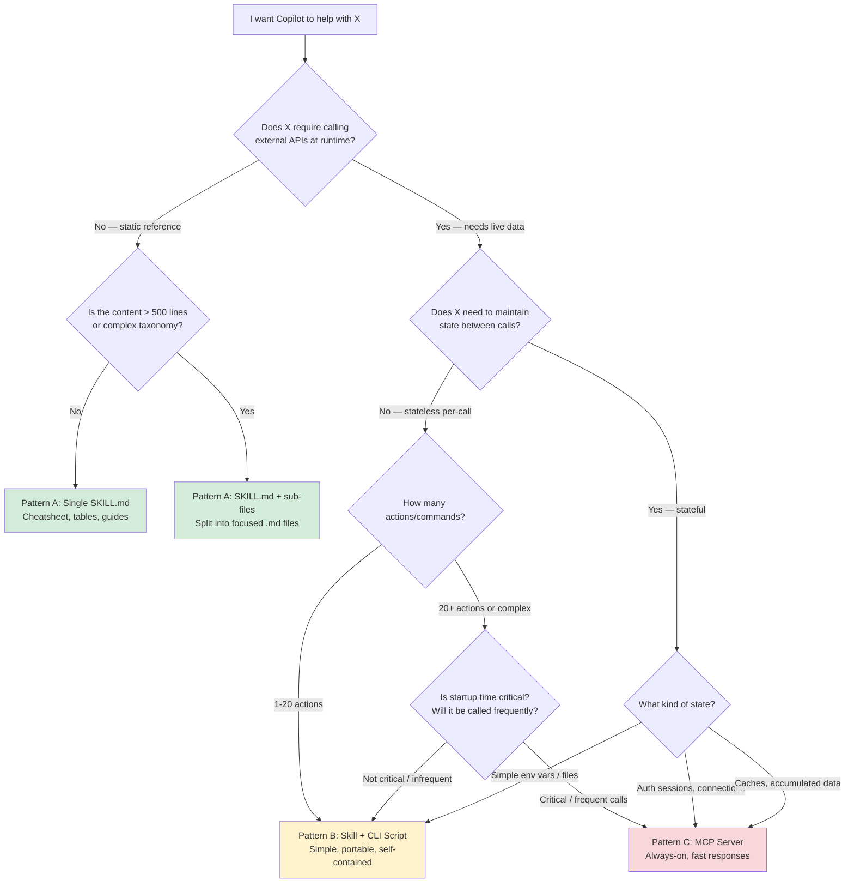

# Skill Architecture Guide — Patterns, Languages, and Tool Integration

> **Purpose:** Complete reference for understanding the three architectural patterns that
> give Copilot executable capabilities — when to use each, how language choice affects them,
> and practical examples from this repo and the broader ecosystem.
>
> **Audience:** Developers familiar with Java who want to design skills with or without
> executable code, especially for a repo revamp of the learning-resources system.

| Audience | Start Here |
|---|---|
| 🟢 **Newbie** | [The Three Patterns](#the-three-patterns--overview) → [Decision Flowchart](#master-decision-flowchart) → [Quick Examples](#quick-examples-from-this-repo) |
| 🟡 **Amateur** | [Language Comparison](#language-comparison-for-executable-skills) → [Java Patterns](#java-specific-patterns-for-pattern-b) → [Hybrid Designs](#hybrid-pattern--skill--mcp-together) |
| 🔴 **Pro** | [Architecture Decision Records](#architecture-decision-records) → [Migration Planning](#migration-planning-for-learning-resources-revamp) → [Advanced Composition](#advanced-composition--multi-skill-systems) |

---

## Table of Contents

- [The Three Patterns — Overview](#the-three-patterns--overview)
- [Master Decision Flowchart](#master-decision-flowchart)
- [Quick Examples from This Repo](#quick-examples-from-this-repo)
- [Pattern A — Pure Knowledge Skill (Tier 1)](#pattern-a--pure-knowledge-skill-tier-1)
- [Pattern B — Knowledge + Bundled CLI (Tier 2)](#pattern-b--knowledge--bundled-cli-tier-2)
- [Pattern C — MCP Server (Tier 3)](#pattern-c--mcp-server-tier-3)
- [Same Scenario, Three Languages — Side-by-Side](#same-scenario-three-languages--side-by-side)
- [Language Deep Dives](#language-deep-dives)
- [Language Comparison for Executable Skills](#language-comparison-for-executable-skills)
- [Java-Specific Patterns for Pattern B](#java-specific-patterns-for-pattern-b)
- [Hybrid Pattern — Skill + MCP Together](#hybrid-pattern--skill--mcp-together)
- [Architecture Decision Records](#architecture-decision-records)
- [Migration Planning for Learning Resources Revamp](#migration-planning-for-learning-resources-revamp)
- [Advanced Composition — Multi-Skill Systems](#advanced-composition--multi-skill-systems)
- [Anti-Patterns and Pitfalls](#anti-patterns-and-pitfalls)
- [Portability and Sharing](#portability-and-sharing)
- [Further Reading](#further-reading)

---

## The Three Patterns — Overview

Every approach for giving Copilot capabilities beyond text generation falls into one of
three architectural patterns. Understanding these patterns is the single most important
concept for designing your skill system.

```text
┌─────────────────────────────────────────────────────────────────────────────────┐
│                                                                                 │
│  Pattern A: Pure Knowledge Skill                                                │
│  ─────────────────────────────                                                  │
│  • SKILL.md = Markdown text (cheatsheets, tables, guides)                       │
│  • No executable code whatsoever                                                │
│  • Copilot READS it for context — like reading a reference book                 │
│  • Language: IRRELEVANT (it's just Markdown)                                    │
│  • Example: learning-resources-vault, copilot-customization                     │
│                                                                                 │
├─────────────────────────────────────────────────────────────────────────────────┤
│                                                                                 │
│  Pattern B: Knowledge + Bundled CLI Script                                      │
│  ──────────────────────────────────────────                                     │
│  • SKILL.md = Knowledge + invocation instructions                               │
│  • scripts/ folder = executable code (Java, Node, Python, etc.)                 │
│  • Copilot RUNS the script via terminal (run_in_terminal tool)                  │
│  • Language: MATTERS for the script (runtime availability, startup, portability) │
│  • Example: atlassian-tools (Node.js CLI)                                       │
│                                                                                 │
├─────────────────────────────────────────────────────────────────────────────────┤
│                                                                                 │
│  Pattern C: MCP Server (Full Protocol)                                          │
│  ─────────────────────────────────────                                          │
│  • .vscode/mcp.json = server registration                                       │
│  • Separate module = long-running server process                                │
│  • Copilot calls tools via JSON-RPC protocol (native tool integration)          │
│  • Language: BARELY MATTERS (protocol is language-agnostic)                      │
│  • Example: modules/mcp-atlassian/ (Java), modules/mcp-learning-resources/      │
│                                                                                 │
└─────────────────────────────────────────────────────────────────────────────────┘
```

### Key Differences at a Glance

| Dimension | Pattern A (Pure Skill) | Pattern B (Skill + CLI) | Pattern C (MCP Server) |
|---|---|---|---|
| **What Copilot does** | Reads text for context | Runs a terminal command | Calls a tool via JSON-RPC |
| **Runtime needed** | None | Script runtime (JDK, Node, Python) | Server runtime + protocol layer |
| **Process lifecycle** | No process | Short-lived (per-command) | Long-lived (background server) |
| **Tool discovery** | Copilot reads SKILL.md body | Copilot reads SKILL.md invocation instructions | Protocol handshake (`tools/list`) |
| **Works in Ask mode** | ✅ Yes | ❌ No (needs terminal) | ❌ No (needs Agent mode) |
| **Works in Edit mode** | ✅ Yes | ❌ No (needs terminal) | ❌ No (needs Agent mode) |
| **Works in Agent mode** | ✅ Yes | ✅ Yes | ✅ Yes |
| **Data freshness** | Static (edit .md to update) | Dynamic (script calls APIs) | Dynamic (server calls APIs) |
| **Complexity** | Trivial | Low-Medium | Medium-High |
| **Portability** | Copy folder → done | Copy folder + ensure runtime | Copy module + configure + build |

---

## Master Decision Flowchart



### Decision Summary Table

| Situation | Pattern | Rationale |
|---|---|---|
| Curated resource lists, documentation, cheatsheets | A | Static content, works everywhere |
| API integration with < 20 endpoints | B | Simple, portable, no server lifecycle |
| Complex search with scoring/ranking | B or C | B if results are small; C if large dataset + frequent calls |
| External service with OAuth/session auth | C | Needs persistent auth state |
| Database CRUD operations | B or C | B for simple queries; C for connection pooling |
| File system operations | B | Short-lived, no state needed |
| Live monitoring/streaming | C | Needs persistent connection |
| One-shot data transformation | B | Run, transform, output, exit |
| Cross-service orchestration | C | Needs coordination state |

---

## Quick Examples from This Repo

### Pattern A — `learning-resources-vault` (Pure Knowledge)

```text
.github/skills/learning-resources/learning-resources-vault/
├── SKILL.md                          ← Master index + metadata
├── resources-java.md                 ← 20 Java resources (Markdown tables)
├── resources-web-javascript.md       ← 12 web/JS resources
├── resources-python.md               ← 6 Python resources
├── resources-algorithms-ds.md        ← 11 algo/DS resources
├── resources-software-engineering.md ← 19 SE resources
├── resources-system-design.md        ← 13 system design resources
├── resources-devops-vcs-build.md     ← 25 DevOps resources
├── resources-cloud-security-ai.md    ← 18 cloud/security/AI resources
├── resources-notetaking-pkm.md       ← 27 PKM resources
├── resources-career-general.md       ← 25 career resources
├── taxonomy-reference.md             ← Enum taxonomy + keyword index
└── migration-mapping.md              ← How it maps from old MCP server
```

**Why Pattern A?** The 176 resources are static curated links. They don't change between
calls. No API needed. Copilot reads the tables and recommends resources based on user
questions. Works in Ask, Edit, AND Agent modes.

### Pattern B — `atlassian-tools` (Knowledge + CLI)

```text
.github/skills/devops-tooling/atlassian-tools/
├── SKILL.md                          ← Knowledge: 89 actions, recipes, JQL cheatsheet
├── scripts/atlassian_cli.js          ← Executable: Node.js REST client (single file)
├── package.json                      ← Declares Node 18+ engine (no npm install needed)
├── .env                              ← Credentials (gitignored)
├── .env.example                      ← Template for setup
├── GUIDE.md                          ← Developer setup guide
└── references/                       ← Additional knowledge files
    ├── action-catalog.md             ← All 89 action names, args, responses
    ├── usage-recipes.md              ← Concrete examples and patterns
    ├── workflow-playbooks.md         ← End-to-end workflow patterns
    ├── jql-cql-cheatsheet.md         ← Query language reference
    ├── confluence-formatting.md      ← HTML/macro formatting rules
    └── tone-and-disclaimer.md        ← Content tone guidelines
```

**Why Pattern B?** Jira/Confluence/Bitbucket data is live — it changes every minute.
Copilot needs to call REST APIs at runtime. But the tool doesn't need persistent state
(each call is independent — send request, get response). A single-file CLI with zero
dependencies is the simplest possible solution.

**How it works:**

```text
1. User asks: "What are my open Jira tickets?"
2. Copilot reads SKILL.md → learns the CLI exists and how to invoke it
3. Copilot reads references/jql-cql-cheatsheet.md → learns the right JQL
4. Copilot runs in terminal:
     $env:CLI_JSON_ARGS = '{"jql":"assignee=currentUser() AND status!=Done"}';
     node .github/skills/devops-tooling/atlassian-tools/scripts/atlassian_cli.js search_jira_issues
5. CLI calls Jira REST API, returns JSON to stdout
6. Copilot reads stdout, formats results for user
```

### Pattern C — `modules/mcp-atlassian/` (MCP Server)

```text
modules/mcp-atlassian/
├── build.gradle.kts                  ← Gradle build config
└── src/main/java/server/atlassian/
    ├── AtlassianMcpServer.java       ← Server entry point (JSON-RPC handler)
    ├── tools/                        ← 27 tool implementations
    │   ├── JiraTools.java
    │   ├── ConfluenceTools.java
    │   └── BitbucketTools.java
    ├── client/                       ← REST API client layer
    └── model/                        ← Request/response models

.vscode/mcp.json                      ← Server registration
```

**Why Pattern C?** This is the more formal approach — a long-running Java process with
native JSON-RPC protocol integration. Copilot discovers the 27 tools automatically via
protocol handshake. Better for complex, stateful operations where you want typed tool
schemas and persistent connections.

---

## Pattern A — Pure Knowledge Skill (Tier 1)

### When to Use

- ✅ Content is static reference material (docs, cheatsheets, patterns)
- ✅ Content rarely changes (update by editing .md files)
- ✅ No external API calls needed
- ✅ You want it to work in ALL Copilot modes (Ask, Edit, Agent)
- ✅ You want zero runtime dependencies
- ✅ You want instant activation (no startup time)
- ✅ Content fits in Markdown tables, lists, and code blocks

### When NOT to Use

- ❌ Data changes between requests (use Pattern B or C)
- ❌ You need to authenticate with external services
- ❌ You need to perform write operations
- ❌ You need computed/aggregated results

### Anatomy

```yaml
---
name: my-skill-name
description: >
  THIS IS THE ACTIVATION TRIGGER. Write it carefully — Copilot semantically
  matches user questions against this text to decide whether to load the skill.
  Include all keywords, topics, and use cases this skill covers.
---
```

```markdown
# Skill Title

## Quick Reference (newbie tier)
[Tables, commands, cheatsheets]

## Detailed Guide (amateur tier)
[Explanations, patterns, examples]

## Advanced / Pro Tips
[Edge cases, architecture, deep dives]
```

### Language Relevance: NONE

Pure skills are Markdown. No language, no runtime, no compilation. The SKILL.md is read
by Copilot as context text. Language is completely irrelevant.

### Design Tips

1. **Description field is everything** — if it doesn't mention a keyword, the skill won't
   activate when the user asks about that keyword
2. **Split large skills** — use sub-files (`resources-java.md`, `resources-python.md`)
   when total content exceeds ~500 lines
3. **Use Markdown tables** — they're the most token-efficient way to present structured data
4. **Include examples** — Copilot uses examples to understand how to apply the knowledge
5. **3-tier structure** — newbie/amateur/pro ensures appropriate depth for any user level

---

## Pattern B — Knowledge + Bundled CLI (Tier 2)

### When to Use

- ✅ Need to call external APIs at runtime (Jira, GitHub, databases, custom services)
- ✅ Each call is independent/stateless (no session needed between calls)
- ✅ Moderate number of actions (1-50)
- ✅ Want self-contained, portable skill (copy folder = done)
- ✅ Don't need the tool to stay running between calls
- ✅ Want simplicity over protocol formality

### When NOT to Use

- ❌ Need persistent connections or connection pooling
- ❌ Need OAuth flows that maintain session state
- ❌ Startup time is critical (100+ calls per session expected)
- ❌ Need native tool integration (structured schemas in Copilot's tool panel)
- ❌ Need the tool to work without terminal access

### How It Works — The Two-Layer Architecture

```text
┌─────────────────────────────────────────────────────────────────┐
│ Layer 1: KNOWLEDGE (SKILL.md + references/)                     │
│                                                                 │
│ • Teaches Copilot WHAT actions exist                            │
│ • Teaches Copilot HOW to invoke them (exact command syntax)     │
│ • Provides recipes, examples, error handling guidance           │
│ • Provides domain knowledge (JQL syntax, API quirks, etc.)      │
│                                                                 │
│ Language relevance: NONE (it's Markdown)                        │
├─────────────────────────────────────────────────────────────────┤
│ Layer 2: EXECUTION (scripts/ folder)                            │
│                                                                 │
│ • The actual executable code                                    │
│ • Reads arguments (env vars, CLI args, stdin)                   │
│ • Calls APIs / performs computation                             │
│ • Prints results to stdout (typically JSON)                     │
│ • Exits immediately after                                       │
│                                                                 │
│ Language relevance: YES (runtime, startup, deps, portability)   │
└─────────────────────────────────────────────────────────────────┘
```

### The Execution Contract

Every Pattern B skill follows this contract between SKILL.md and the script:

```text
1. SKILL.md declares: metadata.allowed-tools: [run_in_terminal]
2. SKILL.md teaches the invocation pattern:
     <runtime> <script-path> <action> [args]
3. Script reads args from:
     - Environment variable (e.g., CLI_JSON_ARGS) — recommended
     - Command-line arguments (e.g., process.argv) — fallback
4. Script outputs to stdout:
     { "success": true, "data": {...} }    — on success
     { "success": false, "error": "..." }  — on failure
5. Script exits with code 0 (success) or 1 (failure)
```

### SKILL.md Frontmatter for Pattern B

```yaml
---
name: my-tool-skill
description: >
  [Activation keywords and use cases — same as Pattern A]
metadata:
  allowed-tools:
    - run_in_terminal    # ← Critical: tells Copilot it can execute commands
  output-format: markdown
---
```

### Folder Structure Template

```text
.github/skills/<category>/<skill-name>/
├── SKILL.md                    ← Knowledge layer (mandatory)
├── scripts/
│   └── <tool>.<ext>            ← Executable (Java/Node/Python/PowerShell)
├── .env                        ← Credentials (gitignored)
├── .env.example                ← Credential template (committed)
├── GUIDE.md                    ← Developer setup documentation
└── references/                 ← Additional knowledge files (optional)
    ├── action-catalog.md       ← Complete action reference
    └── usage-recipes.md        ← Examples and patterns
```

---

## Pattern C — MCP Server (Tier 3)

### When to Use

- ✅ Complex tool with many operations (20+)
- ✅ Needs persistent state (connection pools, caches, auth sessions)
- ✅ High call frequency (amortize startup cost)
- ✅ Want native tool integration (structured schemas, Copilot tool panel)
- ✅ Need bidirectional communication (server can send notifications)
- ✅ Team has capacity to maintain a build system and server lifecycle
- ✅ Tool is shared across multiple repos/workspaces

### When NOT to Use

- ❌ Static reference content (use Pattern A)
- ❌ Simple stateless API calls (use Pattern B — much simpler)
- ❌ Want it to work in Ask/Edit mode (MCP only works in Agent mode)
- ❌ Want zero-config portability (MCP needs `.vscode/mcp.json` + build)
- ❌ Want quick iteration (code change → recompile → restart vs. edit .md)

### How It Works

```text
┌──────────────────────┐         ┌──────────────────────┐
│   VS Code / Copilot  │         │   Your MCP Server    │
│                      │         │   (Java process)     │
│  1. Starts server    │────────▶│                      │
│                      │         │  2. Returns tool list│
│  3. User asks Q      │         │     (JSON-RPC)       │
│  4. Copilot decides  │         │                      │
│     to call tool     │────────▶│  5. Executes tool    │
│                      │         │     (calls APIs etc) │
│  6. Gets response    │◀────────│  7. Returns result   │
│  8. Formats answer   │         │                      │
└──────────────────────┘         └──────────────────────┘
        STDIO or HTTP (JSON-RPC 2.0)
```

### Registration (`.vscode/mcp.json`)

```jsonc
{
  "servers": {
    "my-server": {
      "type": "stdio",
      "command": "java",
      "args": ["-jar", "modules/my-server/build/libs/my-server.jar"],
      "env": { "API_KEY": "${input:apiKey}" }
    }
  }
}
```

### Language Relevance: MINIMAL

The protocol (JSON-RPC 2.0 over STDIO or HTTP) is completely language-agnostic. Copilot
doesn't know or care what language your server is written in. It sends JSON, gets JSON back.

**Choose based on:**
- Team familiarity (you know Java → use Java)
- Ecosystem (TypeScript has the most MCP SDKs and community servers)
- Deployment (Go → single binary; Java → JAR + JDK; Node → node_modules)

---

## Same Scenario, Three Languages — Side-by-Side

The best way to understand language differences is to build the **exact same tool**
in each language and compare every dimension: structure, verbosity, error handling,
JSON, HTTP, and the SKILL.md invocation line.

### The Scenario: GitHub Stars Fetcher

> **Goal:** A Pattern B CLI skill that fetches the GitHub star count and description
> for any public repository. Copilot can ask: "How popular is Spring Boot on GitHub?"
> and the skill fetches live data.
>
> **Actions:**
>
> - `get_repo` — fetch repo metadata (stars, description, language, last push)
> - `compare_repos` — compare two repos side by side

---

### Folder Structure (identical for all three languages)

```text
.github/skills/github-stats/
├── SKILL.md                    ← Knowledge layer (language-agnostic Markdown)
├── scripts/
│   ├── github_stats.java       ← Java implementation
│   ├── github_stats.js         ← Node.js implementation
│   └── github_stats.py         ← Python implementation
├── .env.example                ← Template (same for all languages)
└── .env                        ← Gitignored (same for all languages)
```

**`.env.example` (same for all languages):**

```properties
# GitHub Personal Access Token (optional — increases rate limit from 60 to 5000/hr)
GITHUB_TOKEN=ghp_your_token_here
```

---

### SKILL.md Knowledge Layer (same for all languages — only invocation line differs)

The SKILL.md for all three implementations is identical except for the `## Invocation`
section. This shows that **language only affects one line in SKILL.md**:

```yaml
---
name: github-stats
description: >
  GitHub repository statistics — star counts, descriptions, language, activity.
  Use when asked about how popular a GitHub repo is, how many stars a project has,
  comparing GitHub projects, checking project activity, or fetching GitHub repo metadata.
metadata:
  allowed-tools:
    - run_in_terminal
  output-format: markdown
---
```

```markdown
## Available Actions

| Action | What it does | Required args |
|---|---|---|
| `get_repo` | Fetch stars, description, language, last push | `owner`, `repo` |
| `compare_repos` | Compare two repos side by side | `owner1`, `repo1`, `owner2`, `repo2` |

## Invocation

[This section changes per language — see below]

## Output Format

JSON to stdout:
​```json
{ "success": true, "data": { "stars": 75000, "description": "...", "language": "Java" } }
​```
On error:
​```json
{ "success": false, "error": "Repository not found" }
​```
```

---

### Implementation A — Java (Single-File Source Launcher)

**Invocation line in SKILL.md:**

```powershell
# PowerShell (Windows)
$env:CLI_JSON_ARGS = '{"owner":"spring-projects","repo":"spring-boot"}'; java .github\skills\github-stats\scripts\github_stats.java get_repo

# Bash (Linux/macOS)
CLI_JSON_ARGS='{"owner":"spring-projects","repo":"spring-boot"}' java .github/skills/github-stats/scripts/github_stats.java get_repo
```

**Full implementation:**

```java
// scripts/github_stats.java
// Requires: JDK 11+   Run: java github_stats.java <action>
// No compilation, no dependencies, no npm install.

import java.net.URI;
import java.net.http.HttpClient;
import java.net.http.HttpRequest;
import java.net.http.HttpResponse;
import java.nio.file.Files;
import java.nio.file.Path;
import java.util.Map;
import java.util.stream.Collectors;

public class github_stats {

    // One shared client — reused across all method calls within this process
    private static final HttpClient HTTP = HttpClient.newBuilder()
        .followRedirects(HttpClient.Redirect.NORMAL)
        .build();

    public static void main(String[] args) throws Exception {
        if (args.length < 1) {
            out("{\"success\":false,\"error\":\"Provide an action: get_repo | compare_repos\"}");
            System.exit(1);
        }

        Map<String, String> env = loadEnv();
        String jsonArgs = System.getenv().getOrDefault("CLI_JSON_ARGS", "{}");
        String action = args[0];

        String result = switch (action) {
            case "get_repo" -> getRepo(env, jsonArgs);
            case "compare_repos" -> compareRepos(env, jsonArgs);
            default -> "{\"success\":false,\"error\":\"Unknown action: " + action + "\"}";
        };
        out(result);
    }

    // ── get_repo ──────────────────────────────────────────────────────────────

    private static String getRepo(Map<String, String> env, String jsonArgs) throws Exception {
        String owner = extractStr(jsonArgs, "owner");
        String repo = extractStr(jsonArgs, "repo");

        String body = githubGet(env, "/repos/" + owner + "/" + repo);

        // Extract fields from raw JSON — no library needed for these simple lookups
        String stars = extractNum(body, "stargazers_count");
        String description = extractStr(body, "description");
        String language = extractStr(body, "language");
        String pushed = extractStr(body, "pushed_at");

        return "{\"success\":true,\"data\":{"
            + "\"owner\":\"" + owner + "\","
            + "\"repo\":\"" + repo + "\","
            + "\"stars\":" + stars + ","
            + "\"description\":\"" + esc(description) + "\","
            + "\"language\":\"" + esc(language) + "\","
            + "\"last_push\":\"" + pushed + "\""
            + "}}";
    }

    // ── compare_repos ─────────────────────────────────────────────────────────

    private static String compareRepos(Map<String, String> env, String jsonArgs) throws Exception {
        String owner1 = extractStr(jsonArgs, "owner1");
        String repo1 = extractStr(jsonArgs, "repo1");
        String owner2 = extractStr(jsonArgs, "owner2");
        String repo2 = extractStr(jsonArgs, "repo2");

        String body1 = githubGet(env, "/repos/" + owner1 + "/" + repo1);
        String body2 = githubGet(env, "/repos/" + owner2 + "/" + repo2);

        return "{\"success\":true,\"data\":{"
            + "\"repo1\":{\"full_name\":\"" + owner1 + "/" + repo1 + "\","
            + "\"stars\":" + extractNum(body1, "stargazers_count") + "},"
            + "\"repo2\":{\"full_name\":\"" + owner2 + "/" + repo2 + "\","
            + "\"stars\":" + extractNum(body2, "stargazers_count") + "}"
            + "}}";
    }

    // ── HTTP helper ───────────────────────────────────────────────────────────

    private static String githubGet(Map<String, String> env, String path) throws Exception {
        var builder = HttpRequest.newBuilder()
            .uri(URI.create("https://api.github.com" + path))
            .header("Accept", "application/vnd.github.v3+json")
            .header("User-Agent", "copilot-skill/1.0")
            .GET();

        // Token is optional — anonymous calls have a lower rate limit (60/hr)
        String token = env.get("GITHUB_TOKEN");
        if (token != null && !token.isBlank()) {
            builder.header("Authorization", "Bearer " + token);
        }

        HttpResponse<String> resp = HTTP.send(builder.build(),
            HttpResponse.BodyHandlers.ofString());

        if (resp.statusCode() == 404) {
            throw new RuntimeException("Repository not found: " + path);
        }
        if (resp.statusCode() != 200) {
            throw new RuntimeException("GitHub API error: HTTP " + resp.statusCode());
        }
        return resp.body();
    }

    // ── .env loader ───────────────────────────────────────────────────────────
    // Searches: <workspace>/.env then <skill-dir>/.env

    private static Map<String, String> loadEnv() {
        for (var candidate : new String[]{
            System.getProperty("user.dir") + "/.env",
            System.getProperty("user.dir") + "/.github/skills/github-stats/.env"
        }) {
            var path = Path.of(candidate);
            if (Files.exists(path)) {
                try {
                    return Files.readAllLines(path).stream()
                        .filter(l -> !l.isBlank() && !l.startsWith("#") && l.contains("="))
                        .collect(Collectors.toMap(
                            l -> l.substring(0, l.indexOf("=")).trim(),
                            l -> l.substring(l.indexOf("=") + 1).trim(),
                            (a, b) -> b));
                } catch (Exception ignored) { }
            }
        }
        return Map.of();
    }

    // ── Minimal JSON helpers (no library) ─────────────────────────────────────
    // These work for simple flat JSON — for nested/complex JSON, use a JAR with Jackson

    private static String extractStr(String json, String key) {
        int i = json.indexOf("\"" + key + "\"");
        if (i == -1) return "";
        int colon = json.indexOf(":", i);
        int q1 = json.indexOf("\"", colon);
        // Handle null values: "key": null
        String between = json.substring(colon + 1, q1).trim();
        if (between.startsWith("null")) return "";
        int q2 = json.indexOf("\"", q1 + 1);
        return json.substring(q1 + 1, q2);
    }

    private static String extractNum(String json, String key) {
        int i = json.indexOf("\"" + key + "\"");
        if (i == -1) return "0";
        int colon = json.indexOf(":", i);
        String rest = json.substring(colon + 1).trim();
        // Read digits until non-digit
        StringBuilder sb = new StringBuilder();
        for (char c : rest.toCharArray()) {
            if (Character.isDigit(c)) sb.append(c);
            else if (sb.length() > 0) break;
        }
        return sb.isEmpty() ? "0" : sb.toString();
    }

    private static String esc(String s) {
        return s == null ? "" : s.replace("\\", "\\\\").replace("\"", "\\\"");
    }

    private static void out(String s) { System.out.println(s); }
}
```

**What Java does well here:**

- Strong typing catches mistakes at compile time (when using IDE)
- `HttpClient` is a first-class citizen with builder pattern familiar to Java devs
- `switch` expressions with arrow syntax are clean (Java 14+)
- Easy to grow into a multi-class JAR when complexity increases

**What Java struggles with here:**

- JSON parsing is verbose without Jackson — the `extractStr`/`extractNum` helpers above
  are brittle for nested or complex JSON
- String escaping in JSON output is tedious (`\"` everywhere)
- JVM startup adds ~800ms to every single invocation

---

### Implementation B — Node.js (Single-File, No npm Install)

**Invocation line in SKILL.md:**

```powershell
# PowerShell (Windows)
$env:CLI_JSON_ARGS = '{"owner":"spring-projects","repo":"spring-boot"}'; node .github\skills\github-stats\scripts\github_stats.js get_repo

# Bash (Linux/macOS)
CLI_JSON_ARGS='{"owner":"spring-projects","repo":"spring-boot"}' node .github/skills/github-stats/scripts/github_stats.js get_repo
```

**Full implementation:**

```javascript
// scripts/github_stats.js
// Requires: Node.js 18+   Run: node github_stats.js <action>
// No npm install. Uses built-in fetch (Node 18+) and fs module.

import { readFileSync, existsSync } from 'fs';
import { resolve, dirname } from 'path';
import { fileURLToPath } from 'url';

const __dirname = dirname(fileURLToPath(import.meta.url));

// ── .env loader ───────────────────────────────────────────────────────────────

function loadEnv() {
  const candidates = [
    resolve(process.cwd(), '.env'),
    resolve(__dirname, '../.env'),
  ];
  const env = {};
  for (const path of candidates) {
    if (!existsSync(path)) continue;
    for (const line of readFileSync(path, 'utf8').split('\n')) {
      const trimmed = line.trim();
      if (!trimmed || trimmed.startsWith('#') || !trimmed.includes('=')) continue;
      const eqIdx = trimmed.indexOf('=');
      env[trimmed.slice(0, eqIdx).trim()] = trimmed.slice(eqIdx + 1).trim();
    }
  }
  return env;
}

// ── HTTP helper ───────────────────────────────────────────────────────────────

async function githubGet(env, path) {
  const headers = {
    'Accept': 'application/vnd.github.v3+json',
    'User-Agent': 'copilot-skill/1.0',
  };
  if (env.GITHUB_TOKEN) {
    headers['Authorization'] = `Bearer ${env.GITHUB_TOKEN}`;
  }

  const resp = await fetch(`https://api.github.com${path}`, { headers });

  if (resp.status === 404) throw new Error(`Repository not found: ${path}`);
  if (!resp.ok) throw new Error(`GitHub API error: HTTP ${resp.status}`);

  return resp.json();  // ← parse JSON in one line — no helpers needed
}

// ── get_repo ──────────────────────────────────────────────────────────────────

async function getRepo(env, args) {
  const { owner, repo } = args;
  const data = await githubGet(env, `/repos/${owner}/${repo}`);

  // Destructure exactly the fields we want — clean and explicit
  return {
    success: true,
    data: {
      owner,
      repo,
      stars: data.stargazers_count,
      description: data.description,
      language: data.language,
      last_push: data.pushed_at,
      open_issues: data.open_issues_count,
      forks: data.forks_count,
    }
  };
}

// ── compare_repos ─────────────────────────────────────────────────────────────

async function compareRepos(env, args) {
  const { owner1, repo1, owner2, repo2 } = args;

  // Run both requests in parallel — JavaScript async makes this trivial
  const [data1, data2] = await Promise.all([
    githubGet(env, `/repos/${owner1}/${repo1}`),
    githubGet(env, `/repos/${owner2}/${repo2}`),
  ]);

  return {
    success: true,
    data: {
      repo1: { full_name: `${owner1}/${repo1}`, stars: data1.stargazers_count,
               language: data1.language, forks: data1.forks_count },
      repo2: { full_name: `${owner2}/${repo2}`, stars: data2.stargazers_count,
               language: data2.language, forks: data2.forks_count },
      winner: data1.stargazers_count >= data2.stargazers_count
               ? `${owner1}/${repo1}` : `${owner2}/${repo2}`,
    }
  };
}

// ── Main entry point ──────────────────────────────────────────────────────────

const action = process.argv[2];
if (!action) {
  console.log(JSON.stringify({ success: false, error: 'Provide an action: get_repo | compare_repos' }));
  process.exit(1);
}

const env = loadEnv();
const cliArgs = JSON.parse(process.env.CLI_JSON_ARGS || '{}');

try {
  let result;
  switch (action) {
    case 'get_repo':       result = await getRepo(env, cliArgs); break;
    case 'compare_repos':  result = await compareRepos(env, cliArgs); break;
    default:               result = { success: false, error: `Unknown action: ${action}` };
  }
  console.log(JSON.stringify(result));  // ← one line, handles all escaping
} catch (err) {
  console.log(JSON.stringify({ success: false, error: err.message }));
  process.exit(1);
}
```

**What Node.js does well here:**

- `resp.json()` parses the entire response in one line — no extractStr helpers
- `JSON.stringify(result)` handles all escaping automatically — no manual `\"`
- `Promise.all([...])` runs parallel HTTP requests with zero extra code
- `const { owner, repo } = args` destructures JSON cleanly
- Startup is 5-10x faster than Java JVM

**What Node.js struggles with here:**

- `import.meta.url` / `__dirname` workaround is non-obvious for beginners
- No type checking (TypeScript would fix this but adds tooling)
- Error types aren't checked at compile time
- `process.env.CLI_JSON_ARGS || '{}'` parsing can fail silently on bad JSON

---

### Implementation C — Python (Single-File, stdlib Only)

**Invocation line in SKILL.md:**

```powershell
# PowerShell (Windows)
$env:CLI_JSON_ARGS = '{"owner":"spring-projects","repo":"spring-boot"}'; python .github\skills\github-stats\scripts\github_stats.py get_repo

# Bash (Linux/macOS)
CLI_JSON_ARGS='{"owner":"spring-projects","repo":"spring-boot"}' python3 .github/skills/github-stats/scripts/github_stats.py get_repo
```

**Full implementation:**

```python
#!/usr/bin/env python3
# scripts/github_stats.py
# Requires: Python 3.8+   Run: python github_stats.py <action>
# No pip install. Uses urllib.request (stdlib) and json (stdlib).

import json
import os
import sys
import urllib.request
import urllib.error
from pathlib import Path

# ── .env loader ───────────────────────────────────────────────────────────────

def load_env():
    """Search for .env in workspace root and skill directory."""
    candidates = [
        Path(os.getcwd()) / '.env',
        Path(__file__).parent.parent / '.env',
    ]
    env = {}
    for path in candidates:
        if not path.exists():
            continue
        for line in path.read_text(encoding='utf-8').splitlines():
            line = line.strip()
            if not line or line.startswith('#') or '=' not in line:
                continue
            key, _, value = line.partition('=')
            env[key.strip()] = value.strip()
    return env

# ── HTTP helper ───────────────────────────────────────────────────────────────

def github_get(env, path):
    """Make an authenticated GET request to the GitHub API."""
    url = f"https://api.github.com{path}"
    headers = {
        'Accept': 'application/vnd.github.v3+json',
        'User-Agent': 'copilot-skill/1.0',
    }
    if token := env.get('GITHUB_TOKEN'):  # walrus operator (Python 3.8+)
        headers['Authorization'] = f'Bearer {token}'

    req = urllib.request.Request(url, headers=headers)
    try:
        with urllib.request.urlopen(req) as resp:
            return json.loads(resp.read().decode('utf-8'))
    except urllib.error.HTTPError as e:
        if e.code == 404:
            raise RuntimeError(f"Repository not found: {path}")
        raise RuntimeError(f"GitHub API error: HTTP {e.code}")

# ── get_repo ──────────────────────────────────────────────────────────────────

def get_repo(env, args):
    owner = args['owner']
    repo = args['repo']
    data = github_get(env, f'/repos/{owner}/{repo}')

    # Python dicts map directly to JSON — no manual string building
    return {
        'success': True,
        'data': {
            'owner': owner,
            'repo': repo,
            'stars': data['stargazers_count'],
            'description': data.get('description', ''),
            'language': data.get('language', ''),
            'last_push': data['pushed_at'],
            'open_issues': data['open_issues_count'],
            'forks': data['forks_count'],
        }
    }

# ── compare_repos ─────────────────────────────────────────────────────────────

def compare_repos(env, args):
    owner1, repo1 = args['owner1'], args['repo1']
    owner2, repo2 = args['owner2'], args['repo2']

    # Python stdlib does NOT have async/await in the same easy way as Node.
    # For simplicity we make sequential calls here. For parallel, use
    # concurrent.futures.ThreadPoolExecutor (more code but achievable).
    data1 = github_get(env, f'/repos/{owner1}/{repo1}')
    data2 = github_get(env, f'/repos/{owner2}/{repo2}')

    winner = f'{owner1}/{repo1}' if data1['stargazers_count'] >= data2['stargazers_count'] \
             else f'{owner2}/{repo2}'

    return {
        'success': True,
        'data': {
            'repo1': {'full_name': f'{owner1}/{repo1}',
                      'stars': data1['stargazers_count'],
                      'language': data1.get('language', '')},
            'repo2': {'full_name': f'{owner2}/{repo2}',
                      'stars': data2['stargazers_count'],
                      'language': data2.get('language', '')},
            'winner': winner,
        }
    }

# ── Main entry point ──────────────────────────────────────────────────────────

def main():
    if len(sys.argv) < 2:
        print(json.dumps({'success': False, 'error': 'Provide an action: get_repo | compare_repos'}))
        sys.exit(1)

    action = sys.argv[1]
    env = load_env()
    cli_args = json.loads(os.environ.get('CLI_JSON_ARGS', '{}'))

    handlers = {
        'get_repo': get_repo,
        'compare_repos': compare_repos,
    }

    try:
        handler = handlers.get(action)
        if handler is None:
            result = {'success': False, 'error': f'Unknown action: {action}'}
        else:
            result = handler(env, cli_args)
        print(json.dumps(result))
    except Exception as e:
        print(json.dumps({'success': False, 'error': str(e)}))
        sys.exit(1)

if __name__ == '__main__':
    main()
```

**What Python does well here:**

- `json.dumps(result)` is identical to Node's `JSON.stringify` — clean and automatic
- Dict literals map directly to JSON with zero impedance mismatch
- `data.get('language', '')` is a clean fallback pattern
- f-strings (`f'/repos/{owner}/{repo}'`) are readable and concise
- `handlers = { 'get_repo': get_repo }` is an elegant dispatch table

**What Python struggles with here:**

- `urllib.request` (stdlib) is verbose vs. Node's `fetch` or Python's popular `requests` library
- No built-in async/await for parallel HTTP — sequential calls only in stdlib
- Version mismatch is common (`python` vs `python3`, `2.7` vs `3.x` on PATH)
- Windows PATH for Python is frequently misconfigured

---

### Side-by-Side Comparison of the Three Implementations

#### Lines of Code

| Section | Java | Node.js | Python |
|---|---|---|---|
| .env loader | 16 lines | 12 lines | 14 lines |
| HTTP helper | 16 lines | 12 lines | 14 lines |
| `get_repo` action | 18 lines | 14 lines | 12 lines |
| `compare_repos` action | 18 lines | 12 lines (parallel!) | 18 lines |
| JSON output | 8 lines (manual concat) | 1 line (`JSON.stringify`) | 1 line (`json.dumps`) |
| JSON input parsing | 8 lines (manual extract) | 1 line (`JSON.parse`) | 1 line (`json.loads`) |
| **Total** | ~130 lines | ~90 lines | ~100 lines |

#### Readability Comparison — JSON Handling

The biggest practical difference is JSON. The same operation looks very different:

**Java (manual string building — fragile, verbose):**

```java
return "{\"success\":true,\"data\":{"
    + "\"stars\":" + stars + ","
    + "\"description\":\"" + esc(description) + "\","
    + "\"language\":\"" + esc(language) + "\""
    + "}}";
```

**Node.js (object literal — clean, auto-escaped):**

```javascript
return { success: true, data: { stars: data.stargazers_count, description: data.description } };
// then: console.log(JSON.stringify(result));
```

**Python (dict literal — identical in style to Node.js):**

```python
return {'success': True, 'data': {'stars': data['stargazers_count'], 'description': data.get('description', '')}}
# then: print(json.dumps(result))
```

**Key insight:** Java with a JAR (Jackson library) would look as clean as Node/Python.
The verbosity above is specific to Java's single-file source launcher with no libraries.

#### Parallel HTTP Requests Comparison

**Node.js (trivial with `Promise.all`):**

```javascript
const [data1, data2] = await Promise.all([
    githubGet(env, `/repos/${owner1}/${repo1}`),
    githubGet(env, `/repos/${owner2}/${repo2}`),
]);
```

**Python (requires more code but achievable):**

```python
from concurrent.futures import ThreadPoolExecutor

with ThreadPoolExecutor() as executor:
    f1 = executor.submit(github_get, env, f'/repos/{owner1}/{repo1}')
    f2 = executor.submit(github_get, env, f'/repos/{owner2}/{repo2}')
    data1, data2 = f1.result(), f2.result()
```

**Java (also verbose but achievable):**

```java
var executor = java.util.concurrent.Executors.newVirtualThreadPerTaskExecutor();
var future1 = executor.submit(() -> githubGet(env, "/repos/" + owner1 + "/" + repo1));
var future2 = executor.submit(() -> githubGet(env, "/repos/" + owner2 + "/" + repo2));
String body1 = future1.get();
String body2 = future2.get();
```

**Key insight:** Node.js wins for async/parallel work. Java and Python need more ceremony.
For Pattern B CLI skills where parallelism matters, Node.js is genuinely the best choice.

#### Error Handling Comparison

**Java:**

```java
try {
    var result = getRepo(env, jsonArgs);
    out(result);
} catch (Exception e) {
    out("{\"success\":false,\"error\":\"" + e.getMessage().replace("\"", "\\\"") + "\"}");
    System.exit(1);
}
```

**Node.js:**

```javascript
try {
    const result = await getRepo(env, cliArgs);
    console.log(JSON.stringify(result));
} catch (err) {
    console.log(JSON.stringify({ success: false, error: err.message }));
    process.exit(1);
}
```

**Python:**

```python
try:
    result = get_repo(env, cli_args)
    print(json.dumps(result))
except Exception as e:
    print(json.dumps({'success': False, 'error': str(e)}))
    sys.exit(1)
```

**Key insight:** All three are structurally identical at this level. Node/Python are
slightly cleaner because JSON output is one line.

#### Setup Requirements Comparison

| Step | Java | Node.js | Python |
|---|---|---|---|
| Install runtime | JDK 11+ (likely already present in Java shop) | Node.js 18+ (very common) | Python 3.8+ (common but version issues) |
| Install dependencies | None | None (built-in fetch) | None (stdlib only) |
| Compilation step | None (source launcher) | None | None |
| Verify runtime | `java -version` | `node --version` | `python --version` or `python3 --version` |
| Windows command | `java` | `node` | `python` (may point to 2.x!) |
| Linux/macOS command | `java` | `node` | `python3` (safer) |

**Windows Python note:** On Windows, `python` often launches the Microsoft Store prompt
if not installed, or runs Python 2.x. Always specify `python3` in SKILL.md on Linux/macOS;
test explicitly on Windows. This is a real portability headache Python has that Java
and Node.js avoid.

---

### Choosing Based on This Example

After seeing all three implementations:

| If you... | Choose | Because |
|---|---|---|
| Are a Java developer doing this in a Java shop | **Java** | You know the language. The verbosity is manageable. You'll debug it confidently. |
| Want the cleanest JSON handling without libraries | **Node.js** or **Python** | JSON.stringify / json.dumps are both superior to Java string concatenation |
| Need parallel HTTP calls | **Node.js** | Promise.all is the simplest parallel pattern |
| Are on a team with mixed skills | **Python** | Most widely understood across frontend/backend/data roles |
| Are sharing with colleagues who may not have JDK | **Node.js** or **Python** | Wider runtime availability |
| Want to grow the tool into a proper application later | **Java** | Easiest migration path to a Gradle module / MCP server |
| Are prototyping quickly | **Python** | Fewest lines for data manipulation tasks |

---

## Language Deep Dives

This section provides a complete reference for each language as a Pattern B skill
implementation language — not just syntax, but ecosystem, pitfalls, idioms, and
real examples from this repo's patterns.

---

### Java Deep Dive

#### When Java Is the Right Choice

```text
✅ Your team is Java-first (like this repo)
✅ The skill will eventually grow into a proper Gradle module
✅ You want the skill to share code with your existing modules
✅ Type safety and IDE support are important during development
✅ You need complex data structures (nested objects, collections)
✅ The action set is large enough that a proper class hierarchy pays off
```

#### Java-Specific Skill Folder Structure

```text
.github/skills/<category>/<skill>/
├── SKILL.md
├── scripts/
│   └── SkillName.java          ← Source launcher (Java 11+, no compile needed)
│       OR
│   └── build-jar.ps1           ← Build script (if using JAR approach)
├── lib/
│   └── skill-name-1.0.jar      ← Pre-built JAR (Option 2 only)
├── .env.example
└── .env                        ← Gitignored
```

#### The Java Single-File Source Launcher Pattern

A critical Java feature that almost nobody knows: since Java 11, you can run a `.java`
file directly without `javac`:

```powershell
# This works WITHOUT javac first:
java MyScript.java arg1 arg2

# The JVM compiles it in-memory on each run.
# Constraint: everything must be in a single file (inner classes are allowed).
```

**Constraint: Single Top-Level Public Class**

When using the source launcher, the filename must match the public class name:

```java
// File: github_stats.java
// ✅ Class name must match: github_stats (or just use a non-public class)
public class github_stats {
    // inner static classes are allowed
    static class RepoData { String owner; int stars; }
    // ...
}
```

**When to Graduate to a JAR**

```text
Source launcher works fine until:
  • You need more than one top-level class
  • You need external libraries (Jackson, OkHttp, etc.)
  • The file exceeds ~300 lines (hard to maintain)
  • You want unit tests
  → Then: create a Gradle module, build a JAR, commit it to lib/
```

#### Java Idioms for CLI Scripts

**Reading environment variables cleanly:**

```java
// Pattern: env var → fallback to empty, never NPE
String token = System.getenv().getOrDefault("GITHUB_TOKEN", "");
String args = System.getenv().getOrDefault("CLI_JSON_ARGS", "{}");

// Pattern: required var — fail fast with clear message
String baseUrl = Optional.ofNullable(System.getenv("API_BASE_URL"))
    .filter(s -> !s.isBlank())
    .orElseThrow(() -> new RuntimeException(
        "Missing env var: API_BASE_URL. Set it in .env"));
```

**HTTP with built-in client (Java 11+):**

```java
// Synchronous GET (fine for CLI tools — no event loop needed)
var client = HttpClient.newHttpClient();
var request = HttpRequest.newBuilder()
    .uri(URI.create("https://api.example.com/data"))
    .header("Authorization", "Bearer " + token)
    .header("Accept", "application/json")
    .GET()
    .build();

var response = client.send(request, HttpResponse.BodyHandlers.ofString());
int status = response.statusCode();
String body = response.body();
```

**HTTP POST with JSON body:**

```java
String payload = "{\"query\":\"spring boot\",\"limit\":10}";
var request = HttpRequest.newBuilder()
    .uri(URI.create("https://api.example.com/search"))
    .header("Content-Type", "application/json")
    .header("Authorization", "Bearer " + token)
    .POST(HttpRequest.BodyPublishers.ofString(payload))
    .build();
```

**JSON output without a library (acceptable for simple flat results):**

```java
// Simple approach — works for flat JSON with known string fields
private static String buildResult(String title, int count, String url) {
    return String.format(
        "{\"success\":true,\"data\":{\"title\":\"%s\",\"count\":%d,\"url\":\"%s\"}}",
        esc(title), count, esc(url));
}

// Escape helper — mandatory to avoid JSON injection
private static String esc(String s) {
    if (s == null) return "";
    return s.replace("\\", "\\\\")
            .replace("\"", "\\\"")
            .replace("\n", "\\n")
            .replace("\r", "\\r");
}
```

**JSON output WITH a library (Jackson — needs JAR approach):**

```java
// With Jackson ObjectMapper (requires JAR with jackson-databind):
// var mapper = new ObjectMapper();
// var node = mapper.createObjectNode();
// node.put("title", title);
// node.put("count", count);
// System.out.println(mapper.writeValueAsString(Map.of("success", true, "data", node)));
```

**Action dispatch pattern (Java 21 switch expression):**

```java
String result = switch (action) {
    case "search"     -> handleSearch(env, jsonArgs);
    case "get_item"   -> handleGetItem(env, jsonArgs);
    case "add_item"   -> handleAddItem(env, jsonArgs);
    default           -> "{\"success\":false,\"error\":\"Unknown: " + action + "\"}";
};
```

#### Java Startup Time — Practical Mitigation

The JVM takes ~800ms to start. For a skill with multiple chained calls this accumulates.
Mitigation strategies:

| Strategy | How | Startup time |
|---|---|---|
| **Batch actions** | Design one action that does multiple API calls | Paid once (~800ms) |
| **GraalVM native** | `native-image` produces a self-contained binary | ~20ms |
| **Gradle module** | Keep JVM running, add new entry point | Not applicable (each call is new process) |
| **Accept the overhead** | For infrequent operations, 800ms is fine | No change needed |

**Example of a batch action to amortize startup cost:**

Instead of Copilot calling `get_jira_issue` × 5 (5 × 800ms = 4s), design:

```java
case "get_multiple_issues" -> {
    // CLI_JSON_ARGS = {"keys": ["PROJ-1","PROJ-2","PROJ-3","PROJ-4","PROJ-5"]}
    // Makes all 5 API calls in ONE JVM startup
    String[] keys = extractArray(jsonArgs, "keys");
    var results = Arrays.stream(keys)
        .map(key -> fetchIssue(env, key))
        .toList();
    yield buildArrayResult(results);
}
```

#### Java's Advantage: Migration Path to MCP Server

A Java Pattern B skill is uniquely positioned for zero-friction upgrade to Pattern C:

```text
Phase 1 — Source launcher (today):
  scripts/GitHubStats.java
  Invoked via: java scripts/GitHubStats.java get_repo

Phase 2 — Gradle module (when complexity grows):
  modules/github-stats/src/main/java/...
  Invoked via: java -jar lib/github-stats.jar get_repo

Phase 3 — MCP server (when you need native tool integration):
  modules/github-stats-mcp/src/main/java/...
  Registered in .vscode/mcp.json
  GitHub Stats tools appear natively in Copilot's tool panel

Each phase reuses the code from the previous phase.
Node.js and Python don't have this natural migration path to MCP.
```

---

### Node.js Deep Dive

#### When Node.js Is the Right Choice

```text
✅ Maximum portability (most developers have Node.js installed)
✅ JSON-heavy work (native parsing + serialization)
✅ Async/parallel HTTP calls (Promise.all is trivial)
✅ Sharing skills with colleagues who may not have JDK
✅ Prototyping quickly (fewest lines of code for API calls)
✅ Your skill is inspired by your colleague's atlassian-tools pattern
```

#### Node.js-Specific Skill Folder Structure

```text
.github/skills/<category>/<skill>/
├── SKILL.md
├── scripts/
│   └── skill_name.js           ← Single-file ESM script (Node 18+)
│       (optional)
│   └── skill_name.cjs          ← CommonJS version (older Node compatibility)
├── package.json                ← Documents Node version requirement (no deps needed)
├── .env.example
└── .env                        ← Gitignored
```

**`package.json` (minimal — just documents runtime, no `npm install` needed):**

```json
{
  "name": "skill-name",
  "version": "1.0.0",
  "type": "module",
  "engines": { "node": ">=18.0.0" },
  "description": "No dependencies. Requires only Node.js 18+"
}
```

#### ESM vs CommonJS — The One Gotcha

Node.js has two module systems. The `atlassian_cli.js` in this repo uses **ESM** (`import`
statements, `"type": "module"` in package.json). CommonJS uses `require()`. This matters
for the `__dirname` workaround:

```javascript
// ESM (modern — what atlassian_cli.js uses):
import { readFileSync } from 'fs';
import { fileURLToPath } from 'url';
import { dirname } from 'path';
const __dirname = dirname(fileURLToPath(import.meta.url));  // ← workaround needed

// CommonJS (older — simpler __dirname but uses require):
const { readFileSync } = require('fs');
// __dirname is available natively, no workaround needed
```

**Recommendation:** Use ESM (like the atlassian tool does). It is the modern standard
and aligns with how Node.js is moving. The `__dirname` workaround is a one-time boilerplate.

#### Node.js Idioms for CLI Scripts

**Reading environment variables and CLI args:**

```javascript
const action = process.argv[2];                                 // first real arg
const cliArgs = JSON.parse(process.env.CLI_JSON_ARGS || '{}'); // JSON args
const token = process.env.GITHUB_TOKEN || '';                  // optional token
```

**Built-in `fetch` for HTTP (Node 18+):**

```javascript
// GET request — the simplest possible form
const resp = await fetch('https://api.example.com/resource', {
    headers: { 'Authorization': `Bearer ${token}`, 'Accept': 'application/json' }
});
if (!resp.ok) throw new Error(`HTTP ${resp.status}: ${resp.statusText}`);
const data = await resp.json();  // parse JSON response

// POST request with JSON body
const resp = await fetch('https://api.example.com/resource', {
    method: 'POST',
    headers: { 'Content-Type': 'application/json', 'Authorization': `Bearer ${token}` },
    body: JSON.stringify({ query: 'spring boot', limit: 10 }),
});
```

**Parallel requests (Node's biggest advantage over Java/Python in stdlib):**

```javascript
// Fetch 5 things at the same time — zero extra libraries
const results = await Promise.all([
    fetch('https://api.github.com/repos/spring-projects/spring-boot'),
    fetch('https://api.github.com/repos/spring-projects/spring-framework'),
    fetch('https://api.github.com/repos/quarkusio/quarkus'),
    fetch('https://api.github.com/repos/micronaut-projects/micronaut-core'),
    fetch('https://api.github.com/repos/helidon-io/helidon'),
]);
const datas = await Promise.all(results.map(r => r.json()));
```

**JSON output (single line, handles all escaping automatically):**

```javascript
// Output structured data — JSON.stringify handles all special chars
const result = { success: true, data: { stars: 75000, description: 'Great project!' } };
console.log(JSON.stringify(result));

// Output error
console.log(JSON.stringify({ success: false, error: err.message }));
process.exit(1);
```

**Action dispatch (multiple patterns — choose what reads best):**

```javascript
// Pattern 1: Switch statement (readable, explicit)
switch (action) {
    case 'get_repo':      result = await getRepo(env, cliArgs); break;
    case 'compare_repos': result = await compareRepos(env, cliArgs); break;
    default:              result = { success: false, error: `Unknown: ${action}` };
}

// Pattern 2: Dispatch table (clean for large action sets)
const handlers = { get_repo: getRepo, compare_repos: compareRepos };
const handler = handlers[action];
result = handler ? await handler(env, cliArgs)
                 : { success: false, error: `Unknown: ${action}` };
```

#### The `atlassian_cli.js` Invocation Pattern (from this repo)

The atlassian tool in this repo teaches Copilot this exact invocation:

```powershell
# Set JSON args in env var (avoids PowerShell quoting bugs with nested quotes)
$env:CLI_JSON_ARGS = '{"issueKey":"PROJ-123"}';
node "<workspace>/.github/skills/devops-tooling/atlassian-tools/scripts/atlassian_cli.js" fetch_jira_issue
```

**Why `CLI_JSON_ARGS` as an env var instead of CLI args?**

On Windows PowerShell, nested JSON with quotes in command-line arguments is a quoting
nightmare. This is a pattern the atlassian tool explicitly documents:

```powershell
# ❌ This breaks on PowerShell — nested quotes are a pain:
node script.js get_repo '{"owner":"spring-projects","repo":"spring-boot"}'

# ✅ This always works — env var has no quoting issues:
$env:CLI_JSON_ARGS = '{"owner":"spring-projects","repo":"spring-boot"}'; node script.js get_repo
```

This pattern should be adopted for ALL Pattern B skills regardless of language.

---

### Python Deep Dive

#### When Python Is the Right Choice

```text
✅ Your team includes data scientists, ML engineers, or analysts
✅ You need data manipulation (pandas, numpy, text processing)
✅ Your tool generates reports, charts, or statistical analysis
✅ The skill wraps Python-ecosystem tools (pytest output, pip audit, etc.)
✅ You are comfortable with Python and want to stay productive
✅ Quick scripts where brevity and readability matter most
```

#### Python-Specific Skill Folder Structure

```text
.github/skills/<category>/<skill>/
├── SKILL.md
├── scripts/
│   └── skill_name.py           ← Single-file Python script (3.8+)
├── requirements.txt            ← ONLY if using third-party libraries
│   (ideally empty or absent — use stdlib only for zero-dep portability)
├── .env.example
└── .env                        ← Gitignored
```

#### Python Idioms for CLI Scripts

**Reading environment variables and CLI args:**

```python
import sys
import os
import json

action = sys.argv[1] if len(sys.argv) > 1 else None
cli_args = json.loads(os.environ.get('CLI_JSON_ARGS', '{}'))
token = os.environ.get('GITHUB_TOKEN', '')
```

**HTTP with `urllib.request` (stdlib — zero install):**

```python
import urllib.request
import urllib.error
import json

def http_get(url, headers=None):
    req = urllib.request.Request(url, headers=headers or {})
    try:
        with urllib.request.urlopen(req) as resp:
            return json.loads(resp.read().decode('utf-8'))
    except urllib.error.HTTPError as e:
        error_body = e.read().decode('utf-8')
        raise RuntimeError(f"HTTP {e.code}: {error_body}")
```

**HTTP with `requests` (popular library — needs `pip install requests`):**

```python
# If you can guarantee `requests` is installed (via requirements.txt):
import requests

def http_get(url, token=None):
    headers = {'Accept': 'application/json'}
    if token:
        headers['Authorization'] = f'Bearer {token}'
    resp = requests.get(url, headers=headers)
    resp.raise_for_status()          # raises on 4xx/5xx automatically
    return resp.json()               # one-line JSON parse
```

> **Trade-off:** `requests` is more readable but requires `pip install`. If using it,
> include `requests` in `requirements.txt` and add setup instructions to GUIDE.md.
> The stdlib `urllib.request` approach is more portable but more verbose.

**JSON output:**

```python
import json
# Output success
print(json.dumps({'success': True, 'data': result}))

# Output error
print(json.dumps({'success': False, 'error': str(e)}))
sys.exit(1)
```

**Dict unpacking and `get()` for safe access (Python strength):**

```python
# Safe access with defaults — avoids KeyError on missing fields
stars = data.get('stargazers_count', 0)
description = data.get('description') or ''  # handles None too
language = data.get('language', 'Unknown')

# Dict comprehension for bulk field extraction
fields = {k: data.get(k, '') for k in ['name', 'description', 'language', 'homepage']}
```

**f-string formatting (Python strength):**

```python
# Clean, readable URL construction
url = f"https://api.github.com/repos/{owner}/{repo}"
error_msg = f"Repository {owner}/{repo} not found (HTTP 404)"
log_line = f"[{action}] Fetching {url} with token={'yes' if token else 'no'}"
```

**Action dispatch (Pythonic dict pattern):**

```python
handlers = {
    'get_repo':       get_repo,
    'compare_repos':  compare_repos,
    'validate_urls':  validate_urls,
}

handler = handlers.get(action)
if handler is None:
    print(json.dumps({'success': False, 'error': f'Unknown action: {action}. Available: {list(handlers)}'}))
    sys.exit(1)

result = handler(env, cli_args)
print(json.dumps(result))
```

#### Python Version Gotchas

```text
Problem 1: python vs python3
  On Linux/macOS: `python` may be Python 2.x. Always use `python3`.
  On Windows:     `python` usually works but may launch the Store app.

  In SKILL.md, document both:
    Windows:     python .github\skills\...\script.py <action>
    Linux/macOS: python3 .github/skills/.../script.py <action>

Problem 2: Virtual environments
  If your script uses third-party libraries (requests, pandas), users need
  to activate a venv first. This breaks the "copy folder = done" portability.

  Solution: Use only stdlib unless the task genuinely requires a library.
  For HTTP calls: urllib.request (verbose but portable)
  For JSON: json (built-in, excellent)
  For file operations: pathlib, os (built-in)

Problem 3: f-strings require Python 3.6+
  Walrus operator (:=) requires Python 3.8+
  match/case requires Python 3.10+

  For maximum compatibility: stick to Python 3.8+ features.
  Document the minimum version in SKILL.md and GUIDE.md.
```

---

### PowerShell Deep Dive

#### When PowerShell Is the Right Choice

```text
✅ Windows-only environment where no other runtime is available
✅ The skill needs to interact with Windows-specific tools or APIs
✅ You need to integrate with Active Directory, Exchange, Azure AD
✅ The actions are largely Windows system administration tasks
✅ Your corporate environment blocks installation of Node/Python
✅ You want zero-install on Windows (PowerShell is always present)
```

#### PowerShell Idioms for CLI Scripts

```powershell
# Read env vars and args
param([string]$Action = "help")
$cliArgs = $env:CLI_JSON_ARGS | ConvertFrom-Json  # JSON parsing built-in
$token   = $env:GITHUB_TOKEN

# HTTP GET (built-in Invoke-RestMethod parses JSON automatically)
$headers = @{ "Authorization" = "Bearer $token"; "Accept" = "application/json" }
$data = Invoke-RestMethod -Uri "https://api.github.com/repos/$owner/$repo" -Headers $headers

# Access parsed fields directly
$stars = $data.stargazers_count
$desc  = $data.description

# Output JSON (ConvertTo-Json is built-in)
@{ success = $true; data = @{ stars = $stars; description = $desc } } | ConvertTo-Json -Compress
```

**Why PowerShell is uniquely awkward for Pattern B skills:**

```text
Problem 1: Quoting hell
  Nested quotes in PowerShell are notoriously painful.
  $env:CLI_JSON_ARGS = '{"owner":"x","repo":"y"}' works,
  but more complex JSON with special characters breaks.

Problem 2: Cross-platform friction
  .ps1 scripts need PowerShell Core (7+) on Linux/macOS.
  Most Linux servers don't have PowerShell installed.

Problem 3: Encoding issues
  PowerShell 5.x uses UTF-16LE by default. JSON output may have BOM
  characters that break Copilot's JSON parsing.
  Fix: $OutputEncoding = [System.Text.Encoding]::UTF8

Problem 4: Strict mode surprises
  Set-StrictMode -Version Latest is good practice but can break code
  that accesses undefined variables (which JSON parsing often does).
```

**PowerShell is best used** for skills that wrap Windows admin tasks, not for
cross-platform API-calling skills. For Atlassian/GitHub/REST API work on Windows,
Node.js or Python are significantly easier.

---

### Go Deep Dive (Brief — For Awareness)

Go is rarely the first choice for skill scripts but has one unique advantage:
**single compiled binary with instant startup and zero runtime dependency**.

```go
// scripts/github_stats.go
// go build -o scripts/github_stats.exe scripts/github_stats.go
// Then: .\scripts\github_stats.exe get_repo

package main

import (
    "encoding/json"
    "fmt"
    "io"
    "net/http"
    "os"
)

func main() {
    action := os.Args[1]
    var cliArgs map[string]string
    json.Unmarshal([]byte(os.Getenv("CLI_JSON_ARGS")), &cliArgs)

    switch action {
    case "get_repo":
        result := getRepo(cliArgs)
        out, _ := json.Marshal(result)
        fmt.Println(string(out))
    default:
        fmt.Printf(`{"success":false,"error":"Unknown: %s"}`, action)
        os.Exit(1)
    }
}

func getRepo(args map[string]string) map[string]interface{} {
    url := fmt.Sprintf("https://api.github.com/repos/%s/%s", args["owner"], args["repo"])
    req, _ := http.NewRequest("GET", url, nil)
    req.Header.Set("Accept", "application/vnd.github.v3+json")

    resp, err := http.DefaultClient.Do(req)
    if err != nil { return map[string]interface{}{"success": false, "error": err.Error()} }
    defer resp.Body.Close()

    var data map[string]interface{}
    body, _ := io.ReadAll(resp.Body)
    json.Unmarshal(body, &data)

    return map[string]interface{}{
        "success": true,
        "data": map[string]interface{}{
            "stars":       data["stargazers_count"],
            "description": data["description"],
            "language":    data["language"],
        },
    }
}
```

**Key Go facts:**

- **Requires a build step** — `go build` produces `github_stats.exe` (Windows) or `github_stats` (Unix)
- The resulting binary has **no runtime dependency** — copy the binary, it works
- Binary is platform-specific — ship separate binaries for Windows/macOS/Linux
- Startup time: ~20ms (like GraalVM Java native)
- JSON handling is more verbose than Node/Python but better than Java string concat
- **Not recommended** unless you specifically need the single-binary distribution model

---

## Language Comparison for Executable Skills

This section covers language choice specifically for **Pattern B** (bundled CLI scripts),
where language has the most practical impact.

### Head-to-Head Comparison

| Dimension | Java | Node.js | Python | Go | PowerShell |
|---|---|---|---|---|---|
| **Single-file feasibility** | ✅ Java 11+ source launcher | ✅ Excellent | ✅ Excellent | ❌ Needs build step | ✅ Native scripting |
| **Zero-dependency HTTP** | ✅ `java.net.http.HttpClient` (Java 11+) | ✅ Built-in `fetch` (Node 18+) | ⚠️ `urllib3` (stdlib, verbose) | ✅ `net/http` (stdlib) | ✅ `Invoke-RestMethod` |
| **JSON handling** | ⚠️ Verbose without library | ✅ Native JSON | ✅ Native `json` module | ✅ `encoding/json` | ✅ `ConvertFrom-Json` |
| **Cold start time** | ⚠️ 500ms-1.5s (JVM startup) | ✅ 50-100ms | ✅ 50-200ms | ✅ 10-50ms (compiled) | ✅ 100-200ms |
| **Runtime availability** | ⚠️ JDK not always installed | ✅ Very common in dev envs | ⚠️ Version conflicts | ❌ Rarely pre-installed | ✅ Native on Windows |
| **Cross-platform** | ✅ Excellent (JVM) | ✅ Excellent | ✅ Excellent | ✅ Excellent | ⚠️ Windows-first (PS Core on others) |
| **Error messages** | Verbose stack traces | Readable | Readable | Readable | Readable |
| **File size** | Small (single .java) | Small (single .js) | Small (single .py) | ❌ Large binary | Small (single .ps1) |
| **External deps needed** | None (java.net.http) | None (fetch in Node 18+) | Usually none (stdlib) | None (stdlib) | None |
| **Familiarity (for you)** | ✅✅✅ Expert | ❌ Unfamiliar | ⚠️ Bare minimum | ❌ Unfamiliar | ⚠️ Somewhat familiar |

### Startup Time Impact (Pattern B Specific)

Pattern B scripts start fresh per-command. If Copilot chains 10 API calls in sequence:

| Language | Per-call overhead | 10 calls total | Impact |
|---|---|---|---|
| Go (compiled) | ~20ms | ~200ms | Negligible |
| Node.js | ~80ms | ~800ms | Minimal |
| Python | ~150ms | ~1.5s | Noticeable |
| PowerShell | ~150ms | ~1.5s | Noticeable |
| Java (JVM) | ~800ms | ~8s | Significant |
| Java (GraalVM native) | ~20ms | ~200ms | Negligible |

**Mitigation for Java:** Design actions to be coarse-grained. Instead of 10 individual
calls, design one "batch" action that does all 10 operations in a single JVM startup.

### Practical Recommendation

| Your situation | Best language choice | Reason |
|---|---|---|
| You know Java well, this is a learning project | **Java** | Familiarity > micro-optimization |
| Maximizing portability for sharing with colleagues | **Node.js** | Widest availability, smallest overhead |
| Windows-only, no external runtime desired | **PowerShell** | Zero dependencies on Windows |
| Need absolute minimum startup time | **Go** (pre-compiled) | Single binary, instant start |
| Team uses Python for everything | **Python** | Team consistency |
| You want the simplest possible script | **Node.js** | JSON is native, `fetch` is built-in |

---

## Java-Specific Patterns for Pattern B

Since you're Java-proficient, here are the concrete patterns for building Pattern B
skills in Java.

### Option 1 — Single-File Source Launcher (Recommended for Learning)

**Since Java 11**, you can run a `.java` file directly without compiling first:

```java
// .github/skills/my-domain/my-skill/scripts/MyTool.java
import java.net.URI;
import java.net.http.HttpClient;
import java.net.http.HttpRequest;
import java.net.http.HttpResponse;
import java.nio.file.Files;
import java.nio.file.Path;
import java.util.Map;
import java.util.stream.Collectors;

public class MyTool {

    private static final HttpClient CLIENT = HttpClient.newHttpClient();

    public static void main(String[] args) throws Exception {
        if (args.length < 1) {
            System.out.println("{\"success\":false,\"error\":\"Usage: java MyTool.java <action>\"}");
            System.exit(1);
        }

        String action = args[0];
        String jsonArgs = System.getenv("CLI_JSON_ARGS");
        if (jsonArgs == null) jsonArgs = "{}";

        // Load credentials from .env
        Map<String, String> env = loadEnv();

        try {
            String result = switch (action) {
                case "search" -> handleSearch(env, jsonArgs);
                case "get_item" -> handleGetItem(env, jsonArgs);
                default -> "{\"success\":false,\"error\":\"Unknown action: " + action + "\"}";
            };
            System.out.println(result);
        } catch (Exception e) {
            System.out.println("{\"success\":false,\"error\":\"" +
                e.getMessage().replace("\"", "\\\"") + "\"}");
            System.exit(1);
        }
    }

    private static String handleSearch(Map<String, String> env, String jsonArgs) throws Exception {
        String baseUrl = env.get("API_BASE_URL");
        String token = env.get("API_TOKEN");

        HttpRequest request = HttpRequest.newBuilder()
            .uri(URI.create(baseUrl + "/api/search?q=" + extractField(jsonArgs, "query")))
            .header("Authorization", "Bearer " + token)
            .GET()
            .build();

        HttpResponse<String> response = CLIENT.send(request, HttpResponse.BodyHandlers.ofString());
        return "{\"success\":true,\"data\":" + response.body() + "}";
    }

    private static String handleGetItem(Map<String, String> env, String jsonArgs) throws Exception {
        // Implementation...
        return "{\"success\":true,\"data\":{}}";
    }

    // Minimal JSON field extraction (no library needed for simple cases)
    private static String extractField(String json, String field) {
        int idx = json.indexOf("\"" + field + "\"");
        if (idx == -1) return "";
        int colonIdx = json.indexOf(":", idx);
        int startQuote = json.indexOf("\"", colonIdx);
        int endQuote = json.indexOf("\"", startQuote + 1);
        return json.substring(startQuote + 1, endQuote);
    }

    // Simple .env file loader
    private static Map<String, String> loadEnv() throws Exception {
        Path envPath = Path.of(System.getProperty("user.dir"), ".env");
        if (!Files.exists(envPath)) {
            // Try skill-local .env
            envPath = Path.of(MyTool.class.getProtectionDomain()
                .getCodeSource().getLocation().toURI()).getParent().resolve("../.env");
        }
        if (!Files.exists(envPath)) return Map.of();

        return Files.readAllLines(envPath).stream()
            .filter(line -> !line.isBlank() && !line.startsWith("#") && line.contains("="))
            .collect(Collectors.toMap(
                line -> line.substring(0, line.indexOf("=")).trim(),
                line -> line.substring(line.indexOf("=") + 1).trim(),
                (a, b) -> b  // later values win
            ));
    }
}
```

**Invocation (SKILL.md teaches Copilot this):**

```powershell
$env:CLI_JSON_ARGS = '{"query":"spring boot"}'; java .github\skills\my-domain\my-skill\scripts\MyTool.java search
```

**Advantages:**

- ✅ No compilation step — `java MyTool.java` runs directly
- ✅ Familiar Java syntax (you already know it)
- ✅ Built-in `HttpClient` — no external HTTP library needed
- ✅ Single file — easy to understand and maintain
- ✅ JDK 21 already on your machine

**Limitations:**

- ⚠️ Single file only — cannot span multiple classes (unless inner classes)
- ⚠️ No external JARs without manual classpath management
- ⚠️ JVM startup overhead (~800ms per call)
- ⚠️ JSON parsing without a library is verbose

### Option 2 — Pre-Compiled JAR (For Complex Tools)

When your tool outgrows a single file (multiple classes, external libraries):

```text
.github/skills/my-domain/my-skill/
├── SKILL.md
├── lib/
│   └── my-tool-1.0.jar              ← Built by Gradle, committed to repo
├── scripts/
│   └── build-jar.ps1                ← Script to rebuild the JAR
├── .env.example
└── references/
```

**Build from your Gradle module:**

```powershell
# In your build.gradle.kts, add a task:
# tasks.register<Copy>("deploySkillJar") {
#     from(tasks.jar)
#     into("../../.github/skills/my-domain/my-skill/lib/")
# }

.\gradlew.bat :modules:my-module:deploySkillJar
```

**Invocation:**

```powershell
$env:CLI_JSON_ARGS = '{"key":"PROJ-123"}'; java -jar .github\skills\my-domain\my-skill\lib\my-tool-1.0.jar fetch_issue
```

**Advantages:**

- ✅ Full Java power — multiple classes, packages, libraries
- ✅ Can use Jackson/Gson for proper JSON handling
- ✅ Can share code with your existing Gradle modules
- ✅ Type safety, IDE support, debugger

**Limitations:**

- ⚠️ JAR committed to git (1-50MB — use .gitattributes for LFS if large)
- ⚠️ Must rebuild after code changes
- ⚠️ Recipients need compatible JDK version
- ⚠️ Heavier startup than single .java file

### Option 3 — Gradle Module as CLI (Reuse Existing Code)

You already have `modules/mcp-atlassian/`. You can add a CLI entry point:

```java
// modules/mcp-atlassian/src/main/java/server/atlassian/cli/AtlassianCli.java
public class AtlassianCli {
    public static void main(String[] args) {
        // Reuse your existing tool implementations
        // Print JSON to stdout
    }
}
```

```powershell
# build.gradle.kts adds application plugin
# mainClass = "server.atlassian.cli.AtlassianCli"

.\gradlew.bat :modules:mcp-atlassian:run --args="fetch_jira_issue"
```

**This bridges Pattern B and Pattern C** — same Java code, two entry points (MCP server
+ CLI tool).

### Option 4 — GraalVM Native Image (Advanced — Best Performance)

For production-quality Java CLI tools with instant startup:

```powershell
# Compile to native binary (one-time build step)
native-image -jar lib/my-tool-1.0.jar -o scripts/my-tool.exe

# Now invocation is instant (~20ms startup):
$env:CLI_JSON_ARGS = '{"key":"PROJ-123"}'; .\scripts\my-tool.exe fetch_issue
```

**Advantages:**

- ✅ Instant startup (20-50ms — comparable to Go)
- ✅ Single binary — no JDK needed at runtime
- ✅ All the power of Java at compile time

**Limitations:**

- ⚠️ Complex build setup (GraalVM + native-image tool)
- ⚠️ Platform-specific binary (Windows .exe ≠ macOS/Linux binary)
- ⚠️ Reflection/dynamic features require configuration
- ⚠️ Overkill for learning/experimentation

### Java Pattern Recommendation for Your Repo Revamp

| Phase | Use | Rationale |
|---|---|---|
| **Experimentation / Learning** | Option 1 (single .java file) | Fastest iteration, zero build overhead |
| **Growing tool (5+ actions)** | Option 2 (JAR from Gradle) | Proper structure, IDE support, testability |
| **Production / sharing** | Option 3 (Gradle module + CLI) | Reuse existing code, dual-mode (MCP + CLI) |
| **Performance-critical** | Option 4 (GraalVM native) | Only if startup time is genuinely a problem |

---

## Hybrid Pattern — Skill + MCP Together

The most powerful architecture combines patterns. This is what your repo already
demonstrates:

### Example: Atlassian Tools (Hybrid A+B)

```text
Pattern A (Knowledge):
  SKILL.md teaches: JQL syntax, action catalog, workflow recipes
  references/ provides: cheatsheets, formatting rules, playbooks

Pattern B (Execution):
  scripts/atlassian_cli.js executes: API calls to Jira/Confluence/Bitbucket

Combined effect:
  Copilot KNOWS the domain (from knowledge) AND can ACT (from CLI)
```

### Example: Learning Resources (Could Be Hybrid A+B)

Currently Pattern A only. A potential hybrid design:

```text
Pattern A (Knowledge) — already exists:
  SKILL.md + 10 sub-files = 176 curated resources as Markdown tables

Pattern B (Execution) — potential addition:
  scripts/ResourceUpdater.java could:
  - Fetch a URL and extract metadata (title, description, stars)
  - Validate all resource URLs are still alive (link checker)
  - Add a new resource by fetching its metadata automatically
  - Generate statistics (count by category, freshness audit)
```

### When Hybrid Makes Sense

```text
┌─────────────────────────────────────────────────────────────────┐
│ HYBRID A+B when:                                                │
│   • You have BOTH static reference AND dynamic operations       │
│   • The knowledge layer helps Copilot use the tool correctly    │
│   • The tool is simple enough to not need a server              │
│                                                                 │
│ HYBRID A+C when:                                                │
│   • MCP server handles complex live operations                  │
│   • Skill provides context so Copilot knows WHEN to call tools  │
│   • Skill provides examples of how to interpret results         │
│                                                                 │
│ HYBRID A+B+C when:                                              │
│   • Different operations have different performance needs       │
│   • Simple reads → CLI (Pattern B)                              │
│   • Complex stateful operations → MCP (Pattern C)              │
│   • Reference and context → Skill (Pattern A)                  │
└─────────────────────────────────────────────────────────────────┘
```

---

## Architecture Decision Records

### ADR-001: Why Learning Resources Moved from MCP to Skill

| Question | Answer |
|---|---|
| **Context** | 138 resources stored as Java records in an MCP server |
| **Problem** | Static data disguised as a service; only works in Agent mode; requires JVM |
| **Decision** | Migrate to pure Markdown skill (Pattern A) |
| **Rationale** | Content never changes between calls; LLM can search/rank text natively; works in all modes |
| **Trade-off** | Lost: BM25 scoring engine. Gained: universal availability, zero maintenance |
| **Status** | Completed — MCP preserved as reference implementation |

### ADR-002: Why Atlassian Tools Uses Pattern B (Not MCP)

| Question | Answer |
|---|---|
| **Context** | Need to call Jira/Confluence/Bitbucket REST APIs |
| **Problem** | Full MCP server is overkill for stateless REST calls |
| **Decision** | Single-file Node.js CLI invoked via `run_in_terminal` |
| **Rationale** | Zero deps (Node 18 fetch), self-contained, portable, simple |
| **Trade-off** | Lost: native tool schemas. Gained: simplicity, portability, no build step |
| **Status** | Active — 89 actions, 13 playbooks, production use |

### ADR-003: Why `modules/mcp-atlassian/` Also Exists (Alongside Pattern B Skill)

| Question | Answer |
|---|---|
| **Context** | Both an MCP server module AND a skill with CLI exist for Atlassian |
| **Problem** | Apparent duplication |
| **Explanation** | The MCP module (Pattern C) was built first as a formal server. The skill (Pattern B) was later created for portability and simpler deployment. They serve different contexts |
| **Current state** | Both exist; skill is the primary tool for daily use; MCP module is preserved as reference implementation and for scenarios needing persistent connections |

---

## Migration Planning for Learning Resources Revamp

Based on the current architecture and the existing migration guide
(`migration-learningresources-mcp-to-skills.md`), here's how to think about the revamp:

### Current State

```text
modules/mcp-learning-resources/     ← Pattern C: MCP Server (DEPRECATED)
  └── 28 Java files, BM25 engine, 17 providers, 138 resources
       Status: Code preserved as reference. Not actively used.

.github/skills/learning-resources/
  └── learning-resources-vault/     ← Pattern A: Pure Skill (ACTIVE)
       176 resources as Markdown tables in 10 sub-files
```

### Revamp Options

#### Option 1 — Stay with Pattern A (Recommended for Static Vault)

If the vault remains a curated static list that you edit manually:

```text
Keep: Pattern A (current)
Why:  Works in all modes, zero maintenance, instant activation
Add:  Nothing — current design is optimal for static reference
```

#### Option 2 — Add Pattern B CLI for Vault Management

If you want Copilot to help you **manage** the vault (add resources, validate links,
generate stats):

```text
Keep: Pattern A (vault content stays as Markdown)
Add:  Pattern B (Java CLI for vault management tasks)

.github/skills/learning-resources/learning-resources-vault/
├── SKILL.md                          ← Existing: resource tables + discovery
├── scripts/
│   └── VaultManager.java            ← NEW: management CLI
│       Actions:
│       - validate_urls              → Check all 176 URLs are alive
│       - add_resource               → Fetch URL metadata, format as table row
│       - audit_freshness            → Report stale resources
│       - count_by_category          → Generate stats
│       - export_json                → Export vault as JSON for programmatic use
├── resources-*.md                    ← Existing: the actual vault content
└── taxonomy-reference.md             ← Existing: enum taxonomy
```

**VaultManager.java example:**

```java
// scripts/VaultManager.java — Java 11+ single-file source launcher
import java.net.URI;
import java.net.http.HttpClient;
import java.net.http.HttpRequest;
import java.net.http.HttpResponse;
import java.nio.file.Files;
import java.nio.file.Path;

public class VaultManager {

    private static final HttpClient CLIENT = HttpClient.newBuilder()
        .followRedirects(HttpClient.Redirect.NORMAL)
        .build();

    public static void main(String[] args) throws Exception {
        String action = args.length > 0 ? args[0] : "help";

        String result = switch (action) {
            case "validate_urls" -> validateUrls();
            case "add_resource" -> addResource();
            case "audit_freshness" -> auditFreshness();
            case "count_by_category" -> countByCategory();
            default -> "{\"success\":false,\"error\":\"Unknown: " + action + "\"}";
        };
        System.out.println(result);
    }

    private static String validateUrls() throws Exception {
        // Read all resources-*.md files
        // Extract URLs from Markdown tables
        // HTTP HEAD each URL, report broken links
        return "{\"success\":true,\"data\":{\"total\":176,\"broken\":[]}}";
    }

    private static String addResource() throws Exception {
        String url = extractEnvArg("url");
        // Fetch the URL, extract <title>, <meta description>
        // Format as a Markdown table row
        // Return the row for user to paste into the correct sub-file
        return "{\"success\":true,\"data\":{\"row\":\"| title | url | desc |\"}}";
    }

    // ... other actions
}
```

#### Option 3 — Full Hybrid (A + B + C) for Advanced Features

If you want to build a more sophisticated learning system:

```text
Pattern A:  Static vault (176 curated resources)            ← Always available
Pattern B:  CLI tools for vault management + URL scraping   ← On-demand
Pattern C:  MCP server for advanced search + recommendations ← Background server
            (revive the BM25 engine for complex queries)

When to call what:
  "What resources exist for Spring Boot?"        → Pattern A (read tables)
  "Add this URL as a resource"                   → Pattern B (fetch + format)
  "Find me the best 3 resources for someone who  → Pattern C (scoring engine)
   knows Java but is new to microservices"
```

### Recommended Path for Your Revamp

Given your situation (Java expert, learning Copilot customization, iterating on the repo):

| Phase | Action | Pattern |
|---|---|---|
| **Now** | Keep existing vault as-is | A (already done) |
| **Next** | Add `VaultManager.java` for URL validation and resource addition | A + B |
| **Later** | If you need smart recommendations, revive scoring engine as MCP | A + B + C |
| **Optional** | Add `scripts/ExportTool.java` for JSON/PDF export | B (extension) |

---

## Advanced Composition — Multi-Skill Systems

### Skill Chaining (Pattern B Skills Calling Each Other)

```text
Copilot reads skill-1/SKILL.md → learns action set 1
Copilot reads skill-2/SKILL.md → learns action set 2
Copilot composes: call skill-1's CLI, use output as input to skill-2's CLI
```

**Example:** Atlassian skill fetches Jira issues → Learning resources skill recommends
study material based on the technology tags in those issues.

### Skill + Agent Composition

```text
.agent.md (persona)      → Defines WHO Copilot is (reviewer, designer, etc.)
SKILL.md (knowledge)     → Provides WHAT it knows (domain reference)
SKILL.md (tool)          → Gives HOW it can act (CLI execution)
```

**Example:**

```text
code-reviewer.agent.md   → "You review code for quality and patterns"
atlassian-tools/SKILL.md → "You can fetch Jira tickets and PR diffs"
design-patterns/SKILL.md → "You know GoF patterns and SOLID principles"

Combined: A code reviewer agent that can pull PR context from Bitbucket
and assess it against design pattern knowledge.
```

### Skill + Prompt Composition

```text
.prompt.md (workflow)    → Defines the STEPS and output structure
SKILL.md (knowledge)     → Provides context loaded alongside the prompt
SKILL.md (tool)          → Provides execution capability if needed
```

---

## Anti-Patterns and Pitfalls

### Pattern A Anti-Patterns

| Anti-Pattern | Problem | Better Approach |
|---|---|---|
| Skill with 2000+ lines in one file | Token overflow, slow activation | Split into sub-files (like learning-resources-vault does) |
| Vague `description` field | Skill never activates | Include every keyword/topic explicitly |
| Duplicating content across skills | Maintenance nightmare | Single source of truth; cross-reference |
| Putting behavioral RULES in a skill | Skills are for knowledge, not rules | Use `.instructions.md` for rules |

### Pattern B Anti-Patterns

| Anti-Pattern | Problem | Better Approach |
|---|---|---|
| Script requires `npm install` | Not portable, breaks on copy | Use zero-dep approach (built-in HTTP) |
| Script requires compilation before use | Extra step users forget | Use source launcher or pre-built JAR |
| No `.env.example` file | Users don't know what credentials to set | Always include a template |
| Script prints unstructured text | Copilot can't reliably parse it | Always output JSON |
| SKILL.md doesn't document all actions | Copilot invokes non-existent actions | Keep action catalog exhaustive |
| Fine-grained actions (one per API field) | JVM startup overhead × many calls | Design coarse-grained batch actions |
| Script modifies files silently | Dangerous side effects | Scripts should be read-heavy, explicit about writes |

### Pattern C Anti-Patterns

| Anti-Pattern | Problem | Better Approach |
|---|---|---|
| MCP server for static data | Overengineered; only works in Agent mode | Use Pattern A skill |
| No companion skill for context | Copilot doesn't know WHEN to call tools | Add a skill explaining the domain |
| Server requires manual restart after edits | Slow development iteration | Use file-watcher auto-reload |
| Tools with no input validation | Cryptic errors for users | Validate early, return clear error messages |

---

## Portability and Sharing

### Sharing a Pattern A Skill

```text
Copy: .github/skills/<category>/<name>/
Paste: into recipient's .github/skills/ folder
Done. ✅ Zero configuration needed.
```

### Sharing a Pattern B Skill

```text
Copy: .github/skills/<category>/<name>/
Paste: into recipient's .github/skills/ folder
Also:
  ✅ Recipient needs the runtime (JDK 21 for Java, Node 18 for JS)
  ✅ Recipient needs to create .env with their own credentials
  ✅ Recipient needs to review .env.example for required variables
```

**Portability checklist for Java Pattern B skills:**

| Item | Portable? | Notes |
|---|---|---|
| Single `.java` file (source launcher) | ✅ If JDK 11+ exists | No build step |
| Pre-built JAR | ⚠️ JDK version must match | Include JDK version in GUIDE.md |
| Gradle module | ⚠️ Recipient needs Gradle + JDK | Include build instructions |
| GraalVM native image | ⚠️ Platform-specific binary | Ship per-OS binaries or build instructions |

### Sharing a Pattern C Server

```text
Copy: Module source code + .vscode/mcp.json entry
Paste: Into recipient's project
Also:
  ✅ Recipient needs build tool (Gradle/Maven/npm)
  ✅ Recipient needs to build the server
  ✅ Recipient needs to configure .vscode/mcp.json
  ✅ Recipient needs credentials/env vars
  ❌ Most complex to share — consider Pattern B if portability matters
```

---

## Further Reading

| Document | What it covers | When to read |
|---|---|---|
| [MCP vs Skills](mcp-vs-skills.md) | Decision matrix, migration playbook, anti-patterns | When deciding between MCP and Skill |
| [Migration Guide — Learning Resources](migration-learningresources-mcp-to-skills.md) | Step-by-step MCP→Skill migration with worked examples | When planning your revamp |
| [Copilot Customization Deep Dive](copilot-customization-deep-dive.md) | All 6 primitives in depth, composition, stacking | When designing overall strategy |
| [Copilot Primitives Crosswalk](copilot-primitives-crosswalk.md) | Side-by-side comparison, quick decisions | When choosing between primitives |
| [MCP Server Dev Guide](mcp-server-dev-guide.md) | Building MCP servers from scratch | When implementing Pattern C |
| [Skills Library](skills-library.md) | Inventory of all skills in this repo | When understanding existing landscape |
| [Customization Evolution Guide](customization-evolution-guide.md) | Import, merge, evolve primitives over time | When importing skills from colleagues |

---

## Summary — The Complete Mental Model

```text
╔═══════════════════════════════════════════════════════════════════════════╗
║                                                                         ║
║  A SKILL is a FOLDER containing:                                        ║
║                                                                         ║
║  1. SKILL.md (mandatory)                                                ║
║     → Markdown knowledge that Copilot reads as context                  ║
║     → Activates automatically by semantic match on description field    ║
║     → Language: IRRELEVANT (always Markdown)                            ║
║                                                                         ║
║  2. scripts/ (optional — Pattern B)                                     ║
║     → Executable code that Copilot runs via terminal                    ║
║     → SKILL.md teaches Copilot the invocation syntax                    ║
║     → Language: MATTERS (runtime, startup, portability)                 ║
║     → For you: Java single-file launcher is the best starting point    ║
║                                                                         ║
║  3. references/ (optional)                                              ║
║     → Additional Markdown files for detailed reference                  ║
║     → Keeps SKILL.md lean while providing depth on demand               ║
║     → Language: IRRELEVANT (always Markdown)                            ║
║                                                                         ║
║  AN MCP SERVER is a SEPARATE MODULE (Pattern C):                        ║
║     → Long-running background process with JSON-RPC protocol            ║
║     → Registered in .vscode/mcp.json                                    ║
║     → Copilot discovers tools via protocol (not by reading text)        ║
║     → Language: BARELY MATTERS (protocol is the contract)               ║
║     → For you: Java with your existing Gradle setup                     ║
║                                                                         ║
║  THE KEY INSIGHT:                                                       ║
║     → Skills CAN have executable code (Pattern B)                       ║
║     → But the executable part is OPTIONAL                               ║
║     → The knowledge part (SKILL.md) is ALWAYS Markdown                  ║
║     → Language only matters for the EXECUTION layer                     ║
║     → You can use Java for execution — it works fine                    ║
║                                                                         ║
╚═══════════════════════════════════════════════════════════════════════════╝
```
