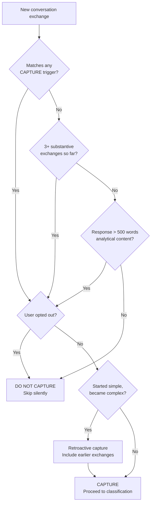
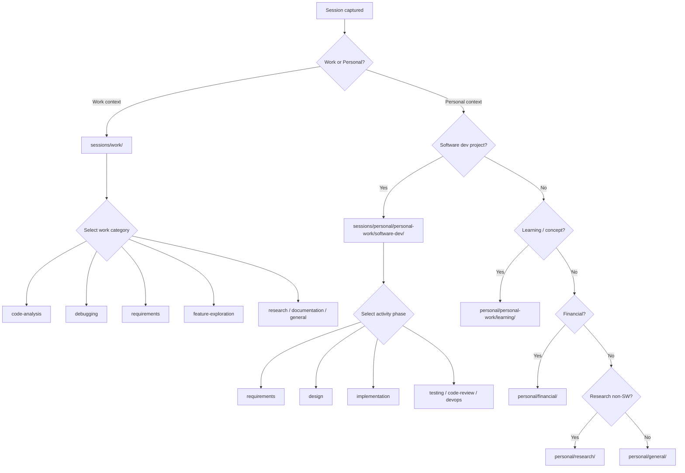
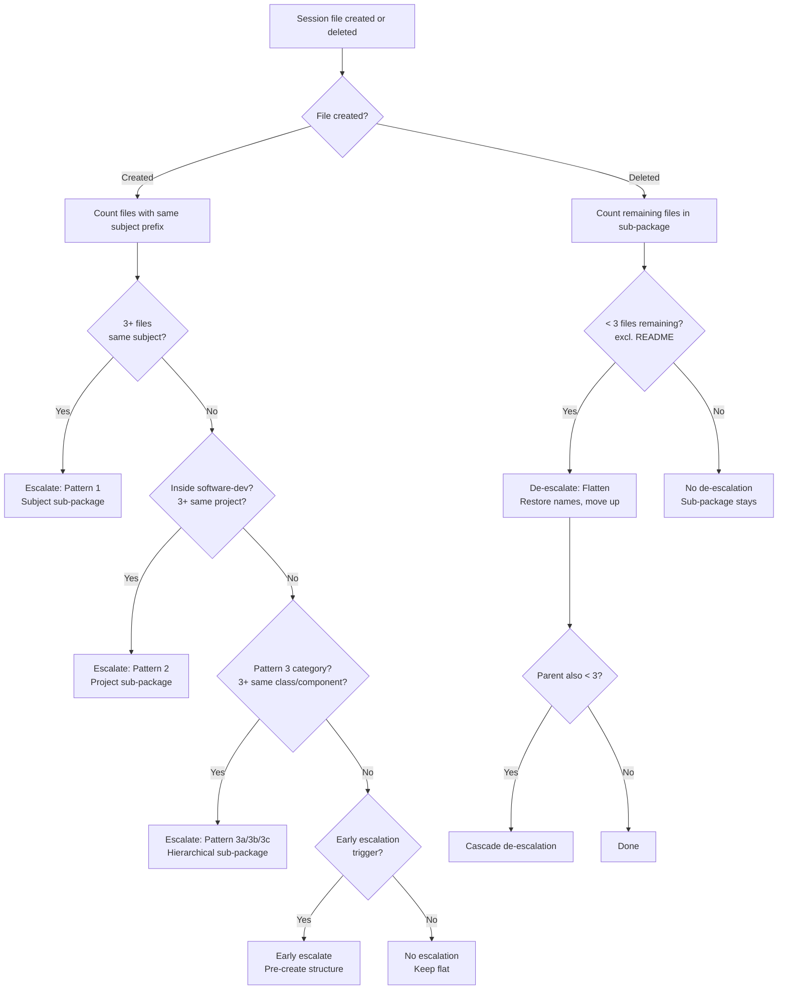
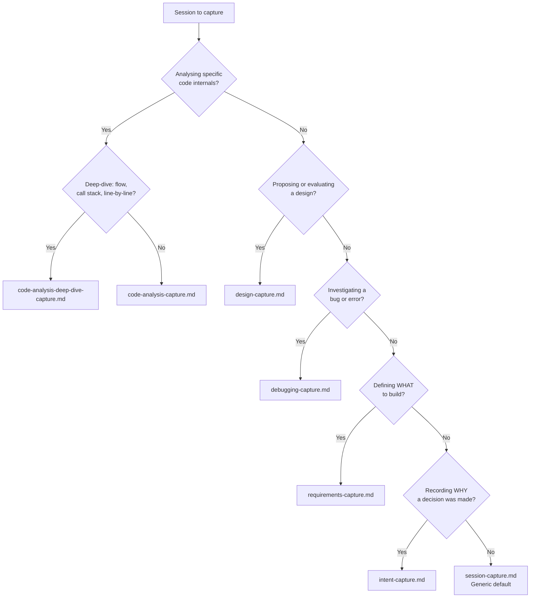
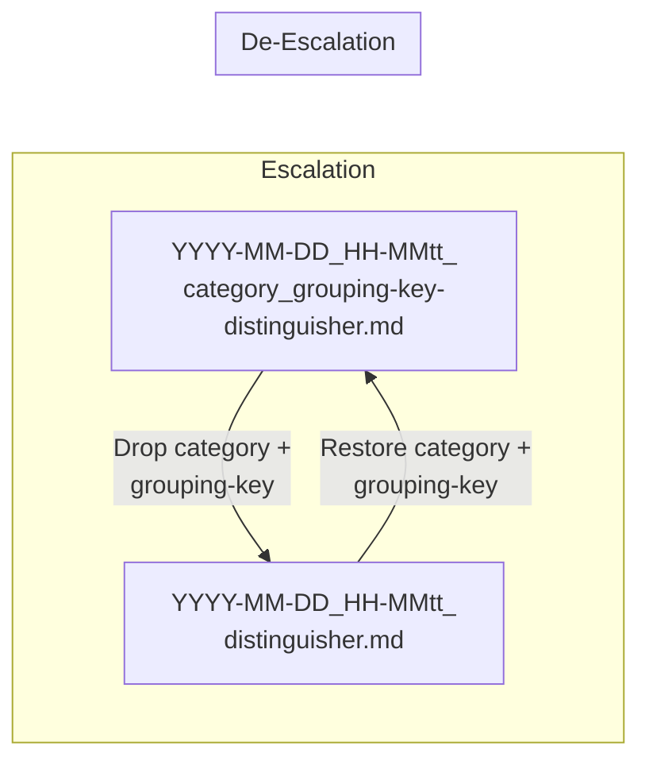
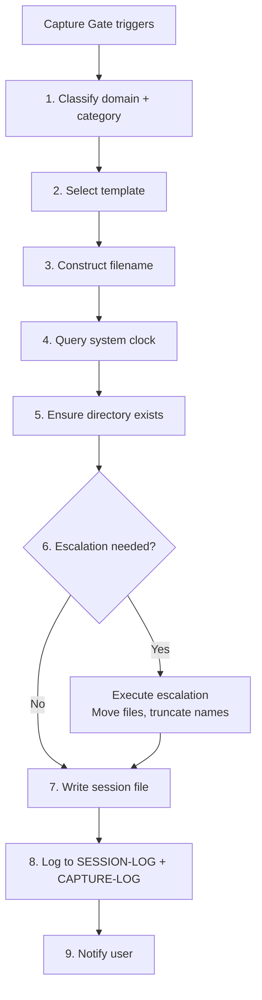

# Chat-Session Capture — Auto-Capture Policy & Protocol

> **Purpose:** Define when and how AI chat sessions are automatically captured into
> the `brain/ai-brain/sessions/` tier. This ensures valuable conversations are preserved
> without cluttering the workspace with trivial interactions.
> (Default path — see `copilot-instructions.md` § Configurable Paths if your brain
> workspace is at a different location.)
>
> **When active:** Always — this instruction applies to every file via `applyTo: "**"`.

---

## The Capture Decision — Ask Before Responding

Before formulating a response, evaluate whether this conversation qualifies for capture.
Use the **Capture Gate** below. Do NOT announce the capture decision to the user — capture
silently when criteria are met.

---

## Capture Gate — When to Capture

### CAPTURE (any ONE of these triggers is sufficient)

| Trigger | Examples |
|---|---|
| **Research work** | Technology evaluation, trade-off analysis, competitive analysis, spike investigation |
| **Code analysis** | Reviewing complex code, architecture analysis, pattern identification, code review with analysis |
| **Requirements gathering** | User stories, acceptance criteria, BDD scenarios, feature scoping |
| **Performance analysis** | Profiling strategies, optimization approaches, benchmarking, bottleneck investigation |
| **Feature development exploration** | Design alternatives, POC planning, feasibility assessment |
| **Complex debugging** | Multi-step investigation, root cause analysis, hypothesis-driven debugging |
| **Documentation** | API docs, design docs, architecture overviews, technical writing |
| **Learning sessions** | Concept explanations, tutorial walkthroughs, deep-dives, skill building |
| **Financial / personal advisory** | Budgeting analysis, investment strategies, tax planning |
| **Architecture / design decisions** | System design, component design, pattern selection, ADRs |
| **Multi-exchange analytical depth** | 3+ substantive exchanges producing insights, not just commands |
| **Lengthy descriptive output** | Response exceeds ~500 words of analytical, explanatory, or research content |

### DO NOT CAPTURE (skip silently)

| Skip condition | Examples |
|---|---|
| Simple refactoring | Rename variable, extract method, inline function |
| One-line fixes | Quick bug fix, typo correction, missing import |
| Formatting / linting | Run linter, fix whitespace, reformat code |
| Simple file operations | Create file, move file, delete file |
| Quick factual answers | "What's the return type of X?", "How do I import Y?" |
| Build / compile commands | Run build, fix compilation error (unless complex) |
| Simple git operations | Commit, push, create branch |
| Routine tasks | No analytical depth, no learning value |
| Explicit user opt-out | User says "don't capture this" or "no session log" |

### Edge Cases

- **Starts simple, becomes complex:** Begin capture mid-conversation when complexity emerges.
  Retroactively include the earlier exchanges that led to the complex discussion.
- **User explicitly requests capture:** Always honour `/capture` or "capture this session."
- **User explicitly declines capture:** Always honour "don't capture" or "skip session log."

### Capture Gate — Visual Decision Flow



---

## Domain Classification

Every captured session belongs to exactly **one domain**:

| Domain | Folder | When to use |
|---|---|---|
| `work` | `sessions/work/` | Corporate tasks, job-related code, employer projects, team work |
| `personal` | `sessions/personal/` | Personal projects, self-learning, side projects, personal finance, hobbies |

**Heuristic:** If the code, project, or topic is something you'd discuss with your manager
or team, it's `work`. If it's something you'd do on your own time, it's `personal`.
When ambiguous, default to `work`.

---

## Category Classification

Within each domain, sessions are filed into a **category** folder:

### Work Categories

| Category | Folder | Use for |
|---|---|---|
| `code-analysis` | `work/code-analysis/` | Code review, architecture review, pattern identification, refactoring analysis |
| `debugging` | `work/debugging/` | Complex bug investigation, RCA, hypothesis-driven debugging |
| `requirements` | `work/requirements/` | User stories, acceptance criteria, BDD, requirements research |
| `performance` | `work/performance/` | Profiling, optimization, benchmarking, load testing analysis |
| `feature-exploration` | `work/feature-exploration/` | Design alternatives, POC planning, feasibility, spike stories |
| `documentation` | `work/documentation/` | API docs, design docs, architecture overviews, runbooks |
| `research` | `work/research/` | Technology evaluation, library comparison, protocol analysis |
| `general` | `work/general/` | Anything that doesn't fit the above categories |

### Personal Categories

#### Top-Level Personal Categories

| Category | Folder | Use for |
|---|---|---|
| `personal-work` | `personal/personal-work/` | **Umbrella** — personal growth, learning, and side projects (see sub-categories below) |
| `financial` | `personal/financial/` | Budgeting, investment analysis, tax strategies, financial planning |
| `research` | `personal/research/` | Personal interest research NOT about software development (hobbies, tools, life decisions) |
| `general` | `personal/general/` | Anything that doesn't fit the above categories |

#### Personal Work Sub-Categories (`personal/personal-work/`)

| Sub-Category | Folder | Use for |
|---|---|---|
| `software-dev` | `personal-work/software-dev/` | **Umbrella** — all personal software development projects (see activity sub-categories below) |
| `learning` | `personal-work/learning/` | Concept deep-dives, tutorials, skill-building, interview prep (not tied to a specific project) |

#### Software Development Activity Sub-Categories (`personal/personal-work/software-dev/`)

Personal software development is an umbrella that covers the full lifecycle. Sessions
are filed by **activity phase**, not by project name:

| Sub-Category | Folder | Use for |
|---|---|---|
| `requirements` | `software-dev/requirements/` | User stories, acceptance criteria, BDD, feature scoping, discovery sessions |
| `research` | `software-dev/research/` | Technology evaluation, library comparison, feasibility spikes for s/w projects |
| `design` | `software-dev/design/` | Architecture, component design, HLD/LLD, system design, pattern selection, ADRs |
| `implementation` | `software-dev/implementation/` | Coding sessions, feature building, complex debugging during dev |
| `testing` | `software-dev/testing/` | Test strategy, TDD/BDD setup, test plans, quality assurance |
| `code-review` | `software-dev/code-review/` | Code analysis, refactoring review, pattern identification |
| `devops` | `software-dev/devops/` | CI/CD, deployment, infrastructure, containerisation for personal projects |
| `general` | `software-dev/general/` | Software dev sessions not fitting the above activities |

**Routing heuristic for software-dev:** If the session is about building, designing,
testing, or researching something *for a personal software project*, it belongs under
`personal-work/software-dev/<activity>`. If it's pure concept learning with no project
context, it belongs in `personal/personal-work/learning/`.

**New categories can be created** when 3+ sessions don't fit existing ones. Follow
kebab-case naming and add a README.md to the new folder.

### Domain & Category Routing — Visual Decision Flow



---

## Project-Aware Session Protocol

### Automatic Project Detection

When a user starts a chat that references a **personal software development project**,
the AI assistant should automatically detect and scope the session. Detection triggers:

| Signal | Example | Action |
|---|---|---|
| Mentions a GitHub repo name | "let's work on ABSDevelopment" | Set `scope: project`, `scope-project: abs-development` |
| Mentions a GitHub org/user repo | "my repo saharshpoddarorg/task-manager" | Set `scope: project`, `scope-project: task-manager` |
| Names a project explicitly | "for my expense tracker project" | Set `scope: project`, `scope-project: expense-tracker` |
| Describes a new project idea | "I want to build a recipe sharing app" | Set `scope: project`, `scope-project: recipe-sharing-app` |
| References existing session project | "back to the task-manager" | Inherit scope from prior sessions |
| Uses keywords: MVP, feature, epic | "let's scope the MVP for ..." | Set `scope: feature` if specific enough |

**Protocol when a project is detected:**

1. Set `scope: project` (or `feature` if a specific feature is named)
2. Set `scope-project` to kebab-case project name
3. Route to `personal/personal-work/software-dev/<activity>/` based on the conversation's focus
4. If activity is ambiguous, ask: "Are we doing requirements, design, or implementation?"
5. Create the project index file (`<project>-INDEX.md`) if it doesn't already exist and
   the project has 3+ sessions across different activities

### Activity Context Switching Within a Project

Real conversations naturally move between activities. When the user context-switches
within the same project session:

| User says | Activity transition | Action |
|---|---|---|
| "now let's design the API" | requirements → design | Log `scope-transition`, continue in same file |
| "let's start coding this" | design → implementation | Log `scope-transition`, consider fork/split |
| "wait, I need to rethink the requirements" | implementation → requirements | Log `scope-transition`, continue |
| "what does the competitor do?" | any → research | Log `scope-transition`, widen if general |
| "let's write tests for this" | implementation → testing | Log `scope-transition` |
| "how should we deploy this?" | any → devops | Log `scope-transition` |
| "let me review what we have" | any → code-review | Log `scope-transition` |

**Context-switch protocol:**

1. **Log the transition** in `scope-transitions` with exchange number, from/to, and reason
2. **Annotate** with a scope boundary marker in the session body (see session-scoping instructions)
3. **Don't fork immediately** — keep the conversation in one file unless:
   - The new activity segment becomes substantial (3+ exchanges with depth)
   - The activity switch is to a completely different project
   - The user explicitly requests splitting
4. **Update the category field** to reflect the dominant activity when the session ends
5. **Cross-reference** — if a fork happens, add bidirectional `scope-refs` in both files

### Additional Activity Types for Project Work

Beyond the standard software-dev activities, project sessions may involve:

| Activity | Route to | Examples |
|---|---|---|
| Competitor analysis | `software-dev/research/` | "What does Todoist do differently?" |
| Customer requirements | `software-dev/requirements/` | "What do users expect from..." |
| Market research | `software-dev/research/` | "Is there demand for..." |
| Technology spikes | `software-dev/research/` | "Can we use WebSockets for..." |
| Architecture decisions | `software-dev/design/` | "Should we use microservices or monolith?" |
| Database schema design | `software-dev/design/` | "How should we model the data?" |
| API design | `software-dev/design/` | "What endpoints do we need?" |
| Security planning | `software-dev/design/` | "How do we handle auth?" |
| Performance planning | `software-dev/design/` | "How do we handle 10k concurrent users?" |
| Deployment strategy | `software-dev/devops/` | "Docker vs Kubernetes for this?" |
| Cost analysis | `software-dev/research/` | "What's the cloud hosting cost?" |

### Tagging and Keyword System

Every captured session uses tags for cross-cutting discoverability. Tags complement the
folder hierarchy — folders organize by activity, tags enable search across activities.

#### Tag Vocabulary by Domain

**Project tags** (always include when project-scoped):

```text
project:<project-name>    ← mandatory for project-scoped sessions
gh:<owner/repo>           ← when linked to a GitHub repository
```

**Activity tags** (2-3 per session, describing what was done):

```text
requirements, user-stories, acceptance-criteria, bdd, nfr, scope, discovery,
story-mapping, prioritisation, stakeholder-analysis, domain-modelling,
event-storming, spike, competitor-analysis, market-research, customer-needs,
architecture, system-design, hld, lld, api-design, database-design, adr,
component-design, pattern-selection, security-design, performance-design,
implementation, coding, feature-building, debugging, refactoring, integration,
tdd, bdd-testing, test-strategy, e2e-testing, unit-testing, test-plan,
code-review, code-analysis, refactoring-review, pattern-identification,
ci-cd, docker, kubernetes, deployment, infrastructure, monitoring,
tech-evaluation, library-comparison, feasibility, trade-off-analysis,
cost-analysis, poc, prototype
```

**Technology tags** (specific technologies discussed):

```text
java, spring-boot, react, typescript, python, docker, kubernetes,
postgresql, mongodb, redis, graphql, rest, grpc, websockets, oauth,
jwt, terraform, github-actions, etc.
```

#### Tag Rules

1. **3-7 tags per session** — enough for discoverability, not so many they lose meaning
2. **Always include `project:<name>`** when the session is project-scoped
3. **Include `gh:<owner/repo>`** when linked to a GitHub repository
4. **Mix activity + technology tags** — e.g., `[project:task-manager, requirements, api-design, rest, java]`
5. **Use the standard vocabulary** above — avoid inventing synonyms
6. **Tags are lowercase kebab-case** — no spaces, no camelCase

---

## Requirements Gathering — Enhanced Capture Protocol

Requirements sessions for personal software development projects use the specialised
`requirements-capture.md` template (in `sessions/_templates/`) instead of the generic
session template. This ensures structured capture of user stories, acceptance criteria,
NFRs, and scope definitions.

### When Is a Session a Requirements Session?

A session is classified as `requirements` when the primary focus is understanding
**WHAT to build** rather than **HOW to build it**. All personal software development
categories live under the `software-dev/` umbrella:

| `software-dev/requirements` | `software-dev/design` | `software-dev/implementation` |
|---|---|---|
| Defining user stories and acceptance criteria | Architecture, component design | Writing code, building features |
| Scoping a feature (in/out, MoSCoW) | Choosing between design patterns | Debugging during development |
| Writing BDD scenarios (Given/When/Then) | System design, HLD/LLD | Implementing a POC or prototype |
| Identifying NFRs (performance, security) | ADRs, pattern selection | Optimising existing code |
| Story mapping or user journey analysis | API contract design | Integration work |
| Discovery sessions (problem exploration) | Database schema design | Refactoring implementation |

### Requirements Capture Structure

Requirements sessions include these additional sections beyond the standard session
template (see `_templates/requirements-capture.md`):

1. **Project Overview** — project name, domain, target user, stage
2. **Problem Statement** — user-perspective description of the problem
3. **User Stories** — As/I want/So that format with Gherkin acceptance criteria
4. **Non-Functional Requirements** — measurable targets per FURPS+ category
5. **Scope Definition** — explicit in-scope / out-of-scope lists
6. **Dependencies & Constraints** — blockers, technical or external constraints
7. **Open Questions** — unresolved items needing follow-up

### Requirements Session Frontmatter

Requirements sessions use `category: requirements` and should include requirements-specific
tags from this vocabulary:

```text
Tags: requirements, user-stories, acceptance-criteria, bdd, nfr, scope,
      discovery, story-mapping, prioritisation, stakeholder-analysis,
      domain-modelling, event-storming, spike
```

### Requirements Session Naming Examples

```text
sessions/personal/personal-work/software-dev/requirements/
  2026-03-20_02-15pm_requirements_task-manager-mvp-scope.md
  2026-03-21_10-00am_requirements_task-manager-recurring-tasks.md
  2026-03-22_04-30pm_requirements_expense-tracker-budget-rules.md
  2026-03-25_09-00am_requirements_portfolio-site-content-model.md

sessions/work/requirements/
  2026-03-20_11-00am_requirements_user-auth-flow-oauth2.md
  2026-03-21_03-00pm_requirements_order-service-cancellation-policy.md
```

### Requirements Versioning Pattern

Requirements evolve across multiple sessions. Use versioning when refining the same
feature scope:

```text
# v1 — initial scoping
2026-03-20_02-15pm_requirements_task-manager-mvp-scope.md

# v2 — refined after technical spike
2026-03-22_10-00am_requirements_task-manager-mvp-scope_v2.md
  parent: 2026-03-20_02-15pm_requirements_task-manager-mvp-scope.md

# v3 — final scope after user feedback
2026-03-25_01-00pm_requirements_task-manager-mvp-scope_v3.md
  parent: 2026-03-22_10-00am_requirements_task-manager-mvp-scope_v2.md
```

### Requirements to Implementation Traceability

After requirements sessions are captured, link forward to implementation:

```markdown
## Traceability

| Story | Session | Implementation | Tests | Status |
|---|---|---|---|---|
| US-001 | [v1](../requirements/2026-03-20_...) | `src/task/TaskService.java` | `TaskServiceTest` | In progress |
| US-002 | [v2](../requirements/2026-03-22_...) | — | — | Not started |
```

This enables the full chain: **requirements session → implementation → tests**.

---

## File Naming Protocol

### Standard Pattern

```text
YYYY-MM-DD_HH-MMtt_<category>_<subject>[_v<N>].md
```

| Segment | Format | Example |
|---|---|---|
| Date | `YYYY-MM-DD` (ISO 8601) | `2026-03-20` |
| Time | `HH-MMtt` (12-hour, lowercase am/pm) | `10-30am`, `04-12pm` |
| Category | kebab-case, matches folder name | `code-analysis`, `research` |
| Subject | kebab-case, descriptive (3-8 words) | `OrderService-calculateTotal` |
| Version | `_v<N>` suffix, only for continuations (v2+) | `_v2`, `_v3` |

> **Timestamp must be real.** Always query the system clock (`Get-Date` / `date`) before
> naming a file. Never guess or round the time. See **Timestamp Accuracy** under
> Capture Execution Protocol for the full rules.

### Subject Naming Rules

1. **Lowercase kebab-case** — `order-service-validation`, not `OrderService_Validation`
2. **Class references** — use kebab-case: `order-service-calculate-total` (not dots or camelCase)
3. **3-8 words** — descriptive but concise
4. **Most specific first** — `hashmap-vs-treemap-performance`, not `performance-comparison-hashmap-treemap`
5. **No filler words** — drop "the", "a", "an", "for", "and" unless critical for meaning
6. **Method-level specificity** — include method name when the session is about a specific method

### Full Examples

```text
# Work domain (flat categories)
2026-03-20_10-30am_code-analysis_order-service-calculate-total.md
2026-03-20_02-15pm_research_mcp-transport-sse-vs-stdio.md
2026-03-20_04-12pm_requirements_user-auth-flow-oauth2.md
2026-03-20_11-00am_performance_database-query-n-plus-one.md
2026-03-20_03-45pm_feature-exploration_chat-session-capture-system.md
2026-03-20_09-15am_debugging_npe-in-config-loader-init.md
2026-03-21_10-00am_code-analysis_order-service-calculate-total_v2.md

# Personal domain — software-dev umbrella (category = leaf folder name)
2026-03-20_02-15pm_requirements_task-manager-mvp-scope.md
2026-03-20_03-00pm_design_task-manager-api-endpoints.md
2026-03-20_11-00am_implementation_task-manager-crud-endpoints.md
2026-03-20_01-00pm_testing_task-manager-e2e-strategy.md
2026-03-20_04-30pm_research_react-vs-svelte-frontend-choice.md
2026-03-21_09-00am_code-review_task-manager-service-layer-patterns.md
2026-03-21_02-00pm_devops_task-manager-docker-compose-setup.md

# Personal domain — stand-alone categories
2026-03-20_01-30pm_financial_tax-optimization-freelance-income.md
2026-03-20_05-00pm_learning_java-virtual-threads-deep-dive.md
```

---

## Sub-Package Escalation

Sessions naturally cluster around shared subjects or projects. Two escalation patterns
keep folders navigable as volume grows.

### Pattern 1 — Subject-Based Sub-Package (3+ files)

When **3+ session files** accumulate for the **same subject** within a category, create
a sub-package (sub-directory) to group them:

#### Before escalation (flat)

```text
work/code-analysis/
  2026-03-20_10-30am_code-analysis_order-service-calculate-total.md
  2026-03-21_02-15pm_code-analysis_order-service-calculate-total_v2.md
  2026-03-22_09-00am_code-analysis_order-service-validate-order.md
  2026-03-23_11-30am_code-analysis_order-service-process-payment.md
  2026-03-24_10-00am_code-analysis_order-service-cancel-order.md
```

#### After escalation (sub-package)

```text
work/code-analysis/order-service/
  2026-03-20_10-30am_calculate-total.md
  2026-03-21_02-15pm_calculate-total_v2.md
  2026-03-22_09-00am_validate-order.md
  2026-03-23_11-30am_process-payment.md
  2026-03-24_10-00am_cancel-order.md
```

**Rules:**

- Sub-package name = kebab-case subject grouping (e.g., `order-service`)
- Files inside drop the category and subject prefix (already implied by folder)
- Add a `README.md` to the sub-package listing its contents
- Move existing files when escalating (update SESSION-LOG.md paths)

### Automatic Escalation Protocol

The AI assistant MUST proactively check escalation thresholds **every time a session
file is created**. Do not wait for the user to notice or request escalation.

**Escalation checklist (run after every session capture or deletion):**

1. **Count files** — count how many session files exist in the target category folder
   that share the same subject grouping (look at the subject slug prefix)
2. **Check Pattern 1 threshold** — if the count (including the new file) reaches **3+**
   files for the same subject, trigger subject-based sub-package escalation immediately
3. **Check Pattern 2 threshold** — if inside `personal/personal-work/software-dev/<activity>/` and the
   count reaches **3+** files for the same project, trigger project-based sub-package
   escalation immediately
4. **Check Pattern 3 threshold** — if the category supports hierarchical escalation
   (see Domain-Specific Hierarchical Escalation section below):
   - **3a (code-analysis):** 3+ files referencing the same class → create class sub-package;
     3+ files within a class sub-package referencing the same method → create method sub-package
   - **3b (design/feature-exploration):** 3+ files referencing the same component → create
     component sub-package; 3+ files referencing the same aspect → create aspect sub-package
   - **3c (debugging):** 3+ files about the same service → create service sub-package;
     3+ files about the same issue type → create issue sub-package
5. **Check de-escalation** — if a file was **deleted** (not moved) and a sub-package now
   contains **fewer than 3 files** (excluding README.md), trigger de-escalation (flattening)
   back to the parent folder (see De-Escalation Protocol below)
6. **Execute escalation** — when triggered:
   - Create the sub-directory
   - Move ALL matching files into the sub-directory with **truncated names**
     (see Name Truncation on Move below)
   - Create `README.md` listing the sub-package contents
   - Update `SESSION-LOG.md` with new paths
   - Update all `scope-refs`, `parent`, and inline links in the moved files
   - Update any cross-references in files OUTSIDE the sub-package that point to moved files
7. **Execute de-escalation** — when triggered (file deletion caused sub-package to drop
   below threshold):
   - Move ALL remaining session files back to the parent folder with **restored names**
     (see Name Restoration on Flatten below)
   - Delete the now-empty sub-directory and its `README.md`
   - Update `SESSION-LOG.md` with restored paths
   - Update all `scope-refs`, `parent`, and inline links in the moved files
   - Update any cross-references in files OUTSIDE the sub-package that point to moved files
8. **Log the operation** — log escalation or de-escalation to CAPTURE-LOG.md and inform
   the user

**Timing:** Escalation should happen in the same turn as the session capture. Do not
create a file in a flat folder and plan to escalate later — check and escalate immediately.

### Escalation Decision — Visual Flow



**Cross-reference updates are mandatory.** When files are moved during escalation, ALL of
the following must be updated:

- `parent` field in frontmatter (if pointing to a moved file)
- `scope-refs[].file` entries in frontmatter (paths to moved files)
- Inline markdown links `[text](path)` that reference moved files
- `SESSION-LOG.md` link paths
- Any `README.md` files that list or link to the moved files

### Pattern 2 — Project-Based Sub-Package (3+ files in same activity for same project)

Within `personal/personal-work/software-dev/<activity>/`, when **3+ sessions** relate to the **same
project**, create a project sub-folder:

#### Before escalation (flat)

```text
personal/personal-work/software-dev/requirements/
  2026-03-20_02-15pm_requirements_task-manager-mvp-scope.md
  2026-03-21_10-00am_requirements_task-manager-recurring-tasks.md
  2026-03-22_04-30pm_requirements_task-manager-notification-rules.md
  2026-03-25_09-00am_requirements_expense-tracker-budget-rules.md
```

#### After escalation (project sub-package)

```text
personal/personal-work/software-dev/requirements/task-manager/
  2026-03-20_02-15pm_mvp-scope.md
  2026-03-21_10-00am_recurring-tasks.md
  2026-03-22_04-30pm_notification-rules.md

personal/personal-work/software-dev/requirements/
  2026-03-25_09-00am_requirements_expense-tracker-budget-rules.md
```

**Rules:**

- Project sub-package name = kebab-case project name (e.g., `task-manager`)
- Files inside drop the category and project prefix (implied by folder path)
- Add a `README.md` to the project sub-package listing its contents
- Threshold is **3+ files** (lower than subject escalation because project cohesion
  is a stronger grouping signal)
- Move existing files when escalating (update SESSION-LOG.md paths)

### Cross-Cutting Project Index

When a personal project spans **3+ activity categories** under `software-dev/`, create
a project index file at `personal/personal-work/software-dev/<project-name>-INDEX.md`:

```markdown
# task-manager — Session Index

| Activity | Sessions | Latest |
|---|---|---|
| requirements | 3 | [notification-rules](requirements/task-manager/...) |
| design | 2 | [api-endpoints](design/task-manager/...) |
| implementation | 4 | [crud-endpoints-v2](implementation/task-manager/...) |
| testing | 1 | [e2e-strategy](testing/...) |
```

This index provides a single entry point for all sessions related to one project,
without duplicating files across folders.

---

## Domain-Specific Hierarchical Escalation (Pattern 3)

Beyond subject-based (Pattern 1) and project-based (Pattern 2) escalation, certain
categories support **hierarchical sub-packaging** that mirrors the structure of the
content being analysed.

### Pattern 3a — Code Analysis: Class → Method Hierarchy

Code analysis sessions often cluster around classes and their methods. When this happens,
create a two-level hierarchy: `class-name/method-name/`.

**Escalation rules:**

| Condition | Action |
|---|---|
| **3+ files** reference the same class (any methods) | Create `class-name/` sub-package |
| **3+ files** in a class sub-package reference the same method | Create `method-name/` sub-package inside the class |
| **1-2 files** about a class with no method clustering | Keep at category level (no escalation) |

**Detection heuristics** — a session references a class when:

- The subject slug contains the class name (e.g., `order-service-calculate-total`)
- The `tags` include the class name (e.g., `order-service`)
- The frontmatter `code-target.class` field is set (see extended frontmatter below)

#### Example: Flat → Class → Class+Method

```text
# Before escalation (flat — 4 files about OrderService)
work/code-analysis/
  2026-04-01_10-30am_code-analysis_order-service-calculate-total.md
  2026-04-02_02-15pm_code-analysis_order-service-validate-order.md
  2026-04-03_09-00am_code-analysis_order-service-process-payment.md
  2026-04-04_11-30am_code-analysis_order-service-cancel-order.md
  2026-04-05_03-00pm_code-analysis_config-loader-init.md

# After class escalation (3+ OrderService files → sub-package)
work/code-analysis/order-service/
  2026-04-01_10-30am_calculate-total.md
  2026-04-02_02-15pm_validate-order.md
  2026-04-03_09-00am_process-payment.md
  2026-04-04_11-30am_cancel-order.md
work/code-analysis/
  2026-04-05_03-00pm_code-analysis_config-loader-init.md    ← stays flat (only 1 file)

# After method escalation (3+ files about calculateTotal → method sub-package)
work/code-analysis/order-service/
  calculate-total/
    2026-04-01_10-30am_calculate-total.md
    2026-04-07_09-00am_calculate-total_v2.md
    2026-04-10_02-00pm_calculate-total-edge-cases.md
  2026-04-02_02-15pm_validate-order.md                      ← stays flat (only 1 file)
  2026-04-03_09-00am_process-payment.md
  2026-04-04_11-30am_cancel-order.md
```

### Pattern 3b — Design / Approach: Component → Aspect Hierarchy

Design and architecture sessions cluster around components, features, or architectural
decisions. Use a similar two-level hierarchy: `component-name/aspect/`.

**Escalation rules:**

| Condition | Action |
|---|---|
| **3+ files** reference the same component/feature | Create `component-name/` sub-package |
| **3+ files** in a component sub-package reference the same aspect | Create `aspect/` sub-package |

**Aspect types** (common second-level groupings):

```text
api-design, schema, security, performance, patterns, trade-offs,
hld, lld, adr, alternatives, migration
```

#### Example

```text
# After component escalation
work/feature-exploration/payment-gateway/
  2026-04-01_10-00am_api-design.md
  2026-04-02_02-00pm_security-pci-compliance.md
  2026-04-03_09-00am_stripe-vs-adyen.md
  2026-04-04_11-00am_error-handling-patterns.md

personal/personal-work/software-dev/design/task-manager/
  api-design/
```

### Pattern 3c — Debugging: Service → Issue Hierarchy

Debugging sessions cluster around services and recurring issues:

| Condition | Action |
|---|---|
| **3+ files** about the same service/component | Create `service-name/` sub-package |
| **3+ files** about the same error/issue type | Create `issue-slug/` inside the service |

### Pattern 3d — Custom Hierarchical Escalation (extensibility)

New domain-specific hierarchical patterns can be added by following this template:

1. **Define the grouping dimension** (what makes files "related" — class, component, service)
2. **Set the escalation threshold** (3+ for all levels — see Threshold Reference)
3. **Define detection heuristics** (how to detect grouping from subject, tags, frontmatter)
4. **Define the naming convention** (kebab-case folder names derived from the grouping key)
5. **Document with before/after examples**

---

## Extended Frontmatter for Domain-Specific Sessions

Sessions in categories that support hierarchical escalation can include additional
frontmatter fields to enable accurate grouping:

### Code Analysis Extended Fields

```yaml
code-target:
  class: OrderService              # Java/TS class name (PascalCase as-is)
  method: calculateTotal           # method name (camelCase as-is)
  package: com.example.order       # optional: full package path
  file: src/order/OrderService.java  # optional: source file path
```

### Design Extended Fields

```yaml
design-target:
  component: payment-gateway       # component or feature name (kebab-case)
  aspect: api-design               # aspect: api-design, schema, security, etc.
  level: hld                       # hld or lld
```

### Debugging Extended Fields

```yaml
debug-target:
  service: order-service           # affected service/component
  error: NullPointerException      # error type or symptom
  issue: JIRA-1234                 # linked issue tracker ID (optional)
```

**These fields are optional.** When present, the escalation protocol uses them for
precise grouping. When absent, grouping falls back to subject slug prefix analysis.

---

## Template Selection Guide

Seven templates live in `brain/ai-brain/sessions/_templates/`. Use the most specific
template that matches the session focus:

| Session Focus | Template | When to Use |
|---|---|---|
| General (research, learning, exploration) | `session-capture.md` | Default — any session not matching a specialised template |
| Code review, architecture review, pattern identification | `code-analysis-capture.md` | Session analyses specific code (class, method, or codebase area) |
| Code deep-dive: internals, flow, line-by-line understanding | `code-analysis-deep-dive-capture.md` | Session aims to fully understand how code works — data flow, call stack, code blocks |
| Architecture, API design, component design, HLD/LLD | `design-capture.md` | Session proposes or evaluates a design (approach, alternatives, trade-offs) |
| Complex bug investigation, RCA, hypothesis-driven debugging | `debugging-capture.md` | Session investigates an error or unexpected behaviour |
| User stories, acceptance criteria, BDD, scope definition | `requirements-capture.md` | Session defines WHAT to build (not HOW) |
| Design decisions, migrations, intent documentation | `intent-capture.md` | Session records WHY a major decision was made |

**Fallback rule:** When uncertain, use the generic `session-capture.md`. The domain-specific
templates add structured sections (findings tables, hypothesis tracking, use-case flows)
that make sessions more useful for their specific domain.

### Template Selection — Visual Decision Flow



---

## Design Aspect Taxonomy

Design sessions (Pattern 3b) organize into aspect sub-folders. These are the standard
aspect types recognised by the escalation protocol:

| Aspect | Sub-Folder Name | Use For |
|---|---|---|
| `intent` | `intent/` | WHY this design exists — purpose, motivation, goals |
| `approach` | `approach/` | HOW the design works — chosen strategy, architecture |
| `proposal` | `proposal/` | Design alternatives evaluated — options, trade-offs |
| `api-design` | `api-design/` | Endpoint contracts, request/response schemas, versioning |
| `schema` | `schema/` | Database schemas, data models, entity relationships |
| `use-case` | `use-case/` | User flows, use-case diagrams, sequence flows |
| `criteria` | `criteria/` | Acceptance criteria, NFRs, quality attributes |
| `security` | `security/` | Auth flows, threat models, security controls |
| `performance` | `performance/` | Scaling strategy, caching, load targets |
| `patterns` | `patterns/` | Design patterns applied, SOLID analysis |
| `trade-offs` | `trade-offs/` | Explicit trade-off analysis, ADRs |
| `migration` | `migration/` | Migration plans, upgrade paths, deprecation |
| `hld` | `hld/` | High-level design — system context, component boundaries |
| `lld` | `lld/` | Low-level design — class diagrams, method contracts |

### Aspect Escalation Rules

Aspects only become sub-folders when the threshold is met (default: 3+ files for the
same aspect within a component sub-package). Until then, the aspect is just a tag/field
in frontmatter — files stay at the component level.

### Code Analysis Focus Taxonomy

Code analysis sessions (Pattern 3a) organize into method sub-folders. Within a class
sub-package, sessions can also be grouped by analysis focus:

| Focus | Example Subject | Description |
|---|---|---|
| Deep-dive | `calculate-total-deep-dive` | Full internals: data flow, call stack, code blocks, line-by-line |
| Recent-changes | `calculate-total-recent-changes` | Impact of recent commits/PRs on the code — algorithm, variables, flow changes |
| Structure | `calculate-total-structure` | Class/method organization, responsibility |
| Patterns | `calculate-total-patterns` | Design patterns used or proposed |
| Performance | `calculate-total-performance` | Hotspots, complexity, optimisation |
| Security | `calculate-total-security` | Input validation, injection risks |
| Bugs | `calculate-total-null-check` | Specific bug or defect analysis |
| Refactoring | `calculate-total-extract-method` | Refactoring proposals and impact |

### Code Analysis Deep-Dive Protocol

A **deep-dive** is an intensive code analysis session that aims to understand the
complete internals, flow, and behaviour of a class, method, or feature. Deep-dives
produce longer, more structured sessions than regular code analysis.

**When a session is a deep-dive:**

- User asks to "understand", "explain internals", "walk through", "trace the flow"
- The goal is comprehension (not finding bugs or proposing refactoring)
- The session covers both high-level abstraction AND line-by-line detail

**Deep-dive analysis structure (use `_templates/code-analysis-deep-dive-capture.md`):**

1. **High-Level Overview** — purpose, responsibility, design role
2. **Data Flow** — inputs → transformations → outputs, with types
3. **Call Stack / Method Flow** — sequence of method calls, who calls what
4. **Code Block Breakdown** — split code into functional blocks by cohesion, explain each
5. **Line-by-Line Walkthrough** — detailed explanation of key logic (not boilerplate)
6. **State Changes** — how fields, variables, and external state evolve
7. **Edge Cases & Error Paths** — what happens on null, empty, overflow, exception
8. **Dependencies & Coupling** — what this code depends on, and what depends on it
9. **Recent Changes Impact** — how recent commits/PRs affected the target code (conditional — only
   when analysing recent change impact). Uses local `git log`/`git diff`/`git blame` or
   Bitbucket API (`fetch_bitbucket_pr_diff`, `get_bitbucket_file_diff`, `fetch_bitbucket_file`)
   via the `atlassian-tools` skill to gather commit data. When Jira keys are found in commit
   messages or PR descriptions, fetches Jira issue details (`fetch_jira_issue`,
   `get_jira_issue_links`) to enrich the analysis with business intent, acceptance criteria,
   and design rationale. When Jira issues link to Confluence pages, fetches design documents
   (`fetch_confluence_page`, `search_confluence_cql`) to capture architecture decisions,
   algorithm approaches, and rejected alternatives. Covers: commit summary, change intent and
   context (from Jira/Confluence), diff annotation, algorithm/variable/field/flow impact
   assessment, intent alignment verification, and regression risks
10. **Key Takeaways** — summary of internals for future reference

**Deep-dive routing — permanent `deep-dive/` sub-folder:**

Deep-dive sessions are **always** routed to a permanent `deep-dive/` sub-folder under
code-analysis (or code-review for personal software-dev). This sub-folder is structural
— it is NOT created by the escalation protocol and is NOT subject to de-escalation.

```text
# Work domain
sessions/work/code-analysis/deep-dive/
  2026-05-02_03-21pm_order-service-calculate-total.md
  2026-05-02_03-51pm_order-service-validate-order.md
  2026-05-02_07-21pm_payment-flow.md

# Personal domain
sessions/personal/personal-work/software-dev/code-review/deep-dive/
  2026-05-02_04-00pm_task-manager-crud-service.md
```

**Deep-dive naming convention:**

- Files inside `deep-dive/` drop the `code-analysis_` category prefix (implied by parent)
- The subject describes the target: `<class-or-flow>-<method-or-aspect>.md`
- No `deep-dive` suffix needed in the filename — the folder provides that context

```text
# Single method deep-dive (inside deep-dive/)
2026-05-02_03-21pm_order-service-calculate-total.md

# Class-level deep-dive (inside deep-dive/)
2026-05-02_03-21pm_order-service-overview.md

# Feature/flow deep-dive (inside deep-dive/)
2026-05-02_03-21pm_payment-flow.md
```

**Escalation inside `deep-dive/`:** The standard Pattern 3a (class → method) escalation
still applies within the `deep-dive/` folder. When 3+ deep-dive sessions target the same
class, create a class sub-folder:

```text
sessions/work/code-analysis/deep-dive/
  order-service/
    2026-05-02_03-21pm_calculate-total.md
    2026-05-03_09-00am_validate-order.md
    2026-05-04_11-00am_process-payment.md
  2026-05-02_07-21pm_payment-flow.md          ← stays flat (different class)
```

**Deep-dive escalation:** Deep-dives often produce early escalation because the user
typically plans to analyse multiple methods or classes. Use the Early Escalation rules
when 2+ methods are named upfront.

---

## Cohesion-Based Escalation Heuristics

The automatic escalation protocol uses these heuristics to detect when files should
be grouped, even without explicit frontmatter fields.

### Subject Prefix Analysis

Files are considered "related" when they share a **subject prefix**:

| File subject | Extracted prefix | Grouping key |
|---|---|---|
| `order-service-calculate-total` | `order-service` | `order-service` |
| `order-service-validate-order` | `order-service` | `order-service` |
| `order-service-cancel-order` | `order-service` | `order-service` |
| `config-loader-init` | `config-loader` | `config-loader` |

**Prefix extraction rules:**

1. Split subject on hyphens: `order-service-calculate-total` → `[order, service, calculate, total]`
2. Try progressively shorter prefixes: `order-service-calculate`, `order-service`, `order`
3. A prefix is a **grouping key** when 3+ files share it
4. Prefer the **longest shared prefix** (more specific grouping)
5. Single-word prefixes (e.g., `order`) are too broad — require 5+ files before escalating

### Tag-Based Grouping

When subject prefixes are ambiguous, check tags:

- Files tagged with the same class/service name → same group
- Files tagged with the same `project:<name>` → same project group
- Files tagged with the same technology AND the same component → same group

### Temporal Proximity

Sessions created within the same week about related subjects have stronger cohesion.
When evaluating borderline escalation (e.g., exactly 3 files), temporal proximity
tips the scale toward escalation.

### Escalation Decision Matrix

| Files with shared prefix | Temporal proximity | Frontmatter match | Action |
|---|---|---|---|
| 5+ | Any | Any | **Always escalate** (Pattern 1 — well above threshold) |
| 3-4 | Same week | Yes | **Escalate** |
| 3-4 | Same week | No prefix match | **Escalate** (prefix is sufficient) |
| 3-4 | Spread over weeks | Yes | **Escalate** |
| 3-4 | Spread over weeks | No match | **Escalate** (3 is the threshold — proceed) |
| 2 | Same session or day | Strong cohesion | **Early escalate** (see Early Escalation below) |
| 2 | Spread over weeks | No match | **Hold** — wait for one more file |
| 1 | Any | Any | **Never escalate** |

### Early Escalation (< 3 files)

In some situations, escalation is justified **before** reaching the standard 3-file
threshold. This avoids creating files in a flat folder only to immediately reorganise
them on the next capture.

**Early escalation triggers (any ONE is sufficient):**

| Trigger | Example | Why |
|---|---|---|
| **Deep-dive session** with planned multi-part analysis | "Let's deep-dive OrderService — today calculateTotal, tomorrow validateOrder" | Folder will inevitably grow; pre-create to avoid rename churn |
| **Class + method known upfront** | User names class AND 2+ methods to analyse | The grouping key (class name) is already confirmed |
| **Existing sub-package for sibling** | `order-service/` already exists under same category for a related class | Consistency — sibling classes should follow the same structure |
| **User explicitly requests structure** | "Create a folder for this class analysis" | Honour user intent immediately |
| **Multi-file template** | A template produces 2+ files by design (e.g., deep-dive HLD + LLD) | Template-driven structure is intentional, not emergent |

**Early escalation rules:**

1. Create the sub-directory immediately
2. Use standard truncated naming (same rules as ≥3 escalation)
3. Log as `escalation:early:<pattern>` in CAPTURE-LOG.md
4. Do NOT de-escalate early-created folders — they are intentional

---

## Configurable Workspace Structure

The session capture folder structure can be customized for different project types.
The defaults work for this repo; adapt them when exporting to other projects.

### Structure Profiles

A **structure profile** is a set of category definitions and escalation rules tailored
to a project type. The active profile is determined by the brain workspace context.

#### Work Project Profile (default for `sessions/work/`)

```text
sessions/work/
├── code-analysis/         ← Escalates: class → method (Pattern 3a)
│   └── deep-dive/         ← Permanent sub-folder for code deep-dives (Pattern 3a inside)
├── debugging/             ← Escalates: service → issue (Pattern 3c)
├── requirements/          ← Escalates: feature → aspect
├── performance/           ← Escalates: service → metric
├── feature-exploration/   ← Escalates: component → aspect (Pattern 3b)
├── documentation/         ← Flat (no hierarchical escalation)
├── research/              ← Escalates: topic → subtopic (Pattern 1 only)
└── general/               ← Flat
```

#### Personal SE Project Profile (default for `sessions/personal/personal-work/software-dev/`)

```text
sessions/personal/personal-work/software-dev/
├── requirements/          ← Escalates: project → feature (Pattern 2)
├── research/              ← Escalates: project → topic
├── design/                ← Escalates: project → component → aspect (Pattern 3b)
├── implementation/        ← Escalates: project → class → method (Pattern 3a)
├── testing/               ← Escalates: project → test-suite
├── code-review/           ← Escalates: project → class (Pattern 3a)
│   └── deep-dive/         ← Permanent sub-folder for code deep-dives (Pattern 3a inside)
├── devops/                ← Escalates: project → tool
└── general/               ← Flat
```

### Adding Custom Categories

To add a new category to a domain:

1. Add a row to the Work Categories or Personal Categories table in this file
2. Define its escalation pattern (flat, Pattern 1/2/3, or custom)
3. Follow kebab-case naming
4. Create the directory on first use (the AI creates it automatically)
5. Add a `README.md` if the category will have 5+ sessions

**Example — adding `security-review` to work:**

```text
| `security-review` | `work/security-review/` | Threat modelling, vulnerability analysis, pen-test review |
```

Escalation: service → vulnerability-type (Pattern 3c adapted).

### Customizing Escalation Thresholds

The default thresholds balance organization with overhead:

| Threshold | Default | When to lower | When to raise |
|---|---|---|---|
| **Pattern 1** (subject grouping) | 3 files | Never (3 is minimum for cohesion) | Low-volume projects (raise to 5) |
| **Pattern 2** (project grouping) | 3 files | Never (3 is minimum for cohesion) | Solo developer (raise to 5) |
| **Pattern 3** (class/component/service) | 3 files | Never (3 is minimum) | — |
| **Sub-level** (method/aspect/issue) | 3 files | Never (3 is minimum) | — |
| **De-escalation** (flattening) | < 3 files | Never | — |

To customize: edit the threshold values in the Automatic Escalation Protocol section
and the Domain-Specific Hierarchical Escalation section of this file.

---

## Cross-Reference Protocol for Escalated Sessions

When sessions are organized into hierarchical sub-packages, cross-references become
critical for discoverability. Follow these rules:

### Intra-Category Cross-References

Sessions within the same category but different sub-packages should cross-reference
when they share context:

```yaml
# In order-service/calculate-total.md
scope-refs:
  - file: "../validate-order.md"
    relationship: related
    note: "calculateTotal calls validateOrder — analysis is related"
```

### Inter-Category Cross-References

Sessions in different categories about the same subject must cross-reference:

```yaml
# In work/code-analysis/order-service/calculate-total.md
scope-refs:
  - file: "../../debugging/order-service/npe-calculate-total.md"
    relationship: related
    note: "debugging session for the NPE found during this code analysis"
  - file: "../../feature-exploration/payment-gateway/api-design.md"
    relationship: related
    note: "calculateTotal is being redesigned as part of payment gateway"
```

### README Index in Sub-Packages

Every sub-package `README.md` should include:

```markdown
# order-service — Code Analysis Sessions

| Date | Subject | Complexity | Key Outcomes |
|---|---|---|---|
| 2026-04-01 | calculate-total | high | 3 code smells, extract-method proposed |
| 2026-04-02 | validate-order | medium | missing null checks identified |

## Related Sessions

- [Debugging: NPE in calculateTotal](../../debugging/order-service/npe-calculate-total.md)
- [Design: Payment Gateway API](../../feature-exploration/payment-gateway/api-design.md)
```

---

## Name Truncation on Move (Escalation)

When files are moved into a sub-package during escalation, redundant segments of the
filename are **truncated** because the folder path already encodes that information.
This keeps filenames concise while preserving the essential identity (timestamp + subject).

### Truncation Rules

1. **Drop the category prefix** — the category is implied by the parent folder
2. **Drop the grouping key prefix** — the subject prefix (class name, project name,
   component name) is implied by the sub-folder name
3. **Keep the timestamp** — always preserve `YYYY-MM-DD_HH-MMtt` (never truncate)
4. **Keep the distinguishing subject suffix** — the part after the grouping key
5. **Keep the version suffix** — `_v2`, `_v3` are always preserved

### Truncation Examples by Pattern

#### Pattern 1 — Subject Escalation

```text
# Before (flat — full names)
work/code-analysis/
  2026-05-02_03-21pm_code-analysis_order-service-calculate-total.md
  2026-05-02_03-51pm_code-analysis_order-service-validate-order.md
  2026-05-02_07-21pm_code-analysis_order-service-process-payment.md

# After (sub-package — truncated names)
work/code-analysis/order-service/
  2026-05-02_03-21pm_calculate-total.md         ← dropped "code-analysis_order-service-"
  2026-05-02_03-51pm_validate-order.md          ← dropped "code-analysis_order-service-"
  2026-05-02_07-21pm_process-payment.md         ← dropped "code-analysis_order-service-"
```

**Rule:** Drop `<category>_<grouping-key>-` from the filename.

#### Pattern 2 — Project Escalation

```text
# Before (flat — full names)
personal/personal-work/software-dev/requirements/
  2026-03-20_02-15pm_requirements_task-manager-mvp-scope.md
  2026-03-21_10-00am_requirements_task-manager-recurring-tasks.md
  2026-03-22_04-30pm_requirements_task-manager-notification-rules.md

# After (sub-package — truncated names)
personal/personal-work/software-dev/requirements/task-manager/
  2026-03-20_02-15pm_mvp-scope.md               ← dropped "requirements_task-manager-"
  2026-03-21_10-00am_recurring-tasks.md          ← dropped "requirements_task-manager-"
  2026-03-22_04-30pm_notification-rules.md       ← dropped "requirements_task-manager-"
```

#### Pattern 3a — Class → Method Escalation

```text
# Step 1: Flat → class sub-package (drop category + class prefix)
work/code-analysis/
  2026-05-02_03-21pm_code-analysis_order-service-calculate-total.md
  →
work/code-analysis/order-service/
  2026-05-02_03-21pm_calculate-total.md          ← dropped "code-analysis_order-service-"

# Step 2: Class → method sub-package (no further truncation needed)
work/code-analysis/order-service/calculate-total/
  2026-05-02_03-21pm_calculate-total.md          ← keeps "calculate-total" (distinguisher)
  2026-05-07_09-00am_calculate-total_v2.md       ← keeps version suffix
  2026-05-10_02-00pm_calculate-total-edge-cases.md
```

#### Pattern 3a-dd — Deep-Dive Escalation (Permanent Sub-Folder)

Deep-dive sessions live in the permanent `deep-dive/` sub-folder and never carry a
category prefix (the path `code-analysis/deep-dive/` already implies it). When escalated
into class sub-packages **within** `deep-dive/`, only the class grouping key is dropped:

```text
# Before (flat inside deep-dive/ — no category prefix, class prefix present)
work/code-analysis/deep-dive/
  2026-04-20_04-18pm_order-service-calculate-total.md
  2026-04-21_09-00am_order-service-validate-order.md
  2026-04-22_10-30am_order-service-process-payment.md

# After class escalation (drop class prefix — folder implies it)
work/code-analysis/deep-dive/order-service/
  2026-04-20_04-18pm_calculate-total.md           ← dropped "order-service-"
  2026-04-21_09-00am_validate-order.md             ← dropped "order-service-"
  2026-04-22_10-30am_process-payment.md            ← dropped "order-service-"

# After method escalation (3+ files about calculateTotal within class sub-package)
work/code-analysis/deep-dive/order-service/calculate-total/
  2026-04-20_04-18pm_calculate-total.md            ← keeps distinguisher
  2026-04-25_02-00pm_calculate-total_v2.md         ← keeps version suffix
  2026-04-28_11-00am_calculate-total-edge-cases.md
```

**Truncation formula for deep-dive/:**

```text
Flat (in deep-dive/):   YYYY-MM-DD_HH-MMtt_<class>-<method>[-focus][-context].md
In class sub-package:   YYYY-MM-DD_HH-MMtt_<method>[-focus][-context].md
In method sub-package:  YYYY-MM-DD_HH-MMtt_<method>[-focus][-context][_vN].md
```

**Restoration on de-escalation** (class sub-package drops below 3 files):

```text
# Before de-escalation (< 3 files in deep-dive/order-service/)
work/code-analysis/deep-dive/order-service/
  2026-04-20_04-18pm_calculate-total.md
  2026-04-21_09-00am_validate-order.md

# After de-escalation (re-add class prefix, stay in deep-dive/)
work/code-analysis/deep-dive/
  2026-04-20_04-18pm_order-service-calculate-total.md
  2026-04-21_09-00am_order-service-validate-order.md
```

**Key difference from standard Pattern 3a:** In `deep-dive/`, files never have a
`<category>_` prefix because the permanent folder path already encodes it. Truncation
only strips the `<class>-` grouping key when moving into a class sub-package. The
`deep-dive/` folder itself is structural and never de-escalates.

#### Pattern 3b — Component → Aspect Escalation

```text
# Step 1: Flat → component sub-package
personal/personal-work/software-dev/design/
  2026-04-01_03-00pm_design_task-manager-api-endpoints.md
  →
personal/personal-work/software-dev/design/task-manager/
  2026-04-01_03-00pm_api-endpoints.md            ← dropped "design_task-manager-"

# Step 2: Component → aspect sub-package (no further truncation)
personal/personal-work/software-dev/design/task-manager/api-design/
  2026-04-01_03-00pm_rest-endpoints.md
  2026-04-02_10-00am_graphql-evaluation.md
  2026-04-05_11-30am_versioning-strategy.md
```

### General Truncation Formula

```text
Original:  YYYY-MM-DD_HH-MMtt_<category>_<grouping-key>-<distinguisher>[_vN].md
Truncated: YYYY-MM-DD_HH-MMtt_<distinguisher>[_vN].md

Where:
  <category>      = folder name (code-analysis, design, requirements, etc.)
  <grouping-key>  = sub-folder name (order-service, task-manager, payment-gateway)
  <distinguisher>  = what makes THIS file unique within the group
```

### Edge Cases

- **Subject IS the grouping key** (no distinguisher beyond it) — keep the grouping key
  as the subject: `2026-05-02_03-21pm_order-service-general.md` → in `order-service/`
  becomes `2026-05-02_03-21pm_general.md`
- **Version files** — `_v2`, `_v3` suffixes are always preserved
- **Files not matching the group** — files that don't share the subject prefix stay in
  the parent folder with their full original name (never truncated)

### Name Truncation & Restoration — Visual Flow



---

## Name Restoration on Flatten (De-Escalation)

When files are moved **out** of a sub-package during de-escalation, the full name is
**restored** by re-adding the category and grouping key prefixes.

### Restoration Formula

```text
Truncated: YYYY-MM-DD_HH-MMtt_<distinguisher>[_vN].md
Restored:  YYYY-MM-DD_HH-MMtt_<category>_<grouping-key>-<distinguisher>[_vN].md
```

### Restoration Example

```text
# Before de-escalation (sub-package with < 3 files after deletion)
work/code-analysis/order-service/
  2026-05-02_03-21pm_calculate-total.md
  2026-05-02_03-51pm_validate-order.md
  README.md

# After de-escalation (flattened — restored full names)
work/code-analysis/
  2026-05-02_03-21pm_code-analysis_order-service-calculate-total.md
  2026-05-02_03-51pm_code-analysis_order-service-validate-order.md
```

### Multi-Level Restoration

When a nested sub-package is flattened (e.g., method level back to class level), only
one level of prefix is restored:

```text
# Before: method sub-package under class (< 3 files after deletion)
work/code-analysis/order-service/calculate-total/
  2026-05-02_03-21pm_calculate-total.md
  2026-05-07_09-00am_calculate-total_v2.md

# After: flattened to class level (no category prefix needed — still in sub-package)
work/code-analysis/order-service/
  2026-05-02_03-21pm_calculate-total.md          ← stays as-is (class folder still exists)
  2026-05-07_09-00am_calculate-total_v2.md
```

---

## De-Escalation (Flattening) Protocol

De-escalation is the **reverse of escalation** — when a sub-package drops below the
minimum threshold (< 3 session files, excluding README.md), the sub-package is dissolved
and its files are moved back to the parent folder with restored names.

### When De-Escalation Triggers

De-escalation occurs when **any** of these events reduce file count below threshold:

| Trigger Event | Example |
|---|---|
| **File deleted** | User deletes or archives a session file |
| **File moved out** | Session moved to a different category or domain |
| **File reclassified** | Session's subject changed, no longer belongs in this group |
| **Status changed to archived** | File is soft-deleted by marking `status: archived` |

### De-Escalation Rules

| Condition | Action |
|---|---|
| Sub-package has **< 3 session files** (excluding README.md) | Flatten to parent |
| Sub-package has **exactly 0 files** | Delete the empty sub-directory immediately |
| Nested sub-package (method/aspect) drops below threshold | Flatten to parent sub-package (class/component) |
| Parent sub-package then also drops below threshold | **Cascade** — flatten parent to category folder |
| De-escalation would create name conflicts in parent | Add a disambiguation suffix before flattening |

### De-Escalation Process (Step by Step)

1. **Detect** — after a file deletion/move, count remaining session files in the
   sub-package (exclude README.md, CAPTURE-LOG.md, and other non-session files)
2. **Check threshold** — if count is < 3, trigger de-escalation
3. **Restore names** — for each session file in the sub-package, reconstruct the full
   filename by re-adding the category and grouping key prefixes (see Name Restoration)
4. **Check for conflicts** — verify no file in the parent folder already has the
   restored name. If conflict exists, append a timestamp disambiguation
5. **Move files** — move all session files to the parent folder with restored names
6. **Delete sub-package** — remove the now-empty sub-directory and its README.md
7. **Update references** — update SESSION-LOG.md, CAPTURE-LOG.md, scope-refs, parent
   fields, and all inline links pointing to the moved files
8. **Check cascade** — if the parent is also a sub-package (e.g., class-level inside
   code-analysis), check if it now falls below threshold. If so, repeat from step 2
9. **Log** — append a `de-escalation:pattern-*` entry to CAPTURE-LOG.md

### Cascade De-Escalation Example

```text
# Initial state: class + method hierarchy
work/code-analysis/order-service/
  calculate-total/
    2026-05-02_03-21pm_calculate-total.md
    2026-05-07_09-00am_calculate-total_v2.md
    2026-05-10_02-00pm_calculate-total-edge-cases.md
  2026-05-02_03-51pm_validate-order.md
  2026-05-03_09-00am_process-payment.md

# Event: User deletes calculate-total_v2.md AND calculate-total-edge-cases.md

# Step 1: calculate-total/ has < 3 files → flatten method to class
work/code-analysis/order-service/
  2026-05-02_03-21pm_calculate-total.md          ← moved out, no rename needed
  2026-05-02_03-51pm_validate-order.md
  2026-05-03_09-00am_process-payment.md

# Step 2: order-service/ still has 3 files → NO cascade (threshold met)
# Done — only method-level de-escalation occurred
```

```text
# Alternate scenario: User also deletes process-payment.md

# Step 1: order-service/ now has < 3 files → cascade flatten class to category
work/code-analysis/
  2026-05-02_03-21pm_code-analysis_order-service-calculate-total.md    ← full name restored
  2026-05-02_03-51pm_code-analysis_order-service-validate-order.md     ← full name restored
```

### De-Escalation Logging

Every de-escalation is logged in CAPTURE-LOG.md:

```markdown
| Date | Time | Operation | Details | Files Affected |
|---|---|---|---|---|
| 2026-05-15 | 03:30 PM | de-escalation:pattern-3a:method | Flattened calculate-total/ (< 3 files after deletion) | 1 file moved |
| 2026-05-15 | 03:31 PM | de-escalation:pattern-3a | Cascade: flattened order-service/ (< 3 files after method flatten) | 2 files moved |
```

---

## Extensibility — Adding New Escalation Patterns

The escalation framework is designed to be extended. To add a new pattern:

### Step 1 — Define the pattern

```text
Pattern N: <Name>
  Domain: <which categories it applies to>
  Grouping dimension: <what makes files related>
  Level 1 threshold: <N files> → <folder name convention>
  Level 2 threshold: <N files> → <sub-folder name convention>
  Detection: <how to identify grouping — subject prefix, tags, frontmatter>
```

### Step 2 — Add to the Automatic Escalation Protocol

Add a new check step to the escalation checklist:

```text
N. **Check Pattern N threshold** — if inside <category>/ and
   the count reaches <threshold> files for the same <grouping dimension>,
   trigger <Pattern N> escalation immediately
```

### Step 3 — Add extended frontmatter fields (if needed)

If the pattern needs domain-specific metadata beyond subject/tags, define new
frontmatter fields under a `<domain>-target:` key.

### Step 4 — Document with examples

Add a before/after example showing the flat structure and the escalated structure.

### Step 5 — Update the Structure Profile

Add the new pattern to the relevant structure profile (work or personal/personal-work/software-dev)
with its escalation annotation.

---

## Versioning Protocol

When a session **continues analysis on the same subject** from a previous session:

| Version | Convention | When |
|---|---|---|
| v1 (implicit) | No `_v<N>` suffix | First session on this subject |
| v2 | `_v2` suffix | Second session continuing from v1 |
| v3+ | `_v3`, `_v4`, etc. | Further continuations |

### Frontmatter versioning fields

```yaml
version: 2
parent: 2026-03-20_10-30am_code-analysis_order-service-calculate-total.md
```

### When to version vs. create new

- **Same subject, continued analysis** → version (v2, v3)
- **Same class/area, different method/aspect** → new file (not a version)
- **Same topic, weeks later, fresh perspective** → new file (too stale for versioning)

---

## Frontmatter Schema

Every captured session file uses this frontmatter:

```yaml
---
date: 2026-03-20
time: "10:30 AM"
kind: session-capture
domain: work
category: code-analysis
project: learning-assistant
subject: order-service-calculate-total
tags: [java, refactoring, order-service, clean-code]
status: draft
version: 1
parent: null
complexity: high
outcomes:
  - identified 3 code smells in calculateTotal()
  - proposed extract-method refactoring
  - performance impact analysis completed
source: copilot
---
```

### Field Reference

| Field | Required | Values | Purpose |
|---|---|---|---|
| `date` | Yes | `YYYY-MM-DD` | Session date |
| `time` | Yes | `"HH:MM AM/PM"` (quoted) | Session start time |
| `kind` | Yes | `session-capture` | Always this value for captured sessions |
| `domain` | Yes | `work` or `personal` | Domain classification |
| `category` | Yes | See category tables above | Category classification |
| `project` | Yes | kebab-case project name | Project or context bucket |
| `subject` | Yes | kebab-case subject slug | What the session is about |
| `tags` | Yes | 3-7 tags, lowercase-hyphens | Searchable metadata |
| `status` | Yes | `draft`, `final`, `archived` | Lifecycle state |
| `version` | Yes | Integer starting at 1 | Version number |
| `parent` | Yes | `null` or filename of previous version | Version chain |
| `complexity` | Yes | `high` or `medium` | Complexity signal |
| `outcomes` | No | List of key outcomes | What was learned/decided/produced |
| `source` | Yes | `copilot` | Always copilot for captured sessions |
| `scope` | Yes | `global`, `project`, `feature` | Applicability level — see session-scoping instructions |
| `scope-project` | Conditional | `null` or kebab-case | Required when scope is `project` or `feature` |
| `scope-feature` | Conditional | `null` or kebab-case | Required when scope is `feature` |
| `scope-transitions` | Yes | List (can be empty) | Log of scope changes during the session |
| `scope-refs` | Yes | List (can be empty) | Cross-references to sessions at different scopes |

> **Session Scoping:** Sessions can operate at global, project, or feature scope.
> Scope can change mid-session (widen, narrow, switch, or fork). See
> `.github/instructions/session-scoping.instructions.md` for the full scoping protocol,
> including transition logging, cross-reference relationships, and the `/session-scope` command.

---

## Captured Session Content Structure

Every captured session file follows this structure:

```markdown
---
(frontmatter)
---

# <Session Title — Human-Readable>

> **Context:** Brief 1-2 sentence context of what prompted this session.

---

## Request

<The user's original request or question — paraphrased or quoted.>

---

## Analysis / Response

<The substantive content of the AI response. This is the main body.
Use appropriate headings (H3, H4) to structure the content.
Include code blocks, tables, diagrams as produced.>

---

## Key Outcomes

- Outcome 1
- Outcome 2
- Outcome 3

---

## Follow-Up / Next Steps

- [ ] Action item 1
- [ ] Action item 2

---

## Session Metadata

| Property | Value |
|---|---|
| Duration | ~X exchanges |
| Files touched | `file1.java`, `file2.md` |
| Related sessions | [link to related session if any] |
```

### Multi-Exchange Sessions

For sessions with multiple distinct exchanges (Q&A pairs), use numbered sections:

```markdown
## Exchange 1 — <Topic>

### Request

...

### Response

...

## Exchange 2 — <Topic>

### Request

...

### Response

...
```

---

## Session Log — Append-Only Index

Every captured session is logged in `brain/ai-brain/sessions/SESSION-LOG.md`.
Append a new row to the table after creating each session file.

```markdown
| Date | Time | Domain | Category | Subject | Ver | Complexity | File |
|---|---|---|---|---|---|---|---|
| 2026-03-20 | 10:30 AM | work | code-analysis | order-service-calculate-total | v1 | high | [View](work/code-analysis/...) |
```

---

## Capture Execution Protocol

When the Capture Gate triggers, execute these steps:

1. **Classify** — determine domain + category from conversation context
2. **Select template** — choose the most specific template (see Template Selection Guide)
3. **Name** — construct filename using the naming protocol
4. **Timestamp** — obtain the **actual current local time** (see Timestamp Accuracy below)
5. **Create directory** — ensure the category folder exists under the domain
6. **Escalation check** — check if this file triggers sub-package escalation
   (Pattern 1, 2, or 3 — see Automatic Escalation Protocol)
7. **Write file** — create the session capture file with frontmatter + content structure
8. **Log** — append entry to SESSION-LOG.md AND CAPTURE-LOG.md (see Logging below)
9. **Notify** — briefly inform the user: "Session captured to `sessions/<path>`"

### Capture Execution — Visual Flow



### Logging Mechanism

Two logs track session capture operations:

#### SESSION-LOG.md — Append-Only Session Index

Every captured session gets a row appended to `SESSION-LOG.md`:

```markdown
| Date | Time | Domain | Category | Subject | Ver | Complexity | Status | File |
|---|---|---|---|---|---|---|---|---|
| 2026-04-20 | 10:30 AM | work | code-analysis | order-service-calculate-total | v1 | high | draft | [View](work/code-analysis/...) |
```

#### CAPTURE-LOG.md — Escalation & Operation Log

All structural operations (escalation, moves, renames) are logged in `CAPTURE-LOG.md`:

```markdown
| Date | Time | Operation | Details | Files Affected |
|---|---|---|---|---|
| 2026-04-20 | 10:35 AM | escalation:pattern-3a | Created order-service/ sub-package (3+ class files) | 4 files moved |
| 2026-04-20 | 10:36 AM | escalation:pattern-3a:method | Created calculate-total/ sub-package (2+ method files) | 2 files moved |
| 2026-04-21 | 02:00 PM | capture | New session: payment-gateway-api-design.md | 1 file created |
| 2026-04-22 | 09:00 AM | escalation:pattern-3b | Created payment-gateway/ sub-package (3+ component files) | 3 files moved |
```

**Operations logged:**

| Operation | When |
|---|---|
| `capture` | New session file created |
| `escalation:pattern-1` | Subject-based sub-package created |
| `escalation:pattern-2` | Project-based sub-package created |
| `escalation:pattern-3a` | Code analysis class sub-package created |
| `escalation:pattern-3a:method` | Code analysis method sub-package created |
| `escalation:pattern-3b` | Design component sub-package created |
| `escalation:pattern-3b:aspect` | Design aspect sub-package created |
| `escalation:pattern-3c` | Debugging service sub-package created |
| `de-escalation:pattern-1` | Subject sub-package flattened back to parent |
| `de-escalation:pattern-2` | Project sub-package flattened back to parent |
| `de-escalation:pattern-3a` | Code analysis class sub-package flattened |
| `de-escalation:pattern-3a:method` | Method sub-package flattened back to class |
| `de-escalation:pattern-3b` | Design component sub-package flattened |
| `de-escalation:pattern-3b:aspect` | Aspect sub-package flattened back to component |
| `de-escalation:pattern-3c` | Debugging service sub-package flattened |
| `version` | Version continuation created (v2, v3) |
| `fork` | Session forked into new file (scope split) |
| `cross-ref` | Cross-reference added between sessions |

**Create CAPTURE-LOG.md** on first use (first escalation or capture event):

```markdown
# Capture Operations Log

> Append-only log of all session capture structural operations.
> Created automatically. Do not edit manually except to fix errors.

| Date | Time | Operation | Details | Files Affected |
|---|---|---|---|---|
```

### Timestamp Accuracy

**The date and time in session filenames and frontmatter MUST reflect the actual current
local time when the file is created.** Never guess, estimate, or use a placeholder time.

- **Always query the system clock** before naming a session file (e.g., `Get-Date` on
  PowerShell, `date` on bash) to obtain the real local time
- **Filename timestamp** uses 12-hour format: `HH-MMtt` (e.g., `09-21pm`, `10-30am`)
- **Frontmatter `time` field** uses quoted 12-hour format: `"09:21 PM"`, `"10:30 AM"`
- **Frontmatter `date` field** uses ISO 8601: `YYYY-MM-DD`
- **Never round or approximate** — if the time is 9:21 PM, use `09-21pm`, not `09-00pm`
  or `10-00pm`
- **When updating an existing file's timestamp** (e.g., fixing an error), rename the file
  to match the corrected timestamp and update the frontmatter accordingly
- **Multi-exchange sessions** — use the timestamp of the first qualifying exchange as the
  session start time; do not update the timestamp when appending later exchanges

### Timing

- **Capture at end of response** — write the file after the substantive response is complete
- **Multi-exchange sessions** — create the file after the first qualifying exchange, then
  append subsequent exchanges to the same file
- **Retroactive capture** — if the conversation becomes complex mid-way, create the file
  and include earlier relevant exchanges

---

## User Controls

| Command | Effect |
|---|---|
| "capture this session" or `/capture` | Force capture regardless of gate criteria |
| "don't capture this" or "no session log" | Suppress capture for this conversation |
| "capture to work/research" | Force capture to a specific domain/category |
| "capture to personal/learning" | Force capture to a specific domain/category |

---

## Integration with Existing Brain Tiers

The `sessions/` tier is one of **6 tiers** in brain/ai-brain:

```text
ai-brain/
  inbox/       TEMP       raw capture — gitignored
  notes/       YOURS      your distilled writing — tracked
  library/     SOURCES    imported materials — tracked
  sessions/    CAPTURED   AI conversation captures — tracked
  backlog/     TRACKED    todos, features, ideas, sprints — tracked
  pkm/         INFRA      capture sources, access policy, logging — tracked
```

### Routing Extension

> **Did you write it yourself?** → notes/
> **Did you import it?** → library/
> **Was it a captured AI conversation worth preserving?** → sessions/
> **Is it work to track or plan?** → backlog/
> **Is it about where/how I capture knowledge?** → pkm/
> **Not ready yet?** → inbox/

### Promotion Path

Captured sessions can be **promoted** to notes/ when you distil them:
- Read the session capture
- Write your own synthesis/insight note in notes/
- Link back to the session: `Source: [session](../sessions/work/...)`
- The session capture stays as a reference; the note is your knowledge

---

## Git Tracking

The `sessions/` tier is **git-tracked** (like notes/ and library/).
Captured sessions are committed as part of normal workflow.

### Commit Convention

```text
brain(sessions): capture <category> — <subject>

Captured <domain>/<category> session on <subject>.
Complexity: <high|medium>. Version: v<N>.

— created by gpt
```
