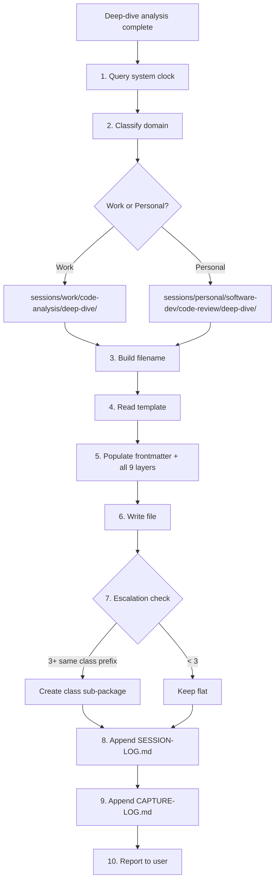

## Target

${input:target:What code do you want to deep-dive into? (e.g., OrderService.calculateTotal, PaymentGateway class, checkout flow)}

## Scope

${input:scope:What scope? (method — single method internals / class — full class analysis / feature — cross-class flow)}

## Focus (optional)

${input:focus:What to emphasize? (all — complete analysis / internals — how it works / flow — call chain and data flow / state — how state evolves / leave blank for all)}

## Context (optional)

${input:context:Why are you deep-diving? (onboarding / pre-refactoring / code-review-prep / learning / debugging-prep / leave blank)}

## Instructions

Perform a **code analysis deep-dive** on the target code. The goal is complete
understanding — not finding bugs or proposing refactoring (though note them if obvious).

Work through these 9 layers systematically. Skip layers that don't apply to the scope.

### Layer 1 — High-Level Overview

- **Purpose:** What does this code do? One-sentence responsibility statement
- **Architecture role:** Where it sits (layer, module, domain boundary)
- **Design pattern:** What pattern it implements (Service, Repository, Strategy, etc.)
- **Entry points:** Who calls this code and when?
- **One-paragraph summary** for someone who has never seen this code

### Layer 2 — Data Flow

Trace data from **inputs → transformations → outputs**:

- List all inputs (parameters, injected dependencies, global state read)
- Show each transformation step with types
- List all outputs (return values, side-effects, state mutations, events emitted)
- Draw a simple flow: `Input A → transform → intermediate → transform → Output B`

### Layer 3 — Call Stack / Method Flow

Map the method call chain:

- Show the complete call tree with indentation (who calls what)
- For each call: caller, callee, purpose, return type
- Highlight recursive calls, callbacks, or async boundaries
- Note any external service calls (DB, HTTP, file I/O)

### Layer 4 — Code Block Breakdown

Split the code into **functional blocks by cohesion**:

- Each block: name, line range, purpose, why it exists
- Show the actual code for each block
- Explain how blocks connect — what data flows between them
- Aim for 3-8 blocks per method (break on logical boundaries, not arbitrary line counts)

### Layer 5 — Line-by-Line Walkthrough

For **key logic lines** (skip boilerplate):

- What the line does
- Why it does it that way
- What would change if this line were different
- Flag any subtle behaviour (implicit conversions, short-circuit evaluation, side-effects)

### Layer 6 — State Changes

Track how state evolves through execution:

- Local variable mutations (before → after → why)
- Field/instance state changes
- External state changes (DB writes, cache invalidation, event publication)
- Thread-safety implications of state changes

### Layer 7 — Edge Cases & Error Paths

Enumerate what can go wrong:

- Null/empty inputs
- Boundary conditions (zero, max, overflow)
- Exception paths (what's caught, what propagates)
- Concurrency issues (race conditions, deadlocks)
- Missing validation

### Layer 8 — Dependencies & Coupling

Map the dependency graph:

- **Outgoing:** what this code depends on (interfaces vs concrete, loose vs tight)
- **Incoming:** what depends on this code (callers, consumers)
- Coupling assessment: is this code easy to change in isolation?

### Layer 9 — Key Takeaways

Summarise for future reference:

- 3-5 bullet points capturing the essential understanding
- Any surprises or non-obvious behaviour
- Suggestions for further investigation (related classes, upstream/downstream)

### Output Rules

- **Scope-adaptive:** For `method` scope, all 9 layers apply. For `class`, emphasize
  Layers 1-3 and 8. For `feature`, emphasize Layers 1-3 and show cross-class flow
- **Code-first:** Show actual code blocks, not just descriptions
- **Type-precise:** Always include types in data flow and call stack tables
- **Honest:** If something is unclear or looks like a bug, say so
- Use the `code-analysis-deep-dive-capture.md` session template for capture
- If the target method is > 50 lines, the Code Block Breakdown (Layer 4) is mandatory
- End with one "what to deep-dive next" recommendation

### Session Capture — Auto-Save to Brain

After completing the deep-dive analysis, **automatically capture** the full output as
a session file. This is mandatory — every deep-dive produces a permanent reference doc.

#### Capture Workflow



#### Step-by-Step Protocol

1. **Get the actual current timestamp** — always query the system clock first:

   ```powershell
   Get-Date -Format "yyyy-MM-dd"          # → 2026-04-20  (frontmatter date)
   Get-Date -Format "hh-mmtt"             # → 09-21pm     (filename time, lowercase am/pm)
   Get-Date -Format "hh:mm tt"            # → 09:21 PM    (frontmatter time, uppercase)
   ```

   Never guess or round — use the exact values returned.

2. **Determine the domain** from the code being analysed:
   - Code in this repo or any work project → `work`
   - Code in a personal/side project → `personal`

3. **Build the file path** — deep-dive sessions go to a **permanent `deep-dive/` sub-folder**
   (not subject to de-escalation):
   - Work: `brain/ai-brain/sessions/work/code-analysis/deep-dive/`
   - Personal: `brain/ai-brain/sessions/personal/software-dev/code-review/deep-dive/`

4. **Build the filename** following the naming convention:

   ```text
   # Inside deep-dive/ — drop the category prefix (implied by parent folders)
   <date>_<time>_<class-kebab>-<method-kebab>.md

   Examples:
     2026-04-20_09-21pm_order-service-calculate-total.md
     2026-04-20_03-45pm_payment-gateway-overview.md       (class-level, no method)
   ```

   - **Kebab-case** the class and method names: `OrderService` → `order-service`
   - **3-8 words** for the subject — most specific first
   - For class-level deep-dives, use `<class-kebab>-overview.md`

5. **Check for existing versions** — before writing, check if a file with the same
   class+method subject already exists in the target folder:
   - If found → create a versioned continuation: append `_v2`, `_v3`, etc.
   - Set `version: 2` and `parent: <original-filename>` in frontmatter

6. **Read and populate the template** from
   `brain/ai-brain/sessions/_templates/code-analysis-deep-dive-capture.md`:

   **Frontmatter** — fill every field:

   ```yaml
   date: 2026-04-20
   time: "09:21 PM"
   kind: session-capture
   domain: work
   category: code-analysis
   project: learning-assistant          # kebab-case project name
   subject: order-service-calculate-total  # matches filename subject
   tags: [project:learning-assistant, deep-dive, code-analysis, java, order-service]
   status: draft
   version: 1
   parent: null
   complexity: high                     # deep-dives are always high
   outcomes:
     - "Mapped data flow for calculateTotal: price × quantity → discount → tax → total"
     - "Identified missing null-check on discount parameter"
   source: copilot
   scope: project                       # or global/feature as appropriate
   scope-project: learning-assistant    # required when scope = project or feature
   scope-feature: null
   scope-transitions: []
   scope-refs: []
   code-target:
     class: OrderService
     method: calculateTotal
     package: com.example.order
     file: src/order/OrderService.java
   deep-dive:
     level: method
     focus: all
   ```

   **Body** — populate ALL 9 layers from the deep-dive analysis output above.
   Every layer must contain real content — not placeholder text.

7. **Write the file** to the path from step 3.

8. **Check escalation** — count session files in the target folder:
   - If **3+ files** share the same class prefix (e.g., `order-service-*`), create a
     class sub-package per Pattern 3a in chat-capture instructions
   - Move matching files into `<class-kebab>/` and truncate their names
   - If **2 files** and a multi-part deep-dive is planned, apply early escalation

9. **Append to SESSION-LOG.md** — add a row to `brain/ai-brain/sessions/SESSION-LOG.md`:

   ```markdown
   | 2026-04-20 | 09:21 PM | work | code-analysis | order-service-calculate-total | v1 | high | draft | [View](work/code-analysis/deep-dive/2026-04-20_09-21pm_order-service-calculate-total.md) |
   ```

10. **Append to CAPTURE-LOG.md** — log the capture operation in
    `brain/ai-brain/sessions/CAPTURE-LOG.md` (create the file if it doesn't exist):

    ```markdown
    | 2026-04-20 | 09:21 PM | capture | Deep-dive: OrderService.calculateTotal → work/code-analysis/deep-dive/ | 1 file created |
    ```

    If escalation was triggered, log that as a separate row:

    ```markdown
    | 2026-04-20 | 09:22 PM | escalation:pattern-3a | Created order-service/ sub-package in deep-dive/ (3+ class files) | N files moved |
    ```

11. **Report** — tell the user: "Deep-dive captured to `sessions/<path>`"

#### Content Quality Rules

- **Layer 4 (Code Block Breakdown)** must be thorough — split every non-trivial method
  into 3-8 functional blocks with actual code snippets and explanations. This is the
  most valuable section for a developer reading the file later.
- **Layer 1 (High-Level Overview)** must be immediately understandable — a developer
  should get the full picture in 30 seconds by reading just this section.
- **Layer 5 (Line-by-Line)** should cover key decision lines, not boilerplate.
- The file must be **self-contained** — a developer who has never seen this code should
  be able to understand it fully by reading only this file.
- Include actual code blocks (not just descriptions) in Layers 4 and 5.
