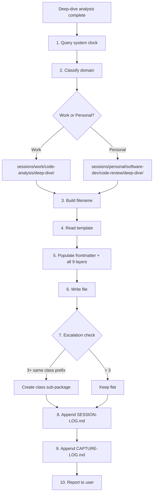

## Target

${input:target:What code do you want to deep-dive into? (e.g., OrderService.calculateTotal, PaymentGateway class, checkout flow)}

## Scope

${input:scope:What scope? (method — single method internals / class — full class analysis / feature — cross-class flow)}

## Focus (optional)

${input:focus:What to emphasize? (all — complete analysis / internals — how it works / flow — call chain and data flow / state — how state evolves / leave blank for all)}

## Context (optional)

${input:context:Why are you deep-diving? (onboarding / pre-refactoring / code-review-prep / learning / debugging-prep / leave blank)}

## Instructions

Perform a **code analysis deep-dive** on the target code. The goal is complete
understanding — not finding bugs or proposing refactoring (though note them if obvious).
The output must be a **developer reference document** — someone reading it should
fully understand the code without ever opening the source file.

Work through these 9 layers systematically. Skip layers that don't apply to the scope.

### Cross-Layer Coherence — How the Layers Interlink

The 9 layers are **not independent sections** — they form a single connected narrative.
A developer must be able to trace any piece of data from Layer 2 (where it enters)
through Layer 4 (which block processes it) through Layer 5 (which line transforms it)
through Layer 6 (how it mutates state) and into Layer 7 (what happens when it's wrong).

**Consistent ID system** — tag items across layers so cross-references are unambiguous:

| Tag | Layer | Example | Purpose |
|---|---|---|---|
| **T*n*** | Layer 2 | T1, T2, T3 | Transformation step in the data pipeline |
| **C*n*** | Layer 3 | C1, C2, C3 | Call in the call stack / method flow |
| **B*n*** | Layer 4 | B1, B2, B3 | Code block in the block breakdown |
| **L*n*** | Layer 5 | L42, L47 | Source file line number |
| **E*n*** | Layer 7 | E1, E2, E3 | Edge case / error scenario |

**Every layer must cross-reference related items in other layers:**

- Layer 3 calls → which Layer 4 block contains them
- Layer 4 blocks → which Layer 2 transformation steps and Layer 3 calls they implement
- Layer 5 lines → which Layer 4 block they belong to
- Layer 6 state changes → which Layer 4 block causes each mutation
- Layer 7 edge cases → which Layer 4 block and source line they occur at
- Layer 8 dependencies → which Layer 4 blocks use them

This interlinking makes the document a **navigable reference** — a developer can jump
from a block to its data flow, from an edge case to the exact line that causes it,
from a dependency to every block that relies on it.

### Layer 1 — High-Level Overview (30-Second Understanding)

This section must give a developer the complete picture in under 30 seconds.

- **One-sentence purpose:** What does this code do? (answer in business terms, not code)
- **Responsibility boundary:** What this code is responsible for — and what it is NOT
- **Architecture role:** Which layer/module it belongs to (controller → service → repository → infrastructure)
- **Design pattern:** What pattern it implements (Service, Repository, Strategy, Factory, Template Method, Observer, etc.)
- **Entry points and triggers:** Who calls this code? What event/request/schedule triggers it?
- **Collaborators:** What other classes/services does it work with? (just names and roles)
- **One-paragraph narrative:** Write a natural-language paragraph explaining what happens when this code runs,
  as if describing it to a developer who just joined the team. Include the "why" — why does this code exist
  in the system, what business problem does it solve?

### Layer 2 — Data Flow (Input → Transformation → Output)

Trace data through the entire execution path:

**Inputs — What enters this code:**

| Parameter / Source | Type | Origin | Description |
|---|---|---|---|
| `paramName` | `Type` | caller / DI / config / DB | What this data represents in business terms |

**Transformation pipeline — What happens to the data:**

Number each transformation step. For each step, show the before-type, transformation
logic, and after-type. Use an ASCII flow diagram to make it visual:

```text
Input: Order(items, customer, discount)
  │
  ├─ T1: Validate → throws InvalidOrderException if items empty
  ├─ T2: Calculate subtotal → sum(item.price × item.qty) → BigDecimal
  ├─ T3: Apply discount → subtotal × (1 - discount.rate) → BigDecimal
  ├─ T4: Calculate tax → discounted × taxRate → BigDecimal
  ├─ T5: Build receipt → Receipt(subtotal, discount, tax, total)
  │
  Output: Receipt with all line items and totals
```

Tag each step **T1, T2, T3...** — these IDs are referenced by Layer 4 blocks to show
which transformation steps each block implements.

**Outputs — What leaves this code:**

| Return / Side-Effect | Type | Consumer | Description |
|---|---|---|---|
| Return value | `Type` | Caller class | What the caller uses this for |
| Side-effect | DB write / event / cache | Downstream system | What changes in the world |

### Layer 3 — Call Stack / Method Flow

Map the complete execution flow as an indented call tree:

```text
→ EntryPoint.publicMethod(args)
    C1 → this.validateInput(args)
         C2 → Validator.check(args)           // returns boolean
    C3 → this.processCore(validatedArgs)
         C4 → dependency.fetchData(id)        // 🔌 DB read — latency point
         C5 → this.transform(raw)             // ✦ pure logic — no side-effects
         C6 → dependency.save(result)         // 🔌 DB write
    C7 → this.notifyListeners(result)
         C8 → EventBus.publish(event)         // ⚡ async — fire-and-forget
```

Tag each call **C1, C2, C3...** — these IDs are referenced by Layer 4 blocks.

For each call in the tree, provide a detail row including which Layer 4 block contains it:

| Call | Caller → Callee | Purpose | Returns | Side-Effects | Block(s) | Notes |
|---|---|---|---|---|---|---|
| C1 | `Controller.handle` → `Service.process` | Entry from HTTP layer | `ResponseDTO` | None | B1 | Wraps in try-catch for HTTP errors |
| C4 | `Service.process` → `Repo.findById` | Fetch entity from DB | `Optional<Entity>` | DB read | B3 | Can return empty → 404 |

Annotate in the call tree: recursive calls (⟳), async boundaries (⚡), external I/O (🔌), pure logic (✦).

### Layer 4 — Code Block Breakdown (The Core of the Deep-Dive)

This is the **most valuable layer** and the one the developer will use side-by-side
with the source code. Split the code into **cohesive functional blocks** and present
each block as a **virtual extracted method** — the method signature the block WOULD have
if you extracted it. This gives the developer a typed contract (inputs → outputs) and an
intent-revealing name for every section of the code, without actually changing anything.

> **Design principle:** Present blocks as if you were doing an extract-method refactoring
> on paper. Each block gets a method name, parameter list, and return type that describe
> its contract. This is purely for understanding — **no code is actually changed**. The
> developer reads the virtual signature to grasp intent, then reads the real code below
> it to see how it's implemented. Think: "how would I explain this to a senior dev who
> just joined the team and is reading this method for the first time?"

> **Keep it technical.** Avoid prose-heavy "What it does" paragraphs. Developers read
> Java, not essays. The virtual method signature IS the explanation. Use brief inline
> annotations in the code fence for anything non-obvious. Reserve plain-English notes
> only for gotchas, implicit assumptions, and caller-specific behaviour — things you
> cannot express in a type signature.

#### 4a — Region Map (Bird's-Eye View)

Before diving into individual blocks, provide a **region map** — a high-level table
showing how the method's lines are organized into logical regions. This is the first
thing a developer sees, giving them a mental roadmap before they read any detail.

```text
## Region Map — <MethodName> (L30-142)

| Region | Lines | Blocks | Purpose (one phrase) |
|---|---|---|---|
| Guard & Validation | L30-45 | B1-B2 | Reject invalid inputs early |
| Core Calculation | L46-89 | B3-B6 | Transform inputs into result |
| Persistence | L90-110 | B7-B8 | Save result and publish events |
| Cleanup & Return | L111-142 | B9-B10 | Release resources and return |
```

For methods under 30 lines, the region map can be omitted — go straight to blocks.
For methods over 50 lines, the region map is **mandatory**.

#### 4b — Block Breakdown (The Detail)

**For each block, provide:**

1. **Block ID + virtual method signature** — `BN` ID and a Java method signature showing
   what the block WOULD look like if extracted: name, parameters (with types), return
   type. This is the primary explanation — it tells the developer exactly what data flows
   in and out, and names the intent
2. **Line range** — exact lines in the source file (e.g., L42-58). These MUST match
   the actual source so the developer can locate the code instantly
3. **The actual code** — paste the real source code verbatim in a fenced block. Do NOT
   paraphrase, summarise, or reformat the code — the developer needs to see exactly
   what is in the file so they can match it visually
4. **Inline annotations** — for complex blocks (10+ lines or dense logic), add
   **inline code comments** in the code fence pointing to the key lines. Format:
   `// ← [B3.1] why this line matters`. These sub-IDs (B3.1, B3.2) let Layer 5
   reference specific lines within a block. Keep annotations technical and terse —
   explain non-obvious behaviour, not what the code literally does
5. **Contract** — one-line summary of what enters and what leaves this block, expressed
   as types: `Order (validated, non-null) → double (subtotal, may be 0.0 if empty)`
6. **Gotchas** — subtle behaviour, edge cases, thread-safety issues — reference E-numbers
   from Layer 7. Only include if something is genuinely surprising or dangerous
7. **State impact** — which Layer 6 variables are mutated in this block (if any)

**Block splitting rules:**

- Split on **logical boundaries**, not arbitrary line counts — each block should do
  exactly one conceptual thing (validate, transform, persist, notify, etc.)
- **Think extract-method:** if you can imagine extracting these lines into a method with
  a clear name, clear parameters, and a clear return type — that's a block. If you can't
  name it or can't define its inputs/outputs, the block boundaries are wrong
- Aim for **3-8 blocks per method** — fewer for simple methods, more for complex ones.
  For very long methods (100+ lines), 8-15 blocks is acceptable
- A block can be 1 line (if it's a critical decision) or 20 lines (if they're cohesive)
- **Overlap is allowed** — if a line serves as both the end of one block and the start
  of another, include it in both and annotate the dual role
- **Don't skip code** — every line of the method must appear in at least one block.
  The blocks together should reconstruct the full method. A developer scrolling through
  the source file must find every single line explained somewhere
- **Name blocks by intent**, not by implementation — "calculateSubtotal" not
  "streamMapToDouble"
- **Nest blocks for deep logic** — when a block contains a significant inner structure
  (e.g., a loop body with branching), use sub-blocks: B3a, B3b, B3c. The parent block
  (B3) shows the full code; sub-blocks zoom into specific segments within it

**Block template:**

```text
### Block B3 — `double calculateSubtotalAndApplyDiscount(List<LineItem> items, double discount)` (L42-58)

Implements: T2-T3 (Layer 2) · Contains: C4, C5 (Layer 3)
Region: Core Calculation
```

````java
// paste the ACTUAL source code verbatim — do not reformat
var subtotal = items.stream()
    .mapToDouble(i -> i.getPrice() * i.getQty()) // ← [B3.1] per-item: price × qty
    .sum();                                       // ← [B3.2] identity = 0.0 if empty (→ E2)
var discounted = applyDiscount(subtotal, discount); // ← [B3.3] multiplicative — can go negative (→ E3)
````

```text
Contract: List<LineItem> (non-null, from B2) → double (discounted subtotal, → B4)
Gotchas: discount > 1.0 → negative total (E3) · double arithmetic → rounding drift on large orders (E6)
State: mutates local `total` (Layer 6) — declared L45, set L47
```

**The virtual method signature IS the documentation.** A developer reading
`double calculateSubtotalAndApplyDiscount(List<LineItem> items, double discount)` immediately
understands the block's purpose, inputs, and output — no prose needed. The actual code
below it shows the implementation. The inline annotations (`[B3.1]`, `[B3.2]`) flag
non-obvious lines. The contract line confirms the typed data flow between blocks.

**When the block maps to an existing private method call:** If the block is essentially
`var result = this.somePrivateMethod(args)`, the virtual signature should match or
refine the actual method signature — don't invent a new name. Instead, annotate what
the actual method does that isn't obvious from its name.

**Inline annotation sub-IDs** (`B3.1`, `B3.2`, etc.) are referenced by Layer 5 for
line-by-line detail. A developer seeing `[B3.2]` in the code can jump to Layer 5
for the full explanation of that specific line.

The cross-references (**T***n*, **C***n*, **B***n*) create a web of links between layers.
A developer reading Block 3 can jump to T3 in Layer 2 to see where in the pipeline
this block sits, or to C4 in Layer 3 to see the call detail, or to E2 in Layer 7 to
see what edge case lurks here.

#### 4c — Handling Complex Code Patterns

Real codebases have god classes, 200-line methods, and multi-caller entry points.
Use these specialised approaches when the code is complex:

##### God Classes (10+ responsibilities, 500+ lines)

When a class mixes multiple responsibilities (e.g., validation + calculation +
persistence + notification all in one class):

1. **Responsibility inventory first** — before blocks, list every responsibility the
   class handles. Group methods by responsibility. Show the virtual class each group
   WOULD belong to if the god class were decomposed:

   ```text
   ## Responsibility Inventory — OrderService (847 lines, 23 methods)

   | # | Responsibility | Virtual Class | Methods | Lines |
   |---|---|---|---|---|
   | R1 | Input validation | `OrderValidator` | validateOrder, checkStock | L30-120 |
   | R2 | Price calculation | `PriceCalculator` | calculateTotal, applyDiscount, applyTax | L121-280 |
   | R3 | Persistence | `OrderRepository` | saveOrder, updateStatus | L281-390 |
   | R4 | Notification | `OrderNotifier` | notifyCustomer, publishEvent | L391-450 |
   | R5 | Logging & metrics | (cross-cutting) | logOrder, recordMetrics | L451-500 |
   ```

2. **Deep-dive one responsibility at a time** — treat each responsibility group as a
   mini-method for Layer 4 purposes. The region map separates them visually
3. **Cross-responsibility data flow** — show how data passes between responsibility
   groups (R1 output feeds R2, R2 output feeds R3, etc.)
4. **God class verdict** — in Layer 9, state clearly: "This class has N responsibilities
   that could be separated. Suggested decomposition: [list]"

##### Very Long Methods (100+ lines)

When a single method spans 100+ lines:

1. **Two-pass block breakdown:**
   - **Pass 1 — Coarse blocks** (5-8 blocks covering the full method at region level)
   - **Pass 2 — Fine blocks** (zoom into each coarse block, split further into 2-4
     sub-blocks each). Use nested IDs: B3 → B3a, B3b, B3c
2. **Mandatory region map** — the region map from 4a is not optional for 100+ line methods
3. **Branch maps for deep nesting** — if the method has 3+ levels of nesting
   (if inside if inside loop inside try), draw an indentation map:

   ```text
   L42  if (isValid)
   L43  ├─ for (item : items)           → B3 (Item Processing Loop)
   L44  │  ├─ if (item.isSpecial())     → B3a (Special Item Handling)
   L50  │  │  └─ try { ... }            → B3b (Special Item DB Lookup)
   L55  │  └─ else                      → B3c (Standard Item Pricing)
   L60  └─ else                         → B2 (Validation Failure Path)
   ```

4. **Every line must be reachable** — the two-pass approach ensures no code is missed.
   A developer scrolling through a 200-line method must find every single line explained

##### Multi-Caller Methods (called from 3+ distinct contexts)

When a method is called from many places with different expectations:

1. **Caller context table** in Layer 1:

   ```text
   | Caller | Context | Expected Behaviour | Error Handling |
   |---|---|---|---|
   | OrderController | HTTP request — user-facing | Fast, throw on invalid | 400/500 mapped |
   | BatchProcessor | Nightly batch — system | Tolerant, log & skip | Logged, continues |
   | EventHandler | Async event — internal | Fire-and-forget | Silently retried |
   | TestHarness | Integration test | Predictable, no side-effects | Asserted |
   ```

2. **Per-caller path annotations in Layer 4** — when a block behaves differently depending
   on who called it (e.g., different error handling paths), annotate:

   ```text
   **Caller-specific behaviour:**
   - From OrderController: throws OrderValidationException → HTTP 400
   - From BatchProcessor: catches and logs, returns null → batch continues
   - From EventHandler: re-throws wrapped in RetryableException
   ```

3. **Coupling assessment in Layer 8** — for each caller, assess: "If I change this method,
   does that caller break?"

##### Deeply Nested / Tangled Logic

When the code has complex conditional chains, deeply nested loops, or interleaved
concerns (e.g., validation mixed with calculation mixed with logging):

1. **Flatten-and-label** — even though the code is nested, the block breakdown should
   present it as a flat sequence of blocks with nesting annotations:

   ```text
   B1 — Outer Validation (L30-35)            [nesting: 0]
   B2 — Item Loop Setup (L36-38)             [nesting: 1]
   B3 — Special Item Branch (L39-52)         [nesting: 2, inside B2 loop]
   B4 — Standard Item Branch (L53-58)        [nesting: 2, inside B2 loop]
   B5 — Loop Accumulator (L59-62)            [nesting: 1, end of B2 loop]
   B6 — Post-Loop Aggregation (L63-70)       [nesting: 0]
   ```

2. **Show the full nesting context** — each block's code snippet should include 1-2 lines
   of surrounding context (the enclosing `if`/`for`/`try`) so the developer can see
   where in the nesting this block lives:

   ```java
   // Context: inside for (var item : items) { if (item.isSpecial()) {
   var specialPrice = lookupSpecialPrice(item.getSku()); // ← [B3.1]
   if (specialPrice == null) {                            // ← [B3.2] fallback
       specialPrice = item.getDefaultPrice();
   }
   total += specialPrice * item.getQty();                 // ← [B3.3] accumulate
   // } — end of special-item branch
   ```

3. **Decision tree for complex conditionals** — when there are 3+ branches, draw an
   ASCII decision tree showing all paths:

   ```text
   L42: if (order.type == PREMIUM)
        ├─ YES → B3 (Premium Pricing) — 15% discount cap
        └─ NO → L48: if (order.total > 1000)
                 ├─ YES → B4 (Bulk Discount) — tiered rates
                 └─ NO → L52: if (customer.isLoyal())
                          ├─ YES → B5 (Loyalty Discount) — 5% flat
                          └─ NO → B6 (Standard Pricing) — no discount
   ```

### Layer 5 — Line-by-Line Walkthrough (Key Logic Only)

For **decision-making lines, algorithm steps, and non-obvious behaviour** — skip
boilerplate (imports, standard getters/setters, simple assignments, logging statements).

When Layer 4 uses inline annotation sub-IDs (`B3.1`, `B3.2`), Layer 5 expands on those
specific lines. The **Sub-ID** column links directly back to the inline annotation in the
Layer 4 code fence, so the developer can jump between the code and the explanation.

For each key line:

| Line | Block | Sub-ID | Code | What It Does | Why This Way | What If Different |
|---|---|---|---|---|---|---|
| L42 | B1 | — | `if (order.isValid())` | Guards against invalid orders | Delegates validation to Order — SRP | If removed: NPE on null items at L47 → E1 |
| L47 | B2 | B3.1 | `var total = items.stream().mapToDouble(...)` | Calculates subtotal via stream | Functional style — immutable intermediate | Could use for-loop but less readable |
| L49 | B2 | B3.2 | `.sum()` | Aggregates to single value | Stream terminal — identity if empty | Empty list returns 0.0 → E2 |
| L51 | B3 | B3.3 | `total = applyDiscount(total, discount)` | Applies percentage discount | Mutates local — discount is multiplicative | If additive: different rounding behaviour → E3 |

The **Block** column links each line back to its Layer 4 block. The **Sub-ID** column
links to the inline annotation in Layer 4's code fence (if present). The **What If
Different** column references Layer 7 edge case IDs (E*n*) where removing or changing
the line would trigger a failure.

Focus on lines where **the developer's understanding would break** if they skipped it.

**For very long methods (100+ lines):** Layer 5 must cover key lines from EVERY coarse
block and its sub-blocks. Prioritise: (1) lines where control flow branches, (2) lines
where state mutates, (3) lines where external calls happen, (4) lines with non-obvious
semantics. Skip lines that are purely mechanical (simple assignments, logging, closing
braces). A 200-line method should have 30-60 lines in this table.

### Layer 6 — State Changes

Track every mutation through execution:

**Local variable lifecycle:**

| Variable | Declared At | Mutated At | Block(s) | Before → After | Why |
|---|---|---|---|---|---|
| `total` | L45 | L47, L51, L55 | B2, B3, B4 | `0.0` → `100.0` → `90.0` → `99.0` | Accumulates: subtotal → discounted → taxed |

The **Block(s)** column shows which Layer 4 blocks are responsible for each mutation —
a developer can jump directly to the block to see the code that changes this variable.

**Instance/field state changes:**

| Field | Changed At | Block | Before → After | Scope of Impact |
|---|---|---|---|---|
| `this.lastProcessedId` | L60 | B5 | `null` → `"ORD-123"` | Affects subsequent calls — not thread-safe (see E4) |

**External state changes (side-effects leaving this code):**

| What Changes | Where | When | Block | Reversible? |
|---|---|---|---|---|
| DB row updated | `orders` table | L62 | B5 | Yes (within transaction) |
| Event published | Message queue | L65 | B6 | No — consumers may have already processed |

### Layer 7 — Edge Cases & Error Paths

Enumerate every way this code can fail or behave unexpectedly:

| Edge | Scenario | Location | Input / Condition | What Happens | Handled? | Impact |
|---|---|---|---|---|---|---|
| E1 | Null input | B1, L42 | `order == null` | NPE at L42 | ❌ No null-check | Caller gets 500 |
| E2 | Empty items list | B2, L47 | `order.getItems().isEmpty()` | Returns `0.0` total | ✅ Stream returns identity | Technically correct but may confuse caller |
| E3 | Negative discount | B3, L51 | `discount > 1.0` | Negative total | ❌ Not validated | Incorrect billing |
| E4 | Concurrent modification | B5, L60 | Two threads, same order | Race condition on `lastProcessedId` | ❌ Not synchronised | Data corruption |
| E5 | DB connection failure | B5, L62 | Network issue at L62 | `SQLException` propagates | ✅ Caught in caller | Transaction rolls back |

The **Edge** column (E*n*) is referenced from Layers 4, 5, and 6 — so a developer
spotting a gotcha in a block can jump here for the full scenario, and vice versa.
The **Location** column pinpoints the exact block and line where the edge case manifests.

### Layer 8 — Dependencies & Coupling

**Outgoing dependencies (what this code needs):**

| Dependency | Type | Interface or Concrete? | Coupling | Used in Blocks | Testability Impact |
|---|---|---|---|---|---|
| `OrderRepository` | Injected | Interface | Loose | B4, B5 | Easy to mock |
| `DiscountService` | Injected | Concrete class | Tight | B3 | Must mock concrete — fragile |
| `TaxCalculator` | Static call | Static method | Very tight | B4 | Cannot mock without PowerMock |

**Incoming dependencies (what needs this code):**

| Dependent | How It Uses This Code | Frequency | Breakage Risk |
|---|---|---|---|
| `OrderController` | Calls `processOrder()` | Per HTTP request | High — controller has no fallback |
| `BatchProcessor` | Calls in loop | Scheduled nightly | Medium — has retry logic |

**Coupling verdict:** How easy is it to change this code without breaking callers?
Rate as: isolated / manageable / tangled / dangerous.

### Layer 9 — Key Takeaways & Developer Cheat Sheet

Summarise everything for quick future reference:

**In 5 bullet points:**

- What this code does (one sentence)
- The most important design decision and why
- The biggest risk/edge case to watch for
- The key dependency to understand
- What to deep-dive next if you want to go deeper

**Developer cheat sheet** (copy-pasteable quick-reference):

```text
Purpose:     <one-liner from Layer 1>
Entry:       <who calls it, when — from Layer 1 entry points>
Happy path:  <T1 → T2 → T3 → ... → output — from Layer 2>
Error path:  <E1, E3 unhandled — from Layer 7>
Key blocks:  <B2 (Price Calc), B3 (Discount) — from Layer 4>
Thread-safe: yes / no / partially — <reference E4 if applicable>
Testable:    easy / moderate / hard — because <reference Layer 8 verdict>
```

The cheat sheet references Layer IDs so a developer can drill into any detail.

### Output Rules

- **Scope-adaptive:** For `method` scope, all 9 layers apply. For `class`, emphasize
  Layers 1-4 and 8 (show blocks per method, skip line-by-line). For `feature`,
  emphasize Layers 1-3 and show cross-class flow with a feature-level block breakdown
- **Code-first:** Always show actual source code in fenced blocks — never describe code
  without showing it. A developer should be able to read ONLY this document and
  reconstruct the mental model of the code completely
- **Side-by-side design:** Line ranges (L*n*) in every block MUST match the actual source
  file. A developer with the source open on the left and this doc on the right should be
  able to locate any block's code instantly by line number
- **Type-precise:** Always include types in data flow and call stack tables
- **Honest:** If something is unclear, surprising, or looks like a bug, say so directly
- **No refactoring in the analysis** — the virtual method signatures and block groupings
  are for understanding, NOT a refactoring proposal. The code stays exactly as-is. If you
  see an extract-method opportunity worth calling out, note it in Layer 9 takeaways, but
  do NOT reorganise or rewrite the actual code in the analysis
- **Completeness over brevity** — every line of the target code must appear in at least
  one block in Layer 4. No gaps. The blocks together reconstruct the full method
- **Cross-layer coherence is mandatory** — every block (B*n*) must reference the
  transformation steps (T*n*) it implements and the calls (C*n*) it contains. Every
  edge case (E*n*) must name its block and line. Every state change must name its block.
  A developer reading any single layer must be able to navigate to every related layer
  via the ID tags. If an ID appears in one layer, it must be defined in its home layer.
- End with one "what to deep-dive next" recommendation

#### Complexity-Adaptive Thresholds

The depth of analysis scales with the complexity of the target code:

| Target | Layer 4 | Region Map | Sub-Blocks | Multi-Caller Table | Responsibility Inventory |
|---|---|---|---|---|---|
| Method ≤ 30 lines | 3-5 blocks | Optional | No | If 3+ callers | N/A |
| Method 30-100 lines | 5-8 blocks | Recommended | If nested 3+ levels | If 3+ callers | N/A |
| Method 100+ lines | 8-15 blocks (two-pass) | **Mandatory** | **Mandatory** | If 3+ callers | N/A |
| Method 200+ lines | 12-20 blocks (two-pass) | **Mandatory** | **Mandatory** | If 3+ callers | N/A |
| Class ≤ 5 methods | Per-method blocks | Per class | No | Per method if applicable | No |
| Class 5-10 methods | Per-method blocks | Per class | For complex methods | Per method if applicable | Recommended |
| God class (10+ methods or 500+ lines) | Per-responsibility then per-method | Per responsibility | **Mandatory** for complex methods | **Mandatory** | **Mandatory** |

**Scaling rules:**

- Method > 50 lines → Layer 4 (Code Block Breakdown) is mandatory with region map
- Method > 100 lines → two-pass breakdown (coarse + fine) is mandatory
- Method > 200 lines → Layer 5 (line-by-line) must cover 30+ key lines
- Class > 5 public methods → Layer 4 breakdown for EACH significant method
  (skip trivial getters/setters/toString)
- Class > 10 public methods or > 500 lines → responsibility inventory (section 4c)
  is mandatory before method-level analysis
- Method called from 3+ distinct callers → caller context table in Layer 1 is mandatory
- Nesting depth 3+ levels → branch map / indentation map is mandatory in Layer 4

### Session Capture — Auto-Save to Brain

After completing the deep-dive analysis, you **MUST** capture the full output as
a session file by **actually creating the file** using the `create_file` tool. This is
not optional — every deep-dive produces a permanent reference document. Do NOT just
show the analysis in chat and skip the file creation.

#### Workspace Resolution

The session file must be written to the `brain/ai-brain/sessions/` directory in the
**workspace where the analysed code lives** — NOT necessarily this (learning-assistant)
repository. Resolve the brain path as follows:

1. **Identify the workspace root** — the root of the VS Code workspace or git repo
   containing the target code (check `git rev-parse --show-toplevel` if unsure)
2. **Find the brain directory** — look for `brain/ai-brain/sessions/` under that
   workspace root. If it does not exist, create the required directory structure:
   `brain/ai-brain/sessions/work/code-analysis/deep-dive/`
3. **Use absolute paths** — when calling `create_file`, always use the full absolute
   path (e.g., `E:\mgcnoscan\iesd-26\brain\ai-brain\sessions\work\code-analysis\deep-dive\<filename>.md`)
4. **Environment variable override** — if `BRAIN_PATH` is set, use that instead of
   the default `brain/ai-brain` relative path

#### Capture Workflow



#### Step-by-Step Protocol

1. **Get the actual current timestamp** — run this command in the terminal (do NOT guess):

   ```powershell
   Get-Date -Format "yyyy-MM-dd_hh-mmtt_hh:mm tt"
   ```

   Parse the output to extract:
   - `yyyy-MM-dd` → frontmatter `date` field (e.g., `2026-04-20`)
   - `hh-mmtt` → filename timestamp segment, lowercase (e.g., `09-21pm`)
   - `hh:mm tt` → frontmatter `time` field, quoted (e.g., `"09:21 PM"`)

   **You MUST run this command.** Never guess, round, or use a placeholder.

2. **Resolve the workspace root** — identify where the analysed code lives:

   ```powershell
   git rev-parse --show-toplevel
   ```

   This gives you the workspace root (e.g., `E:/mgcnoscan/iesd-26`). The brain
   session path is `<workspace-root>/brain/ai-brain/sessions/`.

3. **Determine the domain** from the code being analysed:
   - Code in a work project → `work`
   - Code in a personal/side project → `personal`

4. **Build the absolute file path** — deep-dive sessions go to a **permanent
   `deep-dive/` sub-folder** (not subject to de-escalation):
   - Work: `<workspace-root>/brain/ai-brain/sessions/work/code-analysis/deep-dive/`
   - Personal: `<workspace-root>/brain/ai-brain/sessions/personal/software-dev/code-review/deep-dive/`
   - If a class sub-package already exists (e.g., `deep-dive/order-service/`), place
     the file inside it
   - **If the directory does not exist, create it** (the `create_file` tool creates
     parent directories automatically)

5. **Build the filename** following the naming convention. Files inside `deep-dive/`
   carry rich descriptive metadata because the category is implied by the folder path:

   ```text
   # Naming formula for deep-dive/ (no category prefix — implied by folder)
   <date>_<time>_<subject-slug>.md

   Subject slug composition (order matters — most identifying first):
     <class-kebab>-<method-kebab>[-<focus>][-<context>]

   Segment reference:
     <class-kebab>   — mandatory: kebab-case class name (OrderService → order-service)
     <method-kebab>  — optional: kebab-case method name (calculateTotal → calculate-total)
                       omit for class-level, use "overview" instead
     <focus>         — optional: what aspect was emphasised (internals / flow / state)
                       omit when focus = all (the default)
     <context>       — optional: why the deep-dive was done (onboarding / pre-refactoring)
                       omit when context is general learning
   ```

   **Filename examples by scope:**

   | Scope | Target | Focus | Context | Filename |
   |---|---|---|---|---|
   | method | `OrderService.calculateTotal` | all | — | `2026-04-20_09-21pm_order-service-calculate-total.md` |
   | method | `PaymentGateway.charge` | flow | debugging | `2026-04-20_03-45pm_payment-gateway-charge-flow-debugging.md` |
   | class | `OrderService` | all | onboarding | `2026-04-20_11-00am_order-service-overview-onboarding.md` |
   | class | `ConfigLoader` | internals | — | `2026-04-20_02-30pm_config-loader-overview-internals.md` |
   | feature | checkout flow | flow | — | `2026-04-20_04-00pm_checkout-flow.md` |

   **Inside a class sub-package** (`deep-dive/order-service/`):

   | Target | Filename (no class prefix — implied by folder) |
   |---|---|
   | `OrderService.calculateTotal` | `2026-04-20_09-21pm_calculate-total.md` |
   | `OrderService.validateOrder` | `2026-04-20_03-45pm_validate-order-flow.md` |
   | `OrderService` class overview | `2026-04-20_11-00am_overview-onboarding.md` |

6. **Check for existing versions** — list the target directory to check if a file
   with the same class+method subject already exists:
   - If found → create a versioned continuation: append `_v2`, `_v3`, etc.
   - Set `version: 2` and `parent: <original-filename>` in frontmatter

7. **Build the file content** using the template structure from
   `brain/ai-brain/sessions/_templates/code-analysis-deep-dive-capture.md`:

   **Frontmatter** — fill every field:

   ```yaml
   date: 2026-04-20
   time: "09:21 PM"
   kind: session-capture
   domain: work
   category: code-analysis
   project: learning-assistant
   subject: order-service-calculate-total
   tags: [project:learning-assistant, deep-dive, code-analysis, java, order-service]
   status: draft
   version: 1
   parent: null
   complexity: high
   outcomes:
     - "Mapped data flow: price × quantity → discount → tax → total"
     - "Identified missing null-check on discount parameter"
   source: copilot
   scope: project
   scope-project: learning-assistant
   scope-feature: null
   scope-transitions: []
   scope-refs: []
   code-target:
     class: OrderService
     method: calculateTotal
     package: com.example.order
     file: src/order/OrderService.java
   deep-dive:
     level: method
     focus: all
   ```

   **Body** — populate ALL 9 layers from the deep-dive analysis output above.
   Every layer must contain real, substantive content — not placeholder text.
   Layer 4 (Code Block Breakdown) must reconstruct the full method across all blocks.

8. **WRITE THE FILE** — use the `create_file` tool with the **absolute path** from
   step 4 + filename from step 5. The file content is the frontmatter + all 9 layers.
   This step is **mandatory** — do NOT skip it or defer it.

   Example path: `E:\mgcnoscan\iesd-26\brain\ai-brain\sessions\work\code-analysis\deep-dive\2026-04-20_09-21pm_order-service-calculate-total.md`

9. **Check escalation** — count session files in the target folder:
   - If **3+ files** share the same class prefix (e.g., `order-service-*`), create a
     class sub-package per Pattern 3a in chat-capture instructions
   - Move matching files into `<class-kebab>/` and truncate their names
     (drop class prefix — implied by folder)
   - If **2 files** and a multi-part deep-dive is planned, apply early escalation

10. **Append to SESSION-LOG.md** — use `replace_string_in_file` or `editFiles` to
    append a row to `<workspace-root>/brain/ai-brain/sessions/SESSION-LOG.md`
    (create the file with headers if it doesn't exist):

   ```markdown
   | 2026-04-20 | 09:21 PM | work | code-analysis | order-service-calculate-total | v1 | high | draft | [View](work/code-analysis/deep-dive/2026-04-20_09-21pm_order-service-calculate-total.md) |
   ```

11. **Append to CAPTURE-LOG.md** — log the capture operation in
    `<workspace-root>/brain/ai-brain/sessions/CAPTURE-LOG.md`
    (create the file with headers if it doesn't exist):

    ```markdown
    | 2026-04-20 | 09:21 PM | capture | Deep-dive: OrderService.calculateTotal (method, all) → work/code-analysis/deep-dive/ | 1 file created |
    ```

    If escalation was triggered, log that as a separate row:

    ```markdown
    | 2026-04-20 | 09:22 PM | escalation:pattern-3a | Created order-service/ sub-package in deep-dive/ (3+ class files) | N files moved |
    ```

12. **Report** — tell the user: "Deep-dive captured to `<absolute-path>`"
    Include the full path so the user can open the file directly.

#### Content Quality Rules

- **Layer 4 (Code Block Breakdown)** must be thorough — split every non-trivial method
  into 3-8 functional blocks with actual code snippets and explanations. This is the
  most valuable section for a developer reading the file later.
- **Layer 1 (High-Level Overview)** must be immediately understandable — a developer
  should get the full picture in 30 seconds by reading just this section.
- **Layer 5 (Line-by-Line)** should cover key decision lines, not boilerplate.
- The file must be **self-contained** — a developer who has never seen this code should
  be able to understand it fully by reading only this file.
- Include actual code blocks (not just descriptions) in Layers 4 and 5.
