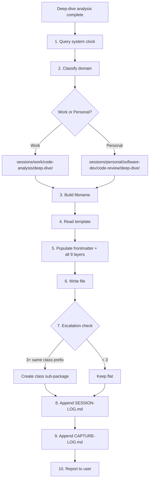

## Target

${input:target:What code do you want to deep-dive into? (e.g., OrderService.calculateTotal, PaymentGateway class, checkout flow)}

## Scope

${input:scope:What scope? (method — single method internals / class — full class analysis / feature — cross-class flow)}

## Focus (optional)

${input:focus:What to emphasize? (all — complete analysis / internals — how it works / flow — call chain and data flow / state — how state evolves / leave blank for all)}

## Context (optional)

${input:context:Why are you deep-diving? (onboarding / pre-refactoring / code-review-prep / learning / debugging-prep / leave blank)}

## Instructions

Perform a **code analysis deep-dive** on the target code. The goal is complete
understanding — not finding bugs or proposing refactoring (though note them if obvious).
The output must be a **developer reference document** — someone reading it should
fully understand the code without ever opening the source file.

Work through these 9 layers systematically. Skip layers that don't apply to the scope.

### Layer 1 — High-Level Overview (30-Second Understanding)

This section must give a developer the complete picture in under 30 seconds.

- **One-sentence purpose:** What does this code do? (answer in business terms, not code)
- **Responsibility boundary:** What this code is responsible for — and what it is NOT
- **Architecture role:** Which layer/module it belongs to (controller → service → repository → infrastructure)
- **Design pattern:** What pattern it implements (Service, Repository, Strategy, Factory, Template Method, Observer, etc.)
- **Entry points and triggers:** Who calls this code? What event/request/schedule triggers it?
- **Collaborators:** What other classes/services does it work with? (just names and roles)
- **One-paragraph narrative:** Write a natural-language paragraph explaining what happens when this code runs,
  as if describing it to a developer who just joined the team. Include the "why" — why does this code exist
  in the system, what business problem does it solve?

### Layer 2 — Data Flow (Input → Transformation → Output)

Trace data through the entire execution path:

**Inputs — What enters this code:**

| Parameter / Source | Type | Origin | Description |
|---|---|---|---|
| `paramName` | `Type` | caller / DI / config / DB | What this data represents in business terms |

**Transformation pipeline — What happens to the data:**

Number each transformation step. For each step, show the before-type, transformation
logic, and after-type. Use an ASCII flow diagram to make it visual:

```text
Input: Order(items, customer, discount)
  │
  ├─ Step 1: Validate → throws InvalidOrderException if items empty
  ├─ Step 2: Calculate subtotal → sum(item.price × item.qty) → BigDecimal
  ├─ Step 3: Apply discount → subtotal × (1 - discount.rate) → BigDecimal
  ├─ Step 4: Calculate tax → discounted × taxRate → BigDecimal
  ├─ Step 5: Build receipt → Receipt(subtotal, discount, tax, total)
  │
  Output: Receipt with all line items and totals
```

**Outputs — What leaves this code:**

| Return / Side-Effect | Type | Consumer | Description |
|---|---|---|---|
| Return value | `Type` | Caller class | What the caller uses this for |
| Side-effect | DB write / event / cache | Downstream system | What changes in the world |

### Layer 3 — Call Stack / Method Flow

Map the complete execution flow as an indented call tree:

```text
→ EntryPoint.publicMethod(args)
    → this.validateInput(args)
        → Validator.check(args)           // returns boolean
    → this.processCore(validatedArgs)
        → dependency.fetchData(id)        // DB call — latency point
        → this.transform(raw)             // pure logic — no side-effects
        → dependency.save(result)         // DB call — write
    → this.notifyListeners(result)
        → EventBus.publish(event)         // async — fire-and-forget
```

For each call in the tree, provide a detail row:

| # | Caller → Callee | Purpose | Returns | Side-Effects | Notes |
|---|---|---|---|---|---|
| 1 | `Controller.handle` → `Service.process` | Entry from HTTP layer | `ResponseDTO` | None | Wraps in try-catch for HTTP errors |
| 2 | `Service.process` → `Repo.findById` | Fetch entity from DB | `Optional<Entity>` | DB read | Can return empty → 404 |

Annotate: recursive calls (⟳), async boundaries (⚡), external I/O (🔌), pure logic (✦).

### Layer 4 — Code Block Breakdown (The Core of the Deep-Dive)

This is the **most valuable layer**. Split the code into **cohesive functional blocks**
based on what each section of code is doing logically. This is NOT about extracting
methods or proposing refactoring — it's about grouping lines that work together to
accomplish one logical step, so a developer can understand the code piece by piece.

**For each block:**

1. **Block name** — a descriptive, intention-revealing label (e.g., "Input Validation Guard",
   "Price Calculation Pipeline", "Error Recovery and Cleanup")
2. **Line range** — exact lines in the source file (e.g., L42-58)
3. **The actual code** — paste the real code in a fenced block (with language tag)
4. **What it does** — plain-English explanation of the block's purpose and mechanics.
   Explain the "what" and the "why" — not just restating the code in words
5. **How it connects** — what data this block receives from the previous block, and what
   it produces/passes to the next block. Show the data bridge between blocks
6. **Key decisions** — if the block contains conditionals, loops, or branching, explain
   the decision logic and what each branch means in business terms
7. **Gotchas** — any subtle behaviour, implicit assumptions, or non-obvious side-effects

**Block splitting rules:**

- Split on **logical boundaries**, not arbitrary line counts — each block should do
  exactly one conceptual thing (validate, transform, persist, notify, etc.)
- Aim for **3-8 blocks per method** — fewer for simple methods, more for complex ones
- A block can be 1 line (if it's a critical decision) or 20 lines (if they're cohesive)
- **Overlap is allowed** — if a line serves as both the end of one block and the
  beginning of another (e.g., a return value that's also a state change), include it
  in both blocks and annotate the dual role
- **Don't skip code** — every line of the method must appear in at least one block.
  The blocks together should reconstruct the full method
- **Name blocks by intent**, not by implementation — "Customer Eligibility Check" not
  "If-statement on line 42"

**Block template:**

```text
### Block N — <Intent-Revealing Name> (L42-58)
```

````java
// paste the actual source code for this block
````

```text
**What it does:** [plain-English explanation — what business/technical step this accomplishes]

**Data bridge:**
  ← Receives: [what data/state this block gets from the previous block]
  → Produces: [what data/state this block passes to the next block]

**Key decisions:** [explain any branching, conditionals, or early returns]

**Gotchas:** [subtle behaviour, edge cases, implicit assumptions]
```

### Layer 5 — Line-by-Line Walkthrough (Key Logic Only)

For **decision-making lines, algorithm steps, and non-obvious behaviour** — skip
boilerplate (imports, standard getters/setters, simple assignments, logging statements).

For each key line:

| Line | Code | What It Does | Why This Way | What If Different |
|---|---|---|---|---|
| 42 | `if (order.isValid())` | Guards against invalid orders | Delegates validation to Order — SRP | If removed: NPE on null items at L47 |
| 47 | `var total = items.stream().mapToDouble(...)` | Calculates subtotal via stream | Functional style — immutable intermediate | Could use for-loop but less readable |
| 51 | `total = applyDiscount(total, discount)` | Applies percentage discount | Mutates local — discount is multiplicative | If additive: different rounding behaviour |

Focus on lines where **the developer's understanding would break** if they skipped it.

### Layer 6 — State Changes

Track every mutation through execution:

**Local variable lifecycle:**

| Variable | Declared At | Mutated At | Before → After | Why |
|---|---|---|---|---|
| `total` | L45 | L47, L51, L55 | `0.0` → `100.0` → `90.0` → `99.0` | Accumulates: subtotal → discounted → taxed |

**Instance/field state changes:**

| Field | Changed At | Before → After | Scope of Impact |
|---|---|---|---|
| `this.lastProcessedId` | L60 | `null` → `"ORD-123"` | Affects subsequent calls — not thread-safe |

**External state changes (side-effects leaving this code):**

| What Changes | Where | When | Reversible? |
|---|---|---|---|
| DB row updated | `orders` table | L62 | Yes (within transaction) |
| Event published | Message queue | L65 | No — consumers may have already processed |

### Layer 7 — Edge Cases & Error Paths

Enumerate every way this code can fail or behave unexpectedly:

| # | Scenario | Input / Condition | What Happens | Handled? | Impact |
|---|---|---|---|---|---|
| 1 | Null input | `order == null` | NPE at L42 | ❌ No null-check | Caller gets 500 |
| 2 | Empty items list | `order.getItems().isEmpty()` | Returns `0.0` total | ✅ Stream returns identity | Technically correct but may confuse caller |
| 3 | Negative discount | `discount > 1.0` | Negative total | ❌ Not validated | Incorrect billing |
| 4 | Concurrent modification | Two threads, same order | Race condition on `lastProcessedId` | ❌ Not synchronised | Data corruption |
| 5 | DB connection failure | Network issue at L62 | `SQLException` propagates | ✅ Caught in caller | Transaction rolls back |

### Layer 8 — Dependencies & Coupling

**Outgoing dependencies (what this code needs):**

| Dependency | Type | Interface or Concrete? | Coupling | Testability Impact |
|---|---|---|---|---|
| `OrderRepository` | Injected | Interface | Loose | Easy to mock |
| `DiscountService` | Injected | Concrete class | Tight | Must mock concrete — fragile |
| `TaxCalculator` | Static call | Static method | Very tight | Cannot mock without PowerMock |

**Incoming dependencies (what needs this code):**

| Dependent | How It Uses This Code | Frequency | Breakage Risk |
|---|---|---|---|
| `OrderController` | Calls `processOrder()` | Per HTTP request | High — controller has no fallback |
| `BatchProcessor` | Calls in loop | Scheduled nightly | Medium — has retry logic |

**Coupling verdict:** How easy is it to change this code without breaking callers?
Rate as: isolated / manageable / tangled / dangerous.

### Layer 9 — Key Takeaways & Developer Cheat Sheet

Summarise everything for quick future reference:

**In 5 bullet points:**

- What this code does (one sentence)
- The most important design decision and why
- The biggest risk/edge case to watch for
- The key dependency to understand
- What to deep-dive next if you want to go deeper

**Developer cheat sheet** (copy-pasteable quick-reference):

```text
Purpose:     <one-liner>
Entry:       <who calls it, when>
Happy path:  <input → step → step → output>
Error path:  <what fails → what happens>
Thread-safe: yes / no / partially
Testable:    easy / moderate / hard — because <reason>
```

### Output Rules

- **Scope-adaptive:** For `method` scope, all 9 layers apply. For `class`, emphasize
  Layers 1-4 and 8 (show blocks per method, skip line-by-line). For `feature`,
  emphasize Layers 1-3 and show cross-class flow with a feature-level block breakdown
- **Code-first:** Always show actual source code in fenced blocks — never describe code
  without showing it. A developer should be able to read ONLY this document and
  reconstruct the mental model of the code completely
- **Type-precise:** Always include types in data flow and call stack tables
- **Honest:** If something is unclear, surprising, or looks like a bug, say so directly
- **No refactoring in the analysis** — the block breakdown shows logical groupings
  for understanding. If you see an extract-method opportunity, note it in Layer 9
  takeaways, but do NOT reorganise the code in the analysis itself
- **Completeness over brevity** — every line of the target code must appear in at least
  one block in Layer 4. No gaps. The blocks together reconstruct the full method
- If the target method is > 50 lines, Layer 4 (Code Block Breakdown) is mandatory
- If the target class has > 5 public methods, provide a Layer 4 breakdown for EACH
  significant method (skip trivial getters/setters/toString)
- End with one "what to deep-dive next" recommendation

### Session Capture — Auto-Save to Brain

After completing the deep-dive analysis, **automatically capture** the full output as
a session file. This is mandatory — every deep-dive produces a permanent reference doc.

#### Capture Workflow



#### Step-by-Step Protocol

1. **Get the actual current timestamp** — always query the system clock first:

   ```powershell
   Get-Date -Format "yyyy-MM-dd"          # → 2026-04-20  (frontmatter date)
   Get-Date -Format "hh-mmtt"             # → 09-21pm     (filename time, lowercase am/pm)
   Get-Date -Format "hh:mm tt"            # → 09:21 PM    (frontmatter time, uppercase)
   ```

   Never guess or round — use the exact values returned.

2. **Determine the domain** from the code being analysed:
   - Code in this repo or any work project → `work`
   - Code in a personal/side project → `personal`

3. **Build the file path** — deep-dive sessions go to a **permanent `deep-dive/` sub-folder**
   (not subject to de-escalation):
   - Work: `brain/ai-brain/sessions/work/code-analysis/deep-dive/`
   - Personal: `brain/ai-brain/sessions/personal/software-dev/code-review/deep-dive/`
   - If a class sub-package already exists (e.g., `deep-dive/order-service/`), place the
     file inside it

4. **Build the filename** following the naming convention. Files inside `deep-dive/`
   carry rich descriptive metadata because the category is implied by the folder path:

   ```text
   # Naming formula for deep-dive/ (no category prefix — implied by folder)
   <date>_<time>_<subject-slug>.md

   Subject slug composition (order matters — most identifying first):
     <class-kebab>-<method-kebab>[-<focus>][-<context>]

   Segment reference:
     <class-kebab>   — mandatory: kebab-case class name (OrderService → order-service)
     <method-kebab>  — optional: kebab-case method name (calculateTotal → calculate-total)
                       omit for class-level, use "overview" instead
     <focus>         — optional: what aspect was emphasised (internals / flow / state)
                       omit when focus = all (the default)
     <context>       — optional: why the deep-dive was done (onboarding / pre-refactoring)
                       omit when context is general learning
   ```

   **Filename examples by scope:**

   | Scope | Target | Focus | Context | Filename |
   |---|---|---|---|---|
   | method | `OrderService.calculateTotal` | all | — | `2026-04-20_09-21pm_order-service-calculate-total.md` |
   | method | `PaymentGateway.charge` | flow | debugging | `2026-04-20_03-45pm_payment-gateway-charge-flow-debugging.md` |
   | class | `OrderService` | all | onboarding | `2026-04-20_11-00am_order-service-overview-onboarding.md` |
   | class | `ConfigLoader` | internals | — | `2026-04-20_02-30pm_config-loader-overview-internals.md` |
   | feature | checkout flow | flow | — | `2026-04-20_04-00pm_checkout-flow.md` |

   **Inside a class sub-package** (`deep-dive/order-service/`):

   | Target | Filename (no class prefix — implied by folder) |
   |---|---|
   | `OrderService.calculateTotal` | `2026-04-20_09-21pm_calculate-total.md` |
   | `OrderService.validateOrder` | `2026-04-20_03-45pm_validate-order-flow.md` |
   | `OrderService` class overview | `2026-04-20_11-00am_overview-onboarding.md` |

5. **Check for existing versions** — before writing, check if a file with the same
   class+method subject already exists in the target folder:
   - If found → create a versioned continuation: append `_v2`, `_v3`, etc.
   - Set `version: 2` and `parent: <original-filename>` in frontmatter

6. **Read and populate the template** from
   `brain/ai-brain/sessions/_templates/code-analysis-deep-dive-capture.md`:

   **Frontmatter** — fill every field:

   ```yaml
   date: 2026-04-20
   time: "09:21 PM"
   kind: session-capture
   domain: work
   category: code-analysis
   project: learning-assistant
   subject: order-service-calculate-total
   tags: [project:learning-assistant, deep-dive, code-analysis, java, order-service]
   status: draft
   version: 1
   parent: null
   complexity: high
   outcomes:
     - "Mapped data flow: price × quantity → discount → tax → total"
     - "Identified missing null-check on discount parameter"
   source: copilot
   scope: project
   scope-project: learning-assistant
   scope-feature: null
   scope-transitions: []
   scope-refs: []
   code-target:
     class: OrderService
     method: calculateTotal
     package: com.example.order
     file: src/order/OrderService.java
   deep-dive:
     level: method
     focus: all
   ```

   **Body** — populate ALL 9 layers from the deep-dive analysis output above.
   Every layer must contain real, substantive content — not placeholder text.
   Layer 4 (Code Block Breakdown) must reconstruct the full method across all blocks.

7. **Write the file** to the path from step 3.

8. **Check escalation** — count session files in the target folder:
   - If **3+ files** share the same class prefix (e.g., `order-service-*`), create a
     class sub-package per Pattern 3a in chat-capture instructions
   - Move matching files into `<class-kebab>/` and truncate their names
     (drop class prefix — implied by folder)
   - If **2 files** and a multi-part deep-dive is planned, apply early escalation

9. **Append to SESSION-LOG.md** — add a row to `brain/ai-brain/sessions/SESSION-LOG.md`:

   ```markdown
   | 2026-04-20 | 09:21 PM | work | code-analysis | order-service-calculate-total | v1 | high | draft | [View](work/code-analysis/deep-dive/2026-04-20_09-21pm_order-service-calculate-total.md) |
   ```

10. **Append to CAPTURE-LOG.md** — log the capture operation in
    `brain/ai-brain/sessions/CAPTURE-LOG.md` (create the file if it doesn't exist):

    ```markdown
    | 2026-04-20 | 09:21 PM | capture | Deep-dive: OrderService.calculateTotal (method, all) → work/code-analysis/deep-dive/ | 1 file created |
    ```

    If escalation was triggered, log that as a separate row:

    ```markdown
    | 2026-04-20 | 09:22 PM | escalation:pattern-3a | Created order-service/ sub-package in deep-dive/ (3+ class files) | N files moved |
    ```

11. **Report** — tell the user: "Deep-dive captured to `sessions/<path>`"

#### Content Quality Rules

- **Layer 4 (Code Block Breakdown)** must be thorough — split every non-trivial method
  into 3-8 functional blocks with actual code snippets and explanations. This is the
  most valuable section for a developer reading the file later.
- **Layer 1 (High-Level Overview)** must be immediately understandable — a developer
  should get the full picture in 30 seconds by reading just this section.
- **Layer 5 (Line-by-Line)** should cover key decision lines, not boilerplate.
- The file must be **self-contained** — a developer who has never seen this code should
  be able to understand it fully by reading only this file.
- Include actual code blocks (not just descriptions) in Layers 4 and 5.
