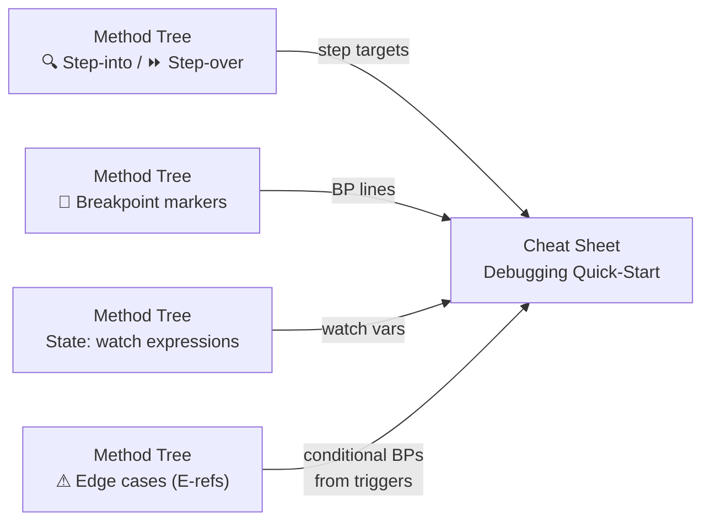
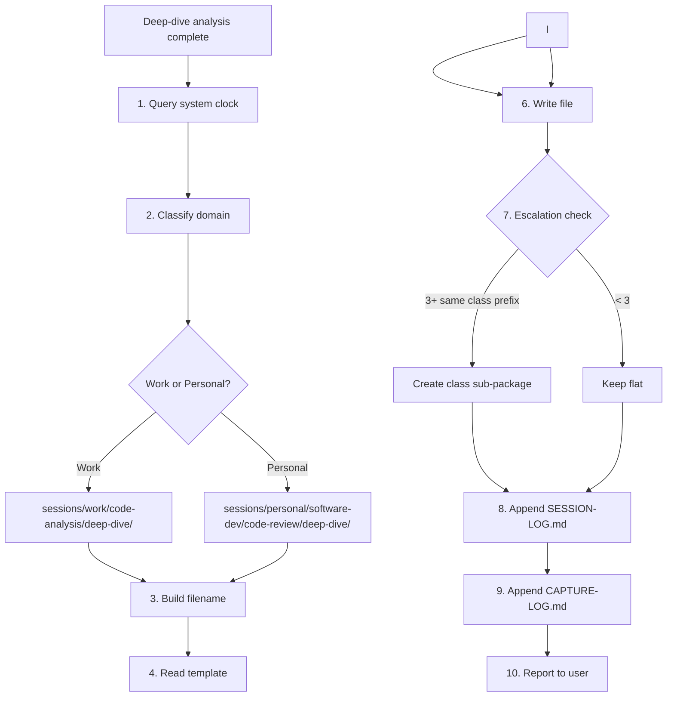

## Target

${input:target:What code do you want to deep-dive into? (e.g., OrderService.calculateTotal, PaymentGateway class, checkout flow)}

## Scope

${input:scope:What scope? (method — single method internals / class — full class analysis / feature — cross-class flow)}

## Focus (optional)

${input:focus:What to emphasize? (all — complete analysis / internals — how it works / flow — call chain and data flow / state — how state evolves / leave blank for all)}

## Context (optional)

${input:context:Why are you deep-diving? (onboarding / pre-refactoring / code-review-prep / learning / debugging-prep / leave blank)}

## Instructions

Perform a **code analysis deep-dive** on the target code. The output is a **virtual
refactoring** — you decompose the code into extracted methods on paper, creating a
method tree that a developer reads like refactored code. No actual code changes are made.

The approach: **think like a developer doing extract-method refactoring**, but stop
at the thinking stage. The extracted methods exist only in the analysis document. Each
extracted method has a real Java signature, the actual source code verbatim, and inline
annotations for anything non-obvious. A developer reads the analysis top-down:

1. **Quick Scan** — what does this code do? (30 seconds)
2. **Refactored View** — the method rewritten as virtual extracted calls (the structure)
3. **Method Extraction Tree** — each extracted method in detail (the substance)
4. **Context & Cheat Sheet** — dependencies, coupling, debugging quick-start

> **This is a developer's annotated walkthrough, not an academic report.** The reader
> is a developer who reads Java fluently. The virtual method signatures and code are the
> documentation — prose is only for gotchas and things you cannot see in the source.

### ID System

Tag items for cross-referencing across sections:

| Tag | Section | Example | Purpose |
|---|---|---|---|
| **B*n*** | Method Tree | B1, B2, B3 | Extracted method / code block |
| **L*n*** | Method Tree | L42, L47 | Source file line number |
| **E*n*** | Method Tree | E1, E2, E3 | Edge case / error scenario |

### 1 — Quick Scan (30-Second Understanding)

Give a developer the complete picture in under 30 seconds:

```text
Purpose:      <one sentence — what does this code do in business terms?>
Responsibility: <what it IS responsible for — and what it is NOT>
Architecture:  <which layer: controller → service → repository → infra>
Pattern:      <Service, Strategy, Factory, Template Method, etc.>
Entry:        <who calls it, what triggers it>
Happy path:   <input → step → step → ... → output (one line)>
Key state:    <which fields/variables change during execution>
Danger:       <biggest unhandled edge case — E-ref>
Side-effects: <what changes outside this code — DB / queue / cache>
```

For multi-caller methods (called from 3+ distinct contexts), add a caller table:

| Caller | Context | Expected Behaviour | Error Handling |
|---|---|---|---|
| `OrderController` | HTTP — user-facing | Fast, throw on invalid | 400/500 mapped |
| `BatchProcessor` | Nightly batch — system | Tolerant, log & skip | Logged, continues |
| `EventHandler` | Async event — internal | Fire-and-forget | Silently retried |

### 2 — Refactored View (The Method as Virtual Extracted Calls)

This is the **single most important artefact** in the deep-dive. Show the original
method body rewritten as if every logical section had been extracted into a well-named
method. The developer reads this and understands the entire structure in under a minute.

**Rules:**

- Rewrite the method body using the virtual method names — one line per extracted call
- Each line has the B-ref, virtual call, and the source line range in a comment
- Data flows visibly through variable names between calls
- The refactored view MUST be compilable-looking Java (not pseudocode)
- Keep the original method's signature and control flow structure intact

**Example:**

```java
public Receipt processOrder(Order order) {
    Order validated   = validateAndGuardInputs(order);                  // B1: L30-45
    double subtotal   = calculateSubtotal(validated.getItems());        // B2: L46-58
    double discounted = applyDiscountRules(subtotal, order.getDiscount()); // B3: L59-68
    double taxed      = calculateTax(discounted, getTaxRate());         // B4: L69-78
    Receipt receipt   = buildReceipt(validated, subtotal, discounted, taxed); // B5: L79-95
    persistAndNotify(receipt);                                          // B6: L96-110
    return receipt;                                                     // L111
}
```

**What this gives the developer:**

- The **pipeline** is visible — data flows left to right through variable names
- Each virtual method name is an **intent-revealing summary** of what that code section does
- The **B-refs and line ranges** let them jump to the detailed breakdown
- The **structure** is immediately clear — validate → calculate → discount → tax → persist
- They know exactly which "method" to drill into for more detail

**Handling branches and loops** — when the method has if-else or loops, keep them in
the refactored view but extract the branch bodies:

```java
public double calculatePrice(Order order) {
    validateOrder(order);                                               // B1: L30-38
    double subtotal = calculateSubtotal(order.getItems());              // B2: L39-52
    double discount;
    if (order.isPremium()) {
        discount = applyPremiumDiscount(subtotal);                      // B3: L54-62
    } else if (order.getTotal() > 1000) {
        discount = applyBulkDiscount(subtotal);                         // B4: L63-70
    } else {
        discount = applyStandardDiscount(subtotal);                     // B5: L71-76
    }
    return applyTaxAndFinalize(discount, order.getTaxRate());           // B6: L77-85
}
```

**Handling nested complexity** — when an extracted method is itself complex (15+ lines,
nested logic), show it as its own refactored view in the Method Extraction Tree:

```java
// B3 is itself complex — its refactored view:
private double applyPremiumDiscount(double subtotal) {
    double loyaltyBonus = lookupLoyaltyBonus(customer);                 // B3a: L54-56
    double baseDiscount = calculateBaseDiscount(subtotal);              // B3b: L57-59
    return combineDiscounts(baseDiscount, loyaltyBonus);                // B3c: L60-62
}
```

This recursive extraction is key: the developer drills into B3 and sees it decomposed
into B3a, B3b, B3c — just like a real codebase where methods call other methods.

**For class scope:** show a refactored view per public method. For feature scope,
show the cross-class flow as a sequence of class.method() calls.

### 3 — Method Extraction Tree (The Core of the Deep-Dive)

This is the **bulk of the analysis** and the section the developer will use side-by-side
with the source code. For each virtual method from the Refactored View, show the real
code with inline annotations. Then recurse into sub-methods when a block is complex.

> **Think like you're building a call tree of extracted methods.** The Refactored View
> (Section 2) is the root. Each extracted method in Section 3 is a node. When a node is
> itself complex, it gets its own child nodes (sub-methods). The developer navigates this
> tree the same way they'd navigate a well-structured codebase: start at the top-level
> method, then drill into the methods it calls.

#### How to Split Code into Extracted Methods

Every block boundary should be a place where a senior developer would genuinely consider
extracting a method. Apply these tests:

**Extract-Method Fitness Test** — every proposed block must pass ALL THREE:

1. **Nameable** — can you give it a verb-noun method name? (`validateInputs`,
   `calculateSubtotal`, `persistResult`). If you can only name it "part of X" or
   "continuation of Y", the boundary is wrong — merge it with the adjacent block
2. **Self-contained** — can you define clear typed inputs (parameters) and a typed
   output (return value)? If the block needs 5+ parameters or its "output" is just
   "side-effect on ambient state", reconsider the boundary
3. **One reason to change** — would this code change for exactly one business reason?
   If half the block is validation and the other half is calculation, split them

**Where to look for natural split points** — the source code tells you where blocks
begin and end:

| Signal in source code | Block boundary type |
|---|---|
| **Blank line** left by the original developer | Intent separator — developer already thought in blocks |
| **Comment** describing "what comes next" | Phase marker — explicit block start |
| **New variable declaration** starting a new phase | Data-phase boundary — new data context begins |
| **Try-catch boundary** | Error-handling boundary — different concern |
| **If-else / switch branch** | Decision boundary — each branch is a candidate block |
| **Loop boundary** | Iteration boundary — setup / body / post-loop are separate blocks |
| **Return statement** | Exit boundary — everything before return is the "compute" block |
| **Method call on an injected dependency** | Delegation boundary — external call is its own concern |

#### Per-Method Template

For each extracted method (B*n*), provide:

```text
#### B1 — `Order validateAndGuardInputs(Order order)` (L30-45)
```

````java
// paste the ACTUAL source code verbatim — do not reformat
if (order == null) {                              // ← [B1.1] no null-check exists — NPE risk (E1)
    throw new IllegalArgumentException("order");
}
if (order.getItems().isEmpty()) {                 // ← [B1.2] empty ≠ null — returns valid but useless
    return order;                                 // ← early return: 0 items → 0.0 total (E2)
}
validator.validate(order);                        // ← [B1.3] delegates to Validator — 🔍 step-into
````

```text
📋 Behaviour:
  Guards the method entry. Three sequential checks: null → empty → domain rules.
  The validator (injected) enforces business constraints (stock availability,
  customer status) — it throws if any rule fails, so downstream code can assume
  a fully valid Order. No data structures are mutated; this is a pure gate.

← Receives: Order (may be null, unchecked) from caller
→ Produces: Order (validated, non-null, items present) → B2
⚠ E1: null order → NPE at L30 (unhandled) | E2: empty items → 0.0 total (handled, but confusing)
State: none mutated
🔍 Step-into: validator.validate() at L38 — worth tracing validation rules
🛑 Breakpoint: L30 — verify order is non-null on entry
```

**Template rules:**

| Element | Required? | Purpose |
|---|---|---|
| **Header** `#### Bn — virtual signature (lines)` | Always | Intent + contract in one line |
| **Code fence** with actual source + inline annotations | Always | The code — developer reads THIS |
| **📋 Behaviour** | Always | Abstraction: what's happening, data structures, algorithm, data flow |
| **← Receives / → Produces** | Always | Data flow between methods — typed contract |
| **⚠ Edge cases** | Only if present | E-refs with trigger + impact |
| **State** | Only if mutates | Variables/fields changed, lifecycle, thread-safety |
| **🔍 Step-into / 🛑 Breakpoint / 👁 Watch** | method scope | Debugging markers for key lines |

#### 📋 Behaviour — What to Write

The `📋 Behaviour` block is the **abstraction layer** between the raw code and the
data flow arrows. It answers: "What is this code doing at a conceptual level?" — not
what each line does, but what the method *achieves* and *how* in terms of:

1. **Data structures** — which collections, maps, or objects are read, built, or mutated?
   Name the concrete types: "Iterates over `List<LineItem>`, accumulates into a `double`"
   — not "processes the items"
2. **Algorithm / pattern** — what approach does the code use? "Stream reduce with identity
   0.0", "Two-pointer merge", "Builder pattern accumulation", "Guard-clause chain with
   early returns". Name the pattern when one exists
3. **Data flow within the method** — how does data transform step by step? "Takes the raw
   `items` list → filters out zero-quantity → maps each to `price × qty` → sums to
   `subtotal`". This is the pipeline the code implements, expressed at one level above
   the code itself
4. **Mutations and side-effects** — what changes? "Mutates `this.cache` (HashMap insert)",
   "Writes to DB via repository", "Publishes event to MQ — fire-and-forget, no rollback"
5. **Key invariant or contract** — what must be true after this method runs? "Output is
   always ≥ 0.0", "All items in the returned list have non-null IDs", "The order is
   persisted OR an exception has been thrown — never silent failure"

**Length:** 2-5 lines. Enough to give a developer the mental model without reading every
line of code. Not so long that it becomes the documentation it replaced.

**The rule:** A developer who reads ONLY the `📋 Behaviour` block should understand
what this extracted method does well enough to decide whether they need to read the
actual code. If they can skip the code and move to the next method, the behaviour
block did its job. If they must read every line to understand anything, the behaviour
block failed.

**Anti-patterns (don't write these):**

- ❌ "This method validates the order" — too vague, just restates the method name
- ❌ "Calls validator.validate() which checks business rules" — just restates the code
- ❌ A 10-line paragraph describing every conditional — that's the code's job

**Good examples:**

- ✅ "Guard-clause chain: null → empty → domain rules (via injected `Validator`). No
  mutations. Downstream code can assume a fully valid, non-null `Order` with items"
- ✅ "Stream pipeline over `List<LineItem>` → `mapToDouble(price × qty)` → `sum()`.
  Identity is 0.0 so empty list produces 0.0 (not null). Pure — no side-effects"
- ✅ "Builds a `Receipt` using the Builder pattern. Pulls subtotal, discount, and tax
  from locals computed by B2-B4. Writes `receiptId` into `this.lastReceiptId` (field
  mutation — not thread-safe). Publishes `OrderCompletedEvent` to MQ — fire-and-forget"

**Inline annotation rules:**

- Format: `// ← [B1.3] why this line matters`
- Only annotate lines where understanding would break if the developer skipped them
- Never annotate what the code literally does (`// adds 1 to count`) — only WHY it
  matters, WHAT it connects to, or WHAT goes wrong when it's wrong
- Reference E-tags for edge cases, other B-tags for cross-block dependencies
- Mark external calls: `🔌 DB read`, `⚡ async`, `✦ pure logic`

**Block continuity rule** — the output of B*n* must be consumable as input to B*n+1*.
If you can't describe what data passes between two adjacent methods, the split is wrong
or a method is missing. The `← Receives` / `→ Produces` arrows must form a complete
chain matching the Refactored View.

#### Nested Extraction (Methods Within Methods)

When an extracted method is itself complex (15+ lines, or contains nested loops/branches
with distinct concerns), decompose it further into sub-methods. Use nested B-IDs:

```text
#### B3 — `double applyPremiumDiscount(double subtotal)` (L54-62)
```

**Refactored view of B3:**

```java
private double applyPremiumDiscount(double subtotal) {
    double loyaltyBonus = lookupLoyaltyBonus(customer);                 // B3a: L54-56
    double baseDiscount = calculateBaseDiscount(subtotal);              // B3b: L57-59
    return combineDiscounts(baseDiscount, loyaltyBonus);                // B3c: L60-62
}
```

Then provide per-method detail for B3a, B3b, B3c at a deeper heading level (`#####`).
This creates a readable tree structure:

```text
### 3 — Method Extraction Tree
  #### B1 — validateAndGuardInputs (L30-45)
  #### B2 — calculateSubtotal (L46-58)
  #### B3 — applyPremiumDiscount (L54-62)         ← complex, decomposed further
    ##### B3a — lookupLoyaltyBonus (L54-56)
    ##### B3b — calculateBaseDiscount (L57-59)
    ##### B3c — combineDiscounts (L60-62)
  #### B4 — calculateTax (L69-78)
  #### B5 — buildReceipt (L79-95)
  #### B6 — persistAndNotify (L96-110)
```

**Nest when:**

- A block has 15+ lines with distinct inner phases
- A block contains a loop body with branching (the loop body is a sub-method)
- A block delegates to 2+ meaningful private method calls (each is a sub-method)
- A block has try-catch where the try body and catch body are separate concerns

**Don't nest when:**

- A block is a straight-line sequence of 10-15 lines doing one thing
- The inner logic is a single expression (even if complex, like a stream pipeline)
- Nesting would create sub-methods with only 2-3 lines each

#### Completeness Rules

- **Every line of the target code must appear in at least one method's code fence.**
  The methods together reconstruct the full source. No gaps
- **Don't skip code** — a developer scrolling through the source file must find every
  single line explained somewhere in the tree
- Aim for **3-8 methods per level** — fewer for simple targets, more for complex ones

#### Handling Complex Code Patterns

##### God Classes (10+ responsibilities, 500+ lines)

1. **Responsibility inventory first** — before the method tree, group methods by
   responsibility and show the virtual class each group WOULD belong to:

   ```text
   ## Responsibility Inventory — OrderService (847 lines, 23 methods)

   | # | Responsibility | Virtual Class | Methods | Lines |
   |---|---|---|---|---|
   | R1 | Input validation | `OrderValidator` | validateOrder, checkStock | L30-120 |
   | R2 | Price calculation | `PriceCalculator` | calculateTotal, applyDiscount | L121-280 |
   | R3 | Persistence | `OrderRepository` | saveOrder, updateStatus | L281-390 |
   | R4 | Notification | `OrderNotifier` | notifyCustomer, publishEvent | L391-450 |
   ```

2. **Deep-dive one responsibility at a time** — each responsibility group gets its own
   Refactored View and Method Extraction Tree
3. **Cross-responsibility data flow** — show how data passes between groups (R1 → R2 → R3)

##### Very Long Methods (100+ lines)

1. **Two-pass extraction:**
   - **Pass 1 — Coarse methods** (5-8 methods covering the full method at region level)
   - **Pass 2 — Fine methods** (each coarse method decomposed into 2-4 sub-methods)
2. **Branch maps for deep nesting** — if the method has 3+ levels of nesting, draw
   an ASCII map showing which block handles each branch:

   ```text
   L42  if (isValid)
   L43  ├─ for (item : items)           → B3 (processItems)
   L44  │  ├─ if (item.isSpecial())     → B3a (handleSpecialItem)
   L50  │  │  └─ try { ... }            → B3b (lookupSpecialPrice)
   L55  │  └─ else                      → B3c (calculateStandardPrice)
   L60  └─ else                         → B2 (handleValidationFailure)
   ```

3. **Decision tree for complex conditionals** — when there are 3+ branches:

   ```text
   L42: if (order.type == PREMIUM)
        ├─ YES → B3 (applyPremiumDiscount) — 15% discount cap
        └─ NO → L48: if (order.total > 1000)
                 ├─ YES → B4 (applyBulkDiscount) — tiered rates
                 └─ NO → L52: if (customer.isLoyal())
                          ├─ YES → B5 (applyLoyaltyDiscount) — 5% flat
                          └─ NO → B6 (noDiscount)
   ```

##### Deeply Nested / Tangled Logic

Flatten-and-label the blocks even though the code is nested:

```text
B1 — validateInputs (L30-35)              [nesting: 0]
B2 — setupItemLoop (L36-38)               [nesting: 1]
B3 — handleSpecialItem (L39-52)           [nesting: 2, inside B2 loop]
B4 — calculateStandardPrice (L53-58)      [nesting: 2, inside B2 loop]
B5 — accumulateLoopResult (L59-62)        [nesting: 1, end of B2 loop]
B6 — aggregateAndReturn (L63-70)          [nesting: 0]
```

Each block's code snippet should include 1-2 lines of surrounding context (the enclosing
`if`/`for`/`try`) so the developer can see where in the nesting this block lives.

### 4 — Dependencies & Coupling

**Outgoing dependencies (what this code needs):**

| Dependency | Type | Interface or Concrete? | Coupling | Used in Blocks | Testability Impact |
|---|---|---|---|---|---|
| `OrderRepository` | Injected | Interface | Loose | B4, B5 | Easy to mock |
| `DiscountService` | Injected | Concrete class | Tight | B3 | Must mock concrete — fragile |
| `TaxCalculator` | Static call | Static method | Very tight | B4 | Cannot mock without PowerMock |

**Incoming dependencies (what needs this code):**

| Dependent | How It Uses This Code | Frequency | Breakage Risk |
|---|---|---|---|
| `OrderController` | Calls `processOrder()` | Per HTTP request | High — controller has no fallback |
| `BatchProcessor` | Calls in loop | Scheduled nightly | Medium — has retry logic |

**Coupling verdict:** How easy is it to change this code without breaking callers?
Rate as: isolated / manageable / tangled / dangerous.

### 4b — Key Takeaways & Developer Cheat Sheet

Summarise everything for quick future reference:

**In 5 bullet points:**

- What this code does (one sentence)
- The most important design decision and why
- The biggest risk/edge case to watch for
- The key dependency to understand
- What to deep-dive next if you want to go deeper

**Developer cheat sheet** (copy-pasteable quick-reference):

```text
Purpose:     <one-liner from Quick Scan>
Entry:       <who calls it, when — from Quick Scan entry points>
Happy path:  <B1 → B2 → B3 → ... → output — from Refactored View>
Error path:  <E1, E3 unhandled — from Method Tree edge cases>
Key blocks:  <B2 (calculateSubtotal), B3 (applyDiscount) — from Method Tree>
Thread-safe: yes / no / partially — <reference E4 if applicable>
Testable:    easy / moderate / hard — because <reference Dependencies verdict>
```

**Debugging quick-start** (when opening the debugger for this code):

```text
Breakpoints:
  L42  — entry guard (verify order is non-null and valid)
  L51  — after discount applied (verify total is positive)
  L60  — field mutation (watch lastProcessedId)

Watch expressions:
  order, order.getItems().size(), total, discount, this.lastProcessedId

Conditional breakpoints:
  L51: discount > 1.0        — catches E3 (negative total)
  L42: order == null          — catches E1 (null input)

Step-into targets (worth tracing):
  validator.validate() — verify validation rules
  this.transform()    — core logic, worth tracing line-by-line

Step-over (trust these):
  Controller.handle()  — thin wrapper
  EventBus.publish()   — async fire-and-forget
```

The cheat sheet references B/L/E IDs so a developer can drill into any detail.
The debugging quick-start is derived from the Method Extraction Tree (step-into/over
markers, breakpoint markers, watch expressions, edge case triggers).

**Debugging quick-start derivation flow:**



### Output Rules

- **Scope-adaptive:** For `method` scope, all 4 phases apply (Quick Scan → Refactored
  View → Method Extraction Tree → Context & Cheat Sheet). For `class`, show Quick Scan,
  Refactored View per public method, Method Tree for complex methods, and Dependencies.
  For `feature`, show Quick Scan, cross-class Refactored View, and cross-class flow
- **Code-first:** Always show actual source code in fenced blocks — never describe code
  without showing it. A developer should be able to read ONLY this document and
  reconstruct the mental model of the code completely
- **Side-by-side design:** Line ranges (L*n*) in every method MUST match the actual source
  file. A developer with the source open on the left and this doc on the right should be
  able to locate any extracted method's code instantly by line number
- **Type-precise:** Always include types in virtual method signatures and data flow arrows
- **Honest:** If something is unclear, surprising, or looks like a bug, say so directly
- **No refactoring in the analysis** — the virtual method signatures and extraction tree
  are for understanding, NOT a refactoring proposal. The code stays exactly as-is. If you
  see a genuine extract-method opportunity, note it in the Cheat Sheet takeaways, but
  do NOT reorganise or rewrite the actual code in the analysis
- **Completeness over brevity** — every line of the target code must appear in at least
  one method's code fence in the Method Extraction Tree. No gaps. The methods together
  reconstruct the full source
- **Cross-reference coherence** — every B-ref in the Refactored View must have a
  corresponding section in the Method Tree. Every E-ref in an edge case annotation must
  name its method and line. The `← Receives` / `→ Produces` arrows must chain correctly
  through the entire Refactored View
- **No analysis dump** — every annotation must tell the developer something they cannot
  see by reading the source code alone. If an annotation just restates what the code
  literally does (`"this line adds the price to the total"` for `total += price`),
  remove it. Focus on: hidden contracts, implicit assumptions, data flow between methods,
  edge cases, and the "why" behind non-obvious choices. A developer who reads Java
  fluently does not need a prose translation of their code
- End with one "what to deep-dive next" recommendation

#### Complexity-Adaptive Thresholds

The depth of analysis scales with the complexity of the target code:

| Target | Method Tree | Nested Extraction | Multi-Caller Table | Responsibility Inventory |
|---|---|---|---|---|
| Method ≤ 30 lines | 3-5 methods | No | If 3+ callers | N/A |
| Method 30-100 lines | 5-8 methods | If nested 3+ levels | If 3+ callers | N/A |
| Method 100+ lines | 8-15 methods (two-pass) | **Mandatory** | If 3+ callers | N/A |
| Method 200+ lines | 12-20 methods (two-pass) | **Mandatory** | If 3+ callers | N/A |
| Class ≤ 5 methods | Per-method extraction | No | Per method if applicable | No |
| Class 5-10 methods | Per-method extraction | For complex methods | Per method if applicable | Recommended |
| God class (10+ methods or 500+ lines) | Per-responsibility then per-method | **Mandatory** for complex methods | **Mandatory** | **Mandatory** |

**Scaling rules:**

- Method > 50 lines → Method Extraction Tree with full per-method detail is mandatory
- Method > 100 lines → two-pass extraction (coarse + fine) is mandatory
- Method > 200 lines → inline annotations must cover 30+ key lines across all methods
- Class > 5 public methods → Refactored View + Method Tree for EACH significant method
  (skip trivial getters/setters/toString)
- Class > 10 public methods or > 500 lines → responsibility inventory is mandatory
  before method-level analysis
- Method called from 3+ distinct callers → caller context table in Quick Scan is mandatory
- Nesting depth 3+ levels → branch map / decision tree is mandatory in Method Tree

### Session Capture — Auto-Save to Brain

After completing the deep-dive analysis, you **MUST** capture the full output as
a session file by **actually creating the file** using the `create_file` tool. This is
not optional — every deep-dive produces a permanent reference document. Do NOT just
show the analysis in chat and skip the file creation.

#### Workspace Resolution

The session file must be written to the `brain/ai-brain/sessions/` directory in the
**workspace where the analysed code lives** — NOT necessarily this (learning-assistant)
repository. Resolve the brain path as follows:

1. **Identify the workspace root** — the root of the VS Code workspace or git repo
   containing the target code (check `git rev-parse --show-toplevel` if unsure)
2. **Find the brain directory** — look for `brain/ai-brain/sessions/` under that
   workspace root. If it does not exist, create the required directory structure:
   `brain/ai-brain/sessions/work/code-analysis/deep-dive/`
3. **Use absolute paths** — when calling `create_file`, always use the full absolute
   path (e.g., `E:\mgcnoscan\iesd-26\brain\ai-brain\sessions\work\code-analysis\deep-dive\<filename>.md`)
4. **Environment variable override** — if `BRAIN_PATH` is set, use that instead of
   the default `brain/ai-brain` relative path

#### Capture Workflow



#### Step-by-Step Protocol

1. **Get the actual current timestamp** — run this command in the terminal (do NOT guess):

   ```powershell
   Get-Date -Format "yyyy-MM-dd_hh-mmtt_hh:mm tt"
   ```

   Parse the output to extract:
   - `yyyy-MM-dd` → frontmatter `date` field (e.g., `2026-04-20`)
   - `hh-mmtt` → filename timestamp segment, lowercase (e.g., `09-21pm`)
   - `hh:mm tt` → frontmatter `time` field, quoted (e.g., `"09:21 PM"`)

   **You MUST run this command.** Never guess, round, or use a placeholder.

2. **Resolve the workspace root** — identify where the analysed code lives:

   ```powershell
   git rev-parse --show-toplevel
   ```

   This gives you the workspace root (e.g., `E:/mgcnoscan/iesd-26`). The brain
   session path is `<workspace-root>/brain/ai-brain/sessions/`.

3. **Determine the domain** from the code being analysed:
   - Code in a work project → `work`
   - Code in a personal/side project → `personal`

4. **Build the absolute file path** — deep-dive sessions go to a **permanent
   `deep-dive/` sub-folder** (not subject to de-escalation):
   - Work: `<workspace-root>/brain/ai-brain/sessions/work/code-analysis/deep-dive/`
   - Personal: `<workspace-root>/brain/ai-brain/sessions/personal/software-dev/code-review/deep-dive/`
   - If a class sub-package already exists (e.g., `deep-dive/order-service/`), place
     the file inside it
   - **If the directory does not exist, create it** (the `create_file` tool creates
     parent directories automatically)

5. **Build the filename** following the naming convention. Files inside `deep-dive/`
   carry rich descriptive metadata because the category is implied by the folder path:

   ```text
   # Naming formula for deep-dive/ (no category prefix — implied by folder)
   <date>_<time>_<subject-slug>.md

   Subject slug composition (order matters — most identifying first):
     <class-kebab>-<method-kebab>[-<focus>][-<context>]

   Segment reference:
     <class-kebab>   — mandatory: kebab-case class name (OrderService → order-service)
     <method-kebab>  — optional: kebab-case method name (calculateTotal → calculate-total)
                       omit for class-level, use "overview" instead
     <focus>         — optional: what aspect was emphasised (internals / flow / state)
                       omit when focus = all (the default)
     <context>       — optional: why the deep-dive was done (onboarding / pre-refactoring)
                       omit when context is general learning
   ```

   **Filename examples by scope:**

   | Scope | Target | Focus | Context | Filename |
   |---|---|---|---|---|
   | method | `OrderService.calculateTotal` | all | — | `2026-04-20_09-21pm_order-service-calculate-total.md` |
   | method | `PaymentGateway.charge` | flow | debugging | `2026-04-20_03-45pm_payment-gateway-charge-flow-debugging.md` |
   | class | `OrderService` | all | onboarding | `2026-04-20_11-00am_order-service-overview-onboarding.md` |
   | class | `ConfigLoader` | internals | — | `2026-04-20_02-30pm_config-loader-overview-internals.md` |
   | feature | checkout flow | flow | — | `2026-04-20_04-00pm_checkout-flow.md` |

   **Inside a class sub-package** (`deep-dive/order-service/`):

   | Target | Filename (no class prefix — implied by folder) |
   |---|---|
   | `OrderService.calculateTotal` | `2026-04-20_09-21pm_calculate-total.md` |
   | `OrderService.validateOrder` | `2026-04-20_03-45pm_validate-order-flow.md` |
   | `OrderService` class overview | `2026-04-20_11-00am_overview-onboarding.md` |

6. **Check for existing versions** — list the target directory to check if a file
   with the same class+method subject already exists:
   - If found → create a versioned continuation: append `_v2`, `_v3`, etc.
   - Set `version: 2` and `parent: <original-filename>` in frontmatter

7. **Build the file content** using the template structure from
   `brain/ai-brain/sessions/_templates/code-analysis-deep-dive-capture.md`:

   **Frontmatter** — fill every field:

   ```yaml
   date: 2026-04-20
   time: "09:21 PM"
   kind: session-capture
   domain: work
   category: code-analysis
   project: learning-assistant
   subject: order-service-calculate-total
   tags: [project:learning-assistant, deep-dive, code-analysis, java, order-service]
   status: draft
   version: 1
   parent: null
   complexity: high
   outcomes:
     - "Mapped data flow: price × quantity → discount → tax → total"
     - "Identified missing null-check on discount parameter"
   source: copilot
   scope: project
   scope-project: learning-assistant
   scope-feature: null
   scope-transitions: []
   scope-refs: []
   code-target:
     class: OrderService
     method: calculateTotal
     package: com.example.order
     file: src/order/OrderService.java
   deep-dive:
     level: method
     focus: all
   ```

   **Body** — populate all 4 phases (Quick Scan, Refactored View, Method Extraction
   Tree, Context & Cheat Sheet) from the deep-dive analysis output above.
   Every section must contain real, substantive content — not placeholder text.
   The Method Extraction Tree must reconstruct the full method across all extracted methods.

8. **WRITE THE FILE** — use the `create_file` tool with the **absolute path** from
   step 4 + filename from step 5. The file content is the frontmatter + all 4 phases.
   This step is **mandatory** — do NOT skip it or defer it.

   Example path: `E:\mgcnoscan\iesd-26\brain\ai-brain\sessions\work\code-analysis\deep-dive\2026-04-20_09-21pm_order-service-calculate-total.md`

9. **Check escalation** — count session files in the target folder:
   - If **3+ files** share the same class prefix (e.g., `order-service-*`), create a
     class sub-package per Pattern 3a in chat-capture instructions
   - Move matching files into `<class-kebab>/` and truncate their names
     (drop class prefix — implied by folder)
   - If **2 files** and a multi-part deep-dive is planned, apply early escalation

10. **Append to SESSION-LOG.md** — use `replace_string_in_file` or `editFiles` to
    append a row to `<workspace-root>/brain/ai-brain/sessions/SESSION-LOG.md`
    (create the file with headers if it doesn't exist):

   ```markdown
   | 2026-04-20 | 09:21 PM | work | code-analysis | order-service-calculate-total | v1 | high | draft | [View](work/code-analysis/deep-dive/2026-04-20_09-21pm_order-service-calculate-total.md) |
   ```

11. **Append to CAPTURE-LOG.md** — log the capture operation in
    `<workspace-root>/brain/ai-brain/sessions/CAPTURE-LOG.md`
    (create the file with headers if it doesn't exist):

    ```markdown
    | 2026-04-20 | 09:21 PM | capture | Deep-dive: OrderService.calculateTotal (method, all) → work/code-analysis/deep-dive/ | 1 file created |
    ```

    If escalation was triggered, log that as a separate row:

    ```markdown
    | 2026-04-20 | 09:22 PM | escalation:pattern-3a | Created order-service/ sub-package in deep-dive/ (3+ class files) | N files moved |
    ```

12. **Report** — tell the user: "Deep-dive captured to `<absolute-path>`"
    Include the full path so the user can open the file directly.

#### Content Quality Rules

- **Method Extraction Tree** must be thorough — split every non-trivial method
  into 3-8 extracted methods with actual code snippets and inline annotations. This is
  the most valuable section for a developer reading the file later.
- **Quick Scan** must be immediately understandable — a developer should get the full
  picture in 30 seconds by reading just this section.
- **Inline annotations** should cover key decision lines, not boilerplate.
- The file must be **self-contained** — a developer who has never seen this code should
  be able to understand it fully by reading only this file.
- Include actual code blocks (not just descriptions) in the Refactored View and Method Tree.
