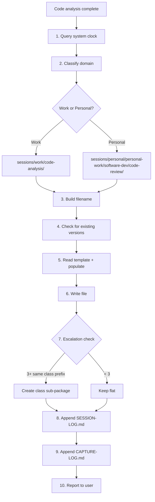

## Target

${input:target:What code to analyse? (e.g., OrderService, PaymentGateway.processPayment, checkout flow)}

## Goal

${input:goal:What's the goal? (review — find issues / understand — learn the code / refactor — plan changes / patterns — identify design patterns)}

## Level

${input:level:Depth? (quick — high-level overview / standard — structure + findings / thorough — full analysis with recommendations)}

## Instructions

Perform a **code analysis** on the target code. Adapt depth based on the level selected.

### Analysis Structure

#### 1. Target Summary

| Property | Value |
|---|---|
| Class | `ClassName` |
| Method | `methodName` (or "class-level") |
| Package | `package.path` |
| File | `src/path/to/File.java` |
| Purpose | One-sentence description |

#### 2. Code Structure Overview

- How the code is organized (classes, methods, inheritance, interfaces)
- Key dependencies (what it uses, what uses it)
- Design patterns in play (Service, Repository, Strategy, Factory, etc.)
- Responsibility assessment — does it do one thing well, or too many?

#### 3. Code Block Breakdown

Split the code into **functional blocks by cohesion**. For each block:

- **Name** — descriptive label for what this block does
- **Lines** — line range in the source file
- **Code** — show the actual code snippet
- **Purpose** — what this block accomplishes
- **Connection** — how it relates to the blocks before/after it

Aim for 3-8 blocks per method. This is the most valuable section — be thorough.

#### 4. Findings Table

| # | Finding | Severity | Category | Line(s) |
|---|---|---|---|---|
| 1 | Description | high/medium/low | smell/bug/pattern/performance/security | L42-45 |

**Categories:**

- `smell` — code smell (long method, god class, feature envy, etc.)
- `bug` — actual or potential bug
- `pattern` — design pattern observation (good or misused)
- `performance` — performance concern
- `security` — security issue (injection, validation, auth)

#### 5. Proposed Changes (if goal is review or refactor)

For each finding, suggest a concrete improvement:

| # | Finding | Proposed Change | Impact | Effort |
|---|---|---|---|---|
| 1 | Ref to finding | What to do | high/medium/low | small/medium/large |

#### 6. Key Takeaways

- 3-5 bullet points summarizing the analysis
- Overall quality assessment (good/needs-work/concerning)
- One recommended next action

### Level Adaptation

| Level | Sections | Depth |
|---|---|---|
| `quick` | 1, 2, 6 | Overview only — skip block breakdown and findings |
| `standard` | 1, 2, 3, 4, 6 | Full structure + findings, skip proposals |
| `thorough` | All (1-6) | Complete analysis with proposals |

### Output Rules

- Show actual code blocks — not just descriptions
- Include line numbers when referencing specific code
- Be honest — if the code is good, say so; if it has problems, be direct
- For `understand` goal, focus on explanation over criticism
- For `review` goal, focus on findings and severity
- For `refactor` goal, focus on proposals with effort estimates

### Session Capture — Auto-Save to Brain

After completing the analysis, **automatically capture** the full output as a session file.

#### Capture Workflow



#### Step-by-Step Protocol

1. **Get the actual current timestamp** — run this command in the terminal (do NOT guess):

   ```powershell
   Get-Date -Format "yyyy-MM-dd_hh-mmtt_hh:mm tt"
   ```

   Parse the output to extract:
   - `yyyy-MM-dd` → frontmatter `date` field (e.g., `2026-04-20`)
   - `hh-mmtt` → filename timestamp segment, lowercase (e.g., `09-21pm`)
   - `hh:mm tt` → frontmatter `time` field, quoted (e.g., `"09:21 PM"`)

   **You MUST run this command.** Never guess, round, or use a placeholder.

2. **Resolve the workspace root** — identify where the analysed code lives:

   ```powershell
   git rev-parse --show-toplevel
   ```

   This gives you the workspace root (e.g., `E:/mgcnoscan/iesd-26`). The brain
   session path is `<workspace-root>/brain/ai-brain/sessions/`.

3. **Determine the domain** from the code being analysed:
   - Code in a work project → `work`
   - Code in a personal/side project → `personal`

4. **Build the absolute file path:**
   - Work: `<workspace-root>/brain/ai-brain/sessions/work/code-analysis/`
   - Personal: `<workspace-root>/brain/ai-brain/sessions/personal/personal-work/software-dev/code-review/`
   - If a class sub-package already exists (e.g., `code-analysis/order-service/`),
     place the file inside it
   - **If the directory does not exist, create it** (the `create_file` tool creates
     parent directories automatically)

5. **Build the filename** following the naming convention. Files at the top level of
   `code-analysis/` include the category prefix; files inside sub-packages drop it:

   ```text
   # At top level (flat — includes category prefix)
   <date>_<time>_code-analysis_<subject-slug>.md

   Subject slug composition (order matters — most identifying first):
     <class-kebab>-<method-kebab>[-<goal>]

   Segment reference:
     <class-kebab>   — mandatory: kebab-case class name (OrderService → order-service)
     <method-kebab>  — optional: kebab-case method name (calculateTotal → calculate-total)
                       omit for class-level, use "overview" instead
     <goal>          — optional: what goal was used (review / refactor / patterns)
                       omit when goal = understand (the default)

   # Inside a class sub-package (drop category + class prefix — both implied)
   <date>_<time>_<method-kebab>[-<goal>].md
   ```

   **Filename examples:**

   | Level | Target | Goal | Flat Filename |
   |---|---|---|---|
   | method | `OrderService.calculateTotal` | review | `2026-04-20_09-21pm_code-analysis_order-service-calculate-total-review.md` |
   | method | `PaymentGateway.charge` | understand | `2026-04-20_03-45pm_code-analysis_payment-gateway-charge.md` |
   | class | `OrderService` | refactor | `2026-04-20_11-00am_code-analysis_order-service-overview-refactor.md` |
   | class | `ConfigLoader` | patterns | `2026-04-20_02-30pm_code-analysis_config-loader-overview-patterns.md` |

   **Inside a class sub-package** (`code-analysis/order-service/`):

   | Target | Filename (no category + class prefix) |
   |---|---|
   | `OrderService.calculateTotal` review | `2026-04-20_09-21pm_calculate-total-review.md` |
   | `OrderService.validateOrder` | `2026-04-20_03-45pm_validate-order.md` |
   | `OrderService` overview | `2026-04-20_11-00am_overview-refactor.md` |

6. **Check for existing versions** — list the target directory to check if a file
   with the same class+method subject already exists:
   - If found → create a versioned continuation: append `_v2`, `_v3`, etc.
   - Set `version: 2` and `parent: <original-filename>` in frontmatter

7. **Build the file content** using the template structure from
   `brain/ai-brain/sessions/_templates/code-analysis-capture.md`:

   **Frontmatter** — fill every field:

   ```yaml
   date: 2026-04-20
   time: "09:21 PM"
   kind: session-capture
   domain: work
   category: code-analysis
   project: learning-assistant
   subject: order-service-calculate-total-review
   tags: [project:learning-assistant, code-analysis, review, java, order-service]
   status: draft
   version: 1
   parent: null
   complexity: medium
   outcomes:
     - "Identified 3 code smells in calculateTotal (long method, feature envy, magic number)"
     - "Proposed extract-method refactoring for discount logic"
   source: copilot
   scope: project
   scope-project: learning-assistant
   scope-feature: null
   scope-transitions: []
   scope-refs: []
   code-target:
     class: OrderService
     method: calculateTotal
     package: com.example.order
     file: src/order/OrderService.java
   ```

   **Body** — populate Target Code, Intent & Purpose, Analysis (Structure + Findings +
   Proposed Changes), Key Outcomes, Follow-Up, and Session Metadata from the analysis
   output above. Every section must contain real, substantive content.

8. **WRITE THE FILE** — use the `create_file` tool with the **absolute path** from
   step 4 + filename from step 5. The file content is the frontmatter + all sections.
   This step is **mandatory** — do NOT skip it or defer it.

   Example path: `E:\mgcnoscan\iesd-26\brain\ai-brain\sessions\work\code-analysis\2026-04-20_09-21pm_code-analysis_order-service-calculate-total-review.md`

9. **Check escalation** — count session files in the target folder (excluding deep-dive/):
   - If **3+ files** share the same class prefix (e.g., `code-analysis_order-service-*`),
     create a class sub-package per Pattern 3a in chat-capture instructions
   - Move matching files into `<class-kebab>/` and truncate names (drop
     `code-analysis_<class-kebab>-` prefix — implied by folder path)
   - If **2 files** and more analysis is planned, consider early escalation

10. **Append to SESSION-LOG.md** — use `replace_string_in_file` or `editFiles` to
    append a row to `<workspace-root>/brain/ai-brain/sessions/SESSION-LOG.md`
    (create the file with headers if it doesn't exist):

   ```markdown
   | 2026-04-20 | 09:21 PM | work | code-analysis | order-service-calculate-total-review | v1 | medium | draft | [View](work/code-analysis/2026-04-20_09-21pm_code-analysis_order-service-calculate-total-review.md) |
   ```

11. **Append to CAPTURE-LOG.md** — log the capture operation in
    `<workspace-root>/brain/ai-brain/sessions/CAPTURE-LOG.md`
    (create the file with headers if it doesn't exist):

    ```markdown
    | 2026-04-20 | 09:21 PM | capture | Code analysis: OrderService.calculateTotal (review, thorough) → work/code-analysis/ | 1 file created |
    ```

    If escalation was triggered, log separately:

    ```markdown
    | 2026-04-20 | 09:22 PM | escalation:pattern-3a | Created order-service/ sub-package (3+ class files) | N files moved |
    ```

12. **Report** — tell the user: "Analysis captured to `<absolute-path>`"
    Include the full path so the user can open the file directly.

#### Content Quality Rules

- **Code Block Breakdown** must include actual code snippets — a developer reading
  the file should see the code alongside the explanation
- **Findings Table** must be actionable — each finding has severity and category
- The file must be **self-contained** — readable without opening the source code
- High-level overview should be understandable in 30 seconds
