# /migrate-skill — Skills Modularization Workflow

## Input

${input:skill:Which skill to migrate? (name or 'pick' to auto-select the simplest pending one):pick}

---

## Context

- **Staging folder:** `.github/skills/_modular/`
- **Legacy folder:** `.github/skills/<category>/<skill-name>/`
- **Migration tracker:** `.github/skills/_modular/README.md`
- **Prompt backlog:** `.github/skills/prompt-backlog/` — holds prompt-related items discovered during migration (migrated last)
- **Already migrated:** `java-build`, `java-debugging`, `package-manager` (new), `career-resources`
- **Delegation rule:** Skills requiring tool installs delegate to `package-manager`

### Scope Rules

- **All checks happen against `.github/skills/`** — the `_modular/` folder specifically
- **If content belongs in `.github/prompts/`** (workflow, slash command, not a knowledge skill):
  - Do NOT migrate it into `_modular/`
  - Instead, add a backlog entry to `.github/skills/prompt-backlog/` with the details
  - The `prompt-backlog/` folder is migrated **last**, after all skills are done
- **Never look at `.github/prompts/` for deduplication** — prompts and skills are different primitives

---

## Workflow Overview

```mermaid
flowchart TD
    A[Start] --> B[Step 1: Pick simplest pending skill]
    B --> C[Step 2: Understand & assess]
    C --> D{Step 3: Deduplication check<br/>against _modular/ only}
    D -->|No overlap| E{Step 4: Complexity check — SRP}
    D -->|Partial overlap| F[3a: ASK USER — merge or keep separate?]
    D -->|Full duplicate| G[3b: Skip migration — already covered]
    D -->|Wrong primitive| W[Route to prompt-backlog/]
    F -->|Merge| H[Merge into existing modular skill]
    F -->|Keep separate| E
    E -->|Single concern| I[Step 5: Clean & migrate]
    E -->|Multiple concerns| J[4a: Split into focused skills]
    J --> I
    I --> K{Step 6: Delegation check<br/>against _modular/ skills}
    K -->|Skill overlap| L[6a: ASK USER — delegate to existing skill?]
    K -->|Workflow content| X[6b: ASK USER — route to prompt-backlog?]
    K -->|Self-contained| M[Step 7: Iterative refinement]
    L -->|Delegate| N[Add skill reference, trim content]
    L -->|Keep| M
    X -->|Route| Y[Add to prompt-backlog/]
    X -->|Keep| M
    N --> M
    Y --> M
    M --> O[Step 8: User approves]
    O --> P[Step 9: Archive legacy to prompt-backlog/legacy-skills/ — after user confirmation]
    P --> Q[Done — update tracker]
    G --> Q
    W --> Q
    H --> P
```



---

## Workflow (execute step-by-step, pausing for user input at decision points)

### Step 1 — Pick the simplest pending skill

If `${input:skill}` = `pick`:

1. Read the migration tracker (`_modular/README.md`)
2. **Rank pending skills by simplicity** — prefer:
   - Single-file skills (no companion files)
   - Skills with fewer lines
   - Skills with narrow scope (one clear concern)
   - Defer complex/multi-file skills (`atlassian-tools`, `learning-resources-vault`) to later
3. Tell the user which skill you've picked, why it's simplest, and what you expect

If a specific skill is named:

- Locate it in the legacy folder structure

### Step 2 — Understand & assess

- Read the full legacy SKILL.md (and any companion files)
- Present a breakdown to the user:
  - What sections exist and their line counts
  - What each section provides
  - Initial assessment: keep / trim / remove / split / delegate

**Pause here.** Wait for the user to confirm or adjust the plan.

### Step 3 — Deduplication check (no duplicates allowed)

**Read the existing `_modular/` skills** — scan each `SKILL.md` in `.github/skills/_modular/` for content overlap.

> **Important:** Only check against skills in `_modular/`. Do NOT check against `.github/prompts/`.
> If the legacy content is actually a workflow/prompt (not knowledge), route it to `prompt-backlog/` instead.

Check for:

- **Full duplicate** — the legacy skill's content is already fully covered by an existing modular skill → skip migration, mark as "covered by `<existing-skill>`" in tracker
- **Partial overlap** — some sections/features of the legacy skill overlap with an existing modular skill
- **No overlap** — the skill is entirely new content
- **Wrong primitive** — the content is actually a prompt/workflow, not a skill → route to `prompt-backlog/`

#### 3a — Partial overlap detected (user-driven decision)

**ASK THE USER** before proceeding:

> "I found overlap between `<legacy-skill>` and the existing `<modular-skill>`:
>
> - Overlapping sections: [list them]
> - Unique to legacy: [list them]
> - Unique to existing: [list them]
>
> Options:
> 1. **Merge** — fold the unique parts of `<legacy-skill>` into `<modular-skill>`
> 2. **Keep separate** — migrate as a distinct skill (removing only the duplicated content)
> 3. **Discard** — the overlap is sufficient; don't migrate
>
> Which approach?"

**Wait for user response.** Do not proceed without explicit direction.

#### 3b — Full duplicate detected

Inform the user and propose skipping. Update the tracker with a note.

### Step 4 — Complexity check (SRP — Single Responsibility Principle)

Evaluate whether the skill covers **one concern or multiple**:

| Signal | Action |
|---|---|
| Single coherent domain | Proceed to Step 5 as-is |
| Two distinct domains bundled together | Propose splitting into 2 skills |
| Three or more concerns | Propose splitting into N focused skills |
| One primary concern + minor tangent | Trim the tangent, keep as one skill |

#### 4a — Split proposal (user-driven)

**ASK THE USER** before splitting:

> "This skill covers multiple concerns that violate SRP:
>
> - Concern A: [description] (~N lines)
> - Concern B: [description] (~N lines)
>
> I recommend splitting into:
> 1. `<skill-a>` — focused on [A]
> 2. `<skill-b>` — focused on [B]
>
> Agree with the split? Or keep as one?"

**Wait for user response.**

### Step 5 — Clean & migrate

Based on user direction:

1. **Copy** the skill folder to `_modular/<skill-name>/`
2. **Trim** — remove content that is:
   - Trivial (things Copilot already knows without being told)
   - Stale (hardcoded versions, dates, counts that go out of date)
   - Generic (knowledge not specific enough to need injection)
   - Meta/filler ("How to use this skill", learning paths unless requested)
   - Duplicated by an existing modular skill (refer to it via delegation instead)
3. **Standardize** frontmatter:
   - `name`: kebab-case skill name
   - `description`: clear activation triggers + delegation note if applicable
4. **Add delegation** if the skill requires tool installations: add `Delegates to: package-manager` in description

### Step 6 — Delegation check (reuse existing skills)

Scan existing `_modular/` skills for delegation opportunities:

- Does an existing modular skill already handle part of this skill's content?
- Can sections be replaced with "see `<skill-name>`" references?
- If a section is actually a **workflow** (step-by-step procedure, slash command logic):
  - It does NOT belong in a skill — add it to `.github/skills/prompt-backlog/` instead
  - Trim it from the skill being migrated

#### 6a — Delegation to existing skill (user-driven)

**ASK THE USER:**

> "Part of this skill's content (`[section]`) is already handled by:
> - Skill: `<existing-skill>` — [what it covers]
>
> Options:
> 1. **Delegate** — replace that section with a reference to `<existing-skill>`
> 2. **Keep inline** — keep the content in this skill (slight duplication is OK)
>
> Which approach?"

**Wait for user response.**

#### 6b — Workflow content detected (route to prompt-backlog)

**ASK THE USER:**

> "This section (`[section]`) looks like a workflow/procedure, not knowledge:
> - [describe what it does]
>
> Options:
> 1. **Route to prompt-backlog** — add entry to `.github/skills/prompt-backlog/` for later prompt creation
> 2. **Keep in skill** — it's reference knowledge, not a workflow
>
> Which approach?"

**Wait for user response.**

If routed to prompt-backlog, create a file in `.github/skills/prompt-backlog/` named
`<skill-name>-<section>.md` with:
- What the workflow does
- Which legacy skill it came from
- Suggested prompt name and structure

### Step 7 — Iterative refinement

After presenting the cleaned version:

- Ask if the user wants further changes
- Apply any additional trims, splits, or restructuring
- Repeat until the user says "done" or "approve"

### Step 8 — User approval gate

Present the final version with a summary:

- Lines before → lines after (% reduction)
- Sections kept / trimmed / removed / delegated
- Any new skills created (from splits)

**Explicitly ask:** "Ready to archive the legacy skill to `prompt-backlog/legacy-skills/` and finalize?"

### Step 9 — Archive legacy & finalize (requires explicit user approval)

**Only after the user explicitly approves:**

#### 9a — Trim the legacy file before archiving

Before moving the file, **edit it in place** to remove content already covered by the
modular skill. The archived file should contain only the residue — the content that was
NOT migrated — so that the prompt-backlog migration pass has a focused, clean file to
work from.

**What to KEEP in the archived file:**

| Keep if... | Examples |
|---|---|
| Routed to `prompt-backlog/` as a workflow | 3-tier learning path, setup procedures, automation scripts |
| Content that was deliberately deferred | PR-link handling, tier-based UX guides |
| Supplementary sections with no modular home | Git aliases, shell one-liners, resource lists |
| Prompt-backlog entry already references it | Anything documented in `prompt-backlog/<skill>-*.md` |

**What to STRIP from the archived file:**

| Strip if... | Examples |
|---|---|
| Already fully migrated to `_modular/` | Core reference tables, commands, patterns now in modular skill |
| Generic knowledge Copilot already knows | Basic command explanations, obvious syntax |
| Duplicated by an existing modular skill | Any section now covered by another `_modular/` skill |
| Meta/structural filler | "How to use this skill", frontmatter description, skill intro |

**Trimming process:**

1. Open the legacy file
2. For each section, check: is this content in `_modular/<skill-name>/SKILL.md`?
   - **Yes** → delete the section (or replace with a one-line note: `# Migrated to _modular/<skill-name>/`)
   - **No** → keep it verbatim
3. Update the frontmatter `description` to reflect what remains:

   ```yaml
   description: 'ARCHIVED — residual content not yet migrated to a prompt. Sections: [list what remains]'
   ```

4. Add a header comment at the top of the file:

   ```markdown
   > **ARCHIVED LEGACY SKILL** — migrated to `_modular/<skill-name>/SKILL.md`.
   > This file contains only the residual content not yet moved to a prompt.
   > See `prompt-backlog/<skill-name>-*.md` for migration notes.
   ```

#### 9b — Move and register

After trimming:

1. **Archive** using `git mv` (preserves history):

   ```bash
   git mv .github/skills/<category>/<skill-name>/SKILL.md .github/skills/prompt-backlog/legacy-skills/<skill-name>/SKILL.md
   ```

2. **Delete** the parent category folder if now empty (no other skills remain in it)

3. **Update** `prompt-backlog/legacy-skills/README.md` — add a row to the contents table:

   ```markdown
   | `<skill-name>/SKILL.md` | `_modular/<skill-name>/SKILL.md` | `<backlog-entry>.md` (if any) | Awaiting cleanup |
   ```

4. **Update** `_modular/README.md` migration tracker (mark as migrated)
5. If a split produced new skills, add new rows to the tracker

> **Why trim before archiving?** A trimmed archive file makes the future prompt-backlog
> migration fast — the agent only sees what's unfinished, not a full re-read of already-
> migrated content. The `git mv` preserves full history if the original is ever needed.

---

## Decision Points Summary

Every decision point in this workflow is **user-driven** — the agent proposes, the user decides:

| Step | Decision | Who decides |
|---|---|---|
| Step 1 | Which skill to migrate | Agent proposes, user confirms |
| Step 2 | Keep/trim/split/remove assessment | Agent proposes, user adjusts |
| Step 3a | Merge vs. keep separate (overlap) | **User decides** |
| Step 4a | Split vs. keep as one (SRP) | **User decides** |
| Step 6a | Delegate vs. keep inline | **User decides** |
| Step 8 | Approve final version | **User decides** |
| Step 9 | Approve legacy archival | **User decides** |

---

## Guiding Principles

- **Less is more** — a skill should contain only what Copilot can't figure out on its own
- **No duplicates** — never migrate content already covered by an existing modular skill
- **One skill = one concern (SRP)** — split if it covers two distinct domains
- **User-driven decisions** — always ask before merging, splitting, or delegating
- **Delegate, don't duplicate** — if a prompt or skill already handles it, reference it
- **No install commands in non-package-manager skills** — delegate to `package-manager`
- **No hardcoded versions** — use `<version>` placeholders
- **No generic knowledge** — if Copilot knows it without the skill file, remove it
- **Flat structure** — no category nesting in `_modular/`
- **Multi-OS** — if OS-specific content is needed, cover macOS + Windows (+ Linux if relevant)
- **Simplest first** — always pick the least complex pending skill to maintain momentum
- **Skills ≠ prompts** — skills are knowledge; prompts are workflows. Route accordingly
- **Prompt-backlog is last** — all prompt-related items accumulate in `prompt-backlog/` and are migrated after all skills are done
