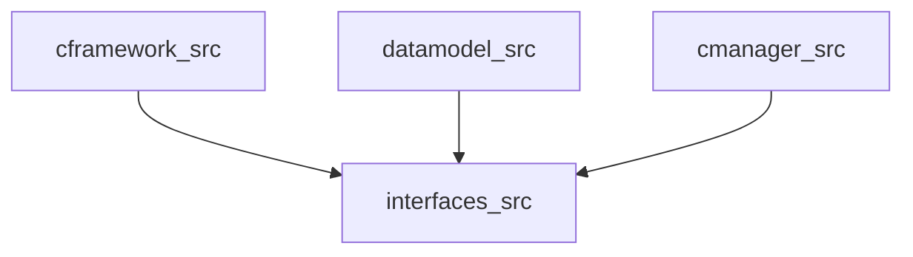

# GHCP Knowledge Sharing — Source Materials Index

> **Purpose:** This file indexes the 6 original KS session files and captures unique content
> (presenter delivery tips, session structure, KS format) not present in the distilled notes.
>
> **Distilled insights:** See [2026-03-06_ghcp-knowledge-sharing-distilled.md](../../notes/2026-03-06_ghcp-knowledge-sharing-distilled.md)

---

## Session Metadata

| Attribute | Value |
|---|---|
| **Session delivered to** | Capital IESD-24 developers & QA engineers |
| **Duration** | ~60–90 minutes |
| **Presenter** | Dhrumil |
| **Date** | February 2026 |
| **Format** | Slides + live demo + presenter notes |

---

## Source Files Processed

| File | Key Topics |
|---|---|
| `GHCP_Combined_KnowledgeSharing_Session.md` | Full session outline (structural reference) |
| `GHCP_Knowledge_Sharing_Session.md` | Main slides with Capital-specific examples |
| `GHCP_Custom_Agents_Guide.md` | Agent deep-dive with CIA Orchestrator architecture |
| `GHCP_Mermaid_Diagrams_Session.md` | Mermaid-as-LLM-context technique |
| `GHCP_Prompt_Files_Guide.md` | Prompt file creation & invocation guide |
| `GHCP_Session_PresenterNotes.md` | Private delivery guide (talking points, hooks) |

---

## Unique Content: KS Session Delivery Guide

> This content is NOT in the distilled notes file — it's specific to delivering a team
> knowledge-sharing session about Copilot. Useful if you run a similar session.

### Opening Hook (from Presenter Notes)

> "Raise your hand if you ever had to tell Copilot the same thing twice in the same
> session — 'we use JUnit 4 not 5', 'extend AppAction not AbstractAction'...
> That pain is exactly what we're solving today."

- Emphasise: the problem isn't Copilot being bad — it doesn't know YOUR codebase
- Custom instructions = an onboarding document that is **always active**, for every developer, forever

### Closing Line (per section)

Section 1: _"Think of it like onboarding a junior developer — except the onboarding document is always active in every conversation, for every developer on the team, forever."_

Section 3 (modes): _"If it fits in one file, Ask or Edit. If it needs to cross files or use tools, Agent."_

### Demo Story Structure (most effective KS format)

The session used **Problem-first → Solution-reveal** structure per section:
1. Show broken output first (before) → ask audience "what's wrong?"
2. Reveal fixed output (after) → walk through WHY each piece was fixed
3. Attribute each fix to a specific rule in the instruction files

**The key demo script** (Section 5 live demo):
- Setup: "A developer has Task X — they write only a stub (method signature + TODO)"
- Show Step 1 (stub): Point out what's missing
- Step 2 (the prompt): Short, no manual context
- Step 3 (output): Walk line-by-line, attribute each fix to a rule
- Step 4 (test): Still no manual context — Copilot generates full test suite
- Closing: "Developer wrote 4 lines. Copilot wrote complete implementation + 3 tests. That's the ROI."

### Q&A Seed Questions (for quiet audiences)

- "Who worked on a module we haven't covered? Let's see what instructions exist for it."
- "What's the most painful repetitive prompt you write every day? We could turn that into a prompt file right now."
- "Has anyone tried Agent mode for test generation? What happened?"
- Challenge: "Which mode would you use to check if all setters fire PropertyChangeEvents?" — Answer: Agent (reads/analyzes multiple files)

---

## Unique Content: Agent Architecture Detail

> Deeper than what's in distilled notes — useful for building your own CIA-style orchestrator.

### CIA Orchestrator — 8-Phase Workflow

This agent runs a full Change Impact Analysis autonomously:

```
P1:  Create tracker file  ← quality gate (prevents incomplete output)
P2A: Graph DB sub-agent   ← structural analysis (Neo4j)
P2B: Vector search sub-agent ← semantic similarity (embeddings)
P2C: Merge + conflict detection
     ┌─ VERIFIED: both agree      → 🟢 
     ├─ GRAPH-CONFIRMED only      → 🔵
     ├─ VECTOR-SUGGESTED only     → 🟡  (open file and verify manually)
     └─ CONFLICT: disagree        → 🔴  (must resolve before shipping)
P3:  Module boundary analysis   ← FQN → path mappings (never guesses)
P4:  Risk scoring               ← interface changes: 5× weight
P5:  Generate change plan       ← ordered list of files to touch
P6:  Verify no orphan paths     ← validates every path exists in repo
P7:  Update tracker file        ← mark each phase complete
P8:  Output final report        ← only if all gates passed
```

**The tracker file pattern:** Creating a `tracker.md` at the start prevents the agent from
stopping early. The tracker has checkboxes; the quality gate prevents output unless all are `[x]`.

### Agent Key Design Insight

> Agents don't just use one file. They **orchestrate multiple instruction files**:
>
> ```
> Layer 1: copilot-instructions.md (ALWAYS loaded)
> Layer 2: Agent-specific instructions (the .agent.md imports)
> Layer 3: Task-specific instructions (loaded by the agent based on what it finds)
> Layer 4: Skills (loaded when agent mentions build, git, etc.)
> ```
>
> This is the concept most people miss — agents inherit the full instruction stack.

---

## Unique Content: Mermaid Diagram Types Quick Reference

> Extracted from GHCP_Mermaid_Diagrams_Session.md — complements the distilled notes table.

### Diagram as Specification Pattern

```
1. Generate diagram from existing code
2. MODIFY the diagram in the editor to show your DESIRED state
   (add a class, change an arrow, add a method)
3. Tell agent: "Implement the changes shown by this diff:"
   [paste original] [paste modified]
4. Agent treats the diagram diff as the specification
   → generates only the code needed to implement it
```

This eliminates "wrong first attempt" — you specify the STRUCTURE first, then the code follows.

### Embedding Diagrams in Instruction Files

```yaml
---
applyTo: "**/*.java"
---
# Architecture Context

## Module Relationships


When editing any .java file, the LLM sees this architectural map automatically.
```

---

## Unique Content: Prompt File Invocation Methods

> Three ways to invoke a prompt file — from GHCP_Prompt_Files_Guide.md.

### Method 1 — Slash Command (most common)
Type `/` in Copilot Chat → picker shows all available prompts

### Method 2 — Command Palette
`Ctrl+Shift+P` → "Chat: Run Prompt" → select file → enter description

### Method 3 — With File Context
Open the target file first → then type the slash command
```
[Device.java open in editor]
/cof-model  Add a setDescription() setter following existing patterns
```

### When to Create a New Prompt File
If you write the same context into prompts **more than twice** → it belongs in a prompt file.
5 minutes to create → the whole team benefits forever.

---

*Created: 2026-03-06 — archived from inbox (6 GHCP_ source files) — created by gpt*
