# Capture Workflow — Complete System Reference

> **Purpose:** Single source of truth for ALL capture workflows — manual jot, file-import,
> deduplication, merge/enhance, brainstorm, refine, and board sync. Contains every Mermaid
> diagram, flowchart, sequence diagram, and state machine for the system.
>
> **Always-on context:** This file is referenced by every capture-related prompt and
> instruction file. Read it before processing any `/jot`, `/read-file-jot`, `/todo`,
> or `/backlog` command.
>
> **Related files:**
>
> - `.github/prompts/jot.prompt.md` — universal capture slash command
> - `.github/prompts/read-file-jot.prompt.md` — file-to-backlog extraction
> - `.github/prompts/todo.prompt.md` — task alias for `/jot`
> - `.github/prompts/todos.prompt.md` — board view and status management
> - `.github/prompts/backlog.prompt.md` — advanced operations
> - `.github/instructions/backlog.instructions.md` — full backlog protocol
> - `brain/ai-brain/backlog/guides/jot-down-guide.md` — classification rules and
>   enhancement patterns (reference doc)
> - `brain/ai-brain/backlog/_templates/` — all item/idea/brainstorm/epic templates

---

## System Architecture Overview

The capture system has **two entry points** that share a common pipeline, diverge at
the import tracking layer, and converge again for dedup/merge and board sync:

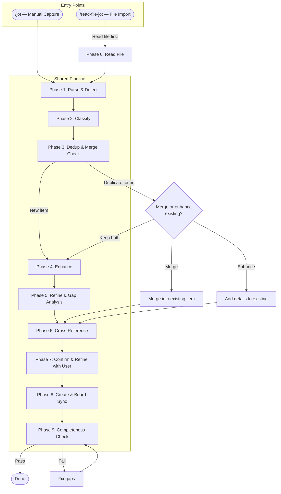

---

## Two Capture Tracks — Manual vs File Import

Items enter the backlog through two distinct tracks. Each is tracked separately
for auditing, traceability, and different workflow needs.

### Track Comparison

| Aspect | Manual Capture (`/jot`) | File Import (`/read-file-jot`) |
|---|---|---|
| Entry point | User types text in chat | User provides a file path |
| Origin type | `manual` | `file-import` |
| Source tracking | Optional `source-file` | Mandatory `source-file` + `import-batch` |
| Batch grouping | Optional (batch jot) | Always grouped by `import-batch: IMP-NNN` |
| Dedup trigger | Check on creation | Check before AND after extraction |
| Import log | Standard CHANGELOG entry | Special `file-import` CHANGELOG entry + import log |
| Template | Standard `item.md` / `idea.md` | Standard templates + `origin-type: file-import` |
| View tracking | Standard views | Standard views + `views/by-source.md` |

### Import Batch Tracking

Every `/read-file-jot` invocation creates an **import batch** identified by `IMP-NNN`:

```yaml
# In each created item's frontmatter:
origin-type: file-import
import-batch: IMP-001
source-file: "C:\\notes\\project-ideas.txt"
```

The import batch groups all items extracted from a single file read, enabling:

- **Traceability** — "which items came from that Notepad++ file?"
- **Bulk operations** — "show me everything from IMP-003"
- **Re-import detection** — "this file was already imported as IMP-001"

### Import Log

File imports are tracked in `brain/ai-brain/backlog/IMPORT-LOG.md`:

```markdown
| IMP-ID | Date | Time | Source File | Items Created | Ideas Created | Notes |
|---|---|---|---|---|---|---|
| IMP-001 | 2026-04-11 | 03:15 PM | C:\notes\project-ideas.txt | 5 BLIs | 3 IDEAs | Initial project ideas import |
```

---

## Phase 0 — Read File (File Import Only)

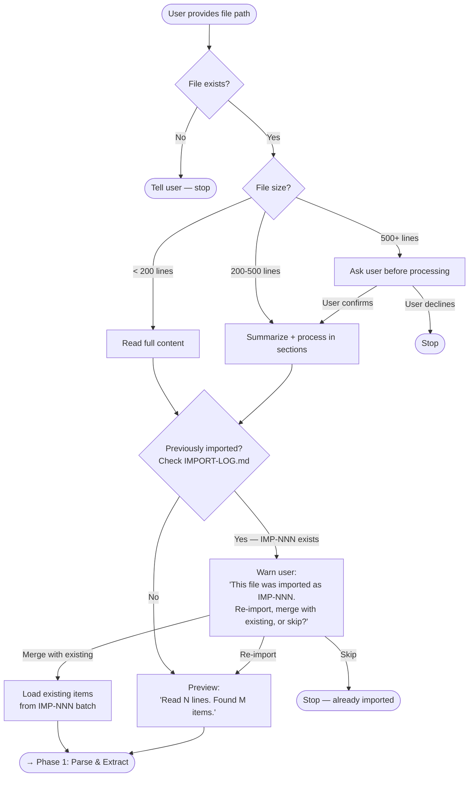

### File Reading Protocol

1. **Read file** — `Get-Content -Raw "<path>"` (Windows) or `cat "<path>"`
2. **Check IMPORT-LOG.md** — has this exact file path been imported before?
3. **If re-import:** warn user with options (re-import fresh, merge, skip)
4. **Preview** — show line count and estimated item count
5. **Assign import batch** — `IMP-NNN` (next sequential from IMPORT-LOG.md)

### File Content Extraction Patterns

| File type | Extraction strategy |
|---|---|
| Plain text (`.txt`) | Split by blank lines, bullets, or numbered items |
| Markdown (`.md`) | Use headings as groups, bullets as items |
| Code (`.java`, `.py`, `.js`) | Extract `TODO`, `FIXME`, `HACK`, `XXX` comments |
| Structured notes (Notepad++) | Parse numbered lists, checkboxes, section markers |
| Mixed format | Combine strategies, classify each section |

---

## Phase 1 — Parse & Detect

Analyze input for signals before classifying:

### Attachment Detection Table

| Pattern | Type | Action |
|---|---|---|
| Windows path: `C:\...`, `E:\...` | Local file | Read with `Get-Content` |
| Unix path: `~/...`, `/home/...` | Local file | Read with `cat` |
| UNC path: `\\server\share\...` | Network file | Read with `Get-Content` |
| `http://` or `https://` | URL | Record in Attachments |
| `BLI-NNN`, `IDEA-NNN`, `EPIC-NNN` | Backlog ref | Cross-link |
| `backlog/features/...` | Backlog path | Cross-link |
| `brain/ai-brain/notes/...` | Brain note | Cross-link |
| `brain/ai-brain/sessions/...` | Session ref | Cross-link |

### Extraction from File Content

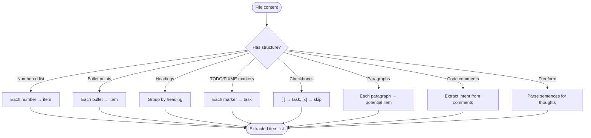

---

## Phase 2 — Classification

### Classification Decision Tree

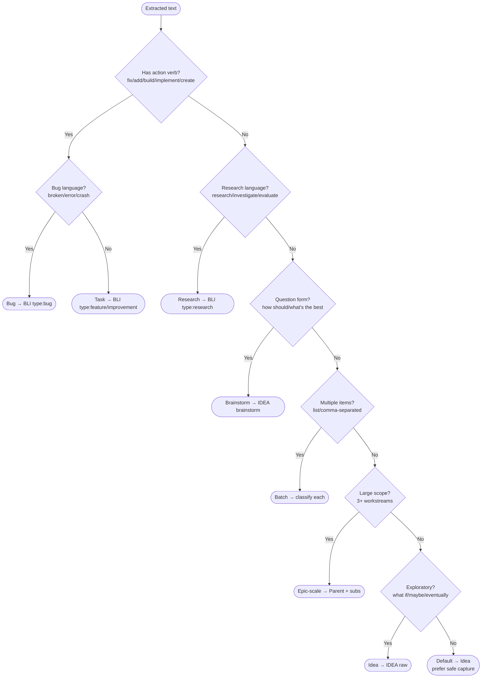

### Classification Signal Table

| Priority | Signal | Classification | Creates |
|---|---|---|---|
| 1 | Action verb: "fix", "add", "build", "implement" | **task** | BLI-NNN |
| 2 | Bug language: "broken", "error", "crash" | **bug** | BLI-NNN (type: bug) |
| 3 | Research: "research", "investigate", "evaluate" | **research** | BLI-NNN (type: research) |
| 4 | Question: "how should we", "what's the best way" | **brainstorm** | IDEA-NNN (brainstorm) |
| 5 | Batch: numbered list, comma-separated | **batch** | Multiple items |
| 6 | Large scope: 3+ workstreams | **epic-scale** | Parent + sub-items |
| 7 | Exploratory: "what if", "maybe", "eventually" | **idea** | IDEA-NNN |
| 8 | Ambiguous (default) | **idea** | IDEA-NNN |

### Artifact → Folder Routing

| Classification | Template | Folder |
|---|---|---|
| task / bug / research | `_templates/item.md` | `features/` or `projects/` or `items/` |
| brainstorm | `_templates/brainstorm.md` | `ideas/` |
| idea | `_templates/idea.md` | `ideas/` |
| epic-scale | `_templates/item.md` (parent + children) | `features/` or `projects/` |

---

## Phase 3 — Deduplication & Merge Check

**Before creating ANY new item, check the existing backlog for duplicates and
enhancement opportunities.** This prevents duplication and enriches existing items.

### Dedup & Merge Flowchart

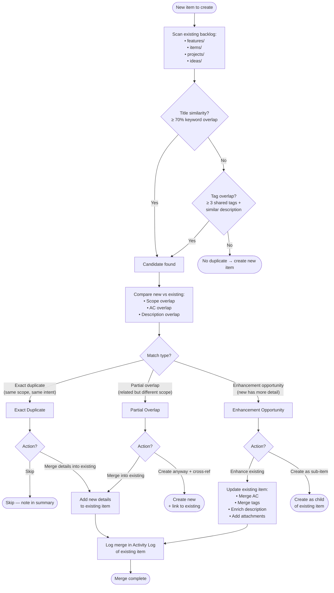

### Dedup Scanning Protocol

For each item about to be created:

1. **Scan titles** — compare against all existing BLI/IDEA titles
   - Keyword extraction: strip stop words, compare remaining keywords
   - ≥ 70% keyword overlap → candidate for duplicate
2. **Scan tags** — if 3+ tags match AND descriptions are similar → candidate
3. **Scan descriptions** — look for semantic overlap (same action on same target)
4. **Check import history** — if `source-file` matches a previous import, flag it

### Merge Protocol

When merging new content into an existing item:

1. **Compare AC** — add any new AC that the existing item doesn't have
2. **Compare tags** — union the tag sets (keep all)
3. **Enrich description** — if new item has more detail, append to existing description
4. **Add attachments** — merge attachment tables (no duplicates)
5. **Update Activity Log** — log the merge with source reference:

```markdown
| 2026-04-11 | 03:15 PM | system | merged | Merged details from IMP-001 extraction (file: C:\notes\ideas.txt) |
```

6. **Update `updated` date** — set to today
7. **Cross-reference** — if not merging fully, add bidirectional link

### Dedup Decision Matrix

| Scenario | Default Action | User Override |
|---|---|---|
| Exact title + exact scope | Skip (note in summary) | User can force create |
| Similar title, broader scope | Create as parent/child | User can merge |
| Same domain, different angle | Create + cross-reference | User can merge |
| New details for existing item | Enhance existing | User can create separate |
| File re-import (same IMP source) | Warn + merge option | User can re-import fresh |

---

## Phase 4 — Enhancement

### Task Enhancement (BLI-NNN) — Full Field Protocol

| Field | Required | Source | Default |
|---|---|---|---|
| Title | Yes | Derived, 3-8 words imperative | — |
| Type | Yes | Inferred from signals | `feature` |
| Priority | Yes | Urgency signals | `medium` |
| Tags | Yes | 3-7 from content/domain | — |
| Epic | Conditional | Match existing epics | `null` |
| Sprint | No | Manual assignment only | `null` |
| Effort | Yes | Complexity assessment | — |
| Description | Yes | 3-5 sentences | — |
| AC | Yes | 3-5 testable criteria | — |
| Breakdown | Conditional | If L/XL or 3+ workstreams | — |
| origin-type | Yes | `manual` or `file-import` | `manual` |
| import-batch | Conditional | File-import only | `null` |
| source-file | Conditional | When file/path involved | `null` |

### Idea Enhancement

| Field | Required | Source |
|---|---|---|
| Title | Yes | 3-5 word descriptive phrase |
| Tags | Yes | 2-5 inferred |
| Raw Idea | Yes | User's exact words verbatim |
| origin-type | Yes | `manual` or `file-import` |
| import-batch | Conditional | File-import only |

### Auto-Breakdown Rules

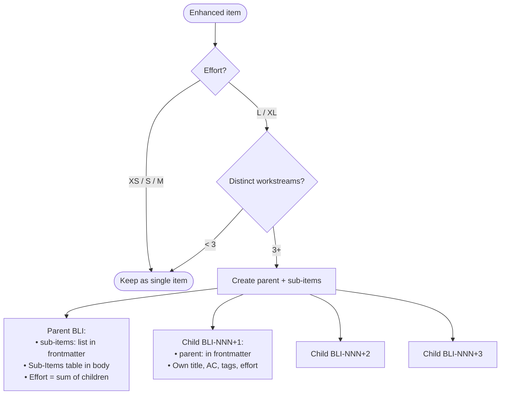

---

## Phase 5 — Refine & Gap Analysis

After enhancement, auto-detect and fill gaps:

### Gap Analysis Checklist

| Gap Type | Detection | Auto-Fix |
|---|---|---|
| Missing AC | Task has < 3 criteria | Add implied from description |
| Missing NFRs | No security/performance/a11y | Add relevant NFRs as AC |
| Implied dependencies | References another system | Add to Related, note dependency |
| Missing error handling | Involves user input / external calls | Add "handles error gracefully" AC |
| Missing rollback | Data migration / schema change | Add "rollback plan documented" AC |
| Future work obvious | Clear next step not mentioned | Add Future Considerations note |

### Possibilities Exploration (Brainstorms)

For brainstorm items, auto-populate:

1. **3-5 concrete possibilities** with brief pros/cons
2. **Constraints** identified from context
3. **Wild ideas** — 2-3 unconventional approaches
4. **Emerging direction** — most promising and why
5. **Next actions** — concrete evaluation steps

### Grouping Analysis

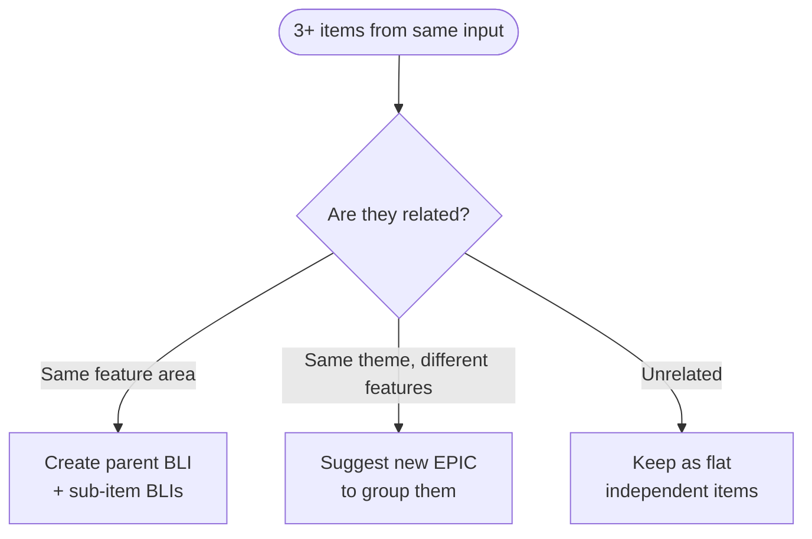

---

## Phase 6 — Cross-Referencing

### Cross-Reference Sources

| Source | Location | Match On |
|---|---|---|
| Existing BLIs | `features/`, `items/`, `projects/` | Title, tags, description |
| Existing IDEAs | `ideas/` | Title, tags |
| Existing EPICs | `epics/` | Theme, tags |
| Brain notes | `brain/ai-brain/notes/` | Topic, title |
| Sessions | `brain/ai-brain/sessions/` | Subject, tags |
| Attachments | Files/URLs provided | Direct reference |
| Import batches | IMPORT-LOG.md | Same source file |

### Bidirectional Link Protocol

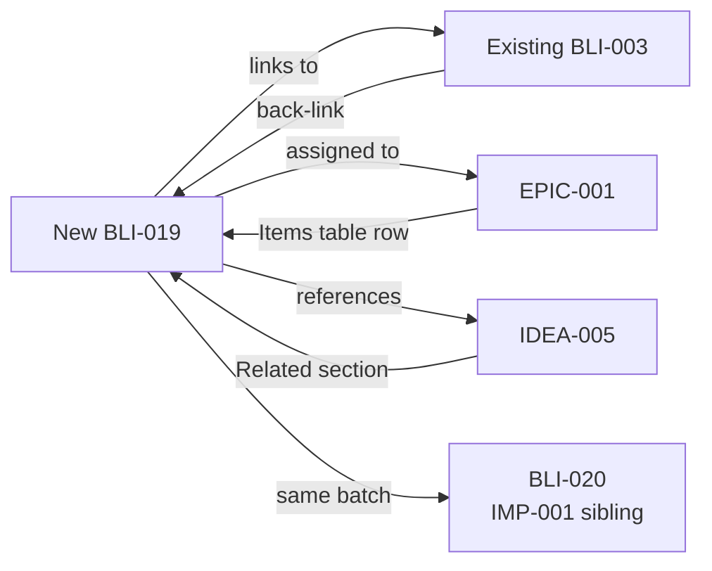

All cross-references are **bidirectional**. When A links B, B links back to A.

---

## Phase 7 — Confirm & Refine (User Interaction)

### Interaction Sequence

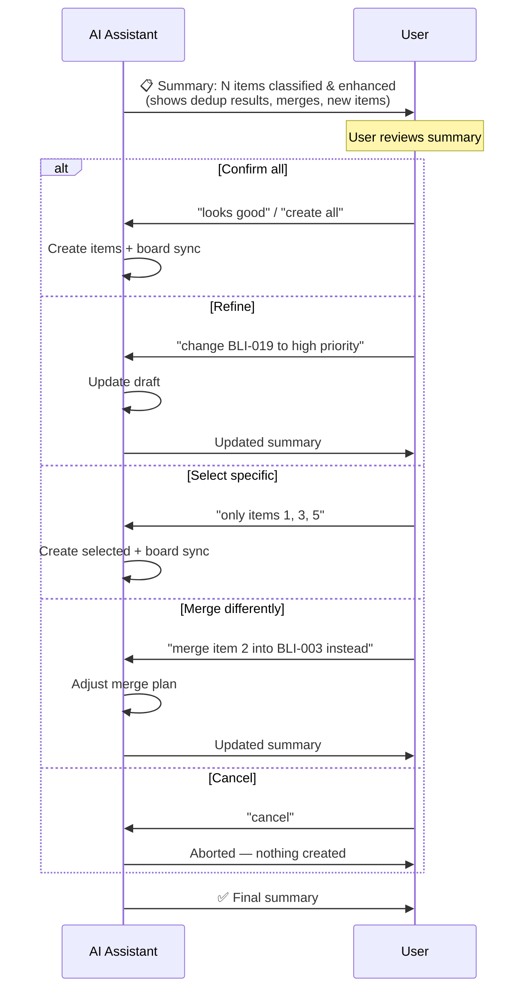

### Summary Format — Manual Capture

```text
Jotted N item(s):

  New Items:
    1. BLI-019: Fix search query empty results (bug, medium, S)
       → features/BLI-019_fix-search-query-empty-results.md
       AC: 3 | Tags: [search, vault, bug] | Epic: EPIC-001

  Merged/Enhanced:
    ⚡ BLI-003: Added 2 new AC, 3 tags from jot input

  Skipped (duplicates):
    ⊘ "fix search results" — duplicate of BLI-003

Boards updated: BOARD.md, views/, CHANGELOG.md
```

### Summary Format — File Import

```text
📄 Import IMP-001: C:\notes\project-ideas.txt (42 lines)
   Extracted 8 items:

  New Items (5):
    1. BLI-019: Fix search query empty results (bug, medium, S)
    2. BLI-020: Add Docker support (feature, high, M)
    3. BLI-021: Implement auth flow (feature, high, L → 3 sub-items)
    4. IDEA-001: Voice search for discovery (raw)
    5. IDEA-002: How to handle caching? (brainstorm)

  Merged into Existing (2):
    ⚡ BLI-003: Added deployment steps from file extraction
    ⚡ IDEA-005: Enriched with additional context from file

  Skipped (1):
    ⊘ "add unit tests" — duplicate of BLI-012

  Import Batch: IMP-001
  All items reference source: C:\notes\project-ideas.txt
  Boards to update: BOARD.md, views/, CHANGELOG.md, IMPORT-LOG.md
```

---

## Phase 8 — Create & Board Sync

### Board Sync Sequence

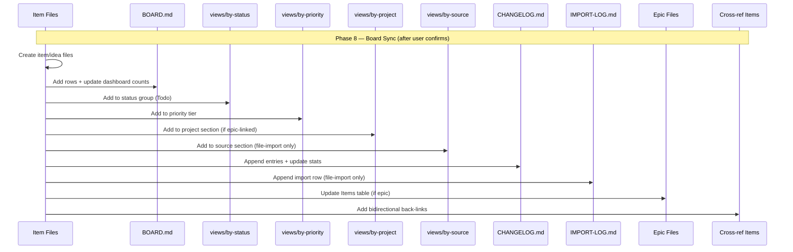

### Board Update Targets

| Target | Manual Capture | File Import |
|---|---|---|
| `BOARD.md` | Always | Always |
| `views/by-status.md` | Always (BLIs) | Always (BLIs) |
| `views/by-priority.md` | Always (BLIs) | Always (BLIs) |
| `views/by-project.md` | When epic-linked | When epic-linked |
| `views/by-source.md` | Not updated | Always — tracks import batches |
| `CHANGELOG.md` | Standard entry | Standard entries + `file-import` summary |
| `IMPORT-LOG.md` | Not updated | Always — new IMP-NNN row |
| Epic files | When epic assigned | When epic assigned |
| Existing items | When cross-referenced | When cross-referenced or merged |

### CHANGELOG Entry Formats

Standard creation:

```markdown
| 2026-04-11 | 03:15 PM | BLI-019 | created | — | todo | Fix search query empty results (bug, medium) |
```

File import summary:

```markdown
| 2026-04-11 | 03:15 PM | IMP-001 | file-import | — | — | Read C:\notes\ideas.txt: 5 BLIs, 3 IDEAs created, 2 merged |
```

Merge into existing:

```markdown
| 2026-04-11 | 03:16 PM | BLI-003 | merged | — | todo | Enhanced with details from IMP-001 (2 new AC, 3 tags) |
```

---

## Phase 9 — Completeness Check (Mandatory)

**Never exit without running this. Fix any failure before final summary.**

### Item-Level

- [ ] Every extracted item classified (nothing skipped without user's explicit choice)
- [ ] Every BLI has: id, title, status, priority, type, created, updated, effort,
  tags (3-7), description (3-5 sentences), AC (3-5)
- [ ] Every IDEA has: id, title, status, created, updated, tags (2-5), Raw Idea verbatim
- [ ] Every brainstorm has: question, 3-5 possibilities, constraints, next actions
- [ ] L/XL items broken down with parent ↔ child links
- [ ] `origin-type` set correctly (`manual` or `file-import`)
- [ ] `import-batch` set for file-import items

### Dedup & Merge

- [ ] Existing backlog scanned for duplicates before creating
- [ ] Duplicates handled (skipped, merged, or cross-referenced)
- [ ] Merges logged in Activity Log of existing items
- [ ] No information lost during merge (new AC, tags, details preserved)

### Attachments & References

- [ ] All file paths in `## Attachments & References` tables
- [ ] All URLs recorded
- [ ] File-import items reference source with "Extracted from `<file>`" note
- [ ] All cross-references bidirectional

### Board Sync

- [ ] BOARD.md updated — rows + dashboard counts
- [ ] views/by-status.md updated
- [ ] views/by-priority.md updated
- [ ] views/by-project.md updated (if epic-linked)
- [ ] views/by-source.md updated (file-import only)
- [ ] CHANGELOG.md updated — entries + stats
- [ ] IMPORT-LOG.md updated (file-import only)
- [ ] Epic files updated (if assigned)

### Timestamps & IDs

- [ ] All dates from system clock (`Get-Date`)
- [ ] All IDs sequential — checked BOARD.md for highest
- [ ] Import batch ID sequential — checked IMPORT-LOG.md for highest
- [ ] Activity Logs have creation entries with timestamps

---

## Item Lifecycle — State Machine

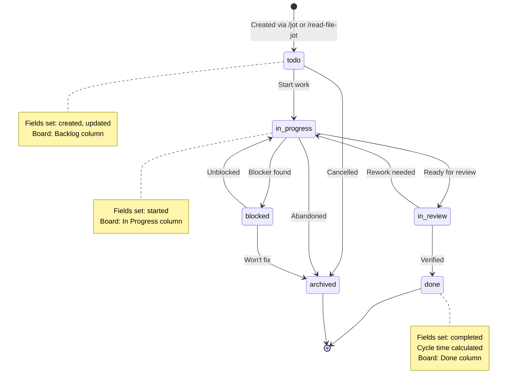

---

## Idea Lifecycle

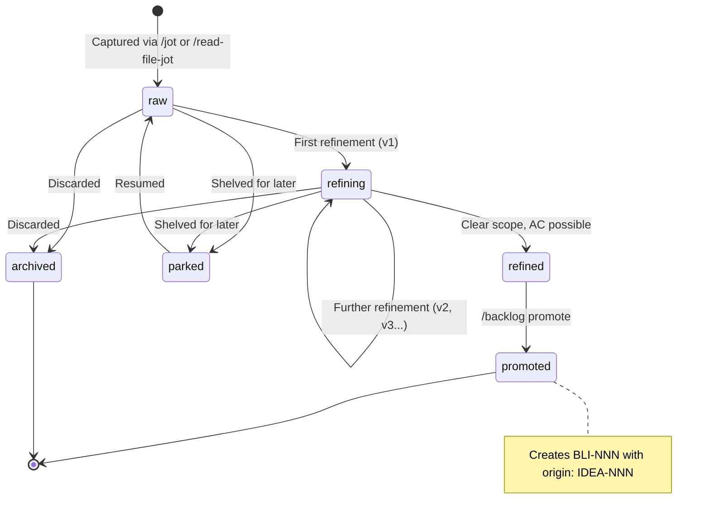

---

## Brainstorm & Refine Workflow

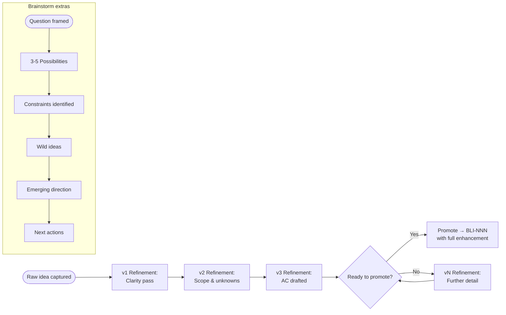

---

## File Import — Full Sequence Diagram

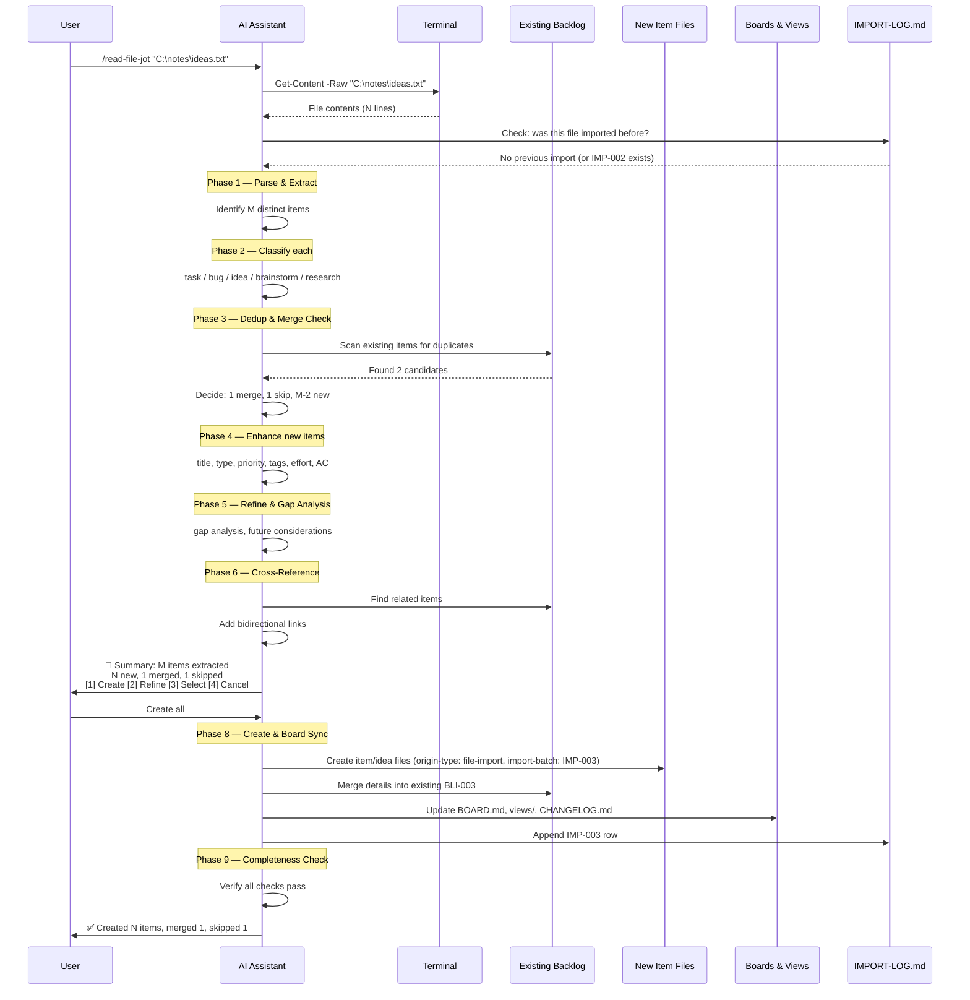

---

## Merge/Enhance Existing — Detailed Protocol

When the dedup check finds an existing item that overlaps with a new item:

### Merge Types

| Type | When | Action |
|---|---|---|
| **AC Merge** | New item has AC the existing one doesn't | Append new AC to existing item |
| **Tag Merge** | New item has tags the existing one doesn't | Union tag sets on existing item |
| **Description Enrich** | New item has richer detail | Append or replace description sections |
| **Attachment Add** | New item has attachments existing doesn't | Add rows to existing Attachments table |
| **Full Absorb** | New item is a subset of existing | Skip creation, note in summary |
| **Sub-Item Convert** | New item is a sub-task of existing | Create as child BLI with parent link |

### Merge Sequence

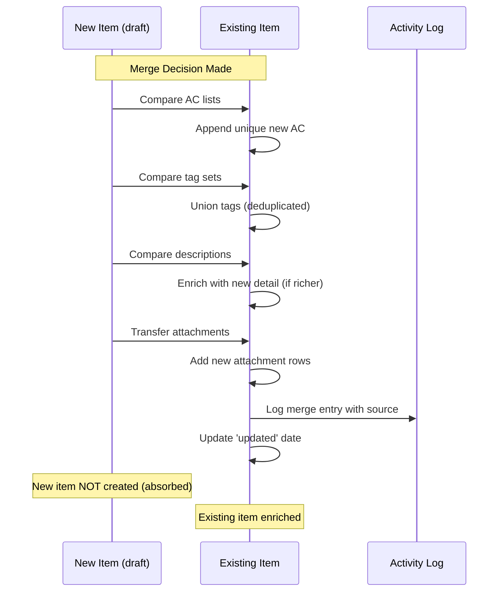

### Safety Rules for Merging

1. **Never lose information** — all new AC, tags, and attachments are preserved
2. **Never modify Raw Idea** — if merging into an IDEA, only add to Refinements
3. **Always log** — every merge gets an Activity Log entry with actor `system`
4. **User can override** — at the confirm phase, user can reject a merge
5. **Preserve existing structure** — don't reorganize existing item's sections

---

## ID Schemas

### Item IDs

| Type | Prefix | Sequence Source | Example |
|---|---|---|---|
| Backlog item | `BLI-` | BOARD.md Kanban section | BLI-019 |
| Idea | `IDEA-` | BOARD.md Ideas section | IDEA-001 |
| Epic | `EPIC-` | BOARD.md Epics section | EPIC-004 |
| Guide | `GUIDE-` | guides/ folder | GUIDE-001 |
| Sprint | `SPRINT-` | sprints/ folder | SPRINT-001 |

### Import Batch IDs

| Prefix | Sequence Source | Example |
|---|---|---|
| `IMP-` | IMPORT-LOG.md | IMP-001 |

IDs are sequential and **never reused**, even for archived or deleted items.

---

## Template Field Reference

### Common Fields (All Templates)

```yaml
origin-type: manual          # "manual" (from /jot) or "file-import" (from /read-file-jot)
import-batch: null           # IMP-NNN — only set for file-import items
source-file: null            # Full file path — set when file involved
```

### BLI-NNN (item.md) Full Fields

```yaml
id: BLI-NNN
title: Short imperative title
status: todo
priority: medium
type: feature
created: YYYY-MM-DD
updated: YYYY-MM-DD
started: null
completed: null
blocked-since: null
review-since: null
epic: null
sprint: null
parent: null
sub-items: []
origin: null
estimated-effort: null
actual-effort: null
tags: []
origin-type: manual
import-batch: null
source-file: null
```

### IDEA-NNN (idea.md / brainstorm.md) Full Fields

```yaml
id: IDEA-NNN
title: Short descriptive title
status: raw
type: brainstorm             # only for brainstorm template
created: YYYY-MM-DD
updated: YYYY-MM-DD
tags: []
promoted-to: null
origin-type: manual
import-batch: null
source-file: null
```

---

## File & Location Index

| What | Where |
|---|---|
| This workflow doc | `brain/ai-brain/backlog/guides/capture-workflow.md` |
| Classification & enhancement rules | `brain/ai-brain/backlog/guides/jot-down-guide.md` |
| Item template | `brain/ai-brain/backlog/_templates/item.md` |
| Idea template | `brain/ai-brain/backlog/_templates/idea.md` |
| Brainstorm template | `brain/ai-brain/backlog/_templates/brainstorm.md` |
| Epic template | `brain/ai-brain/backlog/_templates/epic.md` |
| Board | `brain/ai-brain/backlog/BOARD.md` |
| Changelog | `brain/ai-brain/backlog/CHANGELOG.md` |
| Import log | `brain/ai-brain/backlog/IMPORT-LOG.md` |
| Views | `brain/ai-brain/backlog/views/` |
| Source view | `brain/ai-brain/backlog/views/by-source.md` |
| Backlog instructions | `.github/instructions/backlog.instructions.md` |
| Jot prompt | `.github/prompts/jot.prompt.md` |
| Read-file-jot prompt | `.github/prompts/read-file-jot.prompt.md` |
| Todo prompt (alias) | `.github/prompts/todo.prompt.md` |
| Todos prompt (board) | `.github/prompts/todos.prompt.md` |
| Backlog prompt (advanced) | `.github/prompts/backlog.prompt.md` |
