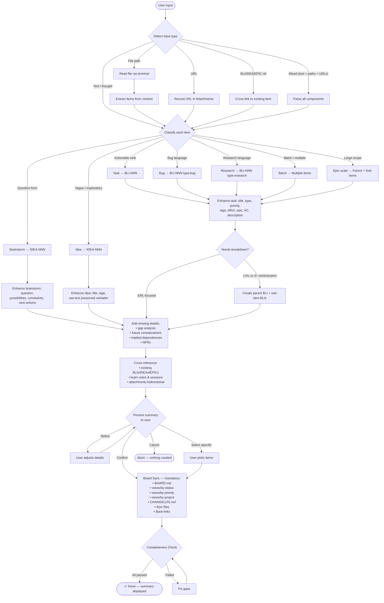
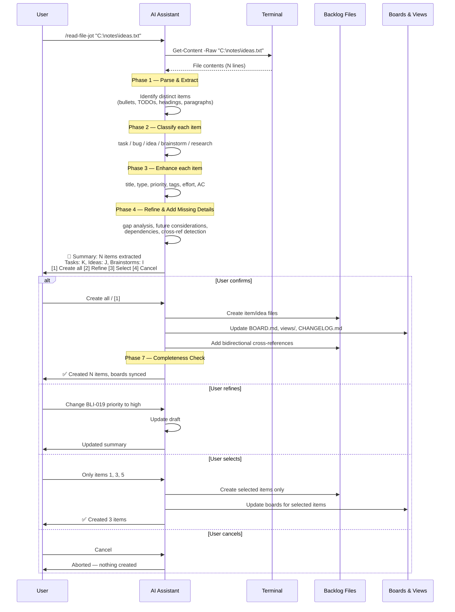
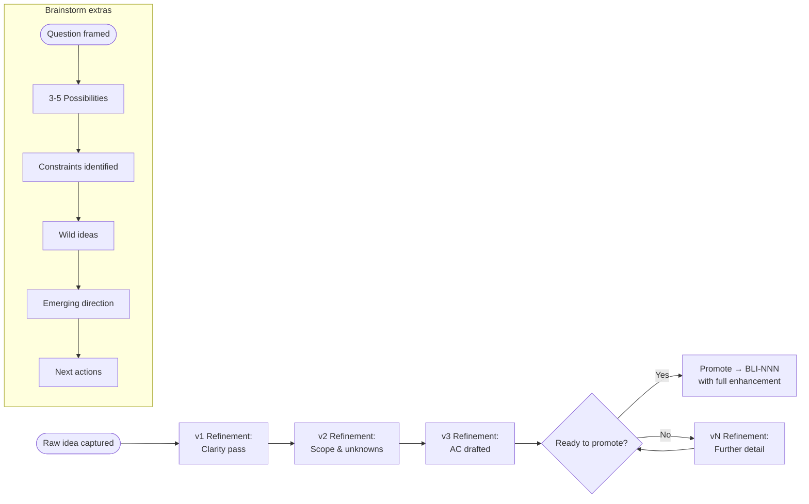
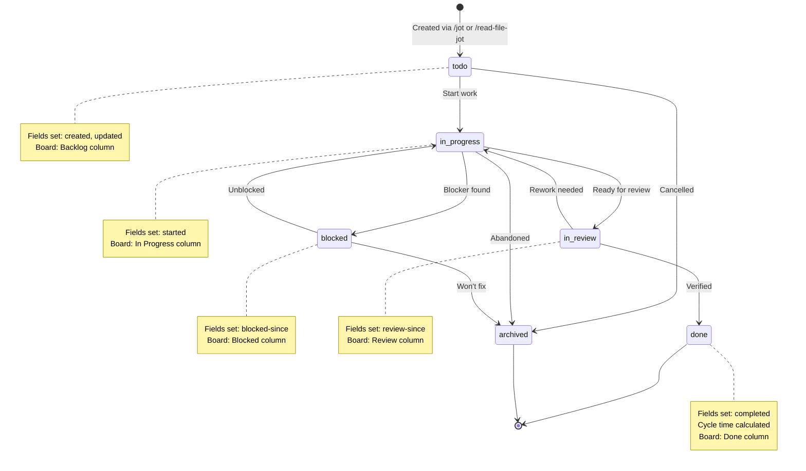
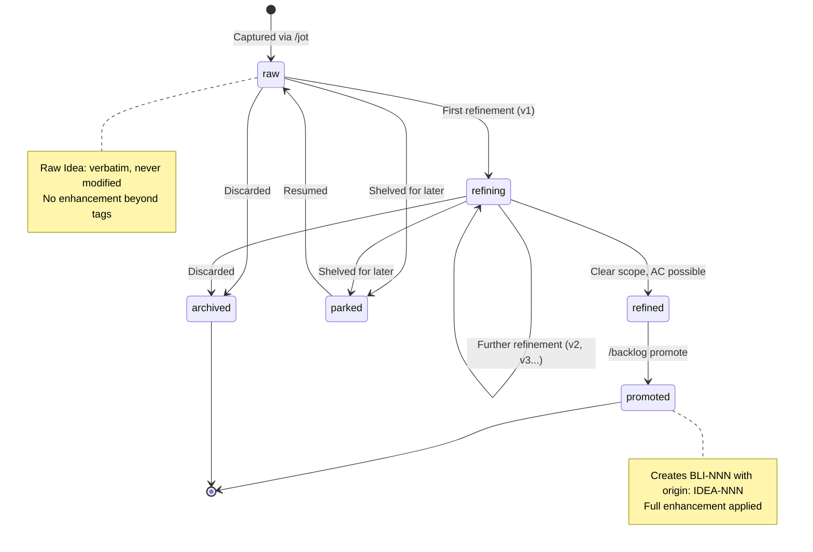
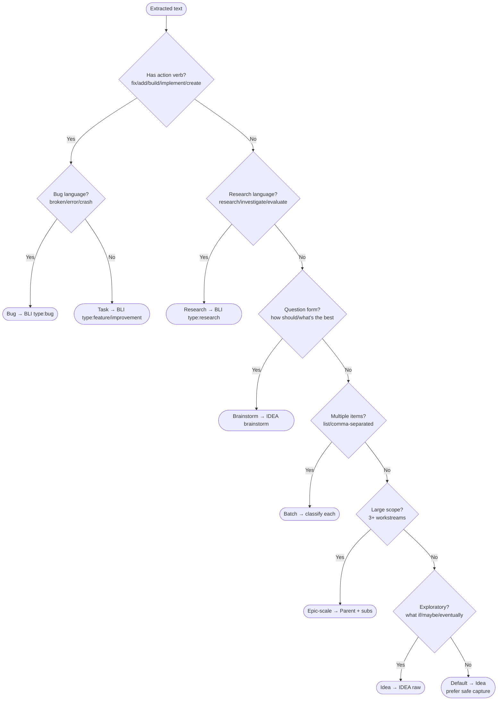
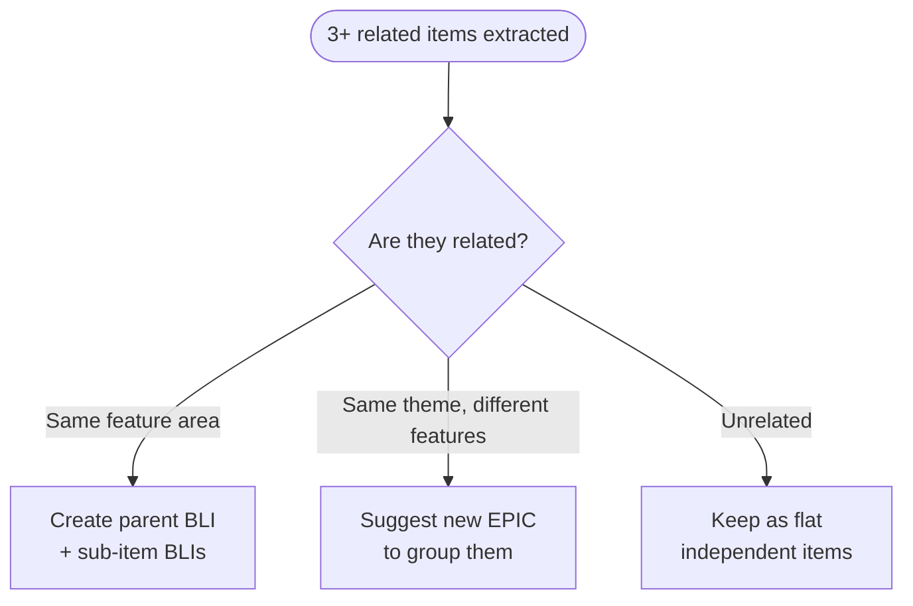
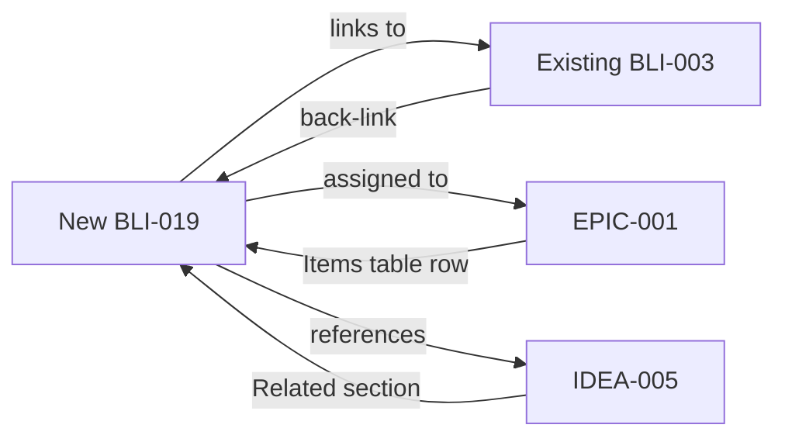
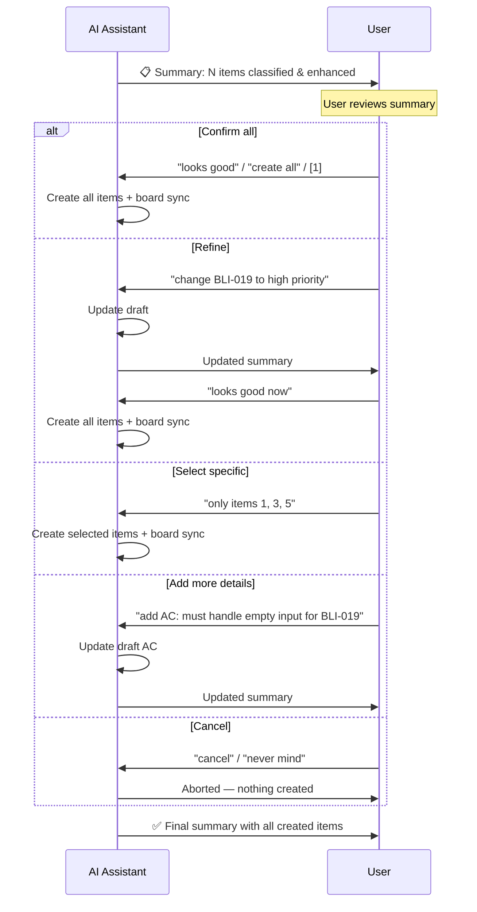
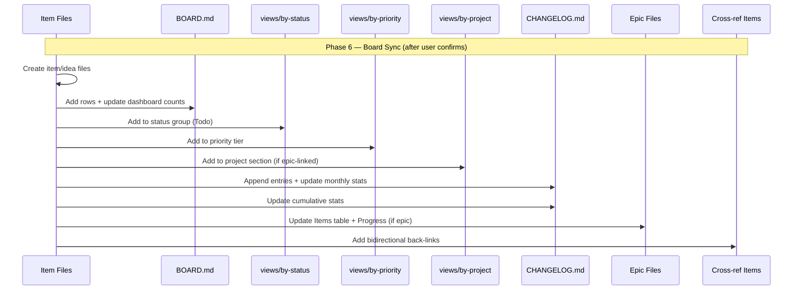

# Jot-Down Guide — Unified Capture & Management Protocol

> **Purpose:** Comprehensive developer documentation for the unified jot-down system.
> Covers all workflows (capture, file-read, refine, brainstorm, breakdown), classification
> logic, enhancement patterns, attachment handling, cross-referencing conventions, board
> sync protocol, completeness checks, and Mermaid workflow diagrams.
>
> **Audience:** GHCP agent context — read before processing any `/jot`, `/read-file-jot`,
> `/todo`, or `/backlog` command.
>
> **Related files:**
>
> - `.github/prompts/jot.prompt.md` — unified capture slash command
> - `.github/prompts/read-file-jot.prompt.md` — file-to-backlog extraction
> - `.github/prompts/todo.prompt.md` — task alias for `/jot`
> - `.github/prompts/todos.prompt.md` — board view and status management
> - `.github/prompts/backlog.prompt.md` — advanced operations
> - `.github/instructions/backlog.instructions.md` — full backlog protocol
> - `brain/ai-brain/backlog/_templates/` — all item/idea/brainstorm/epic templates

---

## Overview

The jot-down system provides **three slash commands** that cover the full capture lifecycle:

| Command | Purpose | When to use |
|---|---|---|
| `/jot` | Universal capture — auto-classifies, enhances, cross-refs | Everyday: thoughts, tasks, bugs, URLs, file paths, batches |
| `/read-file-jot` | File-to-backlog extraction — reads file, parses, creates items | When you have a Notepad++/text/code file with ideas or TODOs |
| `/todo` | Alias for `/jot`, pre-classified as task | Quick task shortcut |

Advanced operations (`/backlog`): brainstorm, refine, promote, guide, epic, sprint.
Board management (`/todos`): view board, mark done, start, block, search.

---

## Master Workflow — Mermaid Flowchart



---

## File-Read Workflow — Sequence Diagram



---

## Brainstorm & Refine Workflow



---

## Item Lifecycle — State Machine



---

## Idea Lifecycle



---

## Phase 1 — Parse & Detect

### Attachment Detection

Scan the input for these patterns BEFORE classifying content:

| Pattern | Type | Action |
|---|---|---|
| Windows path: `C:\...`, `E:\...`, `D:\...` | Local file | Read with `Get-Content` |
| Unix path: `~/...`, `/home/...`, `./...` | Local file | Read with `cat` |
| UNC path: `\\server\share\...` | Network file | Read with `Get-Content` |
| `http://...` or `https://...` | URL | Record in Attachments |
| `BLI-NNN`, `IDEA-NNN`, `EPIC-NNN` | Backlog ref | Cross-link |
| `backlog/features/...`, `backlog/items/...` | Backlog path | Cross-link |
| `brain/ai-brain/notes/...` | Brain note | Cross-link |
| `brain/ai-brain/sessions/...` | Session ref | Cross-link |

### Reading Local Files

When a local file path is detected (either in `/jot` or `/read-file-jot`):

1. **Read the file** using `Get-Content -Raw "<path>"` (Windows) or `cat "<path>"`
2. **If short** (< 200 lines): use full content for enrichment
3. **If long** (200-500 lines): summarize and process in sections
4. **If very long** (500+ lines): ask user before processing
5. **Extract actionable items** — each becomes a separate backlog entry
6. **Record the file path** in every created item's Attachments section
7. **Never copy the file** into the repo — only reference and extract

### File Content Extraction Patterns

| File type | Extraction strategy |
|---|---|
| Plain text (`.txt`) | Split by blank lines, bullets, or numbered items |
| Markdown (`.md`) | Use headings as groups, bullets as items |
| Code (`.java`, `.py`, `.js`) | Extract `TODO`, `FIXME`, `HACK`, `XXX` comments |
| Structured notes (Notepad++) | Parse numbered lists, checkboxes, section markers |
| Mixed format | Combine strategies, classify each section |

### Reading URLs

When a URL is detected:

1. Record in the item's `## Attachments & References` section
2. If **GitHub repo/issue/PR**: infer project name, tags, context
3. If **documentation page**: infer technology, domain
4. Use URL context to enrich description and tags

### Multiple Attachments

A single input can contain multiple attachments — process all:

```text
/jot "implement auth flow - see E:\specs\auth-design.md and
      https://oauth.net/2/ - related to BLI-003"

→ Reads E:\specs\auth-design.md
→ Records https://oauth.net/2/
→ Cross-links to BLI-003
→ Creates BLI with all three in Attachments & References
```

---

## Phase 1b — Classification

### Classification Decision Tree



### Classification Rules Table

| Priority | Signal | Classification |
|---|---|---|
| 1 | Explicit action verb: "fix", "add", "build", "implement", "create", "remove", "update", "migrate" | **task** |
| 2 | Bug language: "broken", "error", "crash", "doesn't work", "failing", "bug" | **bug** (task subtype) |
| 3 | Research language: "research", "investigate", "evaluate", "compare", "explore" | **research** (task subtype) |
| 4 | Question form: "how should we", "what's the best way", "should we" | **brainstorm** |
| 5 | Batch input: numbered list, comma-separated distinct items, "and also" | **batch** |
| 6 | Large scope: 3+ workstreams, mentions multiple systems, L/XL scale | **epic-scale** |
| 7 | Exploratory: "what if", "maybe", "I should", "eventually", "remember", "idea" | **idea** |
| 8 | Default (ambiguous) | **idea** (ideas can be promoted; prefer safe capture) |

### Classification → Artifact Mapping

| Classification | Creates | Template | Folder |
|---|---|---|---|
| task | BLI-NNN | `_templates/item.md` | `features/` or `projects/` or `items/` |
| bug | BLI-NNN (type: bug) | `_templates/item.md` | `features/` or `items/` |
| research | BLI-NNN (type: research) | `_templates/item.md` | `items/` or `features/` |
| brainstorm | IDEA-NNN | `_templates/brainstorm.md` | `ideas/` |
| idea | IDEA-NNN | `_templates/idea.md` | `ideas/` |
| batch | Multiple BLI/IDEA | Per-item template | Per-item folder |
| epic-scale | Parent BLI + sub-BLIs | `_templates/item.md` | `features/` or `projects/` |

### Folder Routing

| Condition | Folder |
|---|---|
| Enhances the learning-assistant project | `features/` |
| Standalone personal app/project | `projects/` |
| General work, cross-cutting, or unclear | `items/` |
| Ideas, brainstorms | `ideas/` |

---

## Phase 2 — Enhancement

### Task Enhancement (BLI-NNN)

Every task gets auto-enhanced with ALL of these fields:

| Field | Source | Example |
|---|---|---|
| Title | Derived from input, 3-8 words, imperative mood | "Fix search query empty results" |
| Type | Inferred from signal words | `feature`, `bug`, `improvement`, `research`, `spike`, `chore` |
| Priority | Inferred from urgency signals (default: `medium`) | `critical`, `high`, `medium`, `low` |
| Tags | 3-7 tags from content, technologies, domains | `[search, vault, bug, mcp]` |
| Epic | Matched against existing epics in `epics/` | `EPIC-001` or `null` |
| Effort | T-shirt size from complexity | `XS`, `S`, `M`, `L`, `XL` |
| Description | 3-5 sentences: what, why, considerations | Rich paragraph |
| AC | 3-5 testable acceptance criteria | Checkbox format |

### Priority Inference

| Signal | Priority |
|---|---|
| "urgent", "critical", "ASAP", "production", "outage" | `critical` |
| "important", "blocking", "high priority", "soon" | `high` |
| Default (no signal) | `medium` |
| "nice to have", "eventually", "someday", "low priority" | `low` |

### Effort Estimation

| Scale | Meaning | Duration proxy |
|---|---|---|
| XS | Trivial — single file edit, config change | < 30 min |
| S | Small — one component, straightforward | 30 min – 2 hr |
| M | Medium — multiple files, some complexity | 2 – 8 hr |
| L | Large — cross-cutting, multi-day | 1 – 3 days |
| XL | Extra large — multi-system, needs breakdown | 3+ days |

### Auto-Breakdown Rules

| Condition | Action |
|---|---|
| Effort is L or XL | Create parent + sub-items |
| 3+ distinct workstreams in one task | Create parent + sub-items |
| User lists steps with "and also" or numbered | Each step → sub-item |
| Multiple unrelated technologies/domains | Group by domain as sub-items |
| S or M, single focus | Keep as one item |

Sub-item protocol:

1. Parent BLI: `sub-items: [BLI-020, BLI-021, BLI-022]` in frontmatter
2. Each child BLI: `parent: BLI-019` in frontmatter
3. Parent body: Sub-Items table listing all children
4. Each child: own title, AC, type, priority, effort
5. Parent effort = sum of children (roughly)

### Idea Enhancement (IDEA-NNN)

| Field | Source |
|---|---|
| Title | 3-5 word descriptive phrase |
| Tags | 2-5 inferred tags |
| Raw Idea | User's exact words, verbatim, NEVER modified |
| Refinements v0 | Only if attachment provided context (labeled "v0 — Context from attachment") |

### Brainstorm Enhancement (IDEA-NNN brainstorm)

| Field | Source |
|---|---|
| The Question | Framed from user's input |
| Possibilities | 3-5 initial options based on context |
| Constraints | Known limitations (tech, time, budget, skills) |
| Wild Ideas | 2-3 unconventional approaches |
| Emerging Direction | Initial assessment of most promising path |
| Next Actions | 2-3 concrete follow-up steps |

---

## Phase 3 — Refine & Add Missing Details

After initial classification and enhancement, auto-refine with additional intelligence:

### Gap Analysis

For every item, check for implied but unstated details:

| Gap type | Detection | Action |
|---|---|---|
| Missing AC | Task has < 3 acceptance criteria | Add implied criteria from description |
| Missing NFRs | No mention of security, performance, accessibility | Add relevant NFRs as AC |
| Implied dependencies | Task references another system or feature | Add to Related section, note dependency |
| Missing error handling | Task involves user input or external calls | Add "handles error gracefully" AC |
| Missing rollback | Task involves data migration or schema change | Add "rollback plan documented" AC |

### Future Considerations

For each task, add a "Future Considerations" note in the Description if there's
an obvious next step that the user hasn't mentioned:

```markdown
## Description

... (main description) ...

**Future considerations:** Once search filtering is implemented, consider adding
saved-search presets and search analytics (usage patterns, popular queries).
```

### Possibilities Exploration (Brainstorms)

For brainstorm items, auto-populate beyond the initial question:

1. **3-5 concrete possibilities** with brief pros/cons for each
2. **Identify constraints** — what limits the options?
3. **Wild ideas** — 2-3 unconventional approaches
4. **Emerging direction** — which option seems most promising and why?
5. **Next actions** — concrete steps to evaluate further

### Grouping Analysis

If a single `/jot` or `/read-file-jot` produces 3+ related items:



---

## Phase 4 — Cross-Referencing

Every item created gets maximum cross-referencing. The goal is a densely connected
knowledge graph where no item exists in isolation.

### Cross-Reference Sources

| Source | Location | Match on |
|---|---|---|
| Existing BLIs | `backlog/features/`, `backlog/items/`, `backlog/projects/` | Title, tags, description overlap |
| Existing IDEAs | `backlog/ideas/` | Title, tags |
| Existing EPICs | `backlog/epics/` | Theme, tags |
| Brain notes | `brain/ai-brain/notes/` | Topic, title |
| Sessions | `brain/ai-brain/sessions/` | Subject, tags |
| Attachments | Files/URLs provided by user | Direct reference |

### Cross-Reference Actions

| Relationship | Where to record | Format |
|---|---|---|
| Related BLI | New item's `## Related` section | `- [BLI-003](../features/BLI-003_...)` |
| Related IDEA | New item's `## Related` section | `- [IDEA-001](../ideas/IDEA-001_...)` |
| Parent epic | Frontmatter `epic:` field + epic file's Items table | `epic: EPIC-001` |
| Parent item | Frontmatter `parent:` field | `parent: BLI-019` |
| Brain note | New item's `## Related` section | `- [note](../../notes/2026-...)` |
| Session | New item's `## Related` section | `- [session](../../sessions/...)` |
| Attachment | New item's `## Attachments & References` table | See template |

### Bidirectional Rule

Cross-references are **always bidirectional**:



---

## Phase 5 — Confirm & Refine (User-Driven Flow)

### User Interaction Model



### Summary Format

```text
Jotted N item(s):

  Tasks (K):
    1. BLI-019: Fix search query empty results (bug, medium, S)
       → features/BLI-019_fix-search-query-empty-results.md
       AC: 3 | Tags: [search, vault, bug] | Epic: EPIC-001
       📎 Attachments: E:\notes\search-bug.txt
    2. BLI-020: Add Docker Compose setup (feature, high, M)
       → features/BLI-020_add-docker-compose-setup.md
       AC: 4 | Tags: [docker, devops] | Sub-items: 2

  Ideas (J):
    3. IDEA-001: Voice search for discovery (raw)
       → ideas/IDEA-001_voice-search-for-discovery.md
       Tags: [search, voice, vault]

  Brainstorms (I):
    4. IDEA-002: How to handle auth? (raw, brainstorm)
       → ideas/IDEA-002_auth-approach-brainstorm.md

Boards updated: BOARD.md, views/, CHANGELOG.md
Cross-refs: BLI-019 ↔ BLI-003 (related search work)

Want to refine anything? (change priority, add details, adjust breakdown)
```

---

## Phase 6 — Board Sync (Mandatory)

**The Golden Rule: No item creation or change without updating the full chain.**

### Board Sync Sequence



### Board Update Targets

| Target | Action | When |
|---|---|---|
| `BOARD.md` | Add rows, update dashboard counts | Always |
| `views/by-status.md` | Add to status group (Todo/etc.) | Always for BLIs |
| `views/by-priority.md` | Add to priority tier | Always for BLIs |
| `views/by-project.md` | Add to project section | When epic-linked |
| `CHANGELOG.md` | Append creation entry, update stats | Always |
| Epic file(s) | Update Items table + Progress | When epic assigned |
| Existing items | Add back-links in Related sections | When cross-referenced |

### CHANGELOG Entry Format

```markdown
| YYYY-MM-DD | HH:MM PM | BLI-NNN | created | — | todo | <title> (<type>, <priority>) |
```

For file-read imports, add a special summary entry:

```markdown
| YYYY-MM-DD | HH:MM PM | — | file-import | — | — | Read <filename>: created N items, M ideas |
```

---

## Phase 7 — Completeness Check (Mandatory)

**Never exit without running this checklist. Fix any failure before presenting
the final summary to the user.**

### Item-Level Completeness

- [ ] Every task (BLI) has: `id`, `title`, `status`, `priority`, `type`, `created`,
  `updated`, `estimated-effort`, `tags` (3-7)
- [ ] Every task has rich description (3-5 sentences) with what, why, considerations
- [ ] Every task has 3-5 concrete, testable acceptance criteria
- [ ] Every idea (IDEA) has: `id`, `title`, `status`, `created`, `updated`, `tags` (2-5)
- [ ] Every idea has Raw Idea section with user's exact words (verbatim)
- [ ] Every brainstorm has: question framed, 3-5 possibilities, constraints, next actions
- [ ] L/XL tasks have been broken down into sub-items (parent + children)
- [ ] Sub-items have bidirectional links (`parent:` ↔ `sub-items:[]`)

### Attachment & Reference Completeness

- [ ] All detected file paths recorded in `## Attachments & References` tables
- [ ] All detected URLs recorded in Attachments tables
- [ ] File paths include "read on YYYY-MM-DD" or "extracted from" notes
- [ ] URLs are stored as markdown links `[text](url)`

### Cross-Reference Completeness

- [ ] All cross-references are **bidirectional** (A links B, B links A)
- [ ] Epic-linked items have `epic:` in frontmatter AND appear in epic's Items table
- [ ] Related existing items have back-link added to their `## Related` section
- [ ] No duplicate items created (checked existing backlog for overlap)

### Board Sync Completeness

- [ ] BOARD.md updated — new rows added, dashboard counts reflect reality
- [ ] views/by-status.md updated — items in correct status group
- [ ] views/by-priority.md updated — items in correct priority tier
- [ ] views/by-project.md updated (if any epic-linked items)
- [ ] CHANGELOG.md updated — entries appended under current month
- [ ] CHANGELOG.md stats updated — monthly and cumulative counts correct
- [ ] Epic file(s) updated — Items table and Progress counts (if applicable)

### Timestamp & ID Completeness

- [ ] All dates from system clock (`Get-Date`), not guessed
- [ ] All IDs sequential — checked BOARD.md for highest existing ID
- [ ] No ID reuse — verified against existing items
- [ ] `created` and `updated` fields set to today's date
- [ ] Activity Log has initial entry with creation timestamp

### Final Verification

- [ ] Summary presented to user with all created items
- [ ] User was given opportunity to refine (or auto-confirmed)
- [ ] All files written to correct folders
- [ ] File names follow pattern: `PREFIX-NNN_kebab-title.md`

---

## Attachments & References Section

Every created item (BLI or IDEA) that has attachments uses this section format:

```markdown
## Attachments & References

| Type | Path / URL | Added | Notes |
|---|---|---|---|
| Local file | `E:\specs\auth-flow.md` | 2026-04-11 | Auth flow specification, extracted for AC |
| URL | [OAuth 2.0 Spec](https://oauth.net/2/) | 2026-04-11 | Reference for implementation |
| Backlog item | [BLI-003](../features/BLI-003_...) | 2026-04-11 | Related search improvement |
| Brain note | [session notes](../../notes/2026-...) | 2026-04-11 | Requirements discussion |
| Session | [research session](../../sessions/personal/...) | 2026-04-11 | Technology evaluation |
```

### Rules for Attachments

- **Local files are referenced, never copied** — store the path, extract relevant details
- **URLs are stored as markdown links** — `[Display text](https://...)`
- **Backlog cross-refs use relative paths** — `../features/BLI-003_...`
- **Brain cross-refs use relative paths** — `../../notes/...`, `../../sessions/...`
- **Added column is mandatory** — date when the reference was added
- **Notes column is mandatory** — describe what the attachment contains/why it matters

---

## ID Assignment Protocol

IDs are sequential and never reused, even for archived or deleted items.

| Type | Prefix | Find highest in | Example |
|---|---|---|---|
| Backlog item | BLI- | BOARD.md Kanban section | BLI-019 |
| Idea | IDEA- | BOARD.md Ideas section | IDEA-001 |
| Epic | EPIC- | BOARD.md Epics section | EPIC-004 |
| Guide | GUIDE- | BOARD.md Guides section | GUIDE-001 |

Always check BOARD.md for the current highest ID before assigning.

---

## Batch Processing

When the user provides multiple items in one `/jot` or `/read-file-jot`:

1. Parse each distinct item (numbered list, comma-separated, "and also", file sections)
2. Classify each independently
3. Assign sequential IDs (e.g., BLI-019, BLI-020, BLI-021)
4. Enhance each with full protocol
5. Cross-reference between batch siblings if related
6. Update all boards **once** at the end (not per-item)
7. Present a single summary covering all items

### Related Batch Items

If items are related, they may form a parent-child hierarchy:

```text
Parent: BLI-019 "Enhance search experience" (L)
  ├── BLI-020 "Add full-text search" (S)
  ├── BLI-021 "Add result filters" (M)
  └── BLI-022 "Add sort options" (S)
```

Decision: flat for unrelated items, hierarchical for items forming a coherent feature.

---

## Activity Log Protocol

Every BLI and IDEA file has an Activity Log. **Every event gets a timestamped entry.**

### Activity Log Entry Format

```markdown
## Activity Log

| Date | Time | Actor | Action | Details |
|---|---|---|---|---|
| 2026-04-11 | 03:15 PM | system | created | Created via /jot — auto-classified as task |
| 2026-04-11 | 03:15 PM | system | enhanced | Added 4 AC, 5 tags, effort: M, epic: EPIC-001 |
| 2026-04-11 | 03:16 PM | user | refined | Changed priority from medium to high |
| 2026-04-12 | 09:00 AM | user | status → in-progress | Started work |
| 2026-04-13 | 04:30 PM | user | status → done | Completed — cycle time: 1.3 days |
```

### Actor Values

| Actor | When |
|---|---|
| `system` | Automated actions (creation, enhancement, board sync) |
| `user` | User-initiated changes (status update, priority change, refinement) |
| `import` | File-read import (`/read-file-jot`) |

---

## Template Quick Reference

### Item Template Fields

```yaml
id: BLI-NNN                    # Sequential, never reused
title: Short imperative title   # 3-8 words
status: todo                    # todo/in-progress/blocked/in-review/done/archived
priority: medium                # critical/high/medium/low
type: feature                   # feature/bug/improvement/research/spike/chore
created: YYYY-MM-DD            # System clock — never guess
updated: YYYY-MM-DD            # Last modification
started: null                   # When status → in-progress
completed: null                 # When status → done
blocked-since: null             # When status → blocked
review-since: null              # When status → in-review
epic: null                      # EPIC-NNN or null
sprint: null                    # SPRINT-NNN or null
parent: null                    # Parent BLI-NNN or null
sub-items: []                   # [BLI-NNN, ...] or empty
origin: null                    # IDEA-NNN if promoted from idea
estimated-effort: null          # XS/S/M/L/XL
actual-effort: null             # "2h", "1d", "3d" (filled on completion)
tags: []                        # 3-7 lowercase kebab-case
source-file: null               # File path if created via /read-file-jot
```

### Idea Template Fields

```yaml
id: IDEA-NNN                    # Sequential, never reused
title: Short descriptive title  # 3-5 words
status: raw                     # raw/refining/refined/promoted/parked/archived
created: YYYY-MM-DD            # System clock
updated: YYYY-MM-DD            # Last modification
tags: []                        # 2-5 lowercase kebab-case
promoted-to: null               # BLI-NNN if promoted
source-file: null               # File path if created via /read-file-jot
```

### Brainstorm Template Fields

```yaml
id: IDEA-NNN                    # Sequential (brainstorms share IDEA sequence)
title: Short title              # 3-5 words
status: raw                     # raw/refining/refined/promoted/parked/archived
type: brainstorm                # Always "brainstorm"
created: YYYY-MM-DD            # System clock
updated: YYYY-MM-DD            # Last modification
tags: []                        # 2-5 lowercase kebab-case
promoted-to: null               # BLI-NNN if promoted
source-file: null               # File path if created via /read-file-jot
```

---

## Quick Reference — Files & Locations

| What | Where |
|---|---|
| Item template | `brain/ai-brain/backlog/_templates/item.md` |
| Idea template | `brain/ai-brain/backlog/_templates/idea.md` |
| Brainstorm template | `brain/ai-brain/backlog/_templates/brainstorm.md` |
| Epic template | `brain/ai-brain/backlog/_templates/epic.md` |
| Guide template | `brain/ai-brain/backlog/_templates/guide.md` |
| Sprint template | `brain/ai-brain/backlog/_templates/sprint.md` |
| Board | `brain/ai-brain/backlog/BOARD.md` |
| Changelog | `brain/ai-brain/backlog/CHANGELOG.md` |
| Views | `brain/ai-brain/backlog/views/` |
| This guide | `brain/ai-brain/backlog/guides/jot-down-guide.md` |
| Backlog instructions | `.github/instructions/backlog.instructions.md` |
| Jot prompt | `.github/prompts/jot.prompt.md` |
| Read-file-jot prompt | `.github/prompts/read-file-jot.prompt.md` |
| Todo prompt (alias) | `.github/prompts/todo.prompt.md` |
| Todos prompt (board) | `.github/prompts/todos.prompt.md` |
| Backlog prompt (advanced) | `.github/prompts/backlog.prompt.md` |
