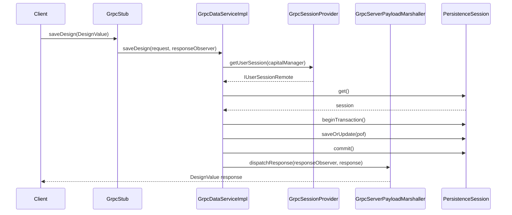
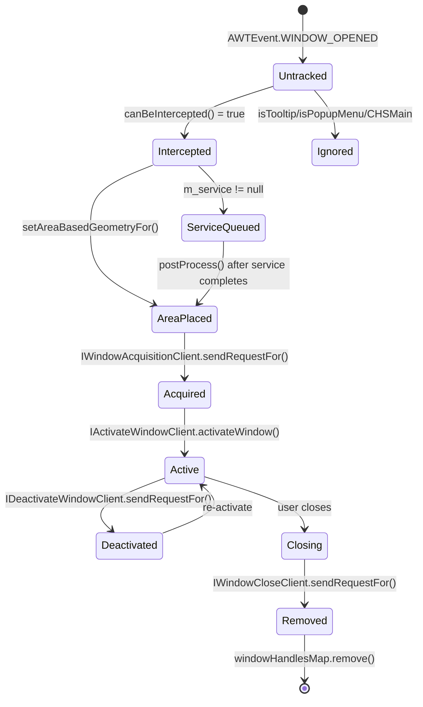
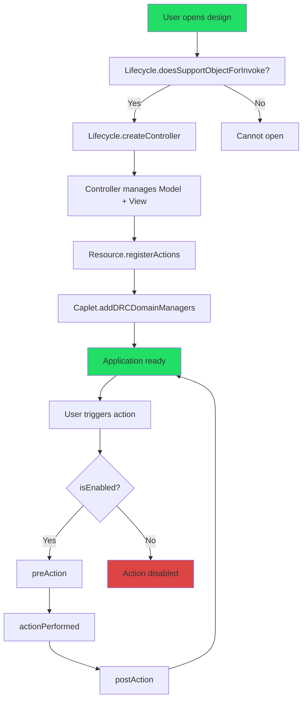

# Knowledge Sharing Session -- Use of AI

 
&nbsp;

## SESSION OUTLINE

&nbsp;

| # | Topic |
|---|-------|
| 1 | Github Copilot |
| 2 | The `.github` Knowledge Base & How It Works|
| 3 | The Problem & The Solution |
| 4 | Custom Instructions — Deep Dive with Examples |
| 5 | Skills — On-Demand Workflows |
| 6 | Prompt Files — Reusable Slash Commands |
| 7 | Custom Agents — Autonomous Specialists |
| 8 | Optimze the context window |
| 9 | Tips, Best Practices & Wrap-up |

&nbsp;
&nbsp;&nbsp;

&nbsp;
&nbsp;
&nbsp;

&nbsp;
&nbsp;&nbsp;

&nbsp;
&nbsp;
&nbsp;
&nbsp;
&nbsp;&nbsp;

&nbsp;
&nbsp;
&nbsp;


---
# Github Copilot
---

## Three Modes — Ask / Edit / Agent


&nbsp;

| Mode | Best For | Capital Example |
|------|----------|------------------|
| **Ask** 💬 | Quick questions, explanations | _"What does `ICapletController` provide?"_ |
| **Edit** ✏️ | Inline edits in the current open file | _"Add `@NotNull` to all parameters"_ |
| **Agent** 🤖 | Multi-file tasks, research, test generation | _"Generate unit tests for `AiUtils` following existing patterns"_ |

&nbsp;

---


### Quick Decision Rule

```
One file, one question?                     →  Ask or Edit
Multiple files, tools, terminal, research?  →  Agent
```

&nbsp;

---
&nbsp;


---


# The `.github` Knowledge Base

&nbsp;

---

&nbsp;

## Everything Lives in `.github/`

&nbsp;

- Commit to the repo — **shared with the whole team**
- Pull the branch → get all the AI-powered enhancements instantly

&nbsp;

```
.github/
├── copilot-instructions.md           ← Global rules (ALWAYS loaded)
│
├── instructions/                      ← Module-specific coding rules
│   ├── cframework.instructions.md    ← CAF UI patterns
│   ├── charness.instructions.md      ← Harness Designer patterns
│   ├── clogic.instructions.md        ← Capital Capture patterns
│   ├── cmanager.instructions.md      ← Persistence layer
│   ├── datamodel.instructions.md     ← COF implementation
│   ├── interfaces.instructions.md    ← Interface contracts
│   ├── grpc.instructions.md          ← gRPC service layer
│   └── capital-nx-integration.instructions.md
│
├── skills/                            ← On-demand workflows
│   ├── build-workflow/
│   ├── git-command/
│   ├── confluence-design-review/
│   └── jira-confluence-mcp-preflight/
│
├── prompts/                           ← Slash commands
│   ├── cof-model-development.prompt.md
│   ├── caplet-action-development.prompt.md
│   └── ...more
│
├── agents/                            ← Custom agents
│   ├── capital-nx.agent.md
│   ├── CIA-Orchestrator.agent.md
│   └── Thinking-Beast-Mode.agent.md
│
└── chat_md/                           ← Saved outputs
```

&nbsp;

---


---
# The Problem & The Solution
---

## The Problem

&nbsp;

- Generic LLM doesn't know Capital's architecture, module boundaries, or patterns
- Every single prompt needs repeated context:
  - _"Extend `AppAction`, not `AbstractAction`"_
  - _"Call `premodify()` before every setter"_
  - _"Use `@ApplicationSpecification(includeIn = {Application.CapitalHarness})` on every domain manager"_
  - _"Use `JUnit 4` with `MockitoJUnitRunner.Silent.class` — never `JUnit 5`"_
- Generated code uses wrong base classes, misses annotations, ignores conventions
- Developer spends **more time fixing** Copilot output than writing it manually
- No awareness of our modules: `cframework_src`, `datamodel_src`, `interfaces_src`, `cmanager_src`

&nbsp;

## The Solution — With Custom Instructions

&nbsp;

- **Custom Instructions** = persistent rules loaded into every Copilot conversation **automatically**
- LLM already knows your team's patterns **before you type a single word**
- Four layers work together:

&nbsp;

| Layer | What It Does | How It Loads |
|-------|-------------|--------------|
| **Instructions** | Module-specific coding rules | Auto — by file path (`applyTo`) |
| **Skills** | Procedural workflows | Auto — by keyword detection |
| **Prompt Files** | Reusable task templates | On demand — you type `/command` |
| **Agents** | Autonomous specialized workers | On demand — you select `@agent` |

&nbsp;

---
 

&nbsp;

## How `applyTo` Works — Automatic Scope

&nbsp;

- Each instruction file has an `applyTo` glob pattern in its YAML frontmatter
- When you open a file matching the pattern → those rules **auto-activate**
- **Zero manual steps** — the right rules apply to the right files automatically

&nbsp;

```yaml
---
applyTo: "cframework_src/**/*.java"
---
# These rules activate ONLY when editing CAF framework files
```

&nbsp;

| You're Editing | Instruction File Loaded Automatically |
|---------------|--------------------------------------|
| `cframework_src/.../MyAction.java` | `cframework.instructions.md` |
| `datamodel_src/.../Device.java` | `datamodel.instructions.md` |
| `interfaces_src/.../IDevice.java` | `interfaces.instructions.md` |
| `cmanager_src/.../grpc/MyService.java` | `grpc.instructions.md` |
| `charness_src/.../HarnessCaplet.java` | `charness.instructions.md` |

&nbsp;

---

&nbsp;

## How Instructions Flow into the LLM

&nbsp;

```
┌──────────────────────────────────────────────────────┐
│                    YOUR PROMPT                        │
│  "Create a DRC validator for bundle spacing"          │
└──────────────────┬───────────────────────────────────┘
                   │
                   ▼
┌──────────────────────────────────────────────────────┐
│              GHCP PRE-PROCESSING                      │
│                                                       │
│  1. Load copilot-instructions.md        (ALWAYS)     │
│  2. Match file path → load instructions  (AUTO)      │
│     charness_src/** → charness.instructions.md       │
│  3. Match intent/task → load skill       (AUTO)      │
│  4. Combine into SYSTEM PROMPT                       │
└──────────────────┬───────────────────────────────────┘
                   │
                   ▼
┌──────────────────────────────────────────────────────┐
│                  LLM (Claude / GPT)                   │
│                                                       │
│  System prompt now includes:                          │
│  ✓ "Extend AppAction for actions"                    │
│  ✓ "Use @ApplicationSpecification annotation"        │
│  ✓ "JUnit 4 with MockitoJUnitRunner.Silent.class"    │
│  
└──────────────────┬───────────────────────────────────┘
                   │
                   ▼
┌──────────────────────────────────────────────────────┐
│              CAPITAL-AWARE OUTPUT                     │
│  Code that follows YOUR team's conventions!          │
└──────────────────────────────────────────────────────┘
```

&nbsp;

---

&nbsp;

&nbsp;

&nbsp;

---
  

## Example 1: DRC Domain Manager — Before vs After

&nbsp;

**Prompt:** _"Create a DRC domain manager for harness bundle spacing validation"_

&nbsp;

### ❌ WITHOUT instructions

&nbsp;

```java
public class BundleSpacingValidator {
    public boolean validate(Object design) {
        // check spacing
        return true;
    }
}
```

&nbsp;

**Problems:** wrong base class, no `IDRCDomainManager`, no `@ApplicationSpecification`, uses `Object` instead of `IHarnessDesign`

&nbsp;

### ✅ WITH instructions

&nbsp;

```java
@ApplicationSpecification(includeIn = {Application.CapitalHarness})
public class BundleSpacingDRCDomainManager implements IDRCDomainManager {

    @Override
    public void addDRCRules(@NotNull DRCContext context) {
        context.addRule(new MinBundleSpacingRule(5.0)); // 5mm minimum
        context.addRule(new BundleRoutingClearanceRule());
    }

    @Override
    public String getDomainName() {
        return "Bundle Spacing Validation";
    }

    @Override
    public boolean isApplicable(@NotNull IHarnessDesign design) {
        return design.getBundles().hasNext();
    }
}
```

&nbsp;

- ✅ Implements `IDRCDomainManager`
- ✅ `@ApplicationSpecification` for CapitalHarness
- ✅ Uses `DRCContext` for rule registration
- ✅ Domain-aware — checks `IHarnessDesign` bundles

&nbsp;

---

&nbsp;

## Example 2: gRPC Service — Following the Contract

&nbsp;

**Prompt:** _"Create a new gRPC service for validating design integrity"_

&nbsp;

```java
public class GrpcDesignValidationServiceImpl
    extends GrpcDesignValidationServiceGrpc.GrpcDesignValidationServiceImplBase
    implements IGrpcService {

    private final IManagerLogin capitalManager;

    public GrpcDesignValidationServiceImpl(IManagerLogin capitalManager) {
        this.capitalManager = capitalManager;
    }

    @Override
    public @NotNull ServerServiceDefinition getServiceDefinition() {
        return bindService();
    }

    @Override
    public void validateDesign(StringValue request,
                               StreamObserver<StringValue> responseObserver) {
        responseObserver.onNext(StringValue.of("VALID"));
        responseObserver.onCompleted();
    }
}
```

&nbsp;

- ✅ Implements `IGrpcService`
- ✅ Constructor takes `IManagerLogin`
- ✅ Extends correct `...ImplBase`
- ✅ Returns `bindService()` from `getServiceDefinition()`
- ✅ `StreamObserver` pattern correct

&nbsp;

---
  

# Prompt Files — Reusable Slash Commands

&nbsp;

---

## What Are Prompt Files?

&nbsp;

- Reusable Markdown templates stored in `.github/prompts/`
- Each file becomes a **`/slash-command`** in Copilot Chat
- They carry **all the rules** — you only describe the **task**
- Committed to repo — whole team benefits instantly

&nbsp;

### The Problem They Solve

&nbsp;

```
❌ Without prompt file:
   "Add a connector count to IHarnessDesign. Remember to call premodify()
    in the implementation, fire PropertyChangeEvent, use @NotNull,
    follow VaultKey pattern, add the interface method in interfaces_src..."

✅ With prompt file:
   /cof-model  Add connectorCount property to IHarnessDesign
```

&nbsp;

---

&nbsp;

## Available Prompt Commands

&nbsp;

| Command | Purpose |
|---------|---------|
| `/cof-model` | COF entity development — interface + implementation patterns |
| `/caplet-action` | CAF actions, caplets, UI components |
| `/persistence-grpc` | PersistenceSession + gRPC service patterns |
| `/java-dev` | General Java coding — nullability, logging, EDT |
| `/nx-integration` | Capital-NX immersed mode integration |
| `/help-me-choose` | Not sure which prompt? Start here |
| `/history` | View last 10 prompts from your chat history |

&nbsp;

---

&nbsp;

## How Instructions + Prompts + Skills Stack Together

&nbsp;

```
You type:  /cof-model  Add description property to IDevice

┌──────────────────────────────────────────────────────┐
│  Custom Instructions (background, auto-loaded)        │
│  → datamodel.instructions.md (file is datamodel_src) │
│  → global copilot-instructions.md                    │
├──────────────────────────────────────────────────────┤
│  Prompt File (you triggered it with /)                │
│  → /cof-model gives step-by-step COF patterns        │
│  → Shows PropertyChange, premodify(), VaultKey        │
└──────────────────────────────────────────────────────┘
                        ↓
           Perfect Capital-aware output
```

&nbsp;

---
 
&nbsp;

## Creating Your Own Prompt File

&nbsp;

```markdown
---
description: One-line description in the prompt picker
name: my-task
argument-hint: describe the task
---

# My Task Title

You are helping with [specific domain] in Capital IESD-24.

## Rules
- Rule 1
- Rule 2

## Code Pattern Example
[Exact output format you want]
```

&nbsp;

- Create in `.github/prompts/`, commit → whole team gets it

&nbsp;

---

&nbsp;

&nbsp;

&nbsp;

---

# Custom Agents — Autonomous Specialists

&nbsp;

---

&nbsp;

## What Are Custom Agents?

&nbsp;

- Autonomous AI workers defined in `.github/agents/*.agent.md`
- **Pre-loaded domain expertise** + **MCP tools** + **strict behavioral rules**
- Can spawn sub-agents, run terminal commands, read/write files — all autonomously
- Committed to repo — the entire team gets the same specialized agents

&nbsp;

### Regular Chat vs Custom Agent

&nbsp;

| Aspect | Regular Copilot Chat | Custom Agent |
|--------|---------------------|--------------|
| **Knowledge** | General + instructions | Deep domain specialization + tools |
| **Autonomy** | Responds to each prompt | Executes multi-phase workflows autonomously |
| **Tools** | Standard file/terminal | MCP tools (Neo4j, Vector search, JIRA) |
| **Output** | Free-form | Enforced templates, badges, quality gates |
| **Sub-agents** | No | Can spawn specialized sub-workers |

&nbsp;

---

&nbsp;

## Agent 1 — `@capital-nx` — NX Integration Specialist

&nbsp;

| Property | Detail |
|----------|--------|
| **Scope** | `interfaces_src/.../immersed/**` |
| **Specialization** | Window lifecycle, EDT safety, REST payloads |
| **Knows** | `ImmersedModeServices`, `IWindowInfoProvider`, `IApplicationServiceExecutor` |

&nbsp;

**Example prompt:**
```
@capital-nx  Add window acquisition handling for a new popup dialog 
             that appears during service execution
```

&nbsp;

**What the agent enforces automatically:**
- `SwingUtilities.invokeLater()` for all UI operations
- `requireExtension()` for mandatory extensions
- `IGuard` pattern for temporary selection suppression
- `ImmersedAreaEnum.POPUP` as fallback geometry
- `windowHandlesMap` tracking on open
- `@NotNull` annotations everywhere

&nbsp;

---
&nbsp;

&nbsp;

---


# Mermaid Diagrams as LLM Context

&nbsp;

---

&nbsp;

## The Core Insight

&nbsp;

- 500 lines of Java code → ~2,000 tokens of syntax noise → LLM must **infer** relationships
- 20 lines of Mermaid diagram → ~200 tokens → LLM **knows** relationships explicitly
- **10× compression** of architectural knowledge
- Result: better first-attempt accuracy, fewer iteration cycles

&nbsp;

```
500 LOC of Device.java
  → LLM infers: "Device probably extends something"

20 lines of Mermaid
  → LLM knows: "Device extends AbstractDevice,
                 implements IDevice + IPrivilegedDevice,
                 has VaultKey for lazy props,
                 fires PropertyChangeEvent on setters,
                 is consumed by CaptureCaplet, HarnessCaplet,
                 DeviceInspector, GrpcDataService"
```

&nbsp;

---

&nbsp;

## The Technique — Three Steps

&nbsp;

```
Step 1:  GENERATE   →  Ask agent to create a Mermaid diagram from existing code
Step 2:  FEED       →  Include the diagram in your next prompt as context
Step 3:  MODIFY     →  Agent reasons over structure to plan and implement changes
```

&nbsp;

---

&nbsp;

## Example 1: gRPC Service Flow — Sequence Diagram

&nbsp;



&nbsp;

**Ask after feeding diagram:** _"Add a validation step before `saveOrUpdate`"_

- Agent inserts **exactly** between `beginTransaction()` and `saveOrUpdate()` — no guessing

&nbsp;

---

&nbsp;

## Example 2: NX Window Lifecycle — State Diagram

&nbsp;



&nbsp;

**Ask after feeding diagram:** _"Add a 'minimized' state for windows hidden during NX context switch"_

- Agent sees the full state machine — branches from `Active` exactly right

&nbsp;

---

&nbsp;

## Example 3: Caplet MVC Lifecycle — Flowchart

&nbsp;



&nbsp;

**Ask after feeding diagram:** _"Add a confirmation dialog before `actionPerformed` for destructive delete actions"_

- Agent inserts between `preAction` and `actionPerformed` — lifecycle is explicit

&nbsp;

---

&nbsp;

## Diagram Selection Guide

&nbsp;

| Task | Best Diagram Type |
|------|------------------|
| Add a property / understand hierarchy | **Class diagram** |
| Understand a call flow | **Sequence diagram** |
| Impact analysis across modules | **Dependency graph** |
| Debug event or state flow | **State diagram** |
| Lifecycle or decision logic | **Flowchart** |

&nbsp;

---

&nbsp;

## Expert Pattern: Generate → Modify → Implement

&nbsp;

```
1. "Generate the IHarnessDesign class diagram with all consumers"
2.  Modify the diagram — add a new method or class
3. "Implement the changes shown in this modified diagram"
```

&nbsp;

- The diagram IS the specification — no ambiguity, zero wrong code

&nbsp;

- We have **12 architecture diagrams** auto-loaded in `architecture-diagrams.instructions.md`
- Every time you edit a `.java` file, the LLM already has the full architectural picture

&nbsp;

---

&nbsp;

&nbsp;

&nbsp;

---
# Tips, Best Practices & Wrap-up

&nbsp;

---

&nbsp;

## Do's — Efficient Copilot Usage

&nbsp;

- ✅ **Continue the same chat** — Keep context alive! If you're working on related tasks, stay in the same conversation thread instead of starting fresh
- ✅ **Search your chat history** — Use `/history` or VS Code's chat history to find similar problems you've solved before
- ✅ **Start over if the agent is confused** — If responses drift off-track after 3-4 exchanges, start a new chat with a clearer prompt
- ✅ **Use `/slash-commands` for repeated tasks** — _"/cof-model add property"_ is faster than explaining the full pattern every time
- ✅ **Let @agents run autonomously** — Don't interrupt multi-phase workflows; agents will report progress and ask if they need clarification
- ✅ **Reference existing files as examples** — _"Follow the pattern in `AiUtilsTest.java`"_ gives concrete context
- ✅ **Be specific with file paths and line numbers** — _"In Device.java line 145"_ is better than _"in the Device class"_
- ✅ **Iterate in the same chat** — _"Good, but also add `@NotNull`"_ builds on prior context efficiently
- ✅ **Use skills for automation** — Type keywords like "code review", "design review", "git" to trigger specialized workflows
- ✅ **Save successful prompts** — When you find a prompt that works well, save it to `.github/prompts/` for team reuse

&nbsp;

## Don'ts — Avoid These Inefficiencies

&nbsp;

- ❌ **Don't start a new chat for every small question** — Context switching is expensive; batch related questions in one thread
- ❌ **Don't keep pushing when the agent misunderstands** — After 2-3 failed attempts, rephrase completely or start fresh
- ❌ **Don't use Agent mode for trivial edits** — _"Add a comment to line 10"_ → use Edit mode, it's instant
- ❌ **Don't forget to verify generated code** — Always review output; Copilot is highly accurate but not infallible
- ❌ **Don't manually repeat the same task** — If you're doing something twice, create a `/prompt` or use a skill
- ❌ **Don't work without instructions loaded** — Check that the right `.instructions.md` files apply to your current file path
- ❌ **Don't paste huge code blocks** — Use file references: _"Read MyClass.java"_ instead of pasting 500 lines

&nbsp;

---

&nbsp;

# Thank You & Questions?

&nbsp;


