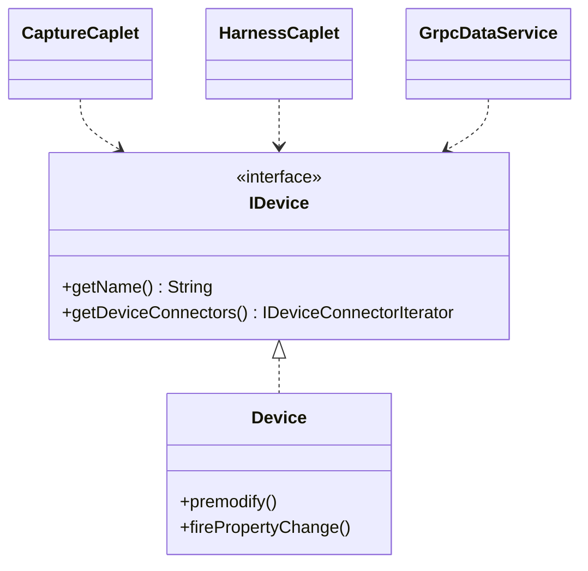
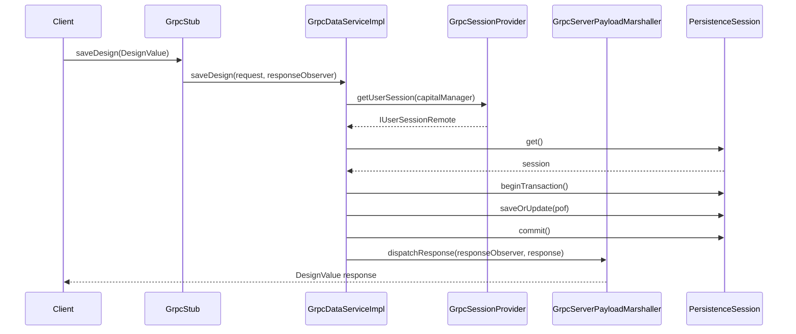
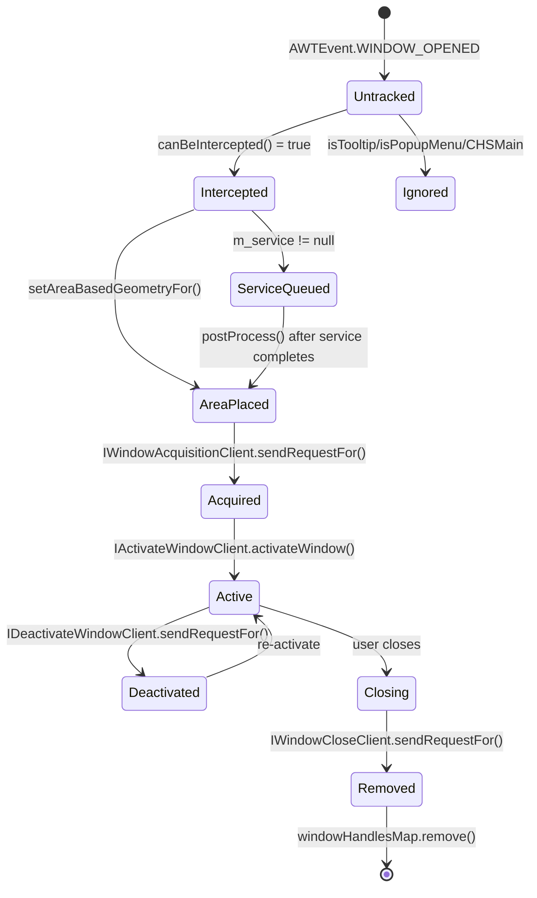
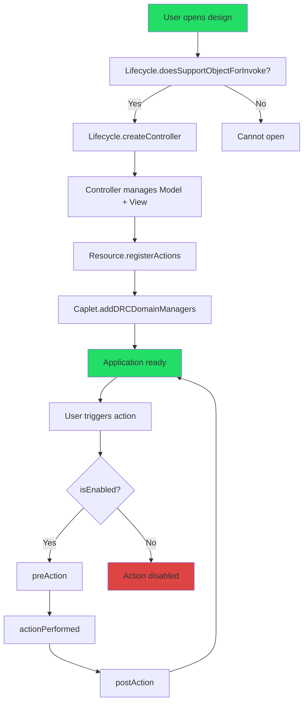

# Mermaid Diagrams as LLM Context — The Secret Weapon

> **For:** Knowledge Sharing Session — Developers & QA on Capital IESD-24
> **Date:** February 2026

---

## TABLE OF CONTENTS

1. [The Core Insight](#1-the-core-insight)
2. [How It Works — The Technique](#2-how-it-works)
3. [Why Mermaid Specifically](#3-why-mermaid-specifically)
4. [Capital Code Examples — Before vs After](#4-capital-code-examples)
5. [Architecture-Diagrams Instruction File](#5-architecture-diagrams-instruction-file)
6. [Best Diagram Types by Task](#6-best-diagram-types-by-task)
7. [Advanced Techniques](#7-advanced-techniques)
8. [Expert Skills to Accelerate Productivity](#8-expert-skills-to-accelerate-productivity)
9. [Quick Reference](#9-quick-reference)

---

## 1. THE CORE INSIGHT

### Slide: The Problem with Raw Code as Context

**Bullet Points:**
- A 500-line Java class consumes ~2000 tokens of context window — mostly syntax noise
- LLM must **infer** relationships from `extends`, `implements`, `import` statements
- Deep inheritance like `Device → AbstractDevice → LogicObject → NamedObject → UIDObject` is hard to hold in context
- Cross-module dependencies are invisible without reading 10+ files
- Result: LLM guesses relationships → hallucinated code → wasted iteration cycles

### Slide: The Solution — Structured Diagrams as Context

**Bullet Points:**
- A 20-line Mermaid diagram captures the **same relationships** as 500 lines of code
- Relationships are **explicit** — no inference needed
- LLM reasons over **structure**, not syntax
- Token-efficient: 10x compression of architectural knowledge
- Result: Better first-attempt accuracy, fewer iterations, architecturally sound output

### Slide: The Key Insight

> **LLMs don't "see" architecture in code. They see text tokens.**
> A class diagram makes architecture visible as text — the one format LLMs actually understand.

```text
500 LOC of Device.java → LLM infers: "Device probably extends something"
20 lines of Mermaid     → LLM knows: "Device extends AbstractDevice extends LogicObject,
                                       implements IDevice + IPrivilegedDevice,
                                       has VaultKey for lazy props,
                                       fires PropertyChangeEvent on setters,
                                       is used by CaptureCaplet, HarnessCaplet,
                                       DeviceInspector, GrpcDataService"
```

---

## 2. HOW IT WORKS

### Slide: Three-Step Workflow

```text
Step 1: GENERATE     → Ask agent to create Mermaid diagram from existing code
Step 2: FEED         → Include diagram in your next prompt as context
Step 3: MODIFY       → Agent reasons over diagram to plan and execute changes
```

### Slide: Step 1 — Generate Diagram from Code

**Prompt:**

```text
Generate a Mermaid class diagram showing the IDevice interface hierarchy,
all its implementations, and all classes that use IDevice across modules.
```

**Agent reads code across modules and produces:**



### Slide: Step 2 — Feed Diagram as Context

**Prompt:**

```text
Using this class diagram as context:

[paste diagram here]

Add a "wireGauge" property to IDevice interface and implement it in Device.java.
Make sure all consumers listed in the diagram are considered for impact.
```

### Slide: Step 3 — Agent Reasons Over Structure

Agent now **sees** from the diagram:
- Interface change goes in `IDevice` (interfaces_src)
- Implementation goes in `Device` (datamodel_src) with `premodify()` + `firePropertyChange()`
- `CaptureCaplet`, `HarnessCaplet`, `GrpcDataService` are affected consumers
- No need to grep 30,000 files — the diagram has the answer

---

## 3. WHY MERMAID SPECIFICALLY

### Slide: Diagram Formats Compared

| Format | Text-Based? | LLM-Friendly? | Renderable? | Editable? |
|--------|------------|---------------|-------------|-----------|
| **Mermaid** | ✅ Yes | ✅ Perfect | ✅ GitHub, VS Code, Confluence | ✅ Easy |
| PlantUML | ✅ Yes | ✅ Good | ⚠️ Needs server | ✅ Easy |
| PNG/SVG | ❌ No | ❌ Cannot read | ✅ Yes | ❌ Hard |
| Draw.io XML | ✅ Yes | ❌ Too verbose | ✅ Yes | ⚠️ Generated |
| ASCII art | ✅ Yes | ⚠️ Fragile | ❌ Not pretty | ⚠️ Manual |

### Slide: Why Mermaid Wins

1. **It's plain text** — fits naturally into Markdown, instructions, prompts
2. **GitHub renders it natively** — in PRs, README files, issues
3. **VS Code renders it** — with Mermaid preview extensions
4. **Confluence renders it** — via Mermaid macros
5. **LLMs can generate AND consume it** — bidirectional unlike images
6. **It's version-controllable** — diffs are meaningful
7. **It's compact** — a 50-class hierarchy fits in 40 lines

---

## 4. CAPITAL CODE EXAMPLES — BEFORE VS AFTER

### EXAMPLE 1: Adding a Property to IDevice

#### WITHOUT Diagram Context

**Prompt:** "Add a description property to IDevice and implement it"

**LLM generates (WRONG):**

```java
// ❌ Missing premodify(), wrong hierarchy, no PropertyChange
public interface IDevice {
    String getDescription();
    void setDescription(String desc);
}

public class Device implements IDevice {
    private String description;
    public void setDescription(String desc) { this.description = desc; }
}
```

#### WITH Diagram Context

**Prompt:** "Using the COF Entity Hierarchy diagram, add description to IDevice"

**LLM generates (CORRECT):**

```java
// In interfaces_src — IDevice interface
@Nullable
String getDescription();
void setDescription(@NotNull String description);

// In datamodel_src — Device implementation
@Override
public void setDescription(@NotNull String description) {
    premodify();  // ← Diagram showed Device has premodify()
    String oldDescription = this.m_description;
    this.m_description = description;
    pcs.firePropertyChange("description", oldDescription, description);  // ← Diagram showed PropertyChangeSupport
}
```

---

### EXAMPLE 2: Understanding gRPC Service Flow

#### Sequence Diagram Fed as Context



**Now ask:** "Add a validation step before `saveOrUpdate` in this flow"

Agent knows exactly where to insert — between `beginTransaction()` and `saveOrUpdate()` — because the sequence diagram makes the order explicit.

---

### EXAMPLE 3: NX Window Lifecycle

#### State Diagram Fed as Context



**Now ask:** "Add a 'minimized' state where windows can be temporarily hidden without closing"

Agent sees the full state machine and knows exactly where to add the new state — branching from `Active`.

---

### EXAMPLE 4: Caplet MVC Flow

#### Flowchart Fed as Context



**Now ask:** "Add a confirmation dialog step before actionPerformed for destructive actions"

Agent inserts between `preAction` and `actionPerformed` — diagram made the lifecycle explicit.

---

## 5. ARCHITECTURE-DIAGRAMS INSTRUCTION FILE

### Slide: What We Created

We created `.github/instructions/architecture-diagrams.instructions.md` with:

| # | Diagram | Covers | Use When |
|---|---------|--------|----------|
| 1 | Module Dependency Graph | All 8 modules + dependencies | Cross-module changes |
| 2 | COF Entity Hierarchy | IUIDObject → IDevice → IConductor | Entity property changes |
| 3 | COF Implementation Hierarchy | UIDObject → Device + premodify/PropertyChange | Implementation changes |
| 4 | CAF Action Framework | AppAction → ViewActionRT → ControllerActionRT | Creating new actions |
| 5 | Caplet Architecture (MVC) | ICaplet → Lifecycle → Controller → View/Model | Caplet modifications |
| 6 | Persistence Layer | PersistenceSession → Pof → HibernateUtil | Database access code |
| 7 | gRPC Service Architecture | IGrpcService → GrpcSessionProvider → Marshaller | gRPC development |
| 8 | NX Immersed Mode | ImmersedModeServices → WindowInterceptor → Clients | NX integration |
| 9 | DRC Validation Framework | IDRCDomainManager → DRCContext → Caplet registration | DRC validators |
| 10 | Harness Domain Model | IHarnessDesign → IBundle → IClip → IGrommet | Harness domain work |
| 11 | Design Container Hierarchy | IProject → IDesign → ILogicDesign / IHarnessDesign | Design navigation |
| 12 | IFIB Service Locator | IFIB → ProjectMgr → CapletMgr → UIMgr | Framework services |

### Slide: How It Auto-Loads

```yaml
applyTo: "**/*.java"
```

This means **every time you edit any Java file**, all 12 diagrams are loaded into context. The LLM always has the full architectural picture.

---

## 6. BEST DIAGRAM TYPES BY TASK

### Slide: Diagram Selection Guide

| Task | Diagram Type | Why |
|------|-------------|-----|
| Add a property | **Class diagram** | Shows inheritance + who implements/uses |
| Understand a flow | **Sequence diagram** | Shows method call order across classes |
| Impact analysis | **Dependency graph** | Shows module-to-module ripple effects |
| Refactoring | **Component diagram** | Shows module responsibilities |
| Debug event flow | **State diagram** | Shows state transitions + edge cases |
| Lifecycle changes | **Flowchart** | Shows decision points + order |
| API design | **Class diagram** | Shows contracts + hierarchies |
| Performance | **Sequence diagram** | Shows call depth + bottleneck points |

---

## 7. ADVANCED TECHNIQUES

### Technique 1: Generate → Modify → Re-generate

```text
Step 1: "Generate class diagram for IDevice hierarchy"
Step 2: Modify the diagram in your editor (add new class/property)
Step 3: "Implement the changes shown in this modified diagram"
```

The LLM now has a **visual diff** — it knows exactly what changed.

### Technique 2: Embed Diagrams in Instruction Files

We already did this — `.github/instructions/architecture-diagrams.instructions.md` embeds diagrams that auto-load when editing Java files.

### Technique 3: Sequence Diagram as Test Specification

```text
"Given this sequence diagram of the login flow, generate integration tests
that verify each step in the sequence, including error paths"
```

Each arrow in the diagram becomes a test assertion.

### Technique 4: State Diagram as FSM Implementation

```text
"Implement a state machine for the window lifecycle shown in this state diagram.
Use the State pattern with enum-based states."
```

Each state becomes an enum value. Each transition becomes a method.

### Technique 5: Dependency Graph for Build Order

```text
"Using the module dependency graph, determine the correct build order
if I change interfaces_src"
```

Agent uses topological sort on the graph to determine: `interfaces_src → datamodel_src → cframework_src → clogic_src → charness_src → cmanager_src`.

---

## 8. EXPERT SKILLS TO ACCELERATE PRODUCTIVITY

### Slide: Skills We Should Create Next

Based on the Mermaid technique and Capital codebase patterns, here are expert skills that would dramatically boost team productivity:

| # | Skill | What It Does | Impact |
|---|-------|-------------|--------|
| 1 | **diagram-first-development** | Auto-generates Mermaid diagram → verifies with dev → implements from diagram | Eliminates "wrong first attempt" problem |
| 2 | **code-review-checklist** | Scans changes against instruction rules: premodify, PropertyChange, @NotNull, EDT safety | Catches 80% of review comments before PR |
| 3 | **test-generation** | Generates JUnit 4 + Mockito tests matching AiUtilsTest patterns per module | Consistent test quality across team |
| 4 | **refactoring-patterns** | Guides safe refactoring with pre/post diagrams and rollback plan | Reduces refactoring risk |
| 5 | **performance-profiling** | Identifies lazy-load misses, N+1 queries, EDT-blocking calls | Catches perf issues before production |
| 6 | **api-documenter** | Generates Javadoc from interface definitions + usage patterns | Consistent API docs with zero effort |
| 7 | **migration-assistant** | Handles javax→jakarta, API version upgrades with cross-module consistency | Clean migrations without breaking downstream |
| 8 | **security-audit** | Reviews gRPC session validation, SQL injection, input sanitization | Proactive security coverage |
| 9 | **onboarding-guide** | Interactive Capital architecture explainer with progressive Mermaid diagrams | New devs productive in days, not weeks |
| 10 | **pr-description-generator** | Auto-generates PR description with affected modules, test coverage, risk assessment | Saves 15 min per PR |

### Slide: Skill Priority Matrix

```text
High Impact + Easy to Create:
  ✅ code-review-checklist    — rules already exist in instruction files
  ✅ test-generation          — patterns already exist (AiUtilsTest, HarnessTestCase)
  ✅ pr-description-generator — just template + git diff analysis

High Impact + Medium Effort:
  ⚡ diagram-first-development — needs diagram generation + verification loop
  ⚡ onboarding-guide          — needs progressive disclosure design
  ⚡ refactoring-patterns      — needs before/after diagram generation

High Impact + Higher Effort:
  🔧 performance-profiling    — needs profiler integration knowledge
  🔧 security-audit           — needs security checklist research
  🔧 migration-assistant      — needs version-specific migration paths
```

### Slide: Expert Patterns People Don't Know About

#### Pattern 1: Chain of Reasoning via Diagrams

Most people ask: "Add a property to Device"

Experts ask:

```text
1. "Generate the IDevice class diagram with all consumers"
2. "Based on this diagram, what's the full impact of adding wireGauge?"
3. "Now implement it — interface in interfaces_src, impl in datamodel_src,
    handle all consumers shown in the diagram"
```

Three prompts → zero wrong code.

#### Pattern 2: Diagram as Specification

Instead of writing a spec document in English, draw a Mermaid diagram:

```text
Here's my design:
[paste Mermaid class diagram with new classes]

Implement everything shown in this diagram following Capital coding patterns.
```

The diagram IS the specification. No ambiguity.

#### Pattern 3: Diagram Diff as Change Request

Modify an existing diagram and tell the agent:

```text
I changed this diagram [paste modified version].
The differences from the original are:
- Added IWireConductor.getGauge() method
- Added WireConductor.m_gauge field
- Added DRCWireGaugeValidator class

Implement only the changes (the diff).
```

#### Pattern 4: Reverse Engineering via Diagrams

When you inherit unfamiliar code:

```text
"Generate a sequence diagram showing what happens when a user places a
device in Capital Capture, from mouse click to database commit"
```

You get a visual walkthrough of the entire flow in 30 seconds. No reading 15 files.

#### Pattern 5: Architecture Decision Records (ADR) with Diagrams

```text
"I need to decide between Strategy pattern and State pattern for window
lifecycle management. Generate both as class diagrams and compare them
against the existing ImmersedModeServices architecture."
```

Agent generates both options, compares against your actual code, and recommends the best fit.

---

## 9. QUICK REFERENCE

### Slide: Mermaid Cheat Sheet

```markdown
# Class Diagram
classDiagram
    class ClassName {
        +publicMethod() ReturnType
        -privateField: Type
    }
    ClassA <|-- ClassB           %% inheritance
    ClassA <|.. ClassC           %% implementation
    ClassA *-- ClassD            %% composition
    ClassA o-- ClassE            %% aggregation
    ClassA ..> ClassF            %% dependency

# Sequence Diagram
sequenceDiagram
    A->>B: method call
    B-->>A: return value
    A->>A: self-call

# State Diagram
stateDiagram-v2
    [*] --> State1
    State1 --> State2: event
    State2 --> [*]

# Flowchart
flowchart TD
    A[Step 1] --> B{Decision?}
    B -->|Yes| C[Step 2a]
    B -->|No| D[Step 2b]
```

### Slide: Quick Reference Card (Handout)

```text
┌─────────────────────────────────────────────────────────────┐
│       MERMAID DIAGRAMS AS LLM CONTEXT — CHEAT SHEET         │
├─────────────────────────────────────────────────────────────┤
│ THE TECHNIQUE:                                               │
│   1. Generate diagram from code (ask Agent)                  │
│   2. Feed diagram into next prompt                           │
│   3. Agent reasons over structure, not syntax                │
│                                                              │
│ DIAGRAM → TASK MAPPING:                                      │
│   Class diagram    → Add property, understand hierarchy      │
│   Sequence diagram → Understand flow, add steps              │
│   State diagram    → Window lifecycle, FSM changes           │
│   Flowchart        → Build order, decision trees             │
│   Dependency graph → Impact analysis, module changes         │
│                                                              │
│ AUTO-LOADED DIAGRAMS (architecture-diagrams.instructions.md):│
│   12 diagrams covering all Capital modules                   │
│   Loaded automatically when editing any .java file           │
│                                                              │
│ TOKEN SAVINGS:                                               │
│   500 LOC → ~2000 tokens (raw code)                         │
│   20-line diagram → ~200 tokens (10x compression)            │
│                                                              │
│ EXPERT PATTERNS:                                             │
│   Generate → Modify → Implement (diagram as spec)           │
│   Diagram diff → targeted implementation                     │
│   Reverse engineer → sequence diagram of unknown code        │
│   ADR → compare patterns via diagrams                        │
└─────────────────────────────────────────────────────────────┘
```

---

*Document prepared by GHCP Agent | February 2026*
