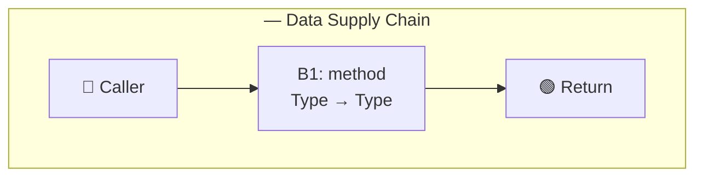

# Code Deep-Dive — <ClassName>.<methodName> (or Class/Feature Overview)

> **Context:** Brief 1-2 sentence context — what code is being deep-dived, why the user
> wants to understand it (learning, onboarding, pre-refactoring, code review prep, etc.).

---

## Target Code

| Property | Value |
|---|---|
| Class | `ClassName` |
| Method | `methodName` (or "class-level" / "feature-level") |
| Package | `com.example.package` |
| File | `src/path/to/File.java` |
| Deep-Dive Level | method / class / feature |

---

## 1. High-Level Overview

<!-- PURPOSE: What does this code do? What is its responsibility in the system?
     Keep this section to 3-5 sentences maximum. -->

- **Purpose:** What this code exists to do — one sentence
- **Responsibility:** Where it sits in the architecture (layer, module, domain)
- **Design Role:** Pattern it implements (e.g., Service, Repository, Strategy, Handler)
- **Callers:** Who calls this code? What triggers its execution?

---

## 2. Data Flow

<!-- INPUTS → TRANSFORMATIONS → OUTPUTS. Trace what data enters, how it changes,
     and what comes out. Include types. -->

### Inputs

| Parameter / Source | Type | Description |
|---|---|---|
| `paramName` | `Type` | What this input represents |

### Transformations

<!-- Describe each major transformation step. Use numbered steps or a flow diagram. -->

1. Step 1 — what happens first
2. Step 2 — what happens next
3. Step 3 — final transformation

### Outputs

| Return / Side-Effect | Type | Description |
|---|---|---|
| Return value | `Type` | What the caller receives |
| Side-effect | Description | External state changes (DB, cache, file, event) |

---

## 2a. Refactored View (Virtual Extracted Calls)

<!-- THE SINGLE MOST IMPORTANT ARTEFACT. Show the original method body rewritten as if
     every logical section had been extracted into a well-named method. The developer reads
     this and understands the entire structure in under a minute.

     RULES:
     - Rewrite the method body using virtual method names — one line per extracted call
     - Each line has the B-ref, virtual call, and the source line range in a comment
     - Data flows visibly through variable names between calls
     - Must be compilable-looking Java (not pseudocode)
     - Keep the original method's signature and control flow intact
     - Handling branches: keep if-else/loops in the refactored view, extract branch bodies
     - Handling nested complexity: decompose complex extracted methods further (B3a, B3b...)

     For class scope: show a refactored view per public method + class-level orchestration
     For feature scope: show cross-class flow with ──handoff──→ markers between classes -->

### Method-Scope Refactored View

<!-- Paste the refactored view here. Example structure:

public Receipt processOrder(Order order) {
    Order validated   = validateAndGuardInputs(order);                  // B1: L30-45
    double subtotal   = calculateSubtotal(validated.getItems());        // B2: L46-58
    double discounted = applyDiscountRules(subtotal, order.getDiscount()); // B3: L59-68
    double taxed      = calculateTax(discounted, getTaxRate());         // B4: L69-78
    Receipt receipt   = buildReceipt(validated, subtotal, discounted, taxed); // B5: L79-95
    persistAndNotify(receipt);                                          // B6: L96-110
    return receipt;                                                     // L111
}

What this gives the developer:
- The pipeline is visible — data flows left to right through variable names
- Each virtual method name is an intent-revealing summary of that code section
- The B-refs and line ranges let them jump to the detailed breakdown (§4)
- The structure is immediately clear (validate → calculate → discount → tax → persist)
-->

```java
// === REFACTORED VIEW ===
// <ClassName>.<methodName>() — virtual extracted calls

// Paste refactored method here
```

### Class-Scope Orchestration View (if applicable)

<!-- For class scope: show how public methods relate to each other and shared state.
     Show: constructor injection (setup phase), primary flow, secondary flows,
     shared state, shared dependencies. -->

```java
// === CLASS-LEVEL ORCHESTRATION VIEW ===
// <ClassName> — N public, M total — <one-line responsibility>

// Primary flow:
// public ReturnType mainMethod(...) { ... }

// Secondary flows:
// public ReturnType otherMethod(...) { ... }

// Shared state: <fields written by method A, read by method B>
// Shared dependency: <injected dependencies used by multiple methods>
```

### Feature-Scope Cross-Class Flow (if applicable)

<!-- For feature scope: show the cross-class flow as a sequence diagram in code form.
     Data handoff points between classes are the critical insight.
     Use ──handoff──→ markers where data crosses class boundaries.
     Label each class with its role: entry, orchestration, computation, persistence.
     Use C*n*-B*n* IDs to uniquely identify blocks across classes. -->

```java
// === FEATURE FLOW: <Feature Name> (N classes, M handoff points) ===

// 1. Entry — <boundary type>
// ClassName.method(params) {
//     ...                                                             // C1-B1
//     result = nextClass.method(data);                                // ──handoff──→ C2
//     ...                                                             // C1-B2
// }

// 2. Orchestration — business logic
// ...

// 3. Pure computation — no side-effects
// ...

// 4. Persistence — side-effect boundary
// ...
```

---

## 2b. Data Supply Chain — Pipeline Diagram

<!-- DATA SUPPLY CHAIN. Visual pipeline showing data transformation at each stage (B-ref),
     type changes, side effects, error paths, null safety, mutation markers, and variable
     lifecycle. This section makes the data pipeline explicit — the Refactored View shows
     the pipeline in code; this section shows it as a visual diagram.

     Include when: method 15+ lines with 2+ transformations, OR class/feature scope.
     Skip when: method ≤ 15 lines and linear (Refactored View is sufficient). -->

### 2b.1 — End-to-End Pipeline Diagram (ASCII)

<!-- ASCII flow: each B-ref is a station. Data enters left, transforms at each station,
     exits right. Side effects branch downward. Error paths branch upward.
     Show: Input type, Output type, Side-effects, Errors per station. -->

```text
                         DATA SUPPLY CHAIN — <MethodName>(<Params>)
                         ════════════════════════════════════════════

  ┌─────────┐      ┌──────────────┐      ┌──────────────┐      ┌─────────┐
  │ CALLER  │─────→│     B1       │─────→│     B2       │─────→│ RETURN  │
  │         │      │ <method>     │      │ <method>     │      │         │
  └─────────┘      └──────────────┘      └──────────────┘      └─────────┘

  Input:           Input:                Input:                  Return:
  <type>           <type>                <type>                  <type>

                   Output:               Output:
                   <type>                <type>

                   Side-effects: none    Side-effects: <or none>
                   Errors: <E-refs>      Errors: <E-refs>
```

### 2b.2 — Stage Card Table

<!-- Compact tabular view. Each row = one pipeline stage (B-ref).
     Columns: Stage, B-ref, Input, Type In, Transformation, Output, Type Out,
     Side Effects, Errors, Null-Safe?, Mutates Input? -->

| Stage | B-ref | Input | Type In | Transformation | Output | Type Out | Side Effects | Errors | Null-Safe? | Mutates Input? |
|---|---|---|---|---|---|---|---|---|---|---|
| 1 | B1 | `param` | `Type` | description | `output` | `Type` | none | — | ✅/❌ | No |

### 2b.3 — Variable Lifecycle Tracker

<!-- Show when each significant variable is born (●), alive (━━━), consumed (○),
     field-mutated (✦). Track across pipeline stages. -->

```text
Variable Lifecycle — <MethodName>(<Params>)
═══════════════════════════════════════════

Variable          B1          B2          B3          Return
──────────────────────────────────────────────────────────────
varName           ●━━━━━━━━━━━━━━━━━━━━━━○
                  born(arg)   read        consumed
```

### 2b.4 — Pipeline Health Indicators

<!-- Annotate each stage with health indicators:
     ✅ safe, ⚠ caution, ❌ risk.
     Vocabulary: NULL-UNSAFE, NULL-SAFE, PURE, IMMUTABLE, MUTATES-INPUT,
     MUTATES-FIELD, NOT-THREAD-SAFE, UNCONSTRAINED, HARDCODED, MIXED-CONCERNS,
     FIRE-AND-FORGET, NON-ATOMIC, SILENT-RETURN, DELEGATES, DETERMINISTIC,
     IDEMPOTENT, LOSSY, BLOCKING, CACHED, TRANSACTIONAL, OUTSIDE-TX. -->

```text
Pipeline Health — <MethodName>(<Params>)
═══════════════════════════════════════

Stage  B-ref  Health Indicators
─────  ─────  ──────────────────────────────────────────
  1    B1     ✅/⚠/❌ INDICATOR — description
  2    B2     ✅/⚠/❌ INDICATOR — description
```

```text
Pipeline Health Score:
  ✅ Safe stages:    <list>
  ⚠ Caution stages: <list>
  ❌ Risk stages:    <list>

  Biggest risk:     <description>
  Recommended focus: <description>
```

### 2b.5 — Mermaid Pipeline Visualization

<!-- Mermaid flowchart: solid arrows for data flow, dotted for errors/side-effects.
     Green nodes = safe/pure, Yellow = caution, Red = risk.
     Include when: method 50+ lines, class scope, or feature scope. -->



---

## 3. Code Internals

<!-- This group covers the detailed code analysis:
     §3a Method Extraction Tree (call stack, code blocks, line-by-line, state changes)
     §3b Error & Exception Map (all failure modes)
     §3c Design Rationale (why this pattern was chosen) -->

---

## 3a. Call Stack / Method Flow

<!-- WHO CALLS WHAT. Trace the sequence of method calls from entry point through
     all significant internal calls. Use indentation to show nesting. -->

```text
EntryPoint.method()
  → ClassA.methodOne()
    → ClassB.methodTwo()
      → ClassC.helperMethod()
    → ClassB.methodThree()
  → ClassA.methodFour()
```

### Call Sequence Detail

| # | Caller | Callee | Purpose | Returns |
|---|---|---|---|---|
| 1 | `EntryPoint.method()` | `ClassA.methodOne()` | Description | `Type` |
| 2 | `ClassA.methodOne()` | `ClassB.methodTwo()` | Description | `Type` |

---

## 3a (cont). Code Block Breakdown

<!-- FUNCTIONAL COHESION. Split the code into logical blocks based on what each
     section does. Each block gets a name, line range, and explanation. -->

### Block 1 — <Block Name> (lines X-Y)

```java
// paste the relevant code block here
```

**What it does:** Explanation of this block's purpose and logic.

**Why it's here:** How this block fits into the overall method/class flow.

### Block 2 — <Block Name> (lines X-Y)

```java
// paste the relevant code block here
```

**What it does:** Explanation of this block's purpose and logic.

**Why it's here:** How this block fits into the overall method/class flow.

<!-- Repeat for each functional block. Aim for 3-8 blocks per method. -->

---

## 3a (cont). Line-by-Line Walkthrough

<!-- DETAILED ANALYSIS of key logic lines. Skip boilerplate (imports, getters/setters,
     standard constructor assignments). Focus on lines where decisions happen,
     algorithms execute, or subtle behaviour occurs. -->

| Line | Code | Explanation |
|---|---|---|
| 42 | `if (order.isValid())` | Guards against processing invalid orders — delegates to `Order.isValid()` |
| 43 | `var total = items.stream()...` | Streams over order items to calculate subtotal |
| 47 | `total = applyDiscount(total, order.getDiscount())` | Applies percentage discount — can return negative if discount > 100% (bug?) |

---

## 3a (cont). State Changes

<!-- HOW STATE EVOLVES. Track fields, local variables, and external state through
     the execution. Use a table or timeline. -->

| Point in Execution | Variable / Field | Before | After | Why |
|---|---|---|---|---|
| After line 42 | `isProcessing` | `false` | `true` | Guard passed, processing begins |
| After line 47 | `total` | `100.00` | `90.00` | 10% discount applied |

---

## 3b. Edge Cases & Error Paths

<!-- WHAT CAN GO WRONG. Enumerate edge cases, exception paths, and boundary
     conditions. For each, explain what happens. -->

| Edge Case | Input / Condition | Behaviour | Handled? |
|---|---|---|---|
| Null input | `order == null` | `NullPointerException` at line 42 | No — missing null check |
| Empty items | `order.getItems().isEmpty()` | Returns 0.0 | Yes — stream returns identity |
| Negative discount | `discount > 1.0` | Negative total returned | No — not validated |

---

## 3c. Design Rationale

<!-- WHY THIS PATTERN WAS CHOSEN. Trade-offs, constraints, rejected alternatives,
     evolution risk. Include for any code with non-obvious design decisions. -->

| Aspect | Detail |
|---|---|
| Pattern used | <e.g., Strategy, Template Method, procedural pipeline> |
| Why this pattern | <motivation, constraints that drove the decision> |
| Alternative rejected | <what else was considered and why it was dropped> |
| Evolution risk | <what happens when requirements change — where does this design break?> |

---

## 4. Context & Reference

<!-- This group covers external context and quick-reference material:
     §4a Dependencies & Coupling (what surrounds this code)
     §4b Key Takeaways & Cheat Sheet (what to do with this knowledge) -->

---

## 4a. Dependencies & Coupling

<!-- WHAT THIS CODE DEPENDS ON, AND WHAT DEPENDS ON IT. -->

### Depends On (outgoing)

| Dependency | Type | Coupling | Notes |
|---|---|---|---|
| `OrderRepository` | Interface | Loose | Injected via constructor |
| `DiscountService` | Concrete class | Tight | Direct method call — not abstracted |

### Depended On By (incoming)

| Dependent | How | Notes |
|---|---|---|
| `OrderController` | Calls `processOrder()` | Entry point from HTTP layer |
| `BatchProcessor` | Calls `processOrder()` in loop | Batch job — performance-sensitive |

---

## 4b. Key Takeaways

<!-- SUMMARY for future reference. What did you learn? What's important to remember? -->

- Takeaway 1
- Takeaway 2
- Takeaway 3

---

## 5. Recent Changes Impact Analysis

<!-- RECENT COMMITS / PRs. Populated when deep-dive.focus includes recent-changes.
     Analyses how recent commits affected the target code — what changed, what was
     impacted, and what risks the changes introduce.
     Skip this section entirely if recent-changes analysis was not requested. -->

### Commit / PR Summary

| # | Commit / PR | Author | Date | Jira Key | Summary |
|---|---|---|---|---|---|
| 1 | `abc1234` or PR #42 | Author name | YYYY-MM-DD | PROJ-123 or — | One-line description |

### Change Intent & Context

<!-- For each commit/PR with a Jira key, synthesise the intent, purpose, and approach
     from the Jira issue and any linked Confluence pages. This section explains WHY the
     code changed — the business motivation, acceptance criteria, and design decisions.
     Skip this subsection if no Jira keys were found. -->

#### Commit 1 — PROJ-123: <Jira Summary>

**Intent (from Jira):** What the Jira issue describes as the goal / problem statement.

**Acceptance Criteria (from Jira):**

- AC1: Expected behaviour or requirement
- AC2: Edge case or constraint to handle

**Design Approach (from Confluence):**
Page: "<Page Title>" (page ID: NNNNN)

- Chosen approach and rationale
- Rejected alternatives and why
- Key constraints or non-functional requirements

**Algorithm Context (from Confluence or Jira description):**
Relevant algorithm details, data flow expectations, or processing rules
documented in linked design pages.

**PR Review Feedback (from Bitbucket PR comments):**

- Key reviewer questions and answers that explain design choices

<!-- When no Jira/Confluence context is available: -->

#### Commit N — No Jira Key: <Commit Summary> (`sha`)

**Intent (from commit message):** Inferred intent based on commit message and diff.

**Context:** No Jira issue linked. Analysis based on commit message and code diff only.

---

### Changes to Target Code

<!-- For each relevant commit, show WHAT changed in the target class/method/feature.
     Focus on: new/removed/modified lines, signature changes, logic changes.
     When Jira context is available, annotate whether the change aligns with ACs. -->

#### Commit `abc1234` — <Summary>

```diff
- old line of code
+ new line of code
```

**What changed:** Describe the modification in terms of the code's purpose.

**Why it changed:** Commit message context, PR description, or inferred reason.

**Aligns with intent:** Yes/No — reference specific Jira AC if available.

### Impact Assessment

<!-- Analyse HOW the recent changes impact the target code's behaviour.
     Map each change to its effect on the dimensions from earlier sections. -->

| Change | Intent (from Jira) | Algorithm Impact | Data / Variables Impact | Flow Impact | Risk | Intent Aligned? |
|---|---|---|---|---|---|---|
| Description of change | Jira summary or — | How the algorithm was affected | Fields, variables, types changed | Call chain / control flow changes | Regression risk level | ✅ / ❌ / N/A |

### Variable / Field Impact Detail

<!-- When the user is concerned about data impact, trace each variable or field
     that was added, removed, renamed, or had its type/usage changed. -->

| Variable / Field | Before | After | Affected Methods | Ripple Risk |
|---|---|---|---|---|
| `fieldName` | Previous type / value / usage | New type / value / usage | Methods that read/write this | low / medium / high |

### Flow Impact Detail

<!-- When the user is concerned about flow impact, show how the call chain,
     control flow, or data pipeline changed. -->

```text
Before:
  EntryPoint.method()
    → ClassA.oldFlow()
      → ClassB.helper()

After:
  EntryPoint.method()
    → ClassA.newFlow()          ← CHANGED
      → ClassC.newHelper()      ← NEW dependency
      → ClassB.helper()         ← still called, but order changed
```

### Regression Risks

<!-- Identify specific regression risks introduced by the recent changes. -->

| Risk | Source Change | Affected Area | Severity | Jira AC Status | Mitigation |
|---|---|---|---|---|---|
| Description | Which commit/line introduced this risk | What could break | high / medium / low | AC met / at risk / N/A | How to verify or prevent |

### Data Source

<!-- How were the recent changes gathered? List all tools and sources used. -->

| Property | Value |
|---|---|
| VCS Source | git / Bitbucket API |
| Commit Range | `abc123..HEAD` or PR #42 |
| Bitbucket Project | IESD (if applicable) |
| Bitbucket Repo | iesd-26 (if applicable) |
| Jira Issues Fetched | PROJ-123, PROJ-456 (or — if none) |
| Confluence Pages Fetched | Page ID 12345 "Page Title" (or — if none) |
| Commands Used | `git log`, `fetch_bitbucket_pr_diff`, `fetch_jira_issue`, `fetch_confluence_page`, etc. |

---

## Key Outcomes

- Outcome 1
- Outcome 2
- Outcome 3

---

## Follow-Up / Next Steps

- [ ] Action item 1
- [ ] Action item 2

---

## Cross-References

<!-- Related sessions in other categories or scopes. Update bidirectionally.
     Relationships: origin, spawned, narrows, widens, related, implements.
     See .github/instructions/session-scoping.instructions.md for details. -->

| Relationship | Session | Note |
|---|---|---|
| | | |

---

## Session Metadata

| Property | Value |
|---|---|
| Duration | ~X exchanges |
| Files analysed | `file1.java`, `file2.java` |
| Lines covered | ~X lines of source code |
| Related sessions | none |
