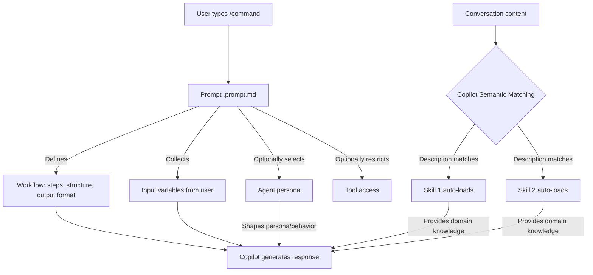
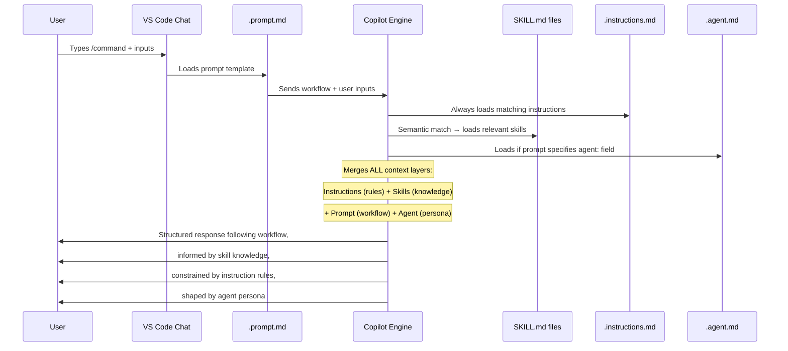

# SESSION: Copilot Prompts vs Skills — When to Use Each and Why — 2026-04-21

## TL;DR

Explored the fundamental difference between GitHub Copilot's **prompts** (`.prompt.md`)
and **skills** (`SKILL.md`) — two of the 6 customization primitives. Prompts are
**workflow triggers** (explicit, user-invoked via `/slash-commands`); skills are
**knowledge bases** (informational, auto-loaded by Copilot when a topic is relevant).
The recommended best practice is the **dual pattern**: pair a skill (for auto-detection)
with a prompt (for explicit invocation) in the same domain.

**Refined mental model:** Prompts are **workflow wrappers** that delegate to skills for
knowledge. But the precise framing matters — see the "Objective Assessment" section
below for what's correct and what needs nuancing in this mental model.

## What Was Done

- Reviewed all 6 Copilot customization primitives and how they relate
- Deep-dived into the key distinctions between prompts and skills
- Analysed real-world composition patterns (dual pattern, stacking, handoffs)
- Studied the Fitness Scorecard for deciding which primitive type is right
- Reviewed the 59-prompt audit in this project showing how all prompts map to backing skills
- Refined the mental model: prompts as **workflow wrappers** that delegate to skills for knowledge
- Connected to personal usage patterns (code deep-dives, cohesive commits + push + PR)
- Objectively assessed what's correct and what's slightly off in the mental model
- Built a complete **creation framework** for making prompt+skill pairs (with data flow, Mermaid diagrams)
- Studied real prompt files (`/ship`, `/git-vcs`, `/design-review`) to see the pattern in practice

## Key Insights

### Objective Assessment — What's Correct and What's Not

After studying the docs, real prompt/skill files, and the 59-prompt audit, here is an
objective evaluation of the evolving understanding:

#### Understanding 1: "Prompts = what to do, Skills = how to do"

**Verdict: Partially correct, but the "how to do" part is misleading.**

| Claim | Accurate? | Precise Version |
|---|---|---|
| Prompts = "what to do" | ✅ Yes | Prompts define the **task/workflow** to execute — the steps, structure, output format |
| Skills = "how to do" | ⚠️ Not quite | Skills are **what to KNOW**, not procedural "how to". They provide domain knowledge (reference material, cheatsheets, patterns) — not step-by-step procedures |

**The subtle but important difference:**

- "How to do" implies procedural instructions: "Step 1, Step 2, Step 3..." — that's
  actually what the **prompt** does (the prompt IS the procedure)
- Skills provide the **domain knowledge** that makes those steps smart — "here are all
  the Git branching strategies", "here's the SOLID principle reference", "here are the
  Maven lifecycle phases"
- Think of it as: the prompt is the **recipe** (steps to follow), the skill is the
  **cookbook knowledge** (understanding of ingredients, techniques, flavour profiles)

**Correct framing:**

```text
Prompt  = WHAT to do + in WHAT ORDER + WHAT to produce  (workflow/procedure)
Skill   = WHAT to KNOW about the domain                 (knowledge/reference)
```

#### Understanding 2: "Prompts are wrappers around skills"

**Verdict: Mostly correct — this is essentially the "dual pattern."**

But with two important nuances:

1. **Prompts don't explicitly "import" skills.** There is no `import: git-vcs` in a
   prompt file. Copilot **auto-loads** relevant skills based on semantic matching of
   the conversation content. The mapping is implicit, not declared.

2. **Not all prompts wrap skills.** 19 of 59 prompts are prompt-only (orchestration,
   session management, action triggers). These don't wrap anything — they ARE the
   entire workflow. `/hub` routes to other prompts. `/ship` runs git commands directly.

**When the wrapper analogy holds:**

```text
/git-vcs prompt (thin wrapper)  →  git-vcs/SKILL.md auto-loads (knowledge core)
/design-review prompt (workflow) →  design-patterns/SKILL.md auto-loads (pattern knowledge)
/deep-dive prompt (procedure)    →  multiple skills auto-load based on topic
```

**When it breaks down:**

```text
/ship prompt = NOT a wrapper — it's a full workflow (lint, build, stage, commit, push, PR)
              Skills like git-vcs MAY auto-load, but /ship works even without them
/hub prompt  = NOT a wrapper — it's a router that points to other prompts
/scope prompt = NOT a wrapper — it's a session management command
```

#### Understanding 3: "Prompt saves me from retyping repeated context"

**Verdict: ✅ Correct — this is the primary value proposition of prompts.**

This is precisely why prompts exist. Without `/deep-dive`, you'd type:
> "Analyse this class, show the data flow, walk through the call stack, break it into
> code blocks, do a line-by-line walkthrough of key logic, identify edge cases..."

With `/deep-dive`, you type one command and the prompt carries all of that.

#### Summary Scorecard

| Mental Model | Score | Notes |
|---|---|---|
| "Prompts = what to do" | ✅ Correct | Prompts define the workflow/task |
| "Skills = how to do" | ⚠️ Reframe | Skills = what to KNOW (knowledge), not procedural how-to |
| "Prompts are wrappers around skills" | ✅ Mostly correct | True for 40/59 prompts (dual pattern), not for orchestration/action prompts |
| "Prompts save retyping" | ✅ Correct | Primary value proposition |
| "Skills auto-load, prompts are manual" | ✅ Correct | Fundamental activation difference |
| "Skills carry the actual knowledge" | ✅ Correct | Skills are the knowledge core |

### The Core Mental Model: 6 Primitives, 3 Categories

All 6 Copilot primitives fall into 3 intent categories:

| Category | Primitives | What They Do |
|---|---|---|
| **Behavioral** (rules) | `copilot-instructions.md`, `.instructions.md`, `.agent.md` | Tell Copilot **HOW** to behave — conventions, rules, persona |
| **Informational** (knowledge) | `SKILL.md` | Tell Copilot **WHAT** it knows — reference material, cheatsheets |
| **Workflow** (actions) | `.prompt.md` | Tell Copilot **WHAT TO DO** — repeatable multi-step tasks |
| **Tool** (external) | MCP Server | Give Copilot **HANDS** — live external API/data access |

### Prompts — The Slash Commands

**File:** `.github/prompts/<name>.prompt.md`
**Analogy:** Standard Operating Procedure (SOP) — a named, repeatable procedure.
**Activation:** **Manual** — the user types `/command-name` in Copilot Chat.

Key characteristics:

- **Not loaded automatically** — only active when explicitly invoked
- **Support input variables** — `${input:varName:Prompt text?}` for runtime user input
- **Support file references** — `#file:path/to/file` to attach context
- **Can specify tools and agents** — `tools:` and `agent:` fields in frontmatter
- **One prompt active at a time** — they don't stack like instructions

Best for:

- Multi-step repeatable workflows (design review, debugging, code explanation)
- Commands that need user input at invocation time
- Orchestration/routing commands (e.g., `/hub` routes to other prompts)
- Action triggers (`/ship`, `/brain-push`, `/brain-fetch`)
- Thin wrappers around skills that just add input variables

### Skills — The Knowledge Base

**File:** `.github/skills/<domain>/SKILL.md`
**Analogy:** Domain reference manual — not rules, but knowledge.
**Activation:** **Automatic** — Copilot semantically matches your question to the skill's
`description` field and injects it when relevant.

Key characteristics:

- **Auto-detected** — Copilot decides when the skill is relevant (no user action)
- **The `description` field is critical** — it's the activation trigger. Too vague = never
  activates. Too narrow = misses relevant questions
- **Informational, not behavioral** — skills don't say "always do X"; they provide knowledge
- **Multiple skills can activate simultaneously** — they stack, unlike prompts
- **No input variables** — skills are passive reference, not interactive workflows

Best for:

- Domain cheatsheets (Git commands, MCP patterns, Java idioms)
- Architecture reference (how your system works)
- Curated learning resources
- "Second brain" content — things you'd otherwise explain every time

### The Killer Question: How to Choose

The **Fitness Scorecard** gives a 5-question flow:

| # | Question | If YES → |
|---|---|---|
| 1 | Does the user need to explicitly trigger this? | **Prompt** |
| 2 | Is this static domain knowledge (reference material)? | **Skill** |
| 3 | Is this a behavioral rule for code output? | **Instruction** |
| 4 | Does this need live/dynamic data from an external API? | **MCP Server** |
| 5 | Does this define a persistent persona for entire sessions? | **Agent** |

Simpler shortcuts:

- **"Is it a RULE or KNOWLEDGE?"** → Rule = instruction, Knowledge = skill
- **"Is it a ROLE or a TASK?"** → Role = agent, Task = prompt
- **"Is it always needed or sometimes?"** → Always = instruction, Sometimes = prompt
- **"Static reference or live data?"** → Static = skill, Live = MCP

### The "Prompt = Wrapper" Mental Model

The clearest way to think about it: **a prompt is a workflow wrapper around one or more skills.**

Consider real usage patterns:

| What You Want to Do | Without Prompts | With Prompt + Skill |
|---|---|---|
| Code analysis deep-dive to understand code in detail | Type the full instruction every time: "Analyse this class, show data flow, call stack, code blocks..." | Type `/deep-dive` — the prompt carries the workflow, the skill carries the code-analysis knowledge |
| Make cohesive commits, push, raise PR | Manually describe commit conventions, PR format, branch rules each time | Type `/ship` — the prompt carries the workflow, `git-vcs` + `github-workflow` skills carry the knowledge |
| Learn a concept with 3-tier depth | Explain the teaching structure you want every time | Type `/learn-concept` — the prompt carries the pedagogy workflow, domain skills auto-load |

The prompt is the **reusable shell** that saves you from retyping context. The skill is
the **knowledge core** that tells Copilot how to actually do the thing well. Neither is
complete alone:

```text
Prompt alone  = "Do a code review" (but Copilot has no knowledge of HOW)
Skill alone   = Deep code review knowledge (but user must explain the workflow each time)
Prompt + Skill = "/design-review" triggers the workflow, skill provides the expertise
```

This is why the project's 59-prompt audit found that **40 of 59 prompts are backed by
skills** (the dual pattern) — the prompt is the thin trigger layer, the skill is where
the actual knowledge lives.

### The Dual Pattern — Best Practice

The **recommended approach** for most domains is to pair both:

```text
SKILL.md (auto-loads)     → Deep knowledge Copilot draws from anytime
.prompt.md (/command)     → Explicit trigger when user wants structured guidance
```

**Why both?** Because skills auto-detect but can't collect user input, while prompts
can collect input but only activate on explicit invocation. Together they cover both
use cases:

| Scenario | What Fires |
|---|---|
| User asks "how does Git branching work?" | Skill auto-activates (no `/` needed) |
| User types `/git-vcs topic:branching goal:compare-strategies` | Prompt fires with structured inputs |
| User asks about Git while editing a Java file | Skill auto-loads alongside Java instructions |

Real examples from this project:

| Domain | Skill | Prompt | Pattern |
|---|---|---|---|
| Git | `git-vcs/SKILL.md` | `/git-vcs` | ✅ Dual |
| MCP | `mcp-development/SKILL.md` | `/mcp` | ✅ Dual |
| Design Patterns | `design-patterns/SKILL.md` | `/design-review` | ✅ Dual |
| Hub (routing) | — | `/hub` | Prompt-only (correct — orchestration) |
| Vault (resources) | `learning-resources-vault/SKILL.md` | `/resources` | ✅ Dual |

### When Prompt-Only Is Correct

Not everything needs a skill. These are rightfully prompt-only:

- **Orchestration commands:** `/hub`, `/composite`, `/steer` — route to other things
- **Session management:** `/context`, `/scope`, `/multi-session` — control state
- **Action triggers:** `/ship`, `/brain-push` — perform an action, not teach
- **Thin wrappers:** `/dsa` just adds input vars over auto-loading skills

### When Skill-Only Is Correct

Some domains don't need an explicit trigger:

- **Deep reference material** (200+ lines) where auto-detection is sufficient
- **Knowledge bases** that aren't workflows (e.g., `learning-resources-vault`)
- **Opt-in formatting** skills like `java-formatting` (auto-detects but doesn't need `/`)

### How They Stack and Compose

```text
copilot-instructions.md     ← always base layer (behavioral)
    + java.instructions.md      ← file-type scoped (behavioral)
    + git-vcs SKILL.md           ← topic auto-detected (informational)
    + /git-vcs prompt            ← user invoked (workflow)
    = Combined context for Copilot's response
```

All 6 primitives can be active simultaneously — there is no "choose one."

### Migration Signals

When a primitive is in the wrong type:

| Current → Should Be | Signal |
|---|---|
| Prompt → Skill | Contains 100+ lines of reference knowledge; users forget the `/command` |
| Skill → Instruction | It's really just 5-10 behavioral rules, not reference knowledge |
| Instruction → Skill | Grew to 200+ lines with tables and examples |
| Skill → MCP | Data goes stale quickly; needs live API calls |
| Prompt → Agent | Defines a persona; users want it for entire conversations |

---

## Creation Framework — How to Build Prompt+Skill Pairs

### The Architecture: How Prompts and Skills Connect



**Key insight from the diagram:** There is **no explicit link** between a prompt and a
skill. The mapping is **implicit through semantic matching**. Copilot reads the
conversation (which includes the prompt text + user inputs) and auto-loads any skills
whose `description` field matches.

### Step-by-Step: Creating a Dual-Pattern Pair

#### Step 1 — Identify the Domain and Split

Ask yourself: "For this domain, what is **knowledge** vs what is **workflow**?"

| Domain Example | Knowledge (→ Skill) | Workflow (→ Prompt) |
|---|---|---|
| Git | Branching strategies, command reference, merge vs rebase comparison | "Teach me about X", "Help me choose a branching strategy" |
| Code Review | SOLID principles, design patterns, code smells | "Review this file focusing on X" |
| Debugging | Exception patterns, fix patterns, debugger usage | "Debug this error using 5-phase methodology" |
| Shipping | Commit format, PR conventions, branch rules | "Lint, build, commit, push, suggest PR" |

#### Step 2 — Create the Skill (Knowledge Core)

```text
Location:  .github/skills/<domain>/SKILL.md
```

The skill contains WHAT Copilot should KNOW:

```yaml
---
name: <domain>
description: >
  [CRITICAL] This field is the activation trigger. Write it as:
  "Use when asked about [KEYWORD 1], [KEYWORD 2], [USE CASE]..."
  Be exhaustive — list every topic and keyword that should activate this skill.
---
```

Skill body contains:

- **Reference tables** — command cheatsheets, comparison matrices
- **Concept explanations** — what things are, how they relate
- **3-tier depth** — newbie/amateur/pro sections
- **Curated resources** — links to official docs, books, tutorials
- **NO workflow steps** — no "Step 1, Step 2" procedures
- **NO behavioral rules** — no "always do X" directives (those go in instructions)

#### Step 3 — Create the Prompt (Workflow Shell)

```text
Location:  .github/prompts/<domain>.prompt.md
```

The prompt contains WHAT to DO and in WHAT ORDER:

```yaml
---
name: <command-name>
description: 'One-line description shown in autocomplete'
agent: <agent-name>              # Optional: auto-select persona
tools: ['codebase', 'search']    # Optional: restrict tools
---
```

Prompt body contains:

- **Input variables** — `${input:var:Question?}` for user-provided context
- **Workflow steps** — "First do X, then do Y, then produce Z"
- **Output structure** — what the response should look like
- **File references** — `#file:path` to attach specific files as context
- **NO domain knowledge** — don't put cheatsheets or reference tables here
- **NO behavioral rules** — those belong in instructions

#### Step 4 — Verify the Semantic Link

The prompt and skill are connected **implicitly through topic matching**:

```text
/git-vcs prompt text includes words: "Git", "branching", "rebase", "merge"...
                    ↓ semantic matching ↓
git-vcs/SKILL.md description: "Git version control workflows, branching
    strategies, commit conventions... Use when asked about git commands,
    branching, merging, rebasing..."
```

To verify: invoke the prompt and check that Copilot's response includes knowledge
that could only come from the skill (specific commands, detailed comparisons, etc.).

#### Step 5 — Register and Cross-Reference

Follow the completeness checklist:

- [ ] Skill registered in `copilot-instructions.md` routing table
- [ ] Skill added to `TAXONOMY.md` and `skills-library.md`
- [ ] Prompt added to `slash-commands.md` (quick lookup + details)
- [ ] Prompt added to `hub.prompt.md` category tree
- [ ] Build passes (`build.ps1`)

### Data Flow: What Happens at Runtime



### Real Examples from This Project

#### Example 1: `/git-vcs` — Classic Dual Pattern

**Prompt** (`git-vcs.prompt.md`) — the workflow shell:

```yaml
agent: learning-mentor
tools: ['codebase', 'fetch']
---
${input:topic:What Git/VCS topic?}
${input:goal:What's your goal? (learn-concept / practice-hands-on / ...)}
${input:level:Your experience level? (newbie / amateur / pro)}
```

The prompt defines: collect 3 inputs, use learning-mentor agent, structure response
by level (newbie/amateur/pro). Contains a domain map (concept hierarchy) but delegates
all actual Git knowledge to the skill.

**Skill** (`git-vcs/SKILL.md`) — the knowledge core:

```text
Core Git Commands Cheatsheet (init, clone, add, commit...)
Branching & Merging reference (branch, checkout, merge, rebase...)
Branching Strategies comparison (GitFlow vs GitHub Flow vs TBD)
Conventional Commits format reference
Semantic Versioning rules
```

The skill has 200+ lines of reference knowledge that auto-loads when the conversation
mentions Git topics.

#### Example 2: `/ship` — Prompt-Only (Not a Wrapper)

**Prompt** (`ship.prompt.md`) — a full self-contained workflow:

```text
Pre-Flight: lint markdown → build Java → stage files
Commit: generate Conventional Commits message → git commit
Push: git push → PR suggestion
Safety: never --force, never git add ., never commit broken build
```

This prompt does NOT wrap a skill. It IS the entire workflow. Skills like `git-vcs`
MAY auto-load to help with commit message format, but `/ship` works standalone.

#### Example 3: `/design-review` — Prompt + Agent + Skill

**Prompt** — the review workflow:

```text
Evaluate: SOLID → Coupling & Cohesion → Design Smells → Naming → Patterns → Testability
Rate each: Critical / Recommended / Consider
Show concrete code improvements
```

**Agent** (`designer`) — the persona: thinks in patterns, focuses on architecture.
**Skill** (`design-patterns/SKILL.md`) — GoF patterns, SOLID reference, code smell catalog.

Three primitives working together: prompt structures the task, agent shapes the mindset,
skill provides the pattern knowledge.

### The 3-Layer Architecture (Correct Mental Model)

```text
┌─────────────────────────────────────────────────┐
│  PROMPT LAYER  (workflow)                       │
│  "What to do, in what order, what to produce"   │
│  /command → inputs → steps → output format      │
├─────────────────────────────────────────────────┤
│  SKILL LAYER  (knowledge)                       │
│  "What to know about the domain"                │
│  Reference tables, cheatsheets, concept maps    │
├─────────────────────────────────────────────────┤
│  INSTRUCTION LAYER  (rules)                     │
│  "What rules to always follow"                  │
│  Naming, formatting, conventions — always on    │
├─────────────────────────────────────────────────┤
│  AGENT LAYER  (persona) — optional              │
│  "Who to be for this session"                   │
│  Mindset, communication style, tool access      │
├─────────────────────────────────────────────────┤
│  MCP LAYER  (external tools) — optional         │
│  "What live systems to access"                  │
│  API calls, DB reads, external write operations │
└─────────────────────────────────────────────────┘
```

### Checklist: Creating a New Dual-Pattern Pair

- [ ] **Domain identified** — clear split between knowledge vs workflow
- [ ] **Skill created** — `.github/skills/<domain>/SKILL.md`
  - [ ] `description` field is keyword-rich and exhaustive
  - [ ] Content is informational (reference, not procedures)
  - [ ] 3-tier depth (newbie/amateur/pro)
- [ ] **Prompt created** — `.github/prompts/<domain>.prompt.md`
  - [ ] `name` and `description` in frontmatter
  - [ ] Input variables for user-provided context
  - [ ] Workflow steps define the task structure
  - [ ] Optional: `agent:` field for persona
  - [ ] Optional: `tools:` field for tool restrictions
- [ ] **Semantic link verified** — invoking prompt causes skill to auto-load
- [ ] **Registered** — TAXONOMY, slash-commands, hub, copilot-instructions routing
- [ ] **Build passes** — `build.ps1` succeeds

## Code Snippets / Commands

### Skill Frontmatter (the description is the activation trigger)

```yaml
---
name: mcp-development
description: >
  Comprehensive guide to MCP (Model Context Protocol)... Use when asked about MCP,
  building MCP servers, configuring AI agents with tools...
---
```

### Prompt Frontmatter (supports input variables and tool/agent selection)

```yaml
---
name: design-review
description: 'Run a SOLID/GRASP architecture review on the current codebase'
agent: designer
tools: ['codebase', 'search', 'usages']
---

${input:target:Which class or module to review?}
${input:focus:Review focus (SOLID, GRASP, both)?:both}
```

### Dual Pattern File Layout

```text
.github/
  skills/
    git-vcs/
      SKILL.md              ← Knowledge (auto-loads)
  prompts/
    git-vcs.prompt.md       ← Workflow trigger (/git-vcs)
```

## Decisions Made

- **Dual pattern is the default recommendation** — pair a skill with a prompt for every
  substantial domain. This gives both auto-detection and explicit invocation.
- **Don't put knowledge inside prompts** — prompts should be thin workflow triggers that
  delegate to skills for domain knowledge. If a prompt contains 100+ lines of reference
  material, extract it to a skill.
- **The `description` field in skills is the single most important line** — it controls
  whether Copilot ever activates the skill. Write it as:
  *"Use when asked about [TOPIC 1], [TOPIC 2], [USE CASE]..."*
- **Think of it as a layered architecture:**
  - **Prompt layer** = UI/trigger (what to do, in what order, what to produce)
  - **Skill layer** = domain knowledge (what to KNOW about the domain)
  - **Instruction layer** = cross-cutting rules (conventions that apply everywhere)
  - **Agent layer** = persona/mindset (who to BE for this session)
  - **MCP layer** = external tools (live data access)
- **Corrected framing:** Skills are "what to KNOW" not "how to do" — the "how to do"
  (procedure/steps) is actually what the prompt provides. Skills provide the knowledge
  that makes those procedures smart.
- **Prompt-skill link is implicit** — there is no explicit import/require mechanism.
  Copilot auto-loads skills whose description matches the conversation content.
  This means the skill's `description` field must contain keywords that overlap with
  what the prompt + user inputs will discuss.

## Open Questions / Follow-Ups

- [ ] Explore how `model:` field in agents (new in 2026) affects choosing agent vs prompt
- [ ] Study token economics — how skill size affects context window usage
- [ ] Experiment with skill `description` wording to see activation sensitivity
- [ ] Review whether any prompt-only commands in this project should gain backing skills
- [ ] Try creating a personal prompt+skill pair for a workflow I repeat often — experience the dual pattern firsthand
- [ ] Investigate: when a prompt specifies `agent:` + the agent has tool restrictions, does the skill still auto-load?
- [ ] Create a "test harness" pattern: invoke a prompt, then check which skills actually loaded (is this observable?)
- [ ] Study how the `/learn-concept` dynamic composition works — one prompt, many skills, topic-driven activation
- [x] **ANSWERED:** Can a prompt be a superset of another prompt? → No. Prompts are standalone.
  `#file:` references enable COMPOSITION (not inheritance). See [Prompt Composition session](2026-04-21_session-prompt-composition-superset.md).
- [ ] Explore `#file:` prompt composition (Recipe 3) for DRY across overlapping prompts like `/ship` and `/github-push`

## Resources Referenced

- [Copilot Customization Deep Dive](.github/docs/copilot-customization-deep-dive.md) — 18-part reference covering all 6 primitives
- [Customization Evolution Guide](.github/docs/customization-evolution-guide.md) — import/merge protocols and fitness scorecard
- [copilot-instructions.md](.github/copilot-instructions.md) — project root instructions (the "employee handbook")
- [GitHub Copilot Documentation](https://docs.github.com/en/copilot) — official docs
- Real prompt files studied: `/git-vcs`, `/ship`, `/design-review` — different patterns (dual, standalone, triple)
- Real skill files studied: `git-vcs/SKILL.md` — reference material with command cheatsheet

## Related Sessions

- **Next:** [Framework Evolution Guide](2026-04-21_session-framework-evolution-guide.md) — full migration roadmap building on this understanding
- **Next:** [Skill Structure & Nesting](2026-04-21_session-framework-evolution-guide.md#skill-structure) — how skills are actually structured (flat, not hierarchical)
- **Next:** [Prompt Composition & Superset](2026-04-21_session-prompt-composition-superset.md) — can prompts extend other prompts? (No — but `#file:` composition exists)
