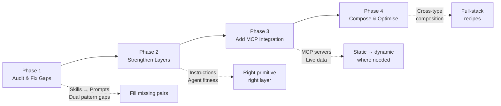
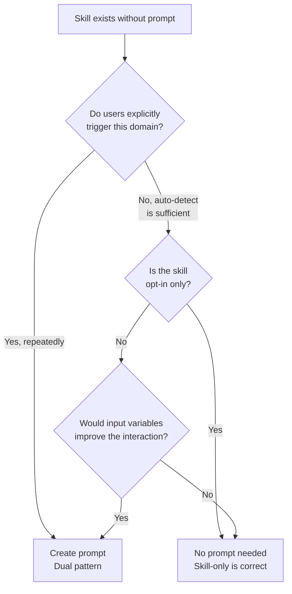
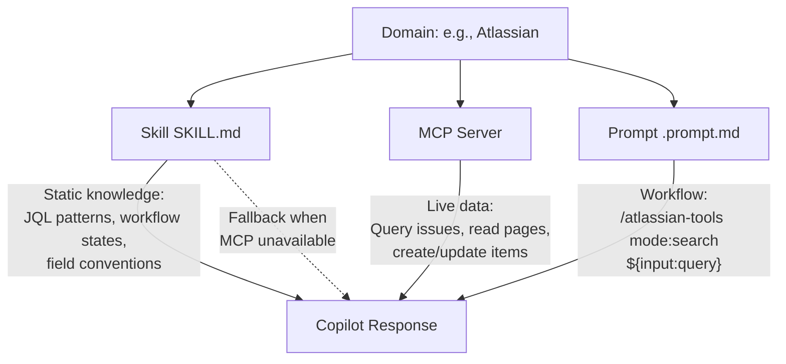
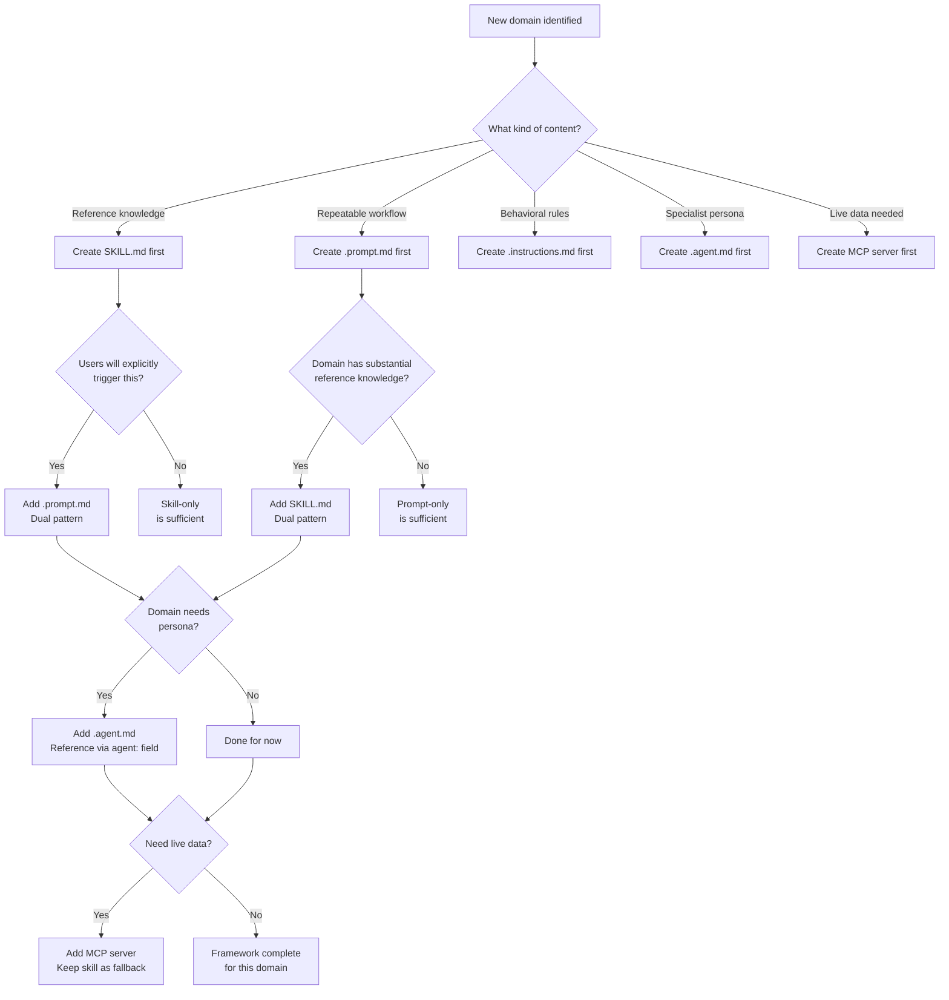

# SESSION: Copilot Customization Framework — Evolution & Migration Guide — 2026-04-21

## TL;DR

Built a complete migration/enhancement/evolution guide for the learning-assistant's
Copilot customization framework. Audited all 6 primitive layers (23 skills, 65 prompts,
9 instructions, 8 agents, MCP servers) and mapped the current state to the ideal layered
architecture. Produced an iterative migration roadmap with concrete phases, gap analysis,
and creation/mapping patterns for evolving the framework holistically.

## What Was Done

- Audited the complete current framework: 23 skills, 65 prompts, 9 instructions, 8 agents, MCP config
- Mapped every primitive to its layer in the 5-layer architecture
- Identified gaps: prompts without skills, skills without prompts, missing instruction layers
- Built an iterative evolution roadmap (4 phases)
- Defined creation patterns for each layer transition
- Created decision flowcharts for "where does this go?"
- Established the framework health metrics and fitness review cadence
- Investigated skill structure/nesting — answered whether skills can be hierarchically nested
- Investigated prompt composition — answered whether prompts can be supersets of other prompts

## Key Insights

### Objective Assessment: Can Skills Be Hierarchically Nested?

**Your idea:** Structure skills like an SE (Software Engineering) tree — a parent "SE skill"
containing child skills for refactoring, debugging, design patterns, etc. Multi-level nesting.

**Verdict: No — this is NOT how Copilot skills work. But the project does something similar
that looks like nesting on the surface.**

#### How Skills Actually Work (The Ground Truth)

**Copilot's skill model is FLAT.** Here is what actually happens:

1. **One `SKILL.md` per domain folder.** Copilot discovers skills by finding files named
   `SKILL.md` inside `.github/skills/<name>/`. There is no parent-child relationship
   between skill folders. Each skill is independent.

2. **The `description` field is the ONLY activation mechanism.** Copilot matches your
   question semantically against each skill's description. There is no "inherit from
   parent skill" or "activate child skills when parent activates."

3. **Multiple skills activate independently.** When you ask about "Java debugging,"
   Copilot might activate BOTH `java-debugging` AND `java-build` if both descriptions
   match — but they don't know about each other. They stack, but not hierarchically.

```text
THIS IS HOW IT WORKS (flat, independent activation):

User asks: "How do I debug a NullPointerException in my Spring Boot app?"

Copilot semantic matching:
  ├── java-debugging/SKILL.md    → description matches "exceptions, debugging" → ✅ LOADS
  ├── java-build/SKILL.md        → description mentions "common errors"        → ✅ LOADS
  ├── design-patterns/SKILL.md   → description doesn't match                   → ❌ SKIPS
  └── git-vcs/SKILL.md           → description doesn't match                   → ❌ SKIPS

Both loaded skills contribute to the response. But they don't have a parent-child link.
```

```text
THIS IS NOT HOW IT WORKS (your hypothesized hierarchical model):

❌ software-engineering/SKILL.md (parent)
    ├── refactoring/SKILL.md (child — would auto-activate when parent activates)
    ├── debugging/SKILL.md (child — inherited from parent)
    └── design-patterns/SKILL.md (child — inherited from parent)

Copilot does NOT support this. There is no inheritance, no parent-child activation.
```

#### What This Project Does Instead: Taxonomy + Sub-Files

The project achieves something that **looks** hierarchical but works differently:

**1. TAXONOMY.md — Logical hierarchy (for humans, not Copilot)**

```text
Skills Library (23 skills)
├── 1. Software Engineering                    [16 skills]
│   ├── 1.1 Languages & Platforms              [6 skills]
│   │   ├── java-build            ← FLAT skill, independently activated
│   │   ├── java-debugging        ← FLAT skill, independently activated
│   │   └── java-formatting       ← FLAT skill, independently activated
│   ├── 1.2 Design & Architecture              [2 skills]
│   │   ├── design-patterns       ← FLAT skill, independently activated
│   │   └── software-dev-roles    ← FLAT skill, independently activated
│   └── 1.3 Development Process   ...
```

This tree is a **documentation artifact** for human navigation. Copilot does NOT read
TAXONOMY.md to decide skill activation. Each skill folder is flat and independent.

**2. Sub-files within a skill — Content scaling (loaded by topic match)**

```text
.github/skills/learning-resources-vault/
├── SKILL.md                          ← Entry point (always loaded when skill activates)
├── resources-java.md                 ← Sub-file (loaded when topic matches "Java")
├── resources-devops-vcs-build.md     ← Sub-file (loaded when topic matches "DevOps")
├── resources-system-design.md        ← Sub-file (loaded when topic matches "system design")
└── ... (10 sub-files total)
```

```text
.github/skills/java-learning-resources/
├── SKILL.md                          ← Entry point
├── java/
│   ├── official/
│   │   ├── oracle-tutorials-guide.md ← Deep reference content
│   │   └── jdk-apis-reference.md     ← Deep reference content
│   └── community/
│       ├── blogs-and-community-guide.md
│       └── open-source-study-guide.md
└── ide/
    └── intellij-idea-guide.md
```

This is NOT hierarchical skills. This is **one skill with modular content files**.
Copilot loads SKILL.md first, then loads relevant sub-files based on topic matching.
The sub-files don't have their own `description` field — they piggyback on the parent
SKILL.md's activation.

#### Why Flat Skills Work Better Than Hierarchy

| Hierarchical (what you imagined) | Flat (what actually works) |
|---|---|
| Parent SE skill activates all children | Each skill activates independently by topic |
| Coupling: changing parent affects all children | Decoupled: change one skill, others unaffected |
| Token cost: parent + all children loaded | Token cost: only matching skills loaded |
| One vague description triggers everything | Precise descriptions trigger only what's needed |
| "SE" is too broad — would load on almost every question | "Java debugging" only loads on debugging questions |

**The flat model is actually better because:**

1. **Token efficiency** — only relevant skills load, not an entire tree
2. **Precision** — `java-debugging` activates on debugging, not on every SE question
3. **Independence** — add/remove/modify one skill without touching others
4. **No false activation** — a broad "SE" parent would activate on almost everything

#### The Correct Mental Model

```text
DON'T think of skills as:        DO think of skills as:
├── Parent                        ├── Domain A (independent)
│   ├── Child A                   ├── Domain B (independent)
│   ├── Child B                   ├── Domain C (independent)
│   └── Child C                   └── Domain D (independent)

Each activates when its description matches.
Multiple can activate at once (they stack).
But there's no inheritance or nesting.
```

**The hierarchy exists only in:**

1. **TAXONOMY.md** — human-readable organization (doesn't affect Copilot behavior)
2. **Sub-files within a skill** — content modularization (one skill, multiple files)
3. **copilot-instructions.md routing table** — human reference for "which skill covers what"

#### Scoreboard: Your Understanding

| Idea | Correct? | Reality |
|---|---|---|
| "SE skill containing refactoring, debugging sub-skills" | ❌ Not how it works | Skills are flat & independent. No parent-child. |
| "Multi-level nesting of skills" | ❌ Not supported | Copilot discovers SKILL.md in flat folders. No nesting. |
| "Skills can be structured/organized" | ✅ Partially | TAXONOMY.md organizes for humans. Sub-files organize content within one skill. |
| "Related skills should be grouped" | ✅ Good instinct | The grouping is logical (taxonomy), not structural (no nested activation). |
| "Multiple skills fire together" | ✅ Correct | But by independent semantic matching, not by inheritance. |

### How to Actually Structure Related Skills

Instead of nesting, use these patterns:

#### Pattern 1: Related Skills via Description Keywords

Make related skills activate together by including overlapping keywords:

```yaml
# java-debugging SKILL.md
description: >
  Exception diagnosis, debugging patterns, stack traces...
  Use when debugging Java code, fixing NullPointerException,
  ClassCastException, or tracing errors.

# java-build SKILL.md
description: >
  Compile, run, build Java projects, javac errors, classpath...
  Use when building Java code, fixing compilation errors.
```

When user asks "I'm getting a NullPointerException when building my project,"
BOTH skills activate because both descriptions match — without any hierarchy.

#### Pattern 2: Large Domain → One Skill with Sub-Files

For a large domain like "Software Engineering resources" — don't create child skills.
Create ONE skill with sub-files:

```text
.github/skills/software-engineering-resources/
├── SKILL.md                    ← Master index + description (activation trigger)
├── resources-dsa.md            ← Algorithms & data structures resources
├── resources-system-design.md  ← System design resources
├── resources-testing.md        ← Testing resources
└── resources-devops.md         ← DevOps resources
```

This is what the `learning-resources-vault` skill (176 resources, 14 files) already does.

#### Pattern 3: Taxonomy for Navigation, Flat for Activation

```text
TAXONOMY.md says:                       On disk (what Copilot sees):
├── 1. Software Engineering             .github/skills/
│   ├── 1.1 Languages                       ├── java-build/SKILL.md
│   │   ├── java-build                      ├── java-debugging/SKILL.md
│   │   ├── java-debugging                  ├── design-patterns/SKILL.md
│   ├── 1.2 Design                          ├── git-vcs/SKILL.md
│   │   ├── design-patterns                 ├── mcp-development/SKILL.md
│   ├── 1.4 DevOps                          └── ... (all flat)
│   │   ├── git-vcs
│   │   ├── mcp-development

The tree is DOCUMENTATION. The disk is FLAT. Copilot reads the disk.
```

### Updated 5-Layer Architecture (with Skill Structure Clarification)

### Current Framework Inventory (Audited 2026-04-21)

| Layer | Primitive | Count | Purpose |
|---|---|---|---|
| **Rules** | `copilot-instructions.md` | 1 | Project-wide conventions |
| **Rules** | `.instructions.md` files | 9 | File-scoped / mode rules |
| **Knowledge** | `SKILL.md` files | 23 | Domain reference material |
| **Workflow** | `.prompt.md` files | 65 | Slash commands / task triggers |
| **Persona** | `.agent.md` files | 8 | Specialist AI personas |
| **Tools** | MCP servers (mcp.json) | Configured | Live data access (Atlassian, GitHub, Filesystem, Learning Resources) |

### The 5-Layer Architecture — What's Already Here

```text
┌─────────────────────────────────────────────────────────────┐
│  LAYER 5: MCP SERVERS  (external tools — live data)         │
│  Learning Resources, Atlassian, GitHub, Filesystem          │
│  → What Copilot can DO with external systems                │
├─────────────────────────────────────────────────────────────┤
│  LAYER 4: AGENTS  (persona — session-scoped)                │
│  8 agents: learning-mentor, designer, debugger,             │
│  code-reviewer, impact-analyzer, daily-assistant,           │
│  my-kanha, Thinking-Beast-Mode                              │
│  → WHO Copilot becomes for a session                        │
├─────────────────────────────────────────────────────────────┤
│  LAYER 3: PROMPTS  (workflow — user-triggered)              │
│  65 prompts: /ship, /deep-dive, /learn-concept,             │
│  /design-review, /hub, /brain-*, /resources, etc.           │
│  → WHAT to do, in what order, what to produce               │
├─────────────────────────────────────────────────────────────┤
│  LAYER 2: SKILLS  (knowledge — auto-detected)               │
│  23 skills: git-vcs, mcp-development, design-patterns,      │
│  java-build, brain-management, atlassian-tools, etc.        │
│  → WHAT Copilot knows about each domain                     │
├─────────────────────────────────────────────────────────────┤
│  LAYER 1: INSTRUCTIONS  (rules — always on or file-scoped)  │
│  1 copilot-instructions.md (base) + 9 scoped instructions   │
│  java, clean-code, md-formatting, change-completeness,      │
│  steering-modes, session-scoping, chat-capture, backlog,    │
│  build                                                      │
│  → Rules Copilot MUST always follow                         │
└─────────────────────────────────────────────────────────────┘
```

### Layer Responsibilities — Precise Definitions

| Layer | What Goes Here | What Does NOT Go Here |
|---|---|---|
| **Instructions** | Behavioral rules, conventions, formatting mandates, "always do X / never do Y" | Reference knowledge, workflows, personas |
| **Skills** | Domain knowledge, reference tables, cheatsheets, concept explanations, curated resource lists | Procedural steps, behavioral rules, tool access |
| **Prompts** | Task workflows, input collection, output structure, step sequences, orchestration | Domain knowledge (delegate to skills), behavioral rules (delegate to instructions) |
| **Agents** | Persistent personas, communication style, tool restrictions, mindset/approach | Workflow steps (delegate to prompts), knowledge (delegate to skills) |
| **MCP Servers** | Live data access, write operations, API calls, external system integration | Static knowledge (use skills), rules (use instructions) |

### Gap Analysis — Current Dual-Pattern Coverage

#### Skills WITH Matching Prompts (✅ Dual Pattern — 18 pairs)

| Skill | Prompt(s) | Status |
|---|---|---|
| `git-vcs` | `/git-vcs` | ✅ Perfect dual |
| `github-workflow` | `/github-workflow` | ✅ Perfect dual |
| `mcp-development` | `/mcp` | ✅ Perfect dual |
| `design-patterns` | `/design-review`, `/refactor` | ✅ Dual (multi-prompt) |
| `copilot-customization` | `/copilot-customization`, `/create-agent`, `/mcp-to-skill` | ✅ Dual (multi-prompt) |
| `digital-notetaking` | `/digital-notetaking` | ✅ Perfect dual |
| `mac-dev` | `/mac-dev` | ✅ Perfect dual |
| `brain-management` | `/brain-new`, `/brain-publish`, `/brain-search`, `/brain-capture-session`, `/backlog`, `/jot` | ✅ Dual (multi-prompt) |
| `pkm-management` | `/brain-fetch`, `/brain-pull`, `/brain-clone`, `/brain-merge`, `/brain-cherry-pick`, `/brain-stash`, `/brain-diff`, `/brain-push`, `/brain-remote`, `/brain-consolidate` | ✅ Dual (multi-prompt) |
| `career-resources` | `/career-roles`, `/interview-prep` | ✅ Dual |
| `daily-assistant-resources` | `/daily-assist` | ✅ Dual |
| `software-engineering-resources` | `/dsa`, `/system-design`, `/devops`, `/build-tools`, `/sdlc` | ✅ Dual (multi-prompt) |
| `java-learning-resources` | `/resources` (shared) | ✅ Dual |
| `learning-resources-vault` | `/resources` | ✅ Dual |
| `java-debugging` | `/debug` | ✅ Dual |
| `deep-research` | (auto-loads for research tasks) | ✅ Skill activates via instructions |
| `requirements-research` | (auto-loads for requirements) | ✅ Skill activates via instructions |
| `atlassian-tools` | `/atlassian-tools` | ✅ Dual |

#### Skills WITHOUT Matching Prompts (potential gaps)

| Skill | Has Prompt? | Assessment |
|---|---|---|
| `java-build` | No dedicated prompt | ⚠️ **Potential gap** — but auto-loads for Java build questions. Consider: `/java-build` prompt? |
| `java-formatting` | No dedicated prompt | ✅ Correct — opt-in auto-detect skill, no workflow needed |
| `jvm-platform` | No dedicated prompt | ⚠️ **Potential gap** — JVM internals deep-dive could use `/jvm` prompt |
| `software-development-roles` | No dedicated prompt | ⚠️ **Potential gap** — could pair with `/roles` prompt |
| `web-reader` | `/read-url` | ✅ Dual (different name but matched) |

#### Prompts WITHOUT Backing Skills (correctly prompt-only)

| Prompt | Why Prompt-Only Is Correct |
|---|---|
| `/hub` | Orchestration router — not knowledge |
| `/composite` | Workflow combiner — not knowledge |
| `/context`, `/scope`, `/multi-session` | Session management — not knowledge |
| `/steer`, `/request-steering` | Mode switching — not knowledge |
| `/ship`, `/github-push` | Action triggers — delegate to git skills |
| `/explain`, `/explore-project` | Generic analysis — skills auto-load by topic |
| `/teach`, `/learn-concept`, `/deep-dive`, `/learn-from-docs`, `/reading-plan` | Generic learning — skills auto-load by topic |
| `/impact`, `/check-standards`, `/write-docs` | Analysis/utility workflows |
| `/code-analysis`, `/code-analysis-deep-dive` | Analysis workflow — skills auto-load |
| `/language-guide`, `/tech-stack` | Generic — skills auto-load by topic |
| `/session-scope` | Session control — not knowledge |
| `/read-file-jot`, `/todo`, `/todos` | Utility — not knowledge |

### The Evolution Roadmap — 4 Iterative Phases



#### Phase 1: Audit & Fill Dual-Pattern Gaps (DO FIRST)

**Goal:** Every substantial domain has both a skill AND a prompt.

| Action | Priority | Effort |
|---|---|---|
| Create `/jvm` prompt for `jvm-platform` skill | Medium | Low — thin wrapper with topic/level inputs |
| Create `/java-build` prompt for `java-build` skill | Low | Low — thin wrapper |
| Create `/roles` prompt for `software-development-roles` skill | Low | Low — thin wrapper |
| Verify `web-reader` skill ↔ `/read-url` prompt linkage | Low | Check only |

**Decision framework for "does this skill need a prompt?":**



#### Phase 2: Strengthen Each Layer (Fitness Review)

**Goal:** Every primitive is in the RIGHT layer. No knowledge in prompts, no workflows
in skills, no reference data in instructions.

**Fitness review for each primitive:**

| Check | What to Look For | Fix |
|---|---|---|
| **Bloated instructions** | Any `.instructions.md` > 500 tokens with reference tables | Extract tables to a skill, keep rules in instruction |
| **Knowledge in prompts** | Any `.prompt.md` with 100+ lines of reference material | Extract to skill, leave workflow shell in prompt |
| **Workflow in skills** | Any `SKILL.md` with "Step 1, Step 2..." procedures | Move procedures to a prompt, keep reference in skill |
| **Rules in skills** | Any `SKILL.md` with "always do X" directives | Move to `.instructions.md` with appropriate `applyTo` |
| **Persona in prompts** | Any `.prompt.md` defining a long persona description | Extract to `.agent.md`, reference via `agent:` field |
| **Static data in MCP** | Any MCP tool serving data that rarely changes | Consider extracting to skill as offline reference |

**Instruction layer audit:**

| Current Instruction | `applyTo` | Review Question |
|---|---|---|
| `java.instructions.md` | `**/*.java` | ✅ File-scoped Java rules — correct |
| `clean-code.instructions.md` | `**/*.java` | ✅ File-scoped quality rules — correct |
| `md-formatting.instructions.md` | `**` | ✅ Global formatting mode — correct |
| `change-completeness.instructions.md` | `**` | ✅ Global completeness mode — correct |
| `steering-modes.instructions.md` | `**` | ✅ Global mode documentation — correct |
| `chat-capture.instructions.md` | `**` | ✅ Global session capture policy — correct |
| `session-scoping.instructions.md` | `**` | ✅ Global scoping rules — correct |
| `backlog.instructions.md` | `brain/ai-brain/backlog/**` | ✅ Path-scoped backlog rules — correct |
| `build.instructions.md` | ? | Review: is this rules or knowledge? |

**Agent layer audit:**

| Agent | Used By Prompts | Fitness Check |
|---|---|---|
| `learning-mentor` | `/learn-concept`, `/deep-dive`, `/git-vcs`, many learning prompts | ✅ Correct — teaching persona |
| `designer` | `/design-review`, `/refactor` | ✅ Correct — architecture persona |
| `debugger` | `/debug` | ✅ Correct — investigation persona |
| `code-reviewer` | `/code-analysis` | ✅ Correct — review persona |
| `impact-analyzer` | `/impact` | ✅ Correct — analysis persona |
| `daily-assistant` | `/daily-assist` | ✅ Correct — personal assistant persona |
| `my-kanha` | ? | Review: what prompts use this? |
| `Thinking-Beast-Mode` | Beast mode (steering) | ✅ Correct — deep research persona |

#### Phase 3: Evolve MCP Integration

**Goal:** Identify where static skill knowledge should be complemented or replaced
by live MCP data.

**MCP coexistence pattern:**



**Migration candidates (skill → skill + MCP):**

| Domain | Current State | MCP Opportunity | Priority |
|---|---|---|---|
| `atlassian-tools` | Skill + MCP already | ✅ Already evolved | — |
| `github-workflow` | Skill + prompt | Add GitHub MCP for live PR/issue data | High |
| `learning-resources-vault` | Skill + MCP (learning resources server) | ✅ Already evolved | — |
| `java-build` | Skill only | MCP for live build status? | Low (overkill) |

**When to add MCP vs keep as skill:**

```text
Add MCP when:
  ✓ Data changes frequently (daily/weekly)
  ✓ Need to WRITE to external systems
  ✓ Need real-time API responses
  ✓ Worth the infrastructure overhead

Keep as skill when:
  ✓ Data is stable (changes monthly or less)
  ✓ Read-only reference material
  ✓ No external API needed
  ✓ Simplicity is more valuable than freshness
```

#### Phase 4: Compose & Optimise (Full-Stack Recipes)

**Goal:** Build cross-type composition patterns that use all 5 layers together.

**Target compositions:**

| Recipe | Layers Used | Example |
|---|---|---|
| **Architecture Review** | Instruction + Skill + Prompt + Agent | Java rules + design-patterns skill + /design-review + designer agent |
| **Learning Session** | Instruction + Skill + Prompt + Agent | Completeness rules + domain skill + /learn-concept + learning-mentor agent |
| **Ship Code** | Instruction + Skill + Prompt | Git rules + git-vcs skill + /ship prompt |
| **Live Code Review** | All 5 | Java rules + patterns skill + /code-analysis + code-reviewer agent + GitHub MCP (PR data) |
| **Atlassian Workflow** | Instruction + Skill + Prompt + MCP | Completeness rules + atlassian skill + /atlassian-tools + Atlassian MCP |

### Creation Patterns — How to Add to Each Layer

#### Pattern A: "I have a domain and want full coverage"



#### Pattern B: "I want to evolve an existing skill"

```text
Step 1: Check — does this skill have a matching prompt?
  No  → Consider creating one (Phase 1)
  Yes → Continue

Step 2: Check — is the skill's description field comprehensive?
  No  → Expand it (this is the most impactful single change)
  Yes → Continue

Step 3: Check — does the skill have 3-tier depth?
  No  → Add newbie/amateur/pro sections
  Yes → Continue

Step 4: Check — should any skill content move to an instruction?
  Yes (behavioral rules found in skill) → Extract to .instructions.md
  No  → Continue

Step 5: Check — would an MCP server complement this skill?
  Yes (live data needed) → Plan MCP server, keep skill as fallback
  No  → Skill is optimised
```

#### Pattern C: "I want to evolve an existing prompt"

```text
Step 1: Check — does this prompt contain domain knowledge (100+ lines)?
  Yes → Extract to SKILL.md, leave workflow shell in prompt
  No  → Continue

Step 2: Check — does this prompt define a persona?
  Yes → Extract to .agent.md, reference via agent: field
  No  → Continue

Step 3: Check — does this prompt have input variables?
  No  → Add ${input:} variables for user context
  Yes → Continue

Step 4: Check — does the matching skill auto-load when prompt fires?
  No  → Improve skill description keywords to match prompt content
  Yes → Prompt is optimised
```

### Framework Health Metrics

Track these metrics after each evolution phase:

| Metric | Current | Target | How to Measure |
|---|---|---|---|
| Dual-pattern coverage | ~18/23 skills (78%) | >90% | Count skills with matching prompts |
| Prompt-only (correctly) | ~30/65 prompts | Stable | Count prompts that are rightfully workflow-only |
| Instruction count | 9 + 1 base | ≤15 | Too many = fragmentation; too few = bloat in base |
| Agent utilisation | 8 agents | All referenced by ≥1 prompt | Check agent: fields in prompts |
| Skill description quality | Varies | All have 50+ word descriptions | Audit description fields |
| Cross-type composition | Partial | Every domain uses ≥2 layers | Audit per domain |
| Build passes | ✅ | ✅ always | `build.ps1` after every change |

### Iterative Evolution Protocol

**Every time you add or change a primitive, run this micro-checklist:**

```text
1. WHAT layer does this belong to?
   □ Rules (instruction) — behavioral, always/never
   □ Knowledge (skill) — informational, reference
   □ Workflow (prompt) — procedural, step-by-step
   □ Persona (agent) — identity, mindset
   □ Tools (MCP) — live data, write ops

2. Does this domain already have primitives in OTHER layers?
   □ Check for existing skill ↔ prompt pairs
   □ Check for existing instruction coverage
   □ Check for existing agent

3. Does adding this create a gap?
   □ New skill without prompt? → Consider dual pattern
   □ New prompt without skill? → Does it need domain knowledge?
   □ New agent without prompt? → How will users trigger it?

4. Register and cross-reference:
   □ TAXONOMY.md, slash-commands.md, hub.prompt.md
   □ copilot-instructions.md routing table
   □ Build passes
```

## Code Snippets / Commands

### Audit Commands (run periodically)

```powershell
# Count all primitives
Write-Output "Skills:       $((Get-ChildItem '.github/skills' -Directory).Count)"
Write-Output "Prompts:      $((Get-ChildItem '.github/prompts' -Filter '*.prompt.md').Count)"
Write-Output "Instructions: $((Get-ChildItem '.github/instructions' -Filter '*.instructions.md').Count)"
Write-Output "Agents:       $((Get-ChildItem '.github/agents' -Filter '*.agent.md').Count)"
```

### Verify Dual-Pattern Coverage

```powershell
# List skills without matching prompts
$skills = (Get-ChildItem '.github/skills' -Directory).Name
$prompts = (Get-ChildItem '.github/prompts' -Filter '*.prompt.md').BaseName -replace '\.prompt$',''
$skills | Where-Object { $_ -notin $prompts } | ForEach-Object { "⚠️  Skill '$_' has no matching prompt" }
```

### Skill Description Quality Check

```powershell
# Find skills with short descriptions (< 50 chars)
Get-ChildItem '.github/skills/*/SKILL.md' | ForEach-Object {
    $content = Get-Content $_.FullName -Raw
    if ($content -match 'description:\s*>\s*\n\s+(.+)') {
        $desc = $matches[1]
        if ($desc.Length -lt 50) { Write-Output "⚠️  $($_.Directory.Name): description too short ($($desc.Length) chars)" }
    }
}
```

## Decisions Made

- **Iterative evolution, not big-bang rewrite** — evolve the framework one phase at a time,
  verifying each phase before moving to the next
- **Dual pattern is the target for every substantial domain** — but some domains correctly
  stay skill-only (java-formatting) or prompt-only (orchestration commands)
- **Skills are FLAT, not hierarchical** — Copilot discovers skills independently by semantic
  matching. No parent-child, no inheritance. The hierarchy in TAXONOMY.md is for human
  navigation only.
- **Large domains use sub-files, not sub-skills** — when a skill grows too large for one file,
  split content into sub-files within the same skill folder. Don't create nested skill folders.
- **Phase 1 first** — fill the 3 identified dual-pattern gaps before strengthening layers
- **MCP is Phase 3** — don't rush to add MCP servers; most domains work well as skill + prompt.
  Only add MCP when live data or write operations are genuinely needed
- **Track framework health metrics** — after each phase, run the audit to verify coverage
- **Prompts are FLAT and standalone, not superset/subset** — each `.prompt.md` is independent.
  No extends/inherits mechanism. The only composition is `#file:` references (Recipe 3).
  Overlapping prompts (like `/ship` and `/github-push`) are acceptable when they serve
  different complexity levels.
- **Prompt overlap is intentional in this project** — `/ship` (simple) and `/github-push`
  (powerful with API PR creation) overlap on lint/build/push but differ on commit splitting
  and PR creation mechanism. This is a valid pattern, not a defect.

## Open Questions / Follow-Ups

- [ ] Phase 1: Create `/jvm` prompt for `jvm-platform` skill
- [ ] Phase 1: Create `/java-build` prompt for `java-build` skill (if warranted)
- [ ] Phase 1: Create `/roles` prompt for `software-development-roles` skill (if warranted)
- [ ] Phase 2: Review `build.instructions.md` — is it rules or knowledge?
- [ ] Phase 2: Audit `my-kanha` agent — which prompts reference it?
- [ ] Phase 2: Check all prompt files for embedded knowledge (100+ lines) that should be in skills
- [ ] Phase 3: Evaluate GitHub MCP server integration for `github-workflow` domain
- [ ] Phase 4: Build the "Live Code Review" full-stack composition recipe
- [ ] Establish a quarterly framework fitness review cadence
- [ ] Document the evolution protocol in `.github/docs/` for team reference
- [x] **ANSWERED:** Can skills be hierarchically nested? → No. Skills are flat. TAXONOMY.md provides logical hierarchy. Sub-files provide content modularity within a single skill.
- [ ] Explore: When to split one large skill into separate skills vs. using sub-files
  (heuristic: if the sub-file needs its own `description` activation trigger, it should be its own skill)
- [ ] Explore: Optimal `description` field keyword overlap between related skills to ensure
  co-activation on complex queries
- [x] **ANSWERED:** Can a prompt be a superset of another prompt? → No. Prompts are standalone.
  `#file:` references enable composition (not inheritance). `/ship` and `/github-push` overlap
  intentionally — different complexity levels for the same domain.
- [ ] Explore `#file:` prompt composition (Recipe 3) to DRY shared steps (pre-flight, push)
  across overlapping prompts like `/ship` and `/github-push`
- [ ] Audit all 65 prompts for scope overlap — identify candidates for merging or decomposition

## Resources Referenced

- [Copilot Customization Deep Dive](.github/docs/copilot-customization-deep-dive.md) — 18-part reference, especially Parts 4 (Composition), 5 (Anti-Patterns), 8 (Creation Walkthroughs)
- [Customization Evolution Guide](.github/docs/customization-evolution-guide.md) — Fitness Scorecard, Dual Pattern, Prompt vs Skill Decision Framework
- [Previous session: Prompts vs Skills](2026-04-21_02-30pm_prompts-vs-skills.md) — foundational understanding of the dual pattern
- Current framework audit: 23 skills, 65 prompts, 9 instructions, 8 agents, MCP configured
- [Prompt Composition session](2026-04-21_04-00pm_prompt-composition-superset.md) — prompt superset/composition analysis with `/ship` vs `/github-push`
